Untitled
================

``` r
# Generate some example data for clustering
tmp <- c(rnorm(30,-3), rnorm(30,3))
x <- cbind(x=tmp, y=rev(tmp))
plot(x)
```

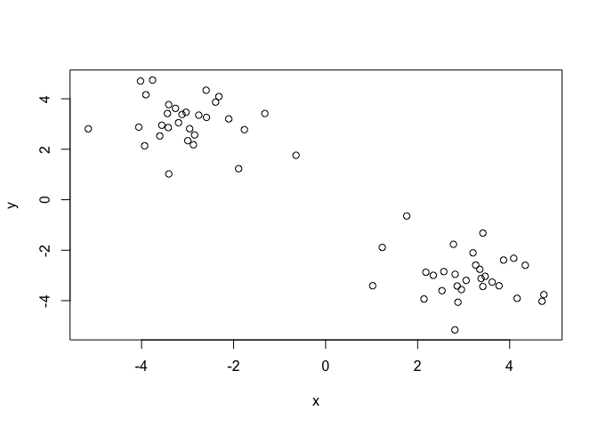<!-- -->

``` r
### use kmeans() setting k to 2 nstart to 20 to answer some questions about the above graph
#Use the kmeans() function setting k to 2 and nstart=20
#Inspect/print the results
#Q. How many points are in each cluster?
#Q. What ‘component’ of your result object details
 #- cluster size?
 #- cluster assignment/membership?
 #- cluster center?
#Plot x colored by the kmeans cluster assignment and
 #add cluster centers as blue points
k<-kmeans(x,centers=2,nstart=20)
```

``` r
k
```

    ## K-means clustering with 2 clusters of sizes 30, 30
    ## 
    ## Cluster means:
    ##           x         y
    ## 1  3.090019 -3.011663
    ## 2 -3.011663  3.090019
    ## 
    ## Clustering vector:
    ##  [1] 2 2 2 2 2 2 2 2 2 2 2 2 2 2 2 2 2 2 2 2 2 2 2 2 2 2 2 2 2 2 1 1 1 1 1
    ## [36] 1 1 1 1 1 1 1 1 1 1 1 1 1 1 1 1 1 1 1 1 1 1 1 1 1
    ## 
    ## Within cluster sum of squares by cluster:
    ## [1] 47.48405 47.48405
    ##  (between_SS / total_SS =  92.2 %)
    ## 
    ## Available components:
    ## 
    ## [1] "cluster"      "centers"      "totss"        "withinss"    
    ## [5] "tot.withinss" "betweenss"    "size"         "iter"        
    ## [9] "ifault"

# you can see the availble components of which there are 9

\#how to call up components is k$component

``` r
#Q. How many points are in each cluster?
k$size
```

    ## [1] 30 30

``` r
#this returns [1] 30 30. this means 30 points in each cluster 
#Q. What ‘component’ of your result object details
 #- cluster size?
 ###i think it's k$size? is this a trick? it's 30???
table(k$cluster) ## 30 1s and 30 2s
```

    ## 
    ##  1  2 
    ## 30 30

``` r
 #- cluster assignment/membership?

 #- cluster center?
```

# now let’s:

``` r
#Plot x colored by the kmeans cluster assignment and
 #add cluster centers as blue points
kmeans(x, centers=2, nstart=20)
```

    ## K-means clustering with 2 clusters of sizes 30, 30
    ## 
    ## Cluster means:
    ##           x         y
    ## 1 -3.011663  3.090019
    ## 2  3.090019 -3.011663
    ## 
    ## Clustering vector:
    ##  [1] 1 1 1 1 1 1 1 1 1 1 1 1 1 1 1 1 1 1 1 1 1 1 1 1 1 1 1 1 1 1 2 2 2 2 2
    ## [36] 2 2 2 2 2 2 2 2 2 2 2 2 2 2 2 2 2 2 2 2 2 2 2 2 2
    ## 
    ## Within cluster sum of squares by cluster:
    ## [1] 47.48405 47.48405
    ##  (between_SS / total_SS =  92.2 %)
    ## 
    ## Available components:
    ## 
    ## [1] "cluster"      "centers"      "totss"        "withinss"    
    ## [5] "tot.withinss" "betweenss"    "size"         "iter"        
    ## [9] "ifault"

``` r
plot(x, col=k$cluster) #col=k$cluster will color the clusters
points(k$centers, col="blue", pch=15) #we did pch=15 to really make the centers stand out
```

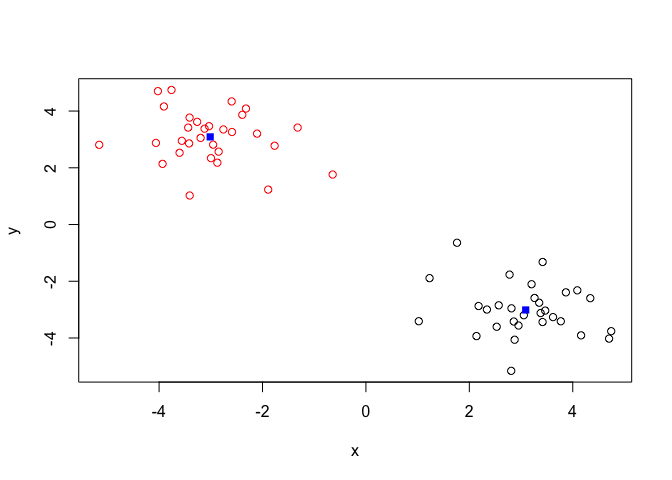<!-- -->

\#Hierarchical clustering \#we dont know the number of clusters ahead of
time \#can be bottom-up or top-down \#more flexible than k-means

``` r
#we need the x again
tmp <- c(rnorm(30,-3), rnorm(30,3))
x <- cbind(x=tmp, y=rev(tmp))
plot(x)
```

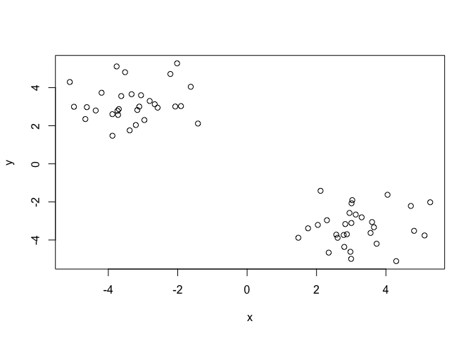<!-- -->

``` r
##so first let's try this
hc<-hclust(dist(x))
hc ###ehhh that's not helpful but lets plot is
```

    ## 
    ## Call:
    ## hclust(d = dist(x))
    ## 
    ## Cluster method   : complete 
    ## Distance         : euclidean 
    ## Number of objects: 60

``` r
plot(hc) ##look at the numbers and how they are organized
#they are 30 and below (left) and above 30 (right) 
## draw a line on the tree using abline
abline(h=6, col="red")
abline(h=4, col="blue")
```

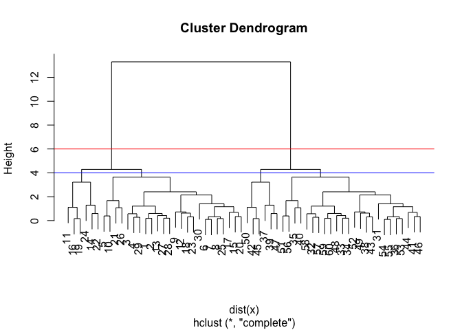<!-- -->

``` r
cutree(hc, k=6)
```

    ##  [1] 1 1 1 1 2 1 1 1 1 2 3 1 1 3 1 3 1 1 3 1 2 3 1 3 1 2 1 1 1 1 4 4 4 4 5
    ## [36] 4 6 4 6 5 4 6 4 4 6 4 6 4 4 6 5 4 4 4 4 5 4 4 4 4

``` r
cutree(hc, k=4)
```

    ##  [1] 1 1 1 1 1 1 1 1 1 1 2 1 1 2 1 2 1 1 2 1 1 2 1 2 1 1 1 1 1 1 3 3 3 3 3
    ## [36] 3 4 3 4 3 3 4 3 3 4 3 4 3 3 4 3 3 3 3 3 3 3 3 3 3

``` r
## you can also cut trees to yield a given k groups/clusters
grps<-cutree(hc, k=2)
table(grps)
```

    ## grps
    ##  1  2 
    ## 30 30

``` r
# First we need to calculate point (dis)similarity
# as the Euclidean distance between observations
dist_matrix <- dist(x)
##let's investigate this new thing
```

``` r
# First we need to calculate point (dis)similarity
# as the Euclidean distance between observations
dist_matrix <- dist(x)
```

``` r
# The hclust() function returns a hierarchical
# clustering model
hc_2 <- hclust(d = dist_matrix)
# the print method is not so useful here
hc_2
```

    ## 
    ## Call:
    ## hclust(d = dist_matrix)
    ## 
    ## Cluster method   : complete 
    ## Distance         : euclidean 
    ## Number of objects: 60

``` r
#Call:
#hclust(d = dist_matrix)
#Cluster method : complete
#Distance : euclidean
#Number of objects: 60 
```

## how to we link clusters in hierclusters?

\#\#aka: how is distance between clusters determined? FOUR MAIN METHODS
\#\#\# complete \#\#\#\# pairwise similarity between all observations in
clusters 1 and 2, uses largest of similarties \#\#\# single \#\#\#\#
uses smallest of similarities \#\#\# average \#\#\#\# uses average of
similarities \#\#\# centroid \#\#\#\# finds the centroid for each
cluster and uses similarity between those \#\#\# so how to do this in R

``` r
# Using different hierarchical clustering methods
#hc.complete <- hclust(d, method="complete")
#hc.average <- hclust(d, method="average")
#hc.single <- hclust(d, method="single")
### d doesn't exist so lol this does shit right now it's just a format
```

### MY TURN\!\!\!

``` r
# Step 1. Generate some example data for clustering
m <- rbind(
 matrix(rnorm(100, mean=0, sd = 0.3), ncol = 2), # c1
 matrix(rnorm(100, mean = 1, sd = 0.3), ncol = 2), # c2
 matrix(c(rnorm(50, mean = 1, sd = 0.3), # c3
 rnorm(50, mean = 0, sd = 0.3)), ncol = 2))
colnames(m) <- c("x", "y")
# Step 2. Plot the data without clustering
plot(m)
```

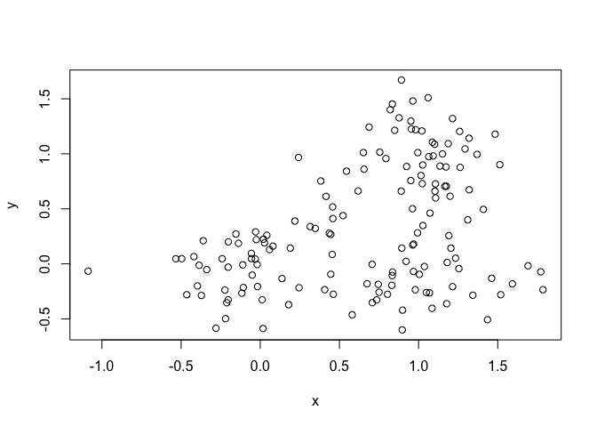<!-- -->

``` r
# Step 3. Generate colors for known clusters
# (just so we can compare to hclust results)
col <- as.factor( rep(c("c1","c2","c3"), each=50) )
plot(m, col=col)
```

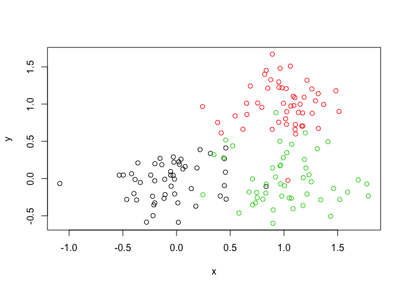<!-- -->

``` r
#Q. Use the dist(), hclust(), plot() and cutree() functions to return 2 and 3 clusters
#Q. How does this compare to your known 'col' groups?
dist(m)
```

    ##               1           2           3           4           5
    ## 2   1.189323440                                                
    ## 3   0.992714149 0.258516455                                    
    ## 4   0.959705034 0.828595701 0.865750575                        
    ## 5   1.038416986 0.176798916 0.244918340 0.671127709            
    ## 6   1.069356317 0.195262103 0.308788505 0.634282710 0.064584826
    ## 7   1.129725466 0.492510094 0.620553607 0.389961415 0.379811239
    ## 8   1.549272791 0.381947036 0.635969375 0.994717242 0.511054522
    ## 9   0.880785985 0.501565827 0.514258404 0.351560139 0.331308681
    ## 10  0.854224594 0.340520127 0.241069109 0.632825043 0.185446335
    ## 11  1.116462543 0.169625488 0.125821150 0.910947863 0.244832918
    ## 12  1.078994446 0.380236591 0.496805208 0.460847967 0.256350881
    ## 13  0.659001688 0.701010800 0.633332073 0.355836371 0.524252168
    ## 14  1.921233162 0.799547337 1.057103686 1.212002190 0.901800543
    ## 15  0.924723272 0.284348664 0.086199635 0.788723259 0.211489942
    ## 16  0.748631490 0.636522723 0.599474599 0.312013919 0.460519749
    ## 17  1.100221196 0.120303957 0.138751177 0.844418943 0.175265438
    ## 18  1.061907508 0.162095547 0.259131730 0.675786883 0.024398351
    ## 19  1.043933252 0.151235475 0.201772099 0.716025875 0.047730613
    ## 20  1.226191135 0.300473970 0.498781251 0.614417729 0.264011592
    ## 21  1.302574985 0.541527585 0.723697118 0.506406981 0.479518746
    ## 22  1.460107958 0.294739258 0.474154605 1.098849682 0.471367420
    ## 23  1.221277195 0.751294668 0.875714129 0.297122996 0.638805901
    ## 24  1.532872645 0.445810733 0.701957932 0.875643542 0.520086146
    ## 25  0.885145608 0.341424077 0.305226558 0.560579983 0.166693385
    ## 26  1.504018170 0.513831655 0.755774400 0.771190494 0.541684347
    ## 27  0.777787247 0.443115774 0.215408603 0.799403375 0.346017553
    ## 28  0.991405678 0.420100782 0.488543451 0.408559542 0.267253335
    ## 29  0.982766061 0.219008614 0.086764555 0.784323983 0.161535583
    ## 30  0.565370710 0.623984332 0.441276290 0.680134020 0.478106041
    ## 31  1.568773100 0.380604668 0.599439428 1.119246885 0.546887724
    ## 32  0.703489348 0.598624444 0.530971184 0.401769215 0.422154526
    ## 33  0.921579451 0.591534268 0.627503020 0.241543541 0.430150143
    ## 34  1.162701394 0.038021110 0.255450884 0.790994093 0.140594728
    ## 35  0.922299120 0.563587920 0.599840039 0.270001682 0.401703519
    ## 36  1.383011331 0.266557367 0.390538728 1.094197683 0.437805766
    ## 37  1.175013602 0.105626488 0.195766020 0.903824369 0.233334782
    ## 38  0.749810065 0.469144897 0.372373390 0.535794461 0.299577821
    ## 39  1.143176121 0.061090511 0.197593262 0.834226662 0.165148392
    ## 40  0.978639499 0.255443359 0.283841820 0.600463073 0.078890057
    ## 41  0.681215380 0.508111833 0.335737635 0.665264835 0.364295564
    ## 42  1.618230022 0.453990610 0.628383091 1.240595410 0.629930404
    ## 43  1.562920218 0.580326632 0.823646324 0.803166950 0.609471487
    ## 44  0.991398918 0.470505258 0.539076421 0.358284966 0.319526409
    ## 45  1.037115999 0.294039367 0.387450416 0.534588147 0.149415823
    ## 46  0.602343300 0.586984313 0.408833513 0.668308740 0.440671041
    ## 47  1.294075989 0.111158623 0.366713043 0.866485231 0.262917816
    ## 48  0.703123812 0.497634705 0.367008224 0.582280330 0.336486844
    ## 49  1.144884797 0.087081563 0.180130188 0.863251154 0.192392083
    ## 50  0.969477341 0.724279525 0.772468996 0.105852518 0.569718146
    ## 51  2.774817470 1.613039864 1.782165112 2.329079644 1.785851853
    ## 52  1.973915467 0.905551130 1.000974419 1.721770756 1.079915126
    ## 53  2.668535918 1.574162431 1.693192038 2.359986909 1.750918925
    ## 54  2.320936294 1.303007910 1.375725309 2.123217276 1.475380016
    ## 55  2.107168853 0.951998336 1.114479752 1.709374213 1.127164606
    ## 56  2.663545607 1.666762557 1.733857951 2.486472448 1.838911627
    ## 57  2.469870437 1.380305547 1.494978535 2.173922082 1.556886711
    ## 58  2.478748763 1.359496166 1.493790207 2.134425630 1.536188769
    ## 59  2.418855167 1.281443859 1.429031398 2.042980536 1.457512319
    ## 60  2.332543078 1.171680400 1.339829049 1.908382149 1.345501014
    ## 61  2.473670849 1.378095411 1.496564932 2.168430200 1.554794722
    ## 62  2.552558447 1.446493561 1.572239586 2.228303185 1.623292301
    ## 63  2.452554391 1.431517717 1.507757152 2.249091926 1.604660358
    ## 64  2.627152681 1.500762256 1.640777884 2.265034520 1.677156513
    ## 65  2.205085228 1.240136640 1.284730347 2.067765985 1.407061693
    ## 66  2.381239414 1.214084771 1.388779731 1.937438376 1.386595047
    ## 67  2.463426291 1.407266025 1.502295038 2.214982996 1.582578234
    ## 68  2.141438217 1.068867488 1.169573113 1.878934199 1.244204464
    ## 69  2.633098904 1.713591031 1.746540691 2.541640566 1.879119883
    ## 70  2.415442768 1.376577341 1.461615592 2.190459836 1.550779853
    ## 71  2.451071145 1.308782528 1.460388770 2.063992711 1.484482816
    ## 72  2.323244902 1.199354260 1.336198061 1.976423094 1.376037317
    ## 73  2.275016568 1.133953369 1.284057974 1.898107506 1.309995418
    ## 74  2.406931662 1.443915954 1.491699489 2.270404190 1.612119984
    ## 75  2.518364048 1.341496370 1.527631648 2.035373182 1.510873037
    ## 76  2.449551500 1.495492552 1.540034505 2.322403743 1.663140656
    ## 77  2.293727972 1.117090218 1.303464651 1.824150573 1.287142970
    ## 78  2.344268232 1.248278668 1.365997662 2.042250949 1.424903511
    ## 79  1.867879848 0.824264412 0.902027824 1.648226308 0.995731584
    ## 80  2.417881931 1.302152030 1.433649053 2.081720320 1.478919312
    ## 81  2.676248736 1.535418838 1.686406456 2.283883880 1.710941032
    ## 82  1.854493505 0.735188599 0.865193848 1.536964697 0.911814322
    ## 83  2.390508521 1.222862996 1.398087319 1.944794024 1.395241235
    ## 84  2.389814291 1.276323280 1.406095721 2.058399741 1.453113858
    ## 85  2.045702428 1.024177400 1.093567303 1.848102875 1.195170266
    ## 86  2.686989930 1.621514032 1.723802089 2.421126285 1.797589201
    ## 87  2.568810354 1.587524689 1.646192540 2.410693974 1.758131076
    ## 88  1.683040556 0.821212950 0.799607136 1.636803639 0.965844803
    ## 89  1.649383735 0.562737075 0.664066329 1.385300397 0.735950814
    ## 90  2.255312511 1.100670912 1.262746747 1.850312662 1.275541997
    ## 91  2.692224046 1.579596576 1.710398533 2.352924247 1.756317559
    ## 92  2.136101064 1.088119845 1.174092302 1.905359513 1.261851208
    ## 93  2.408397322 1.412053153 1.475413483 2.234724413 1.583139416
    ## 94  2.308300506 1.138827787 1.316210553 1.861644003 1.310989984
    ## 95  2.198249986 1.055112431 1.206748109 1.820915604 1.231142292
    ## 96  2.856550493 1.733575041 1.872006733 2.494179921 1.909942894
    ## 97  2.435548696 1.389601256 1.478701253 2.201114909 1.564290249
    ## 98  2.124387897 0.974547670 1.226783341 1.430847997 1.094170763
    ## 99  1.682673108 0.664450328 0.720701582 1.492946591 0.830279733
    ## 100 2.532041740 1.382161239 1.540302651 2.125188950 1.557049693
    ## 101 2.225244849 1.111856346 1.240459738 1.900039355 1.288650937
    ## 102 2.198522018 1.153325435 1.411287789 1.376822265 1.226430161
    ## 103 2.341898126 1.192106210 1.443023404 1.627233956 1.312725227
    ## 104 1.841254542 0.817688242 1.072243346 1.047228360 0.874927858
    ## 105 1.992241698 0.814088918 1.055599631 1.381213811 0.953845974
    ## 106 2.092608619 0.960073503 1.215671458 1.375031363 1.069814422
    ## 107 2.301076009 1.124368600 1.364162896 1.652986758 1.262988491
    ## 108 1.922750391 0.831511041 1.090026467 1.177286409 0.918892780
    ## 109 2.165697697 1.076815144 1.335208294 1.386941365 1.166752822
    ## 110 1.687405373 0.522446157 0.696944387 1.300868255 0.697935779
    ## 111 2.549703638 1.412231167 1.664914488 1.799510458 1.527203272
    ## 112 2.017598513 1.004690396 1.259964610 1.190165934 1.062698977
    ## 113 1.714344090 0.800062072 1.038541793 0.869046856 0.815093773
    ## 114 2.054849901 0.917049927 1.172091848 1.349718666 1.029329241
    ## 115 2.070644156 0.888834415 1.126258683 1.464114901 1.032319295
    ## 116 2.301254913 1.115218905 1.345072355 1.694855872 1.263757632
    ## 117 2.442747523 1.253424345 1.469973552 1.870756007 1.410451179
    ## 118 1.795037013 0.648229979 0.903707640 1.144626723 0.763565461
    ## 119 1.340633021 0.412711192 0.630567491 0.640861197 0.399853783
    ## 120 1.561472636 0.374427765 0.589432943 1.121614874 0.542526540
    ## 121 1.817686179 0.811457839 1.064039291 1.014362742 0.861460556
    ## 122 1.486289880 0.311842180 0.503771583 1.102634971 0.487196392
    ## 123 2.145102015 1.056701076 1.315124493 1.368004280 1.146176453
    ## 124 1.902708106 0.845787393 1.103241182 1.126749355 0.917871755
    ## 125 2.778982400 1.621143145 1.867621670 2.051123684 1.747593117
    ## 126 2.558949541 1.370538580 1.579034913 2.005036477 1.531360675
    ## 127 2.283754969 1.215709698 1.474223440 1.473971246 1.298623050
    ## 128 2.222977474 1.036458244 1.240626660 1.709442744 1.200835237
    ## 129 1.922896420 0.791451540 1.048117084 1.226777422 0.898979244
    ## 130 2.385428768 1.207142706 1.395561285 1.904011462 1.376286843
    ## 131 2.614957135 1.505149724 1.761434697 1.824317216 1.607778270
    ## 132 2.323972201 1.158907486 1.404907503 1.641843349 1.288827132
    ## 133 2.054662385 1.116671356 1.365136729 1.176753557 1.151267644
    ## 134 2.306250111 1.192931703 1.449755316 1.541550809 1.295015159
    ## 135 1.836280841 0.750216248 1.008572195 1.099932694 0.833496493
    ## 136 2.439729167 1.339181703 1.596607884 1.649928565 1.436724145
    ## 137 2.010188258 0.852342829 1.103313176 1.345584223 0.976387714
    ## 138 2.064479612 0.883483500 1.121778432 1.455282332 1.026096124
    ## 139 2.109738453 0.921403625 1.147433290 1.540320204 1.074519197
    ## 140 2.560824014 1.511238592 1.769718623 1.716853472 1.590278742
    ## 141 1.651419501 0.519005198 0.658955169 1.326423443 0.695597256
    ## 142 2.125944125 0.944689287 1.138753723 1.649381094 1.113283985
    ## 143 2.877928340 1.751068470 2.004535444 2.095008255 1.862321652
    ## 144 2.073486492 0.982842504 1.241295797 1.306807391 1.072335877
    ## 145 2.682309159 1.550947012 1.804255999 1.915267327 1.663517378
    ## 146 1.765470695 0.685903848 0.943786528 1.036335436 0.764449296
    ## 147 1.847536848 0.790548614 1.047693745 1.080831603 0.861301923
    ## 148 2.859054475 1.707731419 1.955980606 2.114772696 1.830767131
    ## 149 2.154986474 0.965664297 1.183760297 1.606232727 1.123595003
    ## 150 2.269181431 1.110569507 1.359345185 1.577732290 1.236153988
    ##               6           7           8           9          10
    ## 2                                                              
    ## 3                                                              
    ## 4                                                              
    ## 5                                                              
    ## 6                                                              
    ## 7   0.321439705                                                
    ## 8   0.483033876 0.604832706                                    
    ## 9   0.308379717 0.251537819 0.751331475                        
    ## 10  0.227261827 0.450536902 0.696153896 0.285120687            
    ## 11  0.297600043 0.618708763 0.525557429 0.563299169 0.322821299
    ## 12  0.199627747 0.123819207 0.555011365 0.208444999 0.337190726
    ## 13  0.522180851 0.478382229 0.989031260 0.244440390 0.396268348
    ## 14  0.858920095 0.850494743 0.424943653 1.065133645 1.084888950
    ## 15  0.275242197 0.568035954 0.665973525 0.438379498 0.158089837
    ## 16  0.450204185 0.386001547 0.906601134 0.156326867 0.358409161
    ## 17  0.226665602 0.547731643 0.497845768 0.499171250 0.276683400
    ## 18  0.051185399 0.372269670 0.487406739 0.340795973 0.209528795
    ## 19  0.107958039 0.426991932 0.510470354 0.372847621 0.190913798
    ## 20  0.201724567 0.229745710 0.386016836 0.375251675 0.418427196
    ## 21  0.415126044 0.172910172 0.533552932 0.423951376 0.592078962
    ## 22  0.481089747 0.730975541 0.288242142 0.789245767 0.628103548
    ## 23  0.581914770 0.260922000 0.802798933 0.424194416 0.684339799
    ## 24  0.473119897 0.491569614 0.180431477 0.684017291 0.700191272
    ## 25  0.184754722 0.366404029 0.667487762 0.209281011 0.085114138
    ## 26  0.484053736 0.405664617 0.324265169 0.630668584 0.706300620
    ## 27  0.403930297 0.653325172 0.824271057 0.468789109 0.202880902
    ## 28  0.225833425 0.163290934 0.637020026 0.118633711 0.293491437
    ## 29  0.226070188 0.534126557 0.600459151 0.432907116 0.173578337
    ## 30  0.516315550 0.660442600 0.988500755 0.420405131 0.292660131
    ## 31  0.539838195 0.735180658 0.181541073 0.838399410 0.720783724
    ## 32  0.424136138 0.427742847 0.898179927 0.177325822 0.292422801
    ## 33  0.396330989 0.225230586 0.797861339 0.115920940 0.400968032
    ## 34  0.157323092 0.458681370 0.398158471 0.463607423 0.310668841
    ## 35  0.368342608 0.214486316 0.775581067 0.090799376 0.374889452
    ## 36  0.461812534 0.744721401 0.384048182 0.767198109 0.572814829
    ## 37  0.273239654 0.586917467 0.447959488 0.563881797 0.353598299
    ## 38  0.321283382 0.444313665 0.804077327 0.217983171 0.138588787
    ## 39  0.202803457 0.517554049 0.440579029 0.496444034 0.303621540
    ## 40  0.090759850 0.340257108 0.572737618 0.255430113 0.141585753
    ## 41  0.405812372 0.582620430 0.873674992 0.361091693 0.179401218
    ## 42  0.635460978 0.862835424 0.325843454 0.942083048 0.788884847
    ## 43  0.551404819 0.452247584 0.362046317 0.685955339 0.772623998
    ## 44  0.277081124 0.141755955 0.670682397 0.110798906 0.336628472
    ## 45  0.100374241 0.233104289 0.539097711 0.219773778 0.241012250
    ## 46  0.479236156 0.630650318 0.951045962 0.394560906 0.255227770
    ## 47  0.257390644 0.502135660 0.270883142 0.562138094 0.440986316
    ## 48  0.366670540 0.507135517 0.846457818 0.278121695 0.157208734
    ## 49  0.234425175 0.550979192 0.455966240 0.522650236 0.315531663
    ## 50  0.530614811 0.288149852 0.891760849 0.260190109 0.545176118
    ## 51  1.781620103 1.939370257 1.336384946 2.077095005 1.951082536
    ## 52  1.098933715 1.350166354 0.800223546 1.406873339 1.210550009
    ## 53  1.761041968 1.974287016 1.377531580 2.068332594 1.894610418
    ## 54  1.497491374 1.752457258 1.194286348 1.804512281 1.596346685
    ## 55  1.128594551 1.321541463 0.721560958 1.431340796 1.287059874
    ## 56  1.861268960 2.114043005 1.547020611 2.168241785 1.957518546
    ## 57  1.568799298 1.790484737 1.199771796 1.876701658 1.698084258
    ## 58  1.543065832 1.747411964 1.148214770 1.848960161 1.686136656
    ## 59  1.461081407 1.654593612 1.052398222 1.764907544 1.612906207
    ## 60  1.343631038 1.518685900 0.913979879 1.642791427 1.508838069
    ## 61  1.565750943 1.784193428 1.191551507 1.873390252 1.697723201
    ## 62  1.632098619 1.842159662 1.244746656 1.938903118 1.769708448
    ## 63  1.625568451 1.875729272 1.309142256 1.933079645 1.727585053
    ## 64  1.681906303 1.876504543 1.273776603 1.986352583 1.830027806
    ## 65  1.435350648 1.708205407 1.179863877 1.738299625 1.513742277
    ## 66  1.382425867 1.547480604 0.942859135 1.678902066 1.552667704
    ## 67  1.599208537 1.836200440 1.256662769 1.907565245 1.714623870
    ## 68  1.260972394 1.502738661 0.934720359 1.569298512 1.377946310
    ## 69  1.908698293 2.182106903 1.643724171 2.210425487 1.979702019
    ## 70  1.569855518 1.814896038 1.243606046 1.877874741 1.677934763
    ## 71  1.486772474 1.675036578 1.071596718 1.789560331 1.641665672
    ## 72  1.382994594 1.590188669 0.993419975 1.689062345 1.526512754
    ## 73  1.313669800 1.510357735 0.909971006 1.617774515 1.465824063
    ## 74  1.639177162 1.907167161 1.364836596 1.943190160 1.720562540
    ## 75  1.502252864 1.646235947 1.045960411 1.792360073 1.681707072
    ## 76  1.690750706 1.959934855 1.418454851 1.994311559 1.769906216
    ## 77  1.279777743 1.434274146 0.830696422 1.572507213 1.457158745
    ## 78  1.436606347 1.659362374 1.070890029 1.744493601 1.567083769
    ## 79  1.019207936 1.284237387 0.761463988 1.325429917 1.117866988
    ## 80  1.486799815 1.695576631 1.098625556 1.793257010 1.627445265
    ## 81  1.712452809 1.894277363 1.289647823 2.014270888 1.868592353
    ## 82  0.924190717 1.159760634 0.599191078 1.232390854 1.056605721
    ## 83  1.390852236 1.554832683 0.950303637 1.687039709 1.561553992
    ## 84  1.461571302 1.672772830 1.077196271 1.768315073 1.600788403
    ## 85  1.219177097 1.482661769 0.945961534 1.525184085 1.313948960
    ## 86  1.811801553 2.038720201 1.449221454 2.120082661 1.933544584
    ## 87  1.782524168 2.041924170 1.484229137 2.088421759 1.872328814
    ## 88  1.007533632 1.313177015 0.905904026 1.291163223 1.038615792
    ## 89  0.757222199 1.022503226 0.528458319 1.064287853 0.866901091
    ## 90  1.275962908 1.461378073 0.858174478 1.577511962 1.436118689
    ## 91  1.763313214 1.965245158 1.364184180 2.069127059 1.905346330
    ## 92  1.281906006 1.533285721 0.976247368 1.589621188 1.388753953
    ## 93  1.606959405 1.865967636 1.310872789 1.913160268 1.699571789
    ## 94  1.306432615 1.471699424 0.866982458 1.602672942 1.477754382
    ## 95  1.234901452 1.433615794 0.834673494 1.539187424 1.387214516
    ## 96  1.914379624 2.105067756 1.501147928 2.218413380 2.062699581
    ## 97  1.582378985 1.824199313 1.249421671 1.890583284 1.693443527
    ## 98  1.056444893 1.068154083 0.592614541 1.278038156 1.279228498
    ## 99  0.859412648 1.141215719 0.670886722 1.161529684 0.941883300
    ## 100 1.557088365 1.735501029 1.130786887 1.857745884 1.717193075
    ## 101 1.298280708 1.516279861 0.926632048 1.605598276 1.435158612
    ## 102 1.174130603 1.075833359 0.798824270 1.319020011 1.400251081
    ## 103 1.274618211 1.274327362 0.810353526 1.490698814 1.497736955
    ## 104 0.820400761 0.723229931 0.500061715 0.962900750 1.045208811
    ## 105 0.925694657 0.999027878 0.443130313 1.180510506 1.138573680
    ## 106 1.028570877 1.019536546 0.579777989 1.236753812 1.253753492
    ## 107 1.232952645 1.281234962 0.751933970 1.477596495 1.448021847
    ## 108 0.871433701 0.829456561 0.470162683 1.055381921 1.098667375
    ## 109 1.118950153 1.059166809 0.707417891 1.293046108 1.346210315
    ## 110 0.701762844 0.919961621 0.359314988 1.007356194 0.858161946
    ## 111 1.486440846 1.462558680 1.030311611 1.688348088 1.711428348
    ## 112 1.007589933 0.891855798 0.674018822 1.137113347 1.231598628
    ## 113 0.753894830 0.584620418 0.563089530 0.834809973 0.966302836
    ## 114 0.989164917 0.989425005 0.536122929 1.202821323 1.213682246
    ## 115 1.005694578 1.082270857 0.522680318 1.263161483 1.216551162
    ## 116 1.239087972 1.315467336 0.756235173 1.498620581 1.447077397
    ## 117 1.390904367 1.487903193 0.911854783 1.661361586 1.590851752
    ## 118 0.726290320 0.765573028 0.267960862 0.958941398 0.948622389
    ## 119 0.337970152 0.257202409 0.368463781 0.468716081 0.552369180
    ## 120 0.537242753 0.738715215 0.193768176 0.837471647 0.714893970
    ## 121 0.805551563 0.696071644 0.506776914 0.938120144 1.028968913
    ## 122 0.492496211 0.729868873 0.258990229 0.799535286 0.649213419
    ## 123 1.098313649 1.039075505 0.687976595 1.272630394 1.325574547
    ## 124 0.866450652 0.793304945 0.503261844 1.027910613 1.093130233
    ## 125 1.710906637 1.707340435 1.241125865 1.927304015 1.932895440
    ## 126 1.514450832 1.620933920 1.038829514 1.789797032 1.709760308
    ## 127 1.248548727 1.165680137 0.850452323 1.406109782 1.475542945
    ## 128 1.187741844 1.320596179 0.722664435 1.472166774 1.376651722
    ## 129 0.857872549 0.861243780 0.413454296 1.071568274 1.082920428
    ## 130 1.367638446 1.514513507 0.912907051 1.658196121 1.547440701
    ## 131 1.562677591 1.507506276 1.125722064 1.742801768 1.789583121
    ## 132 1.254643522 1.278685717 0.780001487 1.485543977 1.474273350
    ## 133 1.091843158 0.926100658 0.816333257 1.177291019 1.308379987
    ## 134 1.250440980 1.208496704 0.814709078 1.438396860 1.477160633
    ## 135 0.785427153 0.746389799 0.397914135 0.969905880 1.012685925
    ## 136 1.390397546 1.331172313 0.962543857 1.566717977 1.617543633
    ## 137 0.940992220 0.973449805 0.470810488 1.173563160 1.161763946
    ## 138 0.999037219 1.073739790 0.516092355 1.255473401 1.210470453
    ## 139 1.053354632 1.154578238 0.573480530 1.323258388 1.256300501
    ## 140 1.538653012 1.434640907 1.146314151 1.680395933 1.765014028
    ## 141 0.708773782 0.954365814 0.431649264 1.017124731 0.842070847
    ## 142 1.104674162 1.259429410 0.655251271 1.396516755 1.285137331
    ## 143 1.819677375 1.775986408 1.369335684 2.009104068 2.045710068
    ## 144 1.024750581 0.971511436 0.615342905 1.202706062 1.252001048
    ## 145 1.621636683 1.587046814 1.169152655 1.816796334 1.847272342
    ## 146 0.715618514 0.678184776 0.345857258 0.899675399 0.942871806
    ## 147 0.809863657 0.741393871 0.453576263 0.973895176 1.036566821
    ## 148 1.792555537 1.777988041 1.326716074 2.002058743 2.015807564
    ## 149 1.105538212 1.219098572 0.630139397 1.381423756 1.303393826
    ## 150 1.200285011 1.216517296 0.729806693 1.426043925 1.421513864
    ##              11          12          13          14          15
    ## 2                                                              
    ## 3                                                              
    ## 4                                                              
    ## 5                                                              
    ## 6                                                              
    ## 7                                                              
    ## 8                                                              
    ## 9                                                              
    ## 10                                                             
    ## 11                                                             
    ## 12  0.497198265                                                
    ## 13  0.717949882 0.452858505                                    
    ## 14  0.949948378 0.856798392 1.309315859                        
    ## 15  0.194773590 0.445885543 0.547425889 1.079480707            
    ## 16  0.671585486 0.363560809 0.092425353 1.218905444 0.515617909
    ## 17  0.070977624 0.426284790 0.665927635 0.918370226 0.177860489
    ## 18  0.247552577 0.249876696 0.540789158 0.877402384 0.231546012
    ## 19  0.197538717 0.303736596 0.554772489 0.911912635 0.179503066
    ## 20  0.456030044 0.170629855 0.618850448 0.697026777 0.475357921
    ## 21  0.693999900 0.256518682 0.649569054 0.705987260 0.686233505
    ## 22  0.348346869 0.638439648 0.995607018 0.682639819 0.535536452
    ## 23  0.879425289 0.382703661 0.570789846 0.947546425 0.817036303
    ## 24  0.611347274 0.476085554 0.928336560 0.388384355 0.710701212
    ## 25  0.364488306 0.256017341 0.362160982 1.039240441 0.229570412
    ## 26  0.683448430 0.425623271 0.872563708 0.445284508 0.748158774
    ## 27  0.340520277 0.539540777 0.501769406 1.235111084 0.159014736
    ## 28  0.511559317 0.090075122 0.363054858 0.946854617 0.425273245
    ## 29  0.150357069 0.410460077 0.569768410 1.014138769 0.065561875
    ## 30  0.560009556 0.574237212 0.333992998 1.375204851 0.365409607
    ## 31  0.475682849 0.662246461 1.061964057 0.538447766 0.650798581
    ## 32  0.613538473 0.379382552 0.104563140 1.233900196 0.445433602
    ## 33  0.669415520 0.243599669 0.262820612 1.073919961 0.553242166
    ## 34  0.183606029 0.344561086 0.664713879 0.809918087 0.269673616
    ## 35  0.640975974 0.220606607 0.265662845 1.059096130 0.526181350
    ## 36  0.266831579 0.640330658 0.956316822 0.789507367 0.460931160
    ## 37  0.077604921 0.469635049 0.740052270 0.872357579 0.250541870
    ## 38  0.461216445 0.355249966 0.260966555 1.172374157 0.286468655
    ## 39  0.114613639 0.399519377 0.680501950 0.859877243 0.228440880
    ## 40  0.310538262 0.218015247 0.446024938 0.948846813 0.227913666
    ## 41  0.449938254 0.484855712 0.349077772 1.264193835 0.255414770
    ## 42  0.502955786 0.780117896 1.153684773 0.639313764 0.693575768
    ## 43  0.749936954 0.483962021 0.925615978 0.408986755 0.816229027
    ## 44  0.563825754 0.115674466 0.348138090 0.963200070 0.473842423
    ## 45  0.393418904 0.109426058 0.450262378 0.884328326 0.337433315
    ## 46  0.525997380 0.541462622 0.329574163 1.338154700 0.331227974
    ## 47  0.264296356 0.406178022 0.779164898 0.690407994 0.395475714
    ## 48  0.468296738 0.416573654 0.279152009 1.223339839 0.281337709
    ## 49  0.082843136 0.432287840 0.699649438 0.878080529 0.223109591
    ## 50  0.811542546 0.354995990 0.327501715 1.123478462 0.698221983
    ## 51  1.659226167 1.889367183 2.303737111 1.215304460 1.852953838
    ## 52  0.890929762 1.261236332 1.598662061 0.982912367 1.082271330
    ## 53  1.579620798 1.902278518 2.274754290 1.377371990 1.772934929
    ## 54  1.273828749 1.662971238 1.988954273 1.319382037 1.459820929
    ## 55  0.991556813 1.255422037 1.649619687 0.769201823 1.185454354
    ## 56  1.634735887 2.026006418 2.351116513 1.631454528 1.818627873
    ## 57  1.382035987 1.714674110 2.080138810 1.237861209 1.575039047
    ## 58  1.376471736 1.678438308 2.060428620 1.149655668 1.570997041
    ## 59  1.309046751 1.589637968 1.981057486 1.039498638 1.503808062
    ## 60  1.216563038 1.460466067 1.865696525 0.876292222 1.410129311
    ## 61  1.382727270 1.709673620 2.078425856 1.222522557 1.576124926
    ## 62  1.456902712 1.771143853 2.147436400 1.249416534 1.650883633
    ## 63  1.405235781 1.788449025 2.119629499 1.408221698 1.591733774
    ## 64  1.522562053 1.811751504 2.201099914 1.239020868 1.717250584
    ## 65  1.191493286 1.611118413 1.909438133 1.356668887 1.370299196
    ## 66  1.264796427 1.493283775 1.904581251 0.876594297 1.457608249
    ## 67  1.394397277 1.754275089 2.102577765 1.327055735 1.584620003
    ## 68  1.059041720 1.418088009 1.764639740 1.063752094 1.250730404
    ## 69  1.658949859 2.085303847 2.375955295 1.777519881 1.832624326
    ## 70  1.356383489 1.729628005 2.068244683 1.336356082 1.544828907
    ## 71  1.339761340 1.612218920 2.007494998 1.043568935 1.534455451
    ## 72  1.218027877 1.519610829 1.900273719 1.022818222 1.412693332
    ## 73  1.163356805 1.443636391 1.833541558 0.926730825 1.358051188
    ## 74  1.398194365 1.812425466 2.116141160 1.506871307 1.577279451
    ## 75  1.402664989 1.600656625 2.023103048 0.918699974 1.593668040
    ## 76  1.447790381 1.864744073 2.165712660 1.558688596 1.625757875
    ## 77  1.178333653 1.383648830 1.801301262 0.756582378 1.369009008
    ## 78  1.252005251 1.582791805 1.948315485 1.128133079 1.445443457
    ## 79  0.796046221 1.189518918 1.509419940 0.991147598 0.984770300
    ## 80  1.316784867 1.624693104 2.003162171 1.117035693 1.511200478
    ## 81  1.566204828 1.834645099 2.233597281 1.224335015 1.760942668
    ## 82  0.746556828 1.076223488 1.435375624 0.798170364 0.941237805
    ## 83  1.274055571 1.501085795 1.912989514 0.880422638 1.466802189
    ## 84  1.289531790 1.600857866 1.977319241 1.104463676 1.483866936
    ## 85  0.991372948 1.389101198 1.706927324 1.131974851 1.177488540
    ## 86  1.614473920 1.961279852 2.319358318 1.476035481 1.805611869
    ## 87  1.549544407 1.951002714 2.266980277 1.591486633 1.731375447
    ## 88  0.728008262 1.200963513 1.432934303 1.225117854 0.885608195
    ## 89  0.549536008 0.926650096 1.254040476 0.831693961 0.742899598
    ## 90  1.140168072 1.398866023 1.797442179 0.855959612 1.334233059
    ## 91  1.594194275 1.897768249 2.280567291 1.338555086 1.788461276
    ## 92  1.067512462 1.444816889 1.778869524 1.123669119 1.256781939
    ## 93  1.376755920 1.774976379 2.093587875 1.433561793 1.560221097
    ## 94  1.191866875 1.417080580 1.828564062 0.813051974 1.384205128
    ## 95  1.085623675 1.365785105 1.754695301 0.870978021 1.280247414
    ## 96  1.754420527 2.042386115 2.433834860 1.440033776 1.949021409
    ## 97  1.372371398 1.740272709 2.082849754 1.333097637 1.561569686
    ## 98  1.111873263 1.069619400 1.522473012 0.218902046 1.258548486
    ## 99  0.619087361 1.039189071 1.336029849 0.970318728 0.804495128
    ## 100 1.418725196 1.676761261 2.078759710 1.072697727 1.613187268
    ## 101 1.123702457 1.441171299 1.812721930 0.994788244 1.318066259
    ## 102 1.313643162 1.120157013 1.554124309 0.390191823 1.421569117
    ## 103 1.326702245 1.282313046 1.734936200 0.425656399 1.476301321
    ## 104 0.983686815 0.762463046 1.200336372 0.242463390 1.075327700
    ## 105 0.935184191 0.975941181 1.422567049 0.256336717 1.097087350
    ## 106 1.104407984 1.028487830 1.480831082 0.171909796 1.242421391
    ## 107 1.242602168 1.270550326 1.721268948 0.446573214 1.407102911
    ## 108 0.988507459 0.848589259 1.298021339 0.089362575 1.105861391
    ## 109 1.230922107 1.088312367 1.533583332 0.283703507 1.352983510
    ## 110 0.571716587 0.841262382 1.221215864 0.627253498 0.762830422
    ## 111 1.549738955 1.480867901 1.931450508 0.628562065 1.695947219
    ## 112 1.169766831 0.941115875 1.370222678 0.321355908 1.263515655
    ## 113 0.969639776 0.650710323 1.060446553 0.437293501 1.025192759
    ## 114 1.060184730 0.994396710 1.447140271 0.138931441 1.199869389
    ## 115 1.004354526 1.058912198 1.504920500 0.316165972 1.170550238
    ## 116 1.221141427 1.294222620 1.740328233 0.509522541 1.394023429
    ## 117 1.344458764 1.459787400 1.900700225 0.695546019 1.525410539
    ## 118 0.793241914 0.751638264 1.202893616 0.162491841 0.931082840
    ## 119 0.577250542 0.262468664 0.711792264 0.599047858 0.610872180
    ## 120 0.465218028 0.663639761 1.059415950 0.553668903 0.642131619
    ## 121 0.978759083 0.739761134 1.173980481 0.277166845 1.064206104
    ## 122 0.378197941 0.641787206 1.010689955 0.647617220 0.562506836
    ## 123 1.211140469 1.067800932 1.513277220 0.264907089 1.332630914
    ## 124 1.007994834 0.824183314 1.267905982 0.172778578 1.112520557
    ## 125 1.748212699 1.719034042 2.171346629 0.862280075 1.905415770
    ## 126 1.453223863 1.589806145 2.027698831 0.832562663 1.637835585
    ## 127 1.372124084 1.204760525 1.643340528 0.428645289 1.489065683
    ## 128 1.114805589 1.277663443 1.705959182 0.615252920 1.300430819
    ## 129 0.939011129 0.863123276 1.315961482 0.031842173 1.072899237
    ## 130 1.270347962 1.467238885 1.888572659 0.807791576 1.460710572
    ## 131 1.650430163 1.538078044 1.982985651 0.707187547 1.786356718
    ## 132 1.285732191 1.277319979 1.729938790 0.429999541 1.443068032
    ## 133 1.285265870 0.995477640 1.397926474 0.498053700 1.358910157
    ## 134 1.340097735 1.232062587 1.680375337 0.394274830 1.473639093
    ## 135 0.909518929 0.762771040 1.212911124 0.119059637 1.022317393
    ## 136 1.488097625 1.362296686 1.806716633 0.539635744 1.618652075
    ## 137 0.987690992 0.965744332 1.417766075 0.155249962 1.136606422
    ## 138 1.000139345 1.051007167 1.497395959 0.306338988 1.165509108
    ## 139 1.023105521 1.122495684 1.562330449 0.419438708 1.198049357
    ## 140 1.668155639 1.483560400 1.912856447 0.723269411 1.783194350
    ## 141 0.537157685 0.865671348 1.219189089 0.728335602 0.731749015
    ## 142 1.013099074 1.207667958 1.625855862 0.620425509 1.201610464
    ## 143 1.889793686 1.803327857 2.250268178 0.960832940 2.034371174
    ## 144 1.137761418 0.997125843 1.444115832 0.194770161 1.258594227
    ## 145 1.689521080 1.610111425 2.058998053 0.762772182 1.834377727
    ## 146 0.847416140 0.692321289 1.142919353 0.175780789 0.955296195
    ## 147 0.953501415 0.769428187 1.214607405 0.173086491 1.056288540
    ## 148 1.837439162 1.794187338 2.245575691 0.938848371 1.992079874
    ## 149 1.058502270 1.182841603 1.618697934 0.494007598 1.238065798
    ## 150 1.241731458 1.217663677 1.670484172 0.366584320 1.394918071
    ##              16          17          18          19          20
    ## 2                                                              
    ## 3                                                              
    ## 4                                                              
    ## 5                                                              
    ## 6                                                              
    ## 7                                                              
    ## 8                                                              
    ## 9                                                              
    ## 10                                                             
    ## 11                                                             
    ## 12                                                             
    ## 13                                                             
    ## 14                                                             
    ## 15                                                             
    ## 16                                                             
    ## 17  0.614256400                                                
    ## 18  0.474555660 0.176818400                                    
    ## 19  0.495739046 0.128703054 0.057437940                        
    ## 20  0.531506245 0.389042761 0.244093521 0.299275515            
    ## 21  0.557419849 0.625315334 0.464613724 0.522039327 0.241069452
    ## 22  0.929391965 0.360583295 0.455312866 0.444143127 0.504830753
    ## 23  0.491640745 0.808451914 0.632482063 0.686328138 0.469196975
    ## 24  0.839627317 0.565632072 0.495838593 0.535796561 0.310793386
    ## 25  0.307708426 0.306656291 0.186727326 0.192846686 0.355481346
    ## 26  0.780888160 0.627471312 0.519113500 0.568656822 0.288522086
    ## 27  0.497346145 0.335518148 0.369233681 0.325526249 0.604769350
    ## 28  0.274467800 0.442491136 0.269056780 0.314073418 0.257239132
    ## 29  0.528035959 0.117506299 0.178277219 0.122396814 0.421634777
    ## 30  0.370064287 0.537154175 0.502171042 0.479811104 0.693972374
    ## 31  0.987637313 0.472950174 0.526662903 0.530253081 0.505949441
    ## 32  0.089767875 0.561389410 0.439584956 0.451243132 0.537976135
    ## 33  0.173566473 0.602942699 0.435774133 0.474662294 0.412029100
    ## 34  0.599267241 0.123051922 0.124711927 0.119806668 0.274907448
    ## 35  0.174016567 0.574466426 0.407449451 0.446184744 0.390333553
    ## 36  0.897549579 0.296490527 0.426464603 0.402211201 0.529053243
    ## 37  0.685384019 0.077505607 0.228278601 0.191333115 0.404811013
    ## 38  0.237037701 0.414634863 0.321131804 0.317951692 0.481575923
    ## 39  0.622141371 0.059214743 0.158441215 0.126421874 0.342855502
    ## 40  0.381643034 0.244388354 0.094965677 0.117439269 0.277030972
    ## 41  0.355559546 0.423180290 0.388536985 0.364247624 0.590615964
    ## 42  1.085379587 0.520311141 0.612896754 0.604254741 0.633240963
    ## 43  0.833464309 0.694767088 0.586999355 0.636726006 0.354294968
    ## 44  0.256462478 0.494769718 0.321074944 0.366350308 0.285910279
    ## 45  0.370538799 0.323041315 0.146628614 0.197143702 0.190491073
    ## 46  0.356550053 0.501438724 0.464747861 0.442449140 0.658241232
    ## 47  0.707382101 0.228019654 0.242319505 0.250290274 0.281847712
    ## 48  0.274727801 0.429630264 0.359533716 0.347408775 0.537112505
    ## 49  0.644291173 0.045253397 0.188230279 0.150028662 0.376765667
    ## 50  0.260615159 0.744025851 0.573277367 0.615359023 0.509763238
    ## 51  2.228432835 1.682438910 1.766726459 1.764238508 1.722014988
    ## 52  1.540171797 0.934510490 1.067342602 1.044992282 1.121271526
    ## 53  2.209933500 1.617995116 1.735636733 1.720383073 1.746079948
    ## 54  1.934185308 1.323027260 1.463999860 1.438467184 1.523498784
    ## 55  1.578551703 1.016044188 1.109315770 1.102593745 1.094989603
    ## 56  2.297324887 1.685289547 1.827676106 1.801689835 1.884708255
    ## 57  2.016657752 1.421403664 1.542119125 1.525447235 1.561360660
    ## 58  1.993024027 1.410442177 1.519922222 1.507731236 1.520060913
    ## 59  1.911258401 1.338959349 1.440312127 1.431156829 1.428726506
    ## 60  1.792317746 1.239570573 1.326874664 1.322748417 1.296012883
    ## 61  2.014176495 1.421093582 1.539733726 1.523908384 1.555321658
    ## 62  2.081523561 1.493362787 1.607599576 1.593613729 1.614196324
    ## 63  2.064017792 1.453762380 1.592874175 1.568286237 1.646320074
    ## 64  2.132109068 1.554999374 1.660315754 1.649883855 1.650824228
    ## 65  1.860458943 1.246216397 1.397998234 1.367184681 1.482228010
    ## 66  1.829706909 1.285553181 1.367423898 1.365312089 1.327184037
    ## 67  2.043077623 1.438666690 1.569324486 1.548483271 1.606460576
    ## 68  1.704714574 1.101600574 1.230923095 1.210313886 1.273099340
    ## 69  2.329843324 1.715887806 1.870640988 1.838465452 1.955645949
    ## 70  2.010857269 1.402937525 1.538345989 1.515393815 1.585263948
    ## 71  1.936791141 1.368453022 1.466945480 1.458903106 1.450125762
    ## 72  1.832910065 1.251063156 1.359761953 1.347682137 1.362258764
    ## 73  1.763861990 1.192265879 1.292792087 1.283736687 1.283701927
    ## 74  2.066578795 1.452422297 1.602610359 1.572713713 1.679874102
    ## 75  1.945363501 1.419322241 1.490719124 1.492470790 1.431965244
    ## 76  2.116872448 1.502632814 1.653853798 1.623454703 1.732811477
    ## 77  1.724640670 1.194522542 1.267222353 1.268153228 1.216233436
    ## 78  1.884567925 1.290438469 1.410045921 1.393692665 1.430078742
    ## 79  1.454280652 0.843578849 0.984712790 0.958572714 1.057520733
    ## 80  1.936500851 1.351492727 1.462930808 1.449908126 1.467599946
    ## 81  2.162251879 1.595332503 1.693235046 1.685661278 1.671045271
    ## 82  1.371543178 0.780494486 0.896996907 0.880936275 0.930107343
    ## 83  1.837968148 1.294634805 1.376020100 1.374094683 1.334822147
    ## 84  1.911085561 1.324698071 1.437288306 1.423781400 1.444495472
    ## 85  1.653060490 1.041031379 1.184416403 1.157515464 1.255177821
    ## 86  2.257987925 1.657137746 1.783580807 1.764699016 1.809375365
    ## 87  2.215063511 1.601753516 1.747630923 1.719935927 1.813230495
    ## 88  1.395483891 0.792655279 0.962619196 0.920801715 1.105139243
    ## 89  1.195883292 0.590460408 0.723986061 0.700471900 0.796986177
    ## 90  1.725605209 1.165123877 1.257474116 1.251392601 1.236480390
    ## 91  2.213274425 1.629354740 1.740119086 1.727627110 1.738507207
    ## 92  1.721734501 1.113594380 1.249694053 1.226170551 1.304188801
    ## 93  2.040703497 1.427955632 1.572400990 1.545307004 1.637353679
    ## 94  1.753545625 1.211510259 1.291712248 1.290063240 1.251091518
    ## 95  1.685100505 1.113903519 1.213941898 1.204933616 1.206503524
    ## 96  2.364580354 1.787499653 1.893045956 1.882713417 1.880399379
    ## 97  2.024603951 1.418010373 1.551521995 1.529420319 1.594482275
    ## 98  1.432796024 1.089484598 1.069900342 1.099132592 0.906227945
    ## 99  1.284673886 0.670860066 0.821360302 0.790562130 0.919994209
    ## 100 2.006470864 1.445405717 1.538940440 1.532833904 1.512670728
    ## 101 1.747295699 1.158975225 1.273134285 1.258790935 1.287208746
    ## 102 1.461705653 1.273628843 1.202579197 1.245528712 0.985927852
    ## 103 1.644561836 1.306241891 1.288446572 1.317664637 1.121110859
    ## 104 1.107952383 0.937083338 0.851479046 0.897129557 0.628957753
    ## 105 1.336829509 0.922126846 0.930338085 0.951041831 0.805862798
    ## 106 1.390241791 1.077342842 1.045429786 1.078010267 0.868903075
    ## 107 1.633691641 1.231658846 1.239319664 1.261073291 1.102456389
    ## 108 1.206483998 0.951585831 0.894620382 0.933395367 0.696812927
    ## 109 1.441464937 1.196537962 1.142486093 1.181133780 0.941371121
    ## 110 1.151934670 0.589795183 0.680500511 0.673019462 0.690243166
    ## 111 1.840048336 1.527554336 1.502835580 1.534311334 1.324532942
    ## 112 1.277855928 1.124363179 1.039335893 1.085266961 0.814170820
    ## 113 0.968574624 0.912664228 0.793879678 0.846382049 0.552307950
    ## 114 1.356974523 1.033908163 1.004966398 1.036619419 0.832982245
    ## 115 1.419463055 0.994484863 1.009004711 1.028084359 0.888724559
    ## 116 1.654923157 1.216704592 1.240730195 1.257518513 1.124118038
    ## 117 1.817273081 1.347582239 1.388207975 1.400054459 1.289168529
    ## 118 1.114919522 0.765354873 0.739290674 0.769075826 0.584085647
    ## 119 0.620680024 0.513639103 0.379340533 0.433445542 0.136267690
    ## 120 0.985909638 0.464282294 0.522684535 0.524692085 0.509177688
    ## 121 1.081557133 0.930122303 0.838306796 0.885337877 0.611304127
    ## 122 0.942307812 0.386070456 0.469908526 0.462691843 0.501721365
    ## 123 1.421179094 1.176473841 1.121914154 1.160649905 0.920715724
    ## 124 1.175734947 0.966029212 0.893939966 0.936497184 0.681830850
    ## 125 2.080647452 1.732634507 1.723403130 1.750813633 1.558538421
    ## 126 1.945344468 1.460430553 1.509580970 1.518854584 1.419207221
    ## 127 1.550931638 1.335787902 1.274518233 1.315203449 1.064981520
    ## 128 1.626290670 1.123373844 1.179708411 1.186002312 1.108231513
    ## 129 1.226049282 0.909520095 0.874593194 0.907454946 0.701056218
    ## 130 1.811018172 1.285900417 1.356104303 1.358059956 1.298904899
    ## 131 1.890785095 1.622967626 1.583398037 1.618958291 1.389609368
    ## 132 1.640819004 1.269954325 1.264787727 1.290361857 1.112138250
    ## 133 1.306805040 1.233836457 1.129138168 1.179411362 0.891528823
    ## 134 1.588560858 1.311151062 1.270628483 1.306004290 1.080107791
    ## 135 1.121553797 0.870478359 0.809268336 0.848837418 0.610280413
    ## 136 1.714500488 1.457900711 1.412380538 1.449280401 1.215033680
    ## 137 1.329275744 0.966395999 0.952238816 0.979574688 0.799244835
    ## 138 1.411786398 0.989650041 1.002728004 1.022223834 0.880899059
    ## 139 1.479073655 1.020404991 1.051964277 1.065917652 0.951877055
    ## 140 1.820556324 1.631397032 1.566322661 1.608287071 1.350935152
    ## 141 1.155440820 0.566833754 0.680885332 0.664879271 0.725833875
    ## 142 1.548821180 1.025776019 1.093050019 1.095445936 1.040480823
    ## 143 2.158219048 1.866943419 1.837926076 1.870931805 1.651751322
    ## 144 1.352178258 1.102671971 1.048061310 1.086649090 0.848357785
    ## 145 1.967223011 1.666698889 1.639129328 1.671548167 1.456276655
    ## 146 1.051705090 0.806199290 0.740284039 0.780774856 0.539479846
    ## 147 1.122558458 0.910725141 0.837380005 0.880076041 0.625689390
    ## 148 2.154398069 1.820313337 1.806496990 1.835288439 1.635873100
    ## 149 1.536735091 1.060209517 1.101550616 1.112540829 1.012449803
    ## 150 1.580958547 1.223318496 1.211994205 1.239228438 1.053618913
    ##              21          22          23          24          25
    ## 2                                                              
    ## 3                                                              
    ## 4                                                              
    ## 5                                                              
    ## 6                                                              
    ## 7                                                              
    ## 8                                                              
    ## 9                                                              
    ## 10                                                             
    ## 11                                                             
    ## 12                                                             
    ## 13                                                             
    ## 14                                                             
    ## 15                                                             
    ## 16                                                             
    ## 17                                                             
    ## 18                                                             
    ## 19                                                             
    ## 20                                                             
    ## 21                                                             
    ## 22  0.722576240                                                
    ## 23  0.270146621 0.972730396                                    
    ## 24  0.384039036 0.451795606 0.652979422                        
    ## 25  0.512285843 0.635957599 0.599477656 0.651427334            
    ## 26  0.265690440 0.580654253 0.525680184 0.145671905 0.643702109
    ## 27  0.793118146 0.687981136 0.882520862 0.861322761 0.287095037
    ## 28  0.326078906 0.696270094 0.392738498 0.565399142 0.208388830
    ## 29  0.641016224 0.478004833 0.788952544 0.646856180 0.225703024
    ## 30  0.825533387 0.897734448 0.839249910 0.988564572 0.338926324
    ## 31  0.691724321 0.148266564 0.955955223 0.361523124 0.713294108
    ## 32  0.600565199 0.893361820 0.566516496 0.848768908 0.258415306
    ## 33  0.391085528 0.869789625 0.327279327 0.706131579 0.323702638
    ## 34  0.515152102 0.330924418 0.718369183 0.446825025 0.306475550
    ## 35  0.384156818 0.842846516 0.341123911 0.688079571 0.296614033
    ## 36  0.761120067 0.109333522 0.996922151 0.533816556 0.594188246
    ## 37  0.645584716 0.285094481 0.847394134 0.536919489 0.378896884
    ## 38  0.607119424 0.761206116 0.641983958 0.784057418 0.136593195
    ## 39  0.582278247 0.324523423 0.778276681 0.506602252 0.318340994
    ## 40  0.463553500 0.549689926 0.592256957 0.562160318 0.094869280
    ## 41  0.740484804 0.783617172 0.785192250 0.878925868 0.236133029
    ## 42  0.831254757 0.160788200 1.092289367 0.506192014 0.795405643
    ## 43  0.297927033 0.631628593 0.542457123 0.182496892 0.708568480
    ## 44  0.313435664 0.743137768 0.347733106 0.587350084 0.251879665
    ## 45  0.353915002 0.572957579 0.490087177 0.496177117 0.168395967
    ## 46  0.794133349 0.861993642 0.816184169 0.951715572 0.302884415
    ## 47  0.514359543 0.232364460 0.750611095 0.348874886 0.429018951
    ## 48  0.669446928 0.784710587 0.702275082 0.835555867 0.184130758
    ## 49  0.616389888 0.316767448 0.811796394 0.531432570 0.338129060
    ## 50  0.418246039 0.993073197 0.252829045 0.777773954 0.468719824
    ## 51  1.843613275 1.323395737 2.110491630 1.460029438 1.952521550
    ## 52  1.320496625 0.622925234 1.582291125 0.977621975 1.236707928
    ## 53  1.909790463 1.280545031 2.179737346 1.532222672 1.913228479
    ## 54  1.720063951 1.024531750 1.983374477 1.368334933 1.628369872
    ## 55  1.253377498 0.659080528 1.523354719 0.876593982 1.293206354
    ## 56  2.076687211 1.387634997 2.341852867 1.717545334 1.991104600
    ## 57  1.733293778 1.087760139 2.002467366 1.360527264 1.718259837
    ## 58  1.679585769 1.064822885 1.949656882 1.301039247 1.700256962
    ## 59  1.581365661 0.987032589 1.851507171 1.200771783 1.622855512
    ## 60  1.436867881 0.880869936 1.706619656 1.053915551 1.512021461
    ## 61  1.724921843 1.084914845 1.994349280 1.350875324 1.716753348
    ## 62  1.776880852 1.152295712 2.046847292 1.399286145 1.786392744
    ## 63  1.838263797 1.150289376 2.103280807 1.480546226 1.758675866
    ## 64  1.801452852 1.206069656 2.071528918 1.419794500 1.842015467
    ## 65  1.691799748 0.977533470 1.948766856 1.358586803 1.552858850
    ## 66  1.459861793 0.925649167 1.728883066 1.075972454 1.553275084
    ## 67  1.789178939 1.119445891 2.056600821 1.423504456 1.740514953
    ## 68  1.463331606 0.781763353 1.728512482 1.107406829 1.402511505
    ## 69  2.162316138 1.451226869 2.421237857 1.820283560 2.022146570
    ## 70  1.774064678 1.092343158 2.039971183 1.413748233 1.706632202
    ## 71  1.598500737 1.014803119 1.868550746 1.216712201 1.650186373
    ## 72  1.526098697 0.904670221 1.795910090 1.150086292 1.540167336
    ## 73  1.441033085 0.839598017 1.711116996 1.062613498 1.475370856
    ## 74  1.884396318 1.176248673 2.144315484 1.541385107 1.759077662
    ## 75  1.546641797 1.058762796 1.812768320 1.163641381 1.677348937
    ## 76  1.937804772 1.228973161 2.197514086 1.595006623 1.809276266
    ## 77  1.342923565 0.833976850 1.611420658 0.958885832 1.453729819
    ## 78  1.604412584 0.955582475 1.873187800 1.233861603 1.586526257
    ## 79  1.267024994 0.553261966 1.523636902 0.941556306 1.148544523
    ## 80  1.631111813 1.007651861 1.900987644 1.254437208 1.642565959
    ## 81  1.811729391 1.241608009 2.081222839 1.428270495 1.876784945
    ## 82  1.122790123 0.443145124 1.386636128 0.776097166 1.073781468
    ## 83  1.466543749 0.934658562 1.735451306 1.082599648 1.561926978
    ## 84  1.610118550 0.981975890 1.879842357 1.234547331 1.616500543
    ## 85  1.460738747 0.751916358 1.719768686 1.124474119 1.346758475
    ## 86  1.982755562 1.330862299 2.251873423 1.609787719 1.957200150
    ## 87  2.010568932 1.312783999 2.273796543 1.657476570 1.908131730
    ## 88  1.339007842 0.632314516 1.569942764 1.080122049 1.090911997
    ## 89  1.012087673 0.292167917 1.264734887 0.707853203 0.892078782
    ## 90  1.386260867 0.808087440 1.656390450 1.005490401 1.441734435
    ## 91  1.893763117 1.284964134 2.163908428 1.513186148 1.920225251
    ## 92  1.500742773 0.806512859 1.763835330 1.151462604 1.417288733
    ## 93  1.835771127 1.136743067 2.098447320 1.485216017 1.734078553
    ## 94  1.385337938 0.851287367 1.654608915 1.001630333 1.477680676
    ## 95  1.366762353 0.760791129 1.636706651 0.990013354 1.396532192
    ## 96  2.025774734 1.438891564 2.295532062 1.642773371 2.074841176
    ## 97  1.780848955 1.103821169 2.047410462 1.418274346 1.721011588
    ## 98  0.924888507 0.807389043 1.164420526 0.595444929 1.239598936
    ## 99  1.142266961 0.419809821 1.389169265 0.849538240 0.977396633
    ## 100 1.652697416 1.089316188 1.922236728 1.269309271 1.723247972
    ## 101 1.460167547 0.817915430 1.729017908 1.089767816 1.451580155
    ## 102 0.906557352 1.069623931 1.083364976 0.710977887 1.341364274
    ## 103 1.124257194 1.013509232 1.351639269 0.810779668 1.457453668
    ## 104 0.557845248 0.787505783 0.763497660 0.372340833 0.984406096
    ## 105 0.880436617 0.610513548 1.141011846 0.507462181 1.110346207
    ## 106 0.870714949 0.814792546 1.103492227 0.559787659 1.209804453
    ## 107 1.146721926 0.909977284 1.393596660 0.795100909 1.417705952
    ## 108 0.675214756 0.742243633 0.903282398 0.398847968 1.047211147
    ## 109 0.896686111 0.964898378 1.100737061 0.646682326 1.293632486
    ## 110 0.879675329 0.230149811 1.143825339 0.538562496 0.863749129
    ## 111 1.304624082 1.238655203 1.514533272 1.016934963 1.667587112
    ## 112 0.721508733 0.957506373 0.897259405 0.558902044 1.169151210
    ## 113 0.411789380 0.844032413 0.576894729 0.392619382 0.895195961
    ## 114 0.844108749 0.769155955 1.082202325 0.522812782 1.171133046
    ## 115 0.962660283 0.672152744 1.222101655 0.590714246 1.190162699
    ## 116 1.190964766 0.879405076 1.445886497 0.824316509 1.423213413
    ## 117 1.369197705 0.996847411 1.627121004 0.996454087 1.573277717
    ## 118 0.642352961 0.520273144 0.902723379 0.276309944 0.909933117
    ## 119 0.167434217 0.560059599 0.434627607 0.235112899 0.485337490
    ## 120 0.698622129 0.134033577 0.961859729 0.373169625 0.709117136
    ## 121 0.528807492 0.794981474 0.729037663 0.368499614 0.966229637
    ## 122 0.712995233 0.035986739 0.967226769 0.427393561 0.653033170
    ## 123 0.876933129 0.946795620 1.082387052 0.626098222 1.272963045
    ## 124 0.631797746 0.785113304 0.845780375 0.402061651 1.036449388
    ## 125 1.552861544 1.421076197 1.768253377 1.248286073 1.894205590
    ## 126 1.504579815 1.104880352 1.763439307 1.129917372 1.695512670
    ## 127 0.998104791 1.110661382 1.181559871 0.779422870 1.419602651
    ## 128 1.220594783 0.766522375 1.487228529 0.837402469 1.366306152
    ## 129 0.720390947 0.663992398 0.965816209 0.390767572 1.039446534
    ## 130 1.418082562 0.925452929 1.685323085 1.034399776 1.542744219
    ## 131 1.342798798 1.353203971 1.532634852 1.089592460 1.739943811
    ## 132 1.135973296 0.962039765 1.373853777 0.801685665 1.438888148
    ## 133 0.753353696 1.104056635 0.879635681 0.678071337 1.238834903
    ## 134 1.048424039 1.051691090 1.256316084 0.777564385 1.428608479
    ## 135 0.595494745 0.677829902 0.831221282 0.313452869 0.960760386
    ## 136 1.166635105 1.201570494 1.359347830 0.917362542 1.566464950
    ## 137 0.839590996 0.683053939 1.090017088 0.489659603 1.125048488
    ## 138 0.953580331 0.669135440 1.212768794 0.582215692 1.183570449
    ## 139 1.043661172 0.680382584 1.306971044 0.664683342 1.236309777
    ## 140 1.263500670 1.403330308 1.420234568 1.072700500 1.706378694
    ## 141 0.931218691 0.228470187 1.189390733 0.611958331 0.857708190
    ## 142 1.171575707 0.666110562 1.440856187 0.787876794 1.279705352
    ## 143 1.612321154 1.577995376 1.803207123 1.347728041 1.999148966
    ## 144 0.811595402 0.877391198 1.024414294 0.552290453 1.199935069
    ## 145 1.425985338 1.378947484 1.626584619 1.150545152 1.801863938
    ## 146 0.530558308 0.631367293 0.772701007 0.244978321 0.890284438
    ## 147 0.582256300 0.738024685 0.803651721 0.346093336 0.980107094
    ## 148 1.620455119 1.512950372 1.828604521 1.326616728 1.975110577
    ## 149 1.112205675 0.711943578 1.376860425 0.731190671 1.287101024
    ## 150 1.072188095 0.924520850 1.308617120 0.742854709 1.384069041
    ##              26          27          28          29          30
    ## 2                                                              
    ## 3                                                              
    ## 4                                                              
    ## 5                                                              
    ## 6                                                              
    ## 7                                                              
    ## 8                                                              
    ## 9                                                              
    ## 10                                                             
    ## 11                                                             
    ## 12                                                             
    ## 13                                                             
    ## 14                                                             
    ## 15                                                             
    ## 16                                                             
    ## 17                                                             
    ## 18                                                             
    ## 19                                                             
    ## 20                                                             
    ## 21                                                             
    ## 22                                                             
    ## 23                                                             
    ## 24                                                             
    ## 25                                                             
    ## 26                                                             
    ## 27  0.887351406                                                
    ## 28  0.514713536 0.494847819                                    
    ## 29  0.688583020 0.224109658 0.402233921                        
    ## 30  0.981553851 0.238390426 0.499698279 0.419758996            
    ## 31  0.503593809 0.807970684 0.733383427 0.588741734 1.003489421
    ## 32  0.804727656 0.412560167 0.290023177 0.465719308 0.282011487
    ## 33  0.630047458 0.582963920 0.173522142 0.544670683 0.512896909
    ## 34  0.504429658 0.426760197 0.382448311 0.204240581 0.597850471
    ## 35  0.616500196 0.559436768 0.146758885 0.516734177 0.498196823
    ## 36  0.651784725 0.605925639 0.686068601 0.409822693 0.826328472
    ## 37  0.615057407 0.404969184 0.497248835 0.193594234 0.613196315
    ## 38  0.766894460 0.263650285 0.282024360 0.311407898 0.219010707
    ## 39  0.571105404 0.387421533 0.427130411 0.164181418 0.578203198
    ## 40  0.564718640 0.332573441 0.205836784 0.197153590 0.426466059
    ## 41  0.879118582 0.156189757 0.419355087 0.306227053 0.115894635
    ## 42  0.648667406 0.843474386 0.844214034 0.637460589 1.057162663
    ## 43  0.068097086 0.954964974 0.571851142 0.756677700 1.045585488
    ## 44  0.524462255 0.535448940 0.052280807 0.453043306 0.521011122
    ## 45  0.476919975 0.439737887 0.126061537 0.301046630 0.504663937
    ## 46  0.946130000 0.211824964 0.468899484 0.384210203 0.037455495
    ## 47  0.436166002 0.554149121 0.465016839 0.330076164 0.729415989
    ## 48  0.824031448 0.224354755 0.344724354 0.318396586 0.158278722
    ## 49  0.600733022 0.380675392 0.457279825 0.162153258 0.581295609
    ## 50  0.679665805 0.722397869 0.304808769 0.689332496 0.628356692
    ## 51  1.585615221 1.997060163 1.967578799 1.799078308 2.218043270
    ## 52  1.123149330 1.206126669 1.318269031 1.040922266 1.440921944
    ## 53  1.672102579 1.900329271 1.969777347 1.728374910 2.134081291
    ## 54  1.513925604 1.571161239 1.718537709 1.424074920 1.809082745
    ## 55  1.017793484 1.329459191 1.327363611 1.132241754 1.550698065
    ## 56  1.862524353 1.924994251 2.082192522 1.784733988 2.163347426
    ## 57  1.502830944 1.701743201 1.780110782 1.531091564 1.935723382
    ## 58  1.440501623 1.704633893 1.747997056 1.523292617 1.934938364
    ## 59  1.338657943 1.642090533 1.661489887 1.453575196 1.868960774
    ## 60  1.188751020 1.554919692 1.535781629 1.356172839 1.775159244
    ## 61  1.492693761 1.704198360 1.775926998 1.531442604 1.937567356
    ## 62  1.539270767 1.781213659 1.839402886 1.604890824 2.013485898
    ## 63  1.625746338 1.703454648 1.845594968 1.555535034 1.941366523
    ## 64  1.556216320 1.852295312 1.883385125 1.668613682 2.081693621
    ## 65  1.503779270 1.470785525 1.659844195 1.340222160 1.709141037
    ## 66  1.207717931 1.604106947 1.570287464 1.402565523 1.822083858
    ## 67  1.567651273 1.703879999 1.815526995 1.544573603 1.940385246
    ## 68  1.252878588 1.374645147 1.478026599 1.208878781 1.609547845
    ## 69  1.965936866 1.923521508 2.133520060 1.806190276 2.160802277
    ## 70  1.558709981 1.660436969 1.788447629 1.506734365 1.897736874
    ## 71  1.353207618 1.673903628 1.685113234 1.483522732 1.899768433
    ## 72  1.291235869 1.547893597 1.588540521 1.364322021 1.777097796
    ## 73  1.202486460 1.497701901 1.514833496 1.307206004 1.723364313
    ## 74  1.687034761 1.677018447 1.863048017 1.547067832 1.915317131
    ## 75  1.287514999 1.742994680 1.680825003 1.536766543 1.956472220
    ## 76  1.740657055 1.723629110 1.914853360 1.596357028 1.961805198
    ## 77  1.089069641 1.518765925 1.462266226 1.311975194 1.731668215
    ## 78  1.377001443 1.573962480 1.647974830 1.400714468 1.807063397
    ## 79  1.085644981 1.103846078 1.241736787 0.946402174 1.340025062
    ## 80  1.395111624 1.644148387 1.693257945 1.463951203 1.874866736
    ## 81  1.561329980 1.899521391 1.908774838 1.710298846 2.126175160
    ## 82  0.921670856 1.077788977 1.138090289 0.893073390 1.305810578
    ## 83  1.213942763 1.613425727 1.578264053 1.411675116 1.831223287
    ## 84  1.375809777 1.616357992 1.668864308 1.436906704 1.847344272
    ## 85  1.269734724 1.290555356 1.441742160 1.141602115 1.528128110
    ## 86  1.751822986 1.926504670 2.025309599 1.764413338 2.162642477
    ## 87  1.802954496 1.834659808 2.004867216 1.699135362 2.073047857
    ## 88  1.212710686 0.966519772 1.231675917 0.867457250 1.203067412
    ## 89  0.847884037 0.874318693 0.979051358 0.698692876 1.105340333
    ## 90  1.143510985 1.477532321 1.472288843 1.281257820 1.699541357
    ## 91  1.650737239 1.920063397 1.967849006 1.741634870 2.151673752
    ## 92  1.297130488 1.375236865 1.501702882 1.217832267 1.611784834
    ## 93  1.630825401 1.666830927 1.829057046 1.526649560 1.905152783
    ## 94  1.134428412 1.531605321 1.494035096 1.328663452 1.748324078
    ## 95  1.131018708 1.420708859 1.436557183 1.229033362 1.645619899
    ## 96  1.776792168 2.082839747 2.114812328 1.900858489 2.313122509
    ## 97  1.562941604 1.678665258 1.800087007 1.522680599 1.915671720
    ## 98  0.663614203 1.416659092 1.159460558 1.193015025 1.571499901
    ## 99  0.988128592 0.919921512 1.084535800 0.769116044 1.156746109
    ## 100 1.402761223 1.754439998 1.751505355 1.561140478 1.978596789
    ## 101 1.233102271 1.451076045 1.507567664 1.271074188 1.681676572
    ## 102 0.698711076 1.570721900 1.207131200 1.357832649 1.679847892
    ## 103 0.868666538 1.634609834 1.372345045 1.410801862 1.789936249
    ## 104 0.340962228 1.220669062 0.849914891 1.012980909 1.322490531
    ## 105 0.616124570 1.256087992 1.063016127 1.032373263 1.430425868
    ## 106 0.613872074 1.399306703 1.118556724 1.176895135 1.544843878
    ## 107 0.881966905 1.566070965 1.359223863 1.342502479 1.740166664
    ## 108 0.425688575 1.258673973 0.938384873 1.041162594 1.385563454
    ## 109 0.662761481 1.506300215 1.177471753 1.288113015 1.632299539
    ## 110 0.683407307 0.912180994 0.907626848 0.706915733 1.126593651
    ## 111 1.059375988 1.853724134 1.570856771 1.630389713 2.002693008
    ## 112 0.525649738 1.408563762 1.026864319 1.201150587 1.506336779
    ## 113 0.286380150 1.156916473 0.730999767 0.967996815 1.224572067
    ## 114 0.584178067 1.357081675 1.084397826 1.134319343 1.505227139
    ## 115 0.697888523 1.329397806 1.145807525 1.106247397 1.507831598
    ## 116 0.925323677 1.552222512 1.381236483 1.330578673 1.737204945
    ## 117 1.104100266 1.681616620 1.545201050 1.463756574 1.877401148
    ## 118 0.377735288 1.088462789 0.840469202 0.865527270 1.240939288
    ## 119 0.163386065 0.740879466 0.351916120 0.555777948 0.821370889
    ## 120 0.514430147 0.798864158 0.733550719 0.580526141 0.996328394
    ## 121 0.322803263 1.207472142 0.826351552 1.002597191 1.303488522
    ## 122 0.559845055 0.716515617 0.703209625 0.503550009 0.922781557
    ## 123 0.642277065 1.485848890 1.156990564 1.267787368 1.611632164
    ## 124 0.398700167 1.261768203 0.912935062 1.048860743 1.375349453
    ## 125 1.302238356 2.064258918 1.809100387 1.840150592 2.225402232
    ## 126 1.239803184 1.792430026 1.674364635 1.577376441 1.993738919
    ## 127 0.780425139 1.640723942 1.292712588 1.424600964 1.758513642
    ## 128 0.962455600 1.454370427 1.359194573 1.240580810 1.658189249
    ## 129 0.457414251 1.229357501 0.953062061 1.007426235 1.374100929
    ## 130 1.160962356 1.610821473 1.546977056 1.403384195 1.822993280
    ## 131 1.112561027 1.942276479 1.627273782 1.720935460 2.077934309
    ## 132 0.874560032 1.601984239 1.366910346 1.377882850 1.766933133
    ## 133 0.610826479 1.495764259 1.075297280 1.299362722 1.569292883
    ## 134 0.807880469 1.629385911 1.321749094 1.408254053 1.766126783
    ## 135 0.341375682 1.174292936 0.852655330 0.957872529 1.299194641
    ## 136 0.936700485 1.773573013 1.451377739 1.553407031 1.904854229
    ## 137 0.574402815 1.295045437 1.054975801 1.071135037 1.454365065
    ## 138 0.688708323 1.324402873 1.138031563 1.101112513 1.501911157
    ## 139 0.781316741 1.355798183 1.207389252 1.135114064 1.544829875
    ## 140 1.063525324 1.933746799 1.569838033 1.718987150 2.044831728
    ## 141 0.754119377 0.873635861 0.924713222 0.681021623 1.097130396
    ## 142 0.921224160 1.353505680 1.286191056 1.143272355 1.562450069
    ## 143 1.378441060 2.191745092 1.892870704 1.968811151 2.335882203
    ## 144 0.572042616 1.411824915 1.086559013 1.193758558 1.538480190
    ## 145 1.186449932 1.991886145 1.699910499 1.768815951 2.137945144
    ## 146 0.272587264 1.106301074 0.782257660 0.891164378 1.228836265
    ## 147 0.343804924 1.205295188 0.858437064 0.992731675 1.319023110
    ## 148 1.374184696 2.150725478 1.884244131 1.926689107 2.308002829
    ## 149 0.851242770 1.394641936 1.266541712 1.176191204 1.589632878
    ## 150 0.811745414 1.553593702 1.307438151 1.329539120 1.714093611
    ##              31          32          33          34          35
    ## 2                                                              
    ## 3                                                              
    ## 4                                                              
    ## 5                                                              
    ## 6                                                              
    ## 7                                                              
    ## 8                                                              
    ## 9                                                              
    ## 10                                                             
    ## 11                                                             
    ## 12                                                             
    ## 13                                                             
    ## 14                                                             
    ## 15                                                             
    ## 16                                                             
    ## 17                                                             
    ## 18                                                             
    ## 19                                                             
    ## 20                                                             
    ## 21                                                             
    ## 22                                                             
    ## 23                                                             
    ## 24                                                             
    ## 25                                                             
    ## 26                                                             
    ## 27                                                             
    ## 28                                                             
    ## 29                                                             
    ## 30                                                             
    ## 31                                                             
    ## 32  0.963590062                                                
    ## 33  0.903894810 0.240030661                                    
    ## 34  0.410549153 0.562749202 0.553640128                        
    ## 35  0.878834145 0.231455644 0.028478408 0.525665485            
    ## 36  0.257586349 0.852283397 0.858002283 0.304540318 0.830102695
    ## 37  0.404085191 0.635655594 0.663255232 0.131002867 0.634839734
    ## 38  0.845927751 0.159641413 0.326317463 0.436224881 0.305548920
    ## 39  0.425933525 0.576623070 0.594041100 0.069007243 0.565672978
    ## 40  0.620798127 0.344620936 0.358919575 0.218767211 0.330466740
    ## 41  0.887786989 0.267096604 0.467407999 0.482010510 0.447743115
    ## 42  0.145084955 1.052069628 1.017175373 0.489344728 0.990926383
    ## 43  0.543534628 0.861546007 0.677473579 0.571771124 0.665817642
    ## 44  0.774836846 0.288054863 0.129078226 0.433039845 0.105042204
    ## 45  0.618688285 0.359744843 0.298357041 0.256406119 0.270798121
    ## 46  0.966718580 0.267113741 0.491334414 0.560619864 0.475176971
    ## 47  0.284389610 0.679822250 0.638405154 0.131646526 0.611763205
    ## 48  0.877635718 0.188387811 0.382951481 0.467196433 0.363688811
    ## 49  0.427696854 0.595339971 0.622485596 0.102225711 0.594051791
    ## 50  1.013937987 0.346427585 0.145053381 0.686826111 0.172648303
    ## 51  1.241784472 2.205150769 2.132913594 1.646512490 2.109724119
    ## 52  0.629277595 1.494420692 1.491725292 0.943410882 1.464489535
    ## 53  1.240772332 2.171589011 2.142139392 1.611005347 2.116293134
    ## 54  1.028352161 1.884415836 1.891811792 1.341004009 1.864370118
    ## 55  0.593988769 1.548899923 1.497696624 0.986780747 1.472770967
    ## 56  1.385905400 2.246554923 2.255505456 1.704762150 2.228090423
    ## 57  1.055412578 1.976675077 1.953006696 1.417410559 1.926816450
    ## 58  1.016201824 1.958077761 1.919572120 1.395724409 1.894130072
    ## 59  0.928160386 1.879640960 1.831930829 1.316928012 1.806979617
    ## 60  0.804710971 1.766090481 1.703860709 1.205654950 1.679765909
    ## 61  1.049433241 1.975145043 1.948625632 1.415055535 1.922571395
    ## 62  1.109261420 2.044594447 2.011495192 1.483100134 1.985796125
    ## 63  1.147342841 2.015119917 2.019017647 1.469472614 1.991722273
    ## 64  1.150136121 2.099298380 2.053973767 1.536568954 2.028970260
    ## 65  1.004840907 1.805028921 1.831668035 1.278031155 1.803690407
    ## 66  0.842621677 1.805862752 1.736876819 1.247373286 1.713268538
    ## 67  1.102480757 1.998406324 1.989001885 1.444935137 1.962195050
    ## 68  0.772559282 1.660563084 1.651541941 1.106545698 1.624607454
    ## 69  1.472394834 2.271861321 2.305019436 1.751422490 2.276969451
    ## 70  1.084157795 1.963851690 1.961960352 1.414437050 1.934855869
    ## 71  0.951791183 1.906468753 1.854939598 1.343962834 1.830230564
    ## 72  0.857537635 1.797947780 1.760347402 1.235567061 1.734789116
    ## 73  0.781709879 1.732121157 1.685603407 1.169412850 1.660510639
    ## 74  1.193926072 2.011701666 2.035336152 1.481879481 2.007465122
    ## 75  0.964060037 1.926383734 1.843783535 1.373359925 1.821260173
    ## 76  1.247447709 2.061327772 2.086989167 1.533433540 2.059077455
    ## 77  0.740656004 1.703863992 1.627170691 1.149209596 1.604062046
    ## 78  0.924189216 1.844935213 1.820910750 1.285342450 1.794690135
    ## 79  0.583264264 1.404914661 1.414594627 0.862285146 1.386932557
    ## 80  0.962726467 1.900578588 1.865219874 1.338567452 1.839586079
    ## 81  1.175968034 2.132808029 2.077790536 1.570470116 2.053392133
    ## 82  0.431099972 1.332146162 1.311462690 0.772286885 1.284831682
    ## 83  0.851025990 1.814361967 1.744683760 1.256086715 1.721129311
    ## 84  0.939202083 1.874607503 1.841021951 1.312843495 1.815284911
    ## 85  0.771872522 1.602372781 1.614609868 1.062198403 1.586945150
    ## 86  1.303539556 2.215447455 2.198496507 1.658932487 2.172067511
    ## 87  1.318860980 2.162435935 2.177845236 1.625545499 2.150218644
    ## 88  0.728364852 1.330295782 1.395459958 0.856409686 1.366981803
    ## 89  0.347000297 1.149820679 1.152067504 0.600722819 1.124490705
    ## 90  0.739254264 1.697035715 1.641746326 1.135266219 1.617163261
    ## 91  1.235546732 2.178134928 2.139221769 1.615881101 2.113879356
    ## 92  0.809020110 1.674474762 1.675131513 1.126038764 1.647850135
    ## 93  1.144062398 1.989025877 2.002099015 1.450073717 1.974507719
    ## 94  0.766602081 1.729973792 1.660670156 1.171934424 1.637040115
    ## 95  0.703663647 1.653267377 1.607526530 1.090560331 1.582345905
    ## 96  1.381431551 2.332090913 2.284968273 1.769352033 2.260146950
    ## 97  1.092054679 1.978535156 1.973608238 1.427392492 1.946620745
    ## 98  0.659231764 1.444201205 1.290797548 0.990062026 1.275315444
    ## 99  0.489773217 1.231477440 1.255696043 0.702203975 1.227619085
    ## 100 1.019353716 1.978483245 1.920051896 1.416780251 1.895811665
    ## 101 0.781261904 1.709809161 1.680190874 1.148562997 1.654181861
    ## 102 0.927419785 1.495768718 1.297633003 1.157054646 1.289855601
    ## 103 0.866392122 1.658737010 1.498510533 1.208184629 1.484190806
    ## 104 0.661858137 1.139165993 0.947194590 0.816797054 0.937716089
    ## 105 0.465234277 1.335633087 1.211784180 0.835282931 1.192584885
    ## 106 0.666858997 1.405792828 1.243674376 0.972834753 1.229390394
    ## 107 0.768796148 1.637436964 1.500238012 1.145587417 1.482865455
    ## 108 0.602290899 1.227873844 1.054552405 0.838076380 1.041789064
    ## 109 0.819241371 1.467488882 1.284058624 1.084590161 1.273335715
    ## 110 0.188006716 1.119950487 1.080087253 0.557428956 1.054160094
    ## 111 1.091442881 1.859609947 1.687769885 1.426968953 1.675363306
    ## 112 0.823960939 1.314239453 1.112523406 1.004519837 1.105381074
    ## 113 0.742484853 1.011870625 0.799647419 0.789649408 0.794783737
    ## 114 0.621198519 1.370586617 1.212779363 0.930422230 1.197827913
    ## 115 0.530369228 1.417413868 1.295022755 0.911306593 1.275764847
    ## 116 0.745641185 1.652487227 1.529665002 1.139517045 1.510676394
    ## 117 0.875051011 1.809870516 1.698339205 1.280613070 1.678306366
    ## 118 0.376922078 1.120714117 0.982238511 0.661731090 0.964371238
    ## 119 0.524296862 0.641796108 0.476305517 0.393649532 0.460420512
    ## 120 0.015278241 0.960525951 0.904635603 0.405197420 0.879347015
    ## 121 0.673411685 1.114848824 0.919185300 0.808849914 0.910441187
    ## 122 0.112287239 0.909252297 0.876508851 0.346682072 0.849967333
    ## 123 0.801471681 1.447003062 1.264018223 1.064322697 1.253194453
    ## 124 0.651011509 1.202920125 1.018256963 0.848563200 1.007448696
    ## 125 1.277856065 2.096008422 1.932185888 1.639176373 1.918666947
    ## 126 0.990274975 1.935460043 1.829538889 1.399097791 1.809041321
    ## 127 0.965205857 1.582227467 1.388779577 1.221942011 1.380083375
    ## 128 0.655890773 1.611098308 1.520258133 1.066220357 1.498203286
    ## 129 0.518465605 1.238788309 1.083666187 0.803228647 1.068157818
    ## 130 0.829450939 1.791772000 1.710521536 1.238883098 1.687816446
    ## 131 1.204993928 1.917288190 1.731959063 1.516698159 1.721902676
    ## 132 0.817188089 1.649790728 1.500811024 1.177588522 1.484929144
    ## 133 0.977766187 1.353843210 1.135506387 1.111405330 1.132806159
    ## 134 0.903593438 1.611416901 1.433686770 1.204014612 1.422083499
    ## 135 0.543160162 1.141936782 0.971197369 0.755465061 0.957873169
    ## 136 1.053471701 1.741400902 1.555647725 1.349260869 1.545566977
    ## 137 0.534823950 1.336399587 1.193130681 0.868898808 1.176189981
    ## 138 0.526691268 1.410148344 1.286819982 0.905673490 1.267653914
    ## 139 0.548150802 1.471565300 1.362140843 0.947056302 1.341629099
    ## 140 1.256822335 1.857509825 1.653996579 1.516866345 1.647647002
    ## 141 0.250595520 1.116031540 1.098227288 0.556174483 1.071310679
    ## 142 0.566414174 1.528809584 1.451214232 0.976127355 1.428045637
    ## 143 1.431094260 2.182710170 2.000754782 1.765043217 1.990213523
    ## 144 0.733096533 1.376479437 1.196681960 0.990324257 1.185214661
    ## 145 1.231761999 1.989358184 1.812197796 1.565145606 1.800739868
    ## 146 0.503255351 1.071382644 0.902625344 0.689687064 0.888850037
    ## 147 0.607153909 1.148460038 0.966561656 0.792813513 0.955159446
    ## 148 1.368872289 2.172315098 2.003161034 1.724862296 1.990490442
    ## 149 0.587449475 1.526298156 1.423837723 0.993015661 1.402726033
    ## 150 0.777987610 1.591560139 1.439245060 1.127954766 1.423759306
    ##              36          37          38          39          40
    ## 2                                                              
    ## 3                                                              
    ## 4                                                              
    ## 5                                                              
    ## 6                                                              
    ## 7                                                              
    ## 8                                                              
    ## 9                                                              
    ## 10                                                             
    ## 11                                                             
    ## 12                                                             
    ## 13                                                             
    ## 14                                                             
    ## 15                                                             
    ## 16                                                             
    ## 17                                                             
    ## 18                                                             
    ## 19                                                             
    ## 20                                                             
    ## 21                                                             
    ## 22                                                             
    ## 23                                                             
    ## 24                                                             
    ## 25                                                             
    ## 26                                                             
    ## 27                                                             
    ## 28                                                             
    ## 29                                                             
    ## 30                                                             
    ## 31                                                             
    ## 32                                                             
    ## 33                                                             
    ## 34                                                             
    ## 35                                                             
    ## 36                                                             
    ## 37  0.219233774                                                
    ## 38  0.710079028 0.491096698                                    
    ## 39  0.275939538 0.070442064 0.437948183                        
    ## 40  0.516362427 0.308670823 0.231379560 0.242266737            
    ## 41  0.714946027 0.499805572 0.143227898 0.462831468 0.317493056
    ## 42  0.241169014 0.443971180 0.921703272 0.485311595 0.707704565
    ## 43  0.708023475 0.680679024 0.829817321 0.638083945 0.631103452
    ## 44  0.735913068 0.549149953 0.307816130 0.478946145 0.257344790
    ## 45  0.560085327 0.373316293 0.291085890 0.302928324 0.110435865
    ## 46  0.791867576 0.577780484 0.187021337 0.541701070 0.389560709
    ## 47  0.247537321 0.188456311 0.562415569 0.169962783 0.336433148
    ## 48  0.726015433 0.507097375 0.062834339 0.460206994 0.275916931
    ## 49  0.257899759 0.041309354 0.452271378 0.034198194 0.267388602
    ## 50  0.989421815 0.801546521 0.461255149 0.731630491 0.501190941
    ## 51  1.392394591 1.605525929 2.082182383 1.647776142 1.861432048
    ## 52  0.642782936 0.858992315 1.348932739 0.918674188 1.158685303
    ## 53  1.321902555 1.541033997 2.031970788 1.595697671 1.829601609
    ## 54  1.037650984 1.249473254 1.734897275 1.312109156 1.553770162
    ## 55  0.724731092 0.938869217 1.420147678 0.983439439 1.204278994
    ## 56  1.401268884 1.612255206 2.095951577 1.675392649 1.917223370
    ## 57  1.125726502 1.344641745 1.835726115 1.400296782 1.635689656
    ## 58  1.114039602 1.333028117 1.822300526 1.384547425 1.614469314
    ## 59  1.043802442 1.261462800 1.747658501 1.309830183 1.535190671
    ## 60  0.949750428 1.162627290 1.640669034 1.205362734 1.421761970
    ## 61  1.125057999 1.344159773 1.835136246 1.399063095 1.633534376
    ## 62  1.196925999 1.416158897 1.906594884 1.469506914 1.701834180
    ## 63  1.166856546 1.379830054 1.866160482 1.441876698 1.683194329
    ## 64  1.258929114 1.477511741 1.965555199 1.527609657 1.755096904
    ## 65  0.973786876 1.176029682 1.651477119 1.242050898 1.484157989
    ## 66  0.998279262 1.208982680 1.683217586 1.249664283 1.462120999
    ## 67  1.146360226 1.363113992 1.853044994 1.422295970 1.661440031
    ## 68  0.808325095 1.025673981 1.516196552 1.084213922 1.323072591
    ## 69  1.447478987 1.647137447 2.116491101 1.713981872 1.955707713
    ## 70  1.113311056 1.328198677 1.816506014 1.388996090 1.629503176
    ## 71  1.073964779 1.290995042 1.775882430 1.338306580 1.561884764
    ## 72  0.954791199 1.173609191 1.662490259 1.224660201 1.454310091
    ## 73  0.897594154 1.114790918 1.600374413 1.162618538 1.387669280
    ## 74  1.177368707 1.381730796 1.858362311 1.447270867 1.689497791
    ## 75  1.137505206 1.343664092 1.809488555 1.380467074 1.584724065
    ## 76  1.228986897 1.432349594 1.907523792 1.498194431 1.740360970
    ## 77  0.913672241 1.118921882 1.585417561 1.155707124 1.361452476
    ## 78  0.994479248 1.213540153 1.704554886 1.268698569 1.503687118
    ## 79  0.558248384 0.769663878 1.256455133 0.832232542 1.074017471
    ## 80  1.055017408 1.274134835 1.763882671 1.326327643 1.557334516
    ## 81  1.300648991 1.517865514 2.002742526 1.565216024 1.788192513
    ## 82  0.484007808 0.703169958 1.193368808 0.756403306 0.990593930
    ## 83  1.007574340 1.218098608 1.691983642 1.258607015 1.470693271
    ## 84  1.028207799 1.247381288 1.737381558 1.299977367 1.531599482
    ## 85  0.757992556 0.967912935 1.452483781 1.031293891 1.273309434
    ## 86  1.363204771 1.581064862 2.071758861 1.638863638 1.876476228
    ## 87  1.321275544 1.529679524 2.010535654 1.593908690 1.836092103
    ## 88  0.577911837 0.734541935 1.171980373 0.804864351 1.037025893
    ## 89  0.298335220 0.514566329 1.005078984 0.574109682 0.814606426
    ## 90  0.873387515 1.087925714 1.569044971 1.132497196 1.352437784
    ## 91  1.332870007 1.552011833 2.041778812 1.604183313 1.834636510
    ## 92  0.824203730 1.038822106 1.527307857 1.099758482 1.340514516
    ## 93  1.145962763 1.355383756 1.837945220 1.419153302 1.661235159
    ## 94  0.925680076 1.135133588 1.607913345 1.174980789 1.386361372
    ## 95  0.819581547 1.036448406 1.521645566 1.083940151 1.308817094
    ## 96  1.491300208 1.710026780 2.198326041 1.760386415 1.987847518
    ## 97  1.127217681 1.342925109 1.831972677 1.403081752 1.643083508
    ## 98  0.916713397 1.034920849 1.374578431 1.032841756 1.147125765
    ## 99  0.399113581 0.599584472 1.080302170 0.665277455 0.907428215
    ## 100 1.152289840 1.368077403 1.850412787 1.413588264 1.633901211
    ## 101 0.862487765 1.081689756 1.571891359 1.134691022 1.367250615
    ## 102 1.174878245 1.236902123 1.465601204 1.214414205 1.259112445
    ## 103 1.122404584 1.250128803 1.592129770 1.250007447 1.365249683
    ## 104 0.883650304 0.909069128 1.107704902 0.878251492 0.903734955
    ## 105 0.718744812 0.860291788 1.246933288 0.868669802 1.015692287
    ## 106 0.923805800 1.026931175 1.343418688 1.019596260 1.118798600
    ## 107 1.015934472 1.168530335 1.554177501 1.178662299 1.323330595
    ## 108 0.846645149 0.911335849 1.177456391 0.892494049 0.959738096
    ## 109 1.072390892 1.153440570 1.422793616 1.137621988 1.206920544
    ## 110 0.308185269 0.513397365 0.990659555 0.554641122 0.775409076
    ## 111 1.347572259 1.472897235 1.800930057 1.470771547 1.576678404
    ## 112 1.057645766 1.094563726 1.290252714 1.065413527 1.090028750
    ## 113 0.925580168 0.901420223 1.005752571 0.856881477 0.826626889
    ## 114 0.878191413 0.982762103 1.305280293 0.976351705 1.079587527
    ## 115 0.778747081 0.930546562 1.326748928 0.942177466 1.095392115
    ## 116 0.981512450 1.149585096 1.559723687 1.166455586 1.328360501
    ## 117 1.091962673 1.276669908 1.709104176 1.300872383 1.478567124
    ## 118 0.627016336 0.715678930 1.045387428 0.707635776 0.817027635
    ## 119 0.606660126 0.518276557 0.605288327 0.462655150 0.411627490
    ## 120 0.243356789 0.394439772 0.841111739 0.418331788 0.617113264
    ## 121 0.888737482 0.905039768 1.087639420 0.871613257 0.887384765
    ## 122 0.145320121 0.312082457 0.780559244 0.346533772 0.564770200
    ## 123 1.054088992 1.133682274 1.402131120 1.117533144 1.186265139
    ## 124 0.886090695 0.931820082 1.163168820 0.906834748 0.952413243
    ## 125 1.527805207 1.672845928 2.029172992 1.677710700 1.801619762
    ## 126 1.195397839 1.387826101 1.830712430 1.415806623 1.601088512
    ## 127 1.217958565 1.294804202 1.546196530 1.276696725 1.335130554
    ## 128 0.856671113 1.050127794 1.500394965 1.079986067 1.272530921
    ## 129 0.771621371 0.861413783 1.173405619 0.851381520 0.948176059
    ## 130 1.005920341 1.210492542 1.674971212 1.246517509 1.450093397
    ## 131 1.462536146 1.572968526 1.870456723 1.564986356 1.651681716
    ## 132 1.069837791 1.210213987 1.574728047 1.215183670 1.345386992
    ## 133 1.199354231 1.212746533 1.350507090 1.176024900 1.167819397
    ## 134 1.160814541 1.262535362 1.559962321 1.252965138 1.339717642
    ## 135 0.779539924 0.832729951 1.090903955 0.811290706 0.873517709
    ## 136 1.310689493 1.410502393 1.696264928 1.399478062 1.478948332
    ## 137 0.792387389 0.910878834 1.260764409 0.910146077 1.031751356
    ## 138 0.776039565 0.926113345 1.320162433 0.937098593 1.088829944
    ## 139 0.782373711 0.952229755 1.372423398 0.971233482 1.141499532
    ## 140 1.511256588 1.590852561 1.830339894 1.572265531 1.623971099
    ## 141 0.271245063 0.489338228 0.978251935 0.540738025 0.774387346
    ## 142 0.751348779 0.951091022 1.412100491 0.985069189 1.187020401
    ## 143 1.686728536 1.812881227 2.131138032 1.809912118 1.909437501
    ## 144 0.984103535 1.060348465 1.329555503 1.043702547 1.112884271
    ## 145 1.487840583 1.612594141 1.934480704 1.609717972 1.711617093
    ## 146 0.729834087 0.771153579 1.020199954 0.746985798 0.803400770
    ## 147 0.837373781 0.877584926 1.107141824 0.851556520 0.895886813
    ## 148 1.620136817 1.761682468 2.109460183 1.764871108 1.883144436
    ## 149 0.809869540 0.989826717 1.422622420 1.013163906 1.192538311
    ## 150 1.033157905 1.165559589 1.519513523 1.167731834 1.291039875
    ##              41          42          43          44          45
    ## 2                                                              
    ## 3                                                              
    ## 4                                                              
    ## 5                                                              
    ## 6                                                              
    ## 7                                                              
    ## 8                                                              
    ## 9                                                              
    ## 10                                                             
    ## 11                                                             
    ## 12                                                             
    ## 13                                                             
    ## 14                                                             
    ## 15                                                             
    ## 16                                                             
    ## 17                                                             
    ## 18                                                             
    ## 19                                                             
    ## 20                                                             
    ## 21                                                             
    ## 22                                                             
    ## 23                                                             
    ## 24                                                             
    ## 25                                                             
    ## 26                                                             
    ## 27                                                             
    ## 28                                                             
    ## 29                                                             
    ## 30                                                             
    ## 31                                                             
    ## 32                                                             
    ## 33                                                             
    ## 34                                                             
    ## 35                                                             
    ## 36                                                             
    ## 37                                                             
    ## 38                                                             
    ## 39                                                             
    ## 40                                                             
    ## 41                                                             
    ## 42  0.943489762                                                
    ## 43  0.944378466 0.687800082                                    
    ## 44  0.449120912 0.889006146 0.577844612                        
    ## 45  0.404490341 0.723566701 0.541035271 0.176835453            
    ## 46  0.078931747 1.021662790 1.010449305 0.492383647 0.469415562
    ## 47  0.613603690 0.380120683 0.499606117 0.511157516 0.343455821
    ## 48  0.084660390 0.945493151 0.887721437 0.370474322 0.347158697
    ## 49  0.466891545 0.476971774 0.667339216 0.509302810 0.334051574
    ## 50  0.598021423 1.134791503 0.716151303 0.253786621 0.430543404
    ## 51  2.105303880 1.162712406 1.578721589 2.004689721 1.858247463
    ## 52  1.336588687 0.490003038 1.152981027 1.365751741 1.193857164
    ## 53  2.028089258 1.126337750 1.681231254 2.013429976 1.849882901
    ## 54  1.710285664 0.891426623 1.538799150 1.766543262 1.593575884
    ## 55  1.438378979 0.498447252 1.030480735 1.368619312 1.211584714
    ## 56  2.067043893 1.251677537 1.883200725 2.130073674 1.957302468
    ## 57  1.830070542 0.935897180 1.516501366 1.824662256 1.659043894
    ## 58  1.826367792 0.907648456 1.449340662 1.790611263 1.629719426
    ## 59  1.758562957 0.827583286 1.345436169 1.702854071 1.545212206
    ## 60  1.662397379 0.720109476 1.192096485 1.574985461 1.423218717
    ## 61  1.831326192 0.931866543 1.505426285 1.820121738 1.655348222
    ## 62  1.906264598 0.996843804 1.548755914 1.882676961 1.720102461
    ## 63  1.842440682 1.013201471 1.647668535 1.893158705 1.721011009
    ## 64  1.972492308 1.047421211 1.560649225 1.924899937 1.766724825
    ## 65  1.615334254 0.861720647 1.535340141 1.709515244 1.533872184
    ## 66  1.708705317 0.765281623 1.207626998 1.608302768 1.459762645
    ## 67  1.838012118 0.974524444 1.585666717 1.861728568 1.692377161
    ## 68  1.505156928 0.639912809 1.276920881 1.524621603 1.354514261
    ## 69  2.072167586 1.331095704 1.993454048 2.183360777 2.007498597
    ## 70  1.797011737 0.952062967 1.579579559 1.835476842 1.664396643
    ## 71  1.788903727 0.854794250 1.358130556 1.725872560 1.569794101
    ## 72  1.667965272 0.747550274 1.303108830 1.631447408 1.469917525
    ## 73  1.612523049 0.680068583 1.212467943 1.556541451 1.398125557
    ## 74  1.822063346 1.053156742 1.714794544 1.912337491 1.737218685
    ## 75  1.842115738 0.900142112 1.279872648 1.716262307 1.574833874
    ## 76  1.869501324 1.106552935 1.768365390 1.964265618 1.788969239
    ## 77  1.617298878 0.675585352 1.087826195 1.499021699 1.354169957
    ## 78  1.700669307 0.803763765 1.392670612 1.692612311 1.526843722
    ## 79  1.237693088 0.438805155 1.121163861 1.290510419 1.116242078
    ## 80  1.766602776 0.851369299 1.405966697 1.736362129 1.574278341
    ## 81  2.015545257 1.081465401 1.561796130 1.948794302 1.794506915
    ## 82  1.196493316 0.296979641 0.951382477 1.183896794 1.015689991
    ## 83  1.717797454 0.774343399 1.213418990 1.616150208 1.467958466
    ## 84  1.739279269 0.826268300 1.387715521 1.712234847 1.549506452
    ## 85  1.428434496 0.629662105 1.301131862 1.490468961 1.316257335
    ## 86  2.059533414 1.181495674 1.764642487 2.070480396 1.903361260
    ## 87  1.978189500 1.181695816 1.826496408 2.053381295 1.879488414
    ## 88  1.117168148 0.595692432 1.261822447 1.283652680 1.107776366
    ## 89  0.998189941 0.205760159 0.890190793 1.027665725 0.853719539
    ## 90  1.587360893 0.647393269 1.150976348 1.512698881 1.357746205
    ## 91  2.043875971 1.127899416 1.656499281 2.010219073 1.849830005
    ## 92  1.509747995 0.671890666 1.323764959 1.549279167 1.377159007
    ## 93  1.808605848 1.006202564 1.655843620 1.877489000 1.703748293
    ## 94  1.634690281 0.691210922 1.135685349 1.532079475 1.383559353
    ## 95  1.534524342 0.601216529 1.143028076 1.478482161 1.319574615
    ## 96  2.204351863 1.280150539 1.777994106 2.155892101 1.998718096
    ## 97  1.814273510 0.961581745 1.582654705 1.846788030 1.676381063
    ## 98  1.458431745 0.724225441 0.627732740 1.178005528 1.090226709
    ## 99  1.055859965 0.349608798 1.032019019 1.134711141 0.958476432
    ## 100 1.867007020 0.928711500 1.403980152 1.791112725 1.638041462
    ## 101 1.573475194 0.663708420 1.249488422 1.551650942 1.387273494
    ## 102 1.575742162 1.028839978 0.636662431 1.209260501 1.175435407
    ## 103 1.676969103 0.916615419 0.826496475 1.388806584 1.306609789
    ## 104 1.219433928 0.789611671 0.278658332 0.853786858 0.817878432
    ## 105 1.315164443 0.511531693 0.602131346 1.089943627 0.975964091
    ## 106 1.433149990 0.745616122 0.572789596 1.134299413 1.055922243
    ## 107 1.625055665 0.792578605 0.852724865 1.382445820 1.278708344
    ## 108 1.277026860 0.712340236 0.378297243 0.950025096 0.886844814
    ## 109 1.524340029 0.910679714 0.608009319 1.185651495 1.131798008
    ## 110 1.012970689 0.069497285 0.717366691 0.951511189 0.788255859
    ## 111 1.890829358 1.140579895 1.010468190 1.583588240 1.512655976
    ## 112 1.404741357 0.941762976 0.460757711 1.026883050 1.001785201
    ## 113 1.130579102 0.883056629 0.221532822 0.724025351 0.727192801
    ## 114 1.393075605 0.700427196 0.546560952 1.101531134 1.018862681
    ## 115 1.392331795 0.560311166 0.681844880 1.173030896 1.057678003
    ## 116 1.621444348 0.748685036 0.903493376 1.408179196 1.292744077
    ## 117 1.761535463 0.851891791 1.085342084 1.574721447 1.450949177
    ## 118 1.127820423 0.484604608 0.365785252 0.863556175 0.763712904
    ## 119 0.721441352 0.664201026 0.224536925 0.364444400 0.317228686
    ## 120 0.880733889 0.134971385 0.555426744 0.775640749 0.617698665
    ## 121 1.201840734 0.804323144 0.257913150 0.828459760 0.798897563
    ## 122 0.808097743 0.143102562 0.608594907 0.748885472 0.581532762
    ## 123 1.503688752 0.894442505 0.587747947 1.165312978 1.111139068
    ## 124 1.269636573 0.769789881 0.342294325 0.920111549 0.872180197
    ## 125 2.111864526 1.305255813 1.256600296 1.824538616 1.744092732
    ## 126 1.878059798 0.954233290 1.221950794 1.705054334 1.577503842
    ## 127 1.652501162 1.056146132 0.720887289 1.297027244 1.255276841
    ## 128 1.542742318 0.615520293 0.957134123 1.393337276 1.256230058
    ## 129 1.262318824 0.615114696 0.424985555 0.971008012 0.886808770
    ## 130 1.708467532 0.767480894 1.156069412 1.582792413 1.440479989
    ## 131 1.968488982 1.266193035 1.057390680 1.635205547 1.579786101
    ## 132 1.652725225 0.854773017 0.838683520 1.386802526 1.293602015
    ## 133 1.474572964 1.102691257 0.542731963 1.066676765 1.070558775
    ## 134 1.656205724 0.976968502 0.756308749 1.332238661 1.269803876
    ## 135 1.190883606 0.662701133 0.297588775 0.865106882 0.800288768
    ## 136 1.796126525 1.125609153 0.881153773 1.458991005 1.405378555
    ## 137 1.340606137 0.604537864 0.547732632 1.076572580 0.979639048
    ## 138 1.386465623 0.559130147 0.672351910 1.165024158 1.050431939
    ## 139 1.428949379 0.550482229 0.770720742 1.237683474 1.112569245
    ## 140 1.940716539 1.341120217 1.000877860 1.570150843 1.540357550
    ## 141 0.986133429 0.105830338 0.793627659 0.971390024 0.801381817
    ## 142 1.447568519 0.510717904 0.923981163 1.323007777 1.178312837
    ## 143 2.225025898 1.476173390 1.324837506 1.902220111 1.841286785
    ## 144 1.430249824 0.830504609 0.519398132 1.096000002 1.038676663
    ## 145 2.026646547 1.279865442 1.134933374 1.710869396 1.645257239
    ## 146 1.120842477 0.630749421 0.233225130 0.795313091 0.729526640
    ## 147 1.213146713 0.730388909 0.289358819 0.866592988 0.816102412
    ## 148 2.195026974 1.399344305 1.326047443 1.897990142 1.822793622
    ## 149 1.473771811 0.572285086 0.842603740 1.298338507 1.168460400
    ## 150 1.600385350 0.825113118 0.774603215 1.326334898 1.236597581
    ##              46          47          48          49          50
    ## 2                                                              
    ## 3                                                              
    ## 4                                                              
    ## 5                                                              
    ## 6                                                              
    ## 7                                                              
    ## 8                                                              
    ## 9                                                              
    ## 10                                                             
    ## 11                                                             
    ## 12                                                             
    ## 13                                                             
    ## 14                                                             
    ## 15                                                             
    ## 16                                                             
    ## 17                                                             
    ## 18                                                             
    ## 19                                                             
    ## 20                                                             
    ## 21                                                             
    ## 22                                                             
    ## 23                                                             
    ## 24                                                             
    ## 25                                                             
    ## 26                                                             
    ## 27                                                             
    ## 28                                                             
    ## 29                                                             
    ## 30                                                             
    ## 31                                                             
    ## 32                                                             
    ## 33                                                             
    ## 34                                                             
    ## 35                                                             
    ## 36                                                             
    ## 37                                                             
    ## 38                                                             
    ## 39                                                             
    ## 40                                                             
    ## 41                                                             
    ## 42                                                             
    ## 43                                                             
    ## 44                                                             
    ## 45                                                             
    ## 46                                                             
    ## 47  0.692154428                                                
    ## 48  0.124903504 0.596625127                                    
    ## 49  0.545369373 0.188112848 0.470355567                        
    ## 50  0.611663433 0.760710689 0.513518867 0.761255781            
    ## 51  2.183048550 1.525352955 2.107956494 1.639522748 2.227242563
    ## 52  1.409458189 0.855287722 1.359207846 0.899096403 1.615984879
    ## 53  2.102024115 1.506454961 2.046498472 1.579716721 2.254710270
    ## 54  1.779802034 1.256838752 1.740242801 1.290306802 2.017493283
    ## 55  1.515885064 0.871227079 1.443389315 0.973667030 1.604711575
    ## 56  2.135048407 1.619995799 2.099644347 1.653195580 2.380706420
    ## 57  1.903789759 1.315675666 1.849365933 1.383625740 2.068351447
    ## 58  1.901803377 1.286884824 1.840044568 1.370605291 2.029455604
    ## 59  1.835035370 1.203921082 1.768197843 1.297856809 1.938489633
    ## 60  1.740142868 1.086547261 1.665568522 1.196738407 1.804859850
    ## 61  1.905395900 1.311900269 1.849561713 1.382901183 2.062949626
    ## 62  1.980918382 1.376811122 1.922547146 1.454388145 2.123122151
    ## 63  1.912054182 1.382636985 1.871999338 1.420550295 2.143287442
    ## 64  2.048297747 1.424955306 1.984600086 1.514590650 2.160586638
    ## 65  1.681701436 1.206781817 1.651626397 1.217317454 1.962742217
    ## 66  1.786762908 1.126053275 1.709679921 1.242238253 1.834618843
    ## 67  1.909749431 1.350655928 1.862665928 1.403141121 2.109150825
    ## 68  1.578085076 1.013465676 1.527240007 1.065489237 1.773081689
    ## 69  2.135324293 1.680899925 2.113257326 1.688446095 2.436713639
    ## 70  1.867733253 1.324448738 1.824159401 1.368634926 2.084613153
    ## 71  1.865637140 1.229433404 1.797320867 1.326986127 1.959796501
    ## 72  1.743715141 1.126946558 1.680693221 1.210990635 1.871286570
    ## 73  1.689235375 1.056568351 1.621300173 1.150945141 1.793386771
    ## 74  1.888116876 1.407016921 1.858605179 1.422988154 2.165134445
    ## 75  1.920632013 1.248418059 1.838914785 1.375263258 1.934361321
    ## 76  1.934960863 1.459519936 1.907024586 1.473629439 2.217199886
    ## 77  1.695817670 1.025028728 1.614366730 1.150448485 1.721949447
    ## 78  1.774819701 1.183486852 1.718843312 1.252348419 1.936638083
    ## 79  1.309318654 0.783904792 1.263811060 0.810444704 1.542778998
    ## 80  1.841857125 1.231120318 1.781015255 1.311943366 1.976553347
    ## 81  2.092157232 1.455063810 2.024247044 1.553908012 2.180207444
    ## 82  1.272309439 0.673074245 1.209994632 0.741196177 1.431125318
    ## 83  1.795878498 1.134570266 1.718585100 1.251282505 1.842059944
    ## 84  1.814416101 1.206217223 1.754146279 1.285327729 1.953136499
    ## 85  1.498463085 0.983226981 1.457796900 1.008869019 1.742613088
    ## 86  2.131737919 1.560398891 2.082736728 1.620720694 2.315450587
    ## 87  2.045277089 1.544841131 2.012648021 1.570792193 2.305086507
    ## 88  1.178305255 0.824932590 1.163049172 0.774406274 1.535492175
    ## 89  1.072698215 0.521330325 1.017056170 0.554532098 1.279839093
    ## 90  1.664799854 1.018580487 1.592482710 1.122774335 1.746130508
    ## 91  2.118874665 1.507082598 2.058842011 1.589847476 2.248130636
    ## 92  1.581239752 1.038875974 1.535542381 1.079268819 1.799573712
    ## 93  1.876730887 1.368810432 1.841281223 1.396423195 2.129102096
    ## 94  1.712870578 1.050197432 1.634831279 1.168009265 1.758718592
    ## 95  1.611373252 0.977845721 1.542794448 1.072450858 1.716063948
    ## 96  2.279920322 1.657312016 2.217124057 1.747227221 2.390046313
    ## 97  1.885411119 1.335639677 1.840420149 1.383204905 2.095262541
    ## 98  1.534165060 0.863438621 1.422964497 1.046697362 1.342322749
    ## 99  1.126541478 0.639512365 1.084847845 0.640832427 1.388356515
    ## 100 1.944139719 1.299745653 1.873378758 1.403370316 2.021631598
    ## 101 1.648679493 1.043821342 1.588372219 1.119748769 1.794526907
    ## 102 1.644169015 1.049549674 1.522594083 1.236829215 1.307765821
    ## 103 1.752616145 1.080951979 1.641001971 1.263096714 1.542478143
    ## 104 1.287001976 0.720768520 1.164992610 0.903639586 0.969708006
    ## 105 1.392991916 0.704212789 1.289565727 0.877658990 1.284689483
    ## 106 1.507693303 0.849633491 1.393812617 1.035731944 1.288936763
    ## 107 1.702719862 1.014547083 1.598058339 1.187013327 1.561249780
    ## 108 1.348949839 0.725318716 1.231007900 0.913317267 1.093190302
    ## 109 1.595812826 0.969261474 1.477134534 1.157360334 1.309845869
    ## 110 1.091123341 0.445265260 1.014844484 0.546468189 1.195197786
    ## 111 1.965526372 1.301194748 1.851630175 1.484823714 1.720429059
    ## 112 1.471200760 0.906109603 1.348428799 1.090284473 1.120927856
    ## 113 1.191176219 0.721134337 1.066509059 0.886866554 0.800669172
    ## 114 1.468008934 0.806410233 1.354981228 0.992063863 1.261909776
    ## 115 1.470432922 0.779829582 1.368483479 0.949688115 1.367802544
    ## 116 1.699895117 1.007877897 1.600223754 1.171560256 1.599833286
    ## 117 1.840406053 1.149868564 1.746198346 1.302358633 1.774068717
    ## 118 1.203592841 0.537675302 1.092938779 0.723817528 1.049352477
    ## 119 0.786433670 0.364441331 0.663374988 0.495434548 0.542663129
    ## 120 0.959659273 0.280772029 0.871909774 0.419049413 1.016164794
    ## 121 1.268310387 0.717293011 1.145634190 0.897932643 0.938249789
    ## 122 0.886729559 0.238269577 0.806249709 0.341541655 0.996783179
    ## 123 1.575147430 0.949288713 1.456464913 1.137396813 1.290488964
    ## 124 1.339298016 0.743702725 1.218901290 0.930067391 1.046890399
    ## 125 2.188022294 1.510153249 2.077498996 1.688668825 1.970071508
    ## 126 1.956991536 1.269365987 1.865932872 1.415371399 1.907689571
    ## 127 1.722430827 1.109353829 1.602071863 1.297410373 1.403117422
    ## 128 1.621644945 0.937995453 1.533410823 1.078446981 1.608746015
    ## 129 1.336932026 0.681530309 1.223376580 0.868550773 1.136868170
    ## 130 1.787054398 1.113798518 1.704642382 1.241709001 1.802541193
    ## 131 2.041180643 1.395067962 1.923857685 1.581602580 1.751775043
    ## 132 1.729496519 1.048038894 1.621187682 1.225954004 1.553426788
    ## 133 1.535799644 1.025936468 1.411188821 1.203605169 1.120779316
    ## 134 1.729276931 1.083150598 1.612661514 1.270160651 1.463227177
    ## 135 1.262617052 0.645536774 1.144516907 0.833083362 1.013734034
    ## 136 1.868230745 1.229895249 1.750189931 1.417333920 1.576385134
    ## 137 1.416959109 0.741184207 1.307635687 0.923324737 1.253389835
    ## 138 1.464502018 0.774267514 1.362158252 0.944912277 1.359113485
    ## 139 1.507644521 0.815677930 1.410793119 0.975185768 1.441918848
    ## 140 2.009175843 1.405237900 1.887511576 1.593250786 1.654600518
    ## 141 1.062882406 0.460285692 0.996418699 0.526546242 1.220592316
    ## 142 1.526294379 0.850738260 1.442305039 0.981279139 1.546859523
    ## 143 2.298882355 1.640155766 2.183272574 1.824413018 2.022231184
    ## 144 1.501935221 0.875619297 1.383573246 1.063732136 1.227106918
    ## 145 2.100868880 1.439998955 1.985987901 1.624136227 1.839237766
    ## 146 1.192312719 0.583120820 1.073962492 0.769786557 0.948415629
    ## 147 1.282931546 0.689281524 1.162691245 0.875150454 0.998942127
    ## 148 2.270686409 1.596615483 2.158802664 1.776612902 2.036177997
    ## 149 1.552648564 0.862460912 1.458983819 1.014968474 1.506934004
    ## 150 1.676694276 0.999463015 1.566955483 1.179756091 1.489953053
    ##              51          52          53          54          55
    ## 2                                                              
    ## 3                                                              
    ## 4                                                              
    ## 5                                                              
    ## 6                                                              
    ## 7                                                              
    ## 8                                                              
    ## 9                                                              
    ## 10                                                             
    ## 11                                                             
    ## 12                                                             
    ## 13                                                             
    ## 14                                                             
    ## 15                                                             
    ## 16                                                             
    ## 17                                                             
    ## 18                                                             
    ## 19                                                             
    ## 20                                                             
    ## 21                                                             
    ## 22                                                             
    ## 23                                                             
    ## 24                                                             
    ## 25                                                             
    ## 26                                                             
    ## 27                                                             
    ## 28                                                             
    ## 29                                                             
    ## 30                                                             
    ## 31                                                             
    ## 32                                                             
    ## 33                                                             
    ## 34                                                             
    ## 35                                                             
    ## 36                                                             
    ## 37                                                             
    ## 38                                                             
    ## 39                                                             
    ## 40                                                             
    ## 41                                                             
    ## 42                                                             
    ## 43                                                             
    ## 44                                                             
    ## 45                                                             
    ## 46                                                             
    ## 47                                                             
    ## 48                                                             
    ## 49                                                             
    ## 50                                                             
    ## 51                                                             
    ## 52  0.858844058                                                
    ## 53  0.394753334 0.694818179                                    
    ## 54  0.733850100 0.402295429 0.410662958                        
    ## 55  0.667711031 0.308216821 0.656420558 0.553732575            
    ## 56  0.758607663 0.764776791 0.365215925 0.363777594 0.865351806
    ## 57  0.472895596 0.496107453 0.198710727 0.260993864 0.486048902
    ## 58  0.375360233 0.514379082 0.231896466 0.370163418 0.426662862
    ## 59  0.378521605 0.480391035 0.338740605 0.432497478 0.334238312
    ## 60  0.442908929 0.470310887 0.501084761 0.550354161 0.225708666
    ## 61  0.451983636 0.499828433 0.196936804 0.282019452 0.475096824
    ## 62  0.377929079 0.580003397 0.132954870 0.359105158 0.523503406
    ## 63  0.687499106 0.527411809 0.322207652 0.132294573 0.639100611
    ## 64  0.262298987 0.663999183 0.162895166 0.475417290 0.556330477
    ## 65  0.893873508 0.383425562 0.573730581 0.164513843 0.616110208
    ## 66  0.399312394 0.533149709 0.507308313 0.598462231 0.278648696
    ## 67  0.579758306 0.504159001 0.238530768 0.172144783 0.562052986
    ## 68  0.721640225 0.168630242 0.527123058 0.262161705 0.311254338
    ## 69  0.988936716 0.843685384 0.594294287 0.459263745 1.009467239
    ## 70  0.646080087 0.471026749 0.306257509 0.105663981 0.567397672
    ## 71  0.340482254 0.518413267 0.334447418 0.464651666 0.358274283
    ## 72  0.487186701 0.372628186 0.384329691 0.361170438 0.273509730
    ## 73  0.507796762 0.364382579 0.469666398 0.442887698 0.188817929
    ## 74  0.853798512 0.564922532 0.480973194 0.189638935 0.742977164
    ## 75  0.298974459 0.690466792 0.533922887 0.716503155 0.429841016
    ## 76  0.874539685 0.618506371 0.492657881 0.239843674 0.793560653
    ## 77  0.505788018 0.522510517 0.623458793 0.666450075 0.226109097
    ## 78  0.529647808 0.371189995 0.327660938 0.249862073 0.364757705
    ## 79  0.970340309 0.112187375 0.801093769 0.479908682 0.390117315
    ## 80  0.428562885 0.452908961 0.278972847 0.336463355 0.377968182
    ## 81  0.171314362 0.726682197 0.236293969 0.564627868 0.583977657
    ## 82  0.926651685 0.201637404 0.839447026 0.597277490 0.272362603
    ## 83  0.390789815 0.542471544 0.505497029 0.603604419 0.288307453
    ## 84  0.455004717 0.424178807 0.301592663 0.321683519 0.358036486
    ## 85  0.868686896 0.150664905 0.637755451 0.282485644 0.423802289
    ## 86  0.514378058 0.723551127 0.124685305 0.380672616 0.734328565
    ## 87  0.798009222 0.692033432 0.404723873 0.290509994 0.822333262
    ## 88  1.273457660 0.427255413 1.045341342 0.655694031 0.717136992
    ## 89  1.134881126 0.344630462 1.030129257 0.740300728 0.477099863
    ## 90  0.519601109 0.390788141 0.530679157 0.514991375 0.149109135
    ## 91  0.308996552 0.720367579 0.085965905 0.475218218 0.643704120
    ## 92  0.766805996 0.183588904 0.538832400 0.219551782 0.378835379
    ## 93  0.765271497 0.516318781 0.401677658 0.117051412 0.665923512
    ## 94  0.475193052 0.490509933 0.564887492 0.608127865 0.213110716
    ## 95  0.580602274 0.313150308 0.543031991 0.467506460 0.113467647
    ## 96  0.279181494 0.887174663 0.225307952 0.635415943 0.787450735
    ## 97  0.619276940 0.484445140 0.278409005 0.132667300 0.565163837
    ## 98  1.041353796 0.963730106 1.248352270 1.251904374 0.701016581
    ## 99  1.140595210 0.293459708 0.986220588 0.655399903 0.516197073
    ## 100 0.252096790 0.607166675 0.326585406 0.532705810 0.430265109
    ## 101 0.589015138 0.270166166 0.462764952 0.337234212 0.226116321
    ## 102 1.374096929 1.335892097 1.617525592 1.634692286 1.083023262
    ## 103 0.979163404 1.084119172 1.246762809 1.320034167 0.792633197
    ## 104 1.454622406 1.191005908 1.618751497 1.545162315 1.000860909
    ## 105 0.979104905 0.756110924 1.121960923 1.071107266 0.517989266
    ## 106 1.118882710 1.017992167 1.323914477 1.317972864 0.765165557
    ## 107 0.818966171 0.903442990 1.062266697 1.127699078 0.605779396
    ## 108 1.291590249 1.070488688 1.463284872 1.408734969 0.858476013
    ## 109 1.246767431 1.198087253 1.479750514 1.493296115 0.941932999
    ## 110 1.093263683 0.442189234 1.062150508 0.840389947 0.429582347
    ## 111 1.034039665 1.278242591 1.350353533 1.477581616 0.976872752
    ## 112 1.457807676 1.304205266 1.663996710 1.634679617 1.081761752
    ## 113 1.652511505 1.325475263 1.799551126 1.697370455 1.165724160
    ## 114 1.113694234 0.981021358 1.306284031 1.288157028 0.734572709
    ## 115 0.904049045 0.749415701 1.064514372 1.040363405 0.487604660
    ## 116 0.720504413 0.807122242 0.949351990 1.015702094 0.503817281
    ## 117 0.540632133 0.800648562 0.805168000 0.934852897 0.494526435
    ## 118 1.212943281 0.866610910 1.328770064 1.226035191 0.690428976
    ## 119 1.691075806 1.153174551 1.745942601 1.552630666 1.089794762
    ## 120 1.244625138 0.621908496 1.238756993 1.021788081 0.594066575
    ## 121 1.490788010 1.214699763 1.651700649 1.572593076 1.030359915
    ## 122 1.301988171 0.620593886 1.268809966 1.022852714 0.640189626
    ## 123 1.250804539 1.187801049 1.478929724 1.486850775 0.934718484
    ## 124 1.374830116 1.146485826 1.548613919 1.490179578 0.941289433
    ## 125 0.936023073 1.357997266 1.295407406 1.491412035 1.049780627
    ## 126 0.419099288 0.837614802 0.724021879 0.910575986 0.544702858
    ## 127 1.307492877 1.329470424 1.568138777 1.609264417 1.062709096
    ## 128 0.623264247 0.577385777 0.766023038 0.784637892 0.270361704
    ## 129 1.187922722 0.952067159 1.346541478 1.287585495 0.737361080
    ## 130 0.425662177 0.596682895 0.592515106 0.693604720 0.312115411
    ## 131 1.181761823 1.430876592 1.506645555 1.636964514 1.131987076
    ## 132 0.894841020 0.994640617 1.152739903 1.223938009 0.699761091
    ## 133 1.623048083 1.480471021 1.839944685 1.813934100 1.261130867
    ## 134 1.147872037 1.205183599 1.411472341 1.466538343 0.926648800
    ## 135 1.331160477 1.050199340 1.481729425 1.402867723 0.859187270
    ## 136 1.198614326 1.335926964 1.491126591 1.577491151 1.048641076
    ## 137 1.060056260 0.879378355 1.229089911 1.193155816 0.639529787
    ## 138 0.913901472 0.754916647 1.074029291 1.048131561 0.495105899
    ## 139 0.808808470 0.670425689 0.959714984 0.942714437 0.393169334
    ## 140 1.410830639 1.574591151 1.720082987 1.817691792 1.289202791
    ## 141 1.123453723 0.396004685 1.055576406 0.798253598 0.456058754
    ## 142 0.681700128 0.472215846 0.763336210 0.721045575 0.175148867
    ## 143 1.168300400 1.573938427 1.531708444 1.724535236 1.266543884
    ## 144 1.255770709 1.142671242 1.466031283 1.454306632 0.900675088
    ## 145 1.086061284 1.401699258 1.425023767 1.580811157 1.097038101
    ## 146 1.369250720 1.041622711 1.503184101 1.404984706 0.869143929
    ## 147 1.387750740 1.122419524 1.547770793 1.474361429 0.929472264
    ## 148 1.006956126 1.454531679 1.374617871 1.582064026 1.146328265
    ## 149 0.736165264 0.633086153 0.886397135 0.883126435 0.341456478
    ## 150 0.949417640 0.997771310 1.194220560 1.245978432 0.710814740
    ##              56          57          58          59          60
    ## 2                                                              
    ## 3                                                              
    ## 4                                                              
    ## 5                                                              
    ## 6                                                              
    ## 7                                                              
    ## 8                                                              
    ## 9                                                              
    ## 10                                                             
    ## 11                                                             
    ## 12                                                             
    ## 13                                                             
    ## 14                                                             
    ## 15                                                             
    ## 16                                                             
    ## 17                                                             
    ## 18                                                             
    ## 19                                                             
    ## 20                                                             
    ## 21                                                             
    ## 22                                                             
    ## 23                                                             
    ## 24                                                             
    ## 25                                                             
    ## 26                                                             
    ## 27                                                             
    ## 28                                                             
    ## 29                                                             
    ## 30                                                             
    ## 31                                                             
    ## 32                                                             
    ## 33                                                             
    ## 34                                                             
    ## 35                                                             
    ## 36                                                             
    ## 37                                                             
    ## 38                                                             
    ## 39                                                             
    ## 40                                                             
    ## 41                                                             
    ## 42                                                             
    ## 43                                                             
    ## 44                                                             
    ## 45                                                             
    ## 46                                                             
    ## 47                                                             
    ## 48                                                             
    ## 49                                                             
    ## 50                                                             
    ## 51                                                             
    ## 52                                                             
    ## 53                                                             
    ## 54                                                             
    ## 55                                                             
    ## 56                                                             
    ## 57  0.404879129                                                
    ## 58  0.518691658 0.124430321                                    
    ## 59  0.625354116 0.222139032 0.111305583                        
    ## 60  0.784268831 0.379411576 0.275856727 0.164585915            
    ## 61  0.424785613 0.023634616 0.100973404 0.200925166 0.360149967
    ## 62  0.436279843 0.101229417 0.100143979 0.210082113 0.374404716
    ## 63  0.238590564 0.234729666 0.358931178 0.447901522 0.591225421
    ## 64  0.520486501 0.215533866 0.149697234 0.222140388 0.368767782
    ## 65  0.458498852 0.422484323 0.523846993 0.570794305 0.664753194
    ## 66  0.811227491 0.408004073 0.294035329 0.186013662 0.062935341
    ## 67  0.304422051 0.121389803 0.245789906 0.338643119 0.488460448
    ## 68  0.613406442 0.328549357 0.359502260 0.347929153 0.388140112
    ## 69  0.232818864 0.597635408 0.719838725 0.818725101 0.967890317
    ## 70  0.303815045 0.178437731 0.299613993 0.381697687 0.520889009
    ## 71  0.639164387 0.241128601 0.120480503 0.039321654 0.167913028
    ## 72  0.612078216 0.215855361 0.160160561 0.109296668 0.189541303
    ## 73  0.708327788 0.311272006 0.238572861 0.147521609 0.118631431
    ## 74  0.262773914 0.397323255 0.519995173 0.600709850 0.732017219
    ## 75  0.875825901 0.491228252 0.366974645 0.284020131 0.220298867
    ## 76  0.232654202 0.429097085 0.553152997 0.638980591 0.775168804
    ## 77  0.911792985 0.506983706 0.402183056 0.290975433 0.127647000
    ## 78  0.503356713 0.132210166 0.156260411 0.185476529 0.304787265
    ## 79  0.843206300 0.602689701 0.626041803 0.592059438 0.573240530
    ## 80  0.529952773 0.125100330 0.061501416 0.101366199 0.254318288
    ## 81  0.600879409 0.303817822 0.218824122 0.257431301 0.375707647
    ## 82  0.955522227 0.645126131 0.630219362 0.564378032 0.492514339
    ## 83  0.812463776 0.409908542 0.294589985 0.187769905 0.072164916
    ## 84  0.535561286 0.133491981 0.090203022 0.110877872 0.250918324
    ## 85  0.644346301 0.445333171 0.499411151 0.498664405 0.536359062
    ## 86  0.244564017 0.249483598 0.327281723 0.438472793 0.603055919
    ## 87  0.100541187 0.394131031 0.516203616 0.615580570 0.766721393
    ## 88  0.982245447 0.856652151 0.909913486 0.896853481 0.897403965
    ## 89  1.104072687 0.832507363 0.830319816 0.770370559 0.699916794
    ## 90  0.781858104 0.382323897 0.298926994 0.195282208 0.083046224
    ## 91  0.450036843 0.234739737 0.220250964 0.312450524 0.466009801
    ## 92  0.581216956 0.344040465 0.396225338 0.400417267 0.454389499
    ## 93  0.258459210 0.304732831 0.427073496 0.508282281 0.642361000
    ## 94  0.849834950 0.445044376 0.341361967 0.230057485 0.065882953
    ## 95  0.760491694 0.374181873 0.313867395 0.226374912 0.158262281
    ## 96  0.537337509 0.403434748 0.378240664 0.453506426 0.588914661
    ## 97  0.301192951 0.154534761 0.277471501 0.363941102 0.507643702
    ## 98  1.534309226 1.131254002 1.029812775 0.918570604 0.754449392
    ## 99  1.015649602 0.787728442 0.806847940 0.764741827 0.724363001
    ## 100 0.664012623 0.288100868 0.165100397 0.127900944 0.216815196
    ## 101 0.639552284 0.274222951 0.253583171 0.210505418 0.240732627
    ## 102 1.914093608 1.509940389 1.404800314 1.294052972 1.131226666
    ## 103 1.564731069 1.160780256 1.047067001 0.939386947 0.783831977
    ## 104 1.865807332 1.475821640 1.390230616 1.280480345 1.117796309
    ## 105 1.376592037 0.981687077 0.893608016 0.783703852 0.621077097
    ## 106 1.606007231 1.203855465 1.104063283 0.992764635 0.828370814
    ## 107 1.374259244 0.969813370 0.857660886 0.749035603 0.591927264
    ## 108 1.720283152 1.325889457 1.236381643 1.125934956 0.962272249
    ## 109 1.773343946 1.369440300 1.265275717 1.154346390 0.991105250
    ## 110 1.198043279 0.873416998 0.841620406 0.759845111 0.650725309
    ## 111 1.689429767 1.292539029 1.172264571 1.071163868 0.928748217
    ## 112 1.936993626 1.537816398 1.441796965 1.330555625 1.165970560
    ## 113 2.029801967 1.648060541 1.569013863 1.460832435 1.300467900
    ## 114 1.581766888 1.181110620 1.084006387 0.972745798 0.808160428
    ## 115 1.332964237 0.933350496 0.839180178 0.728243631 0.563980208
    ## 116 1.259571940 0.855123808 0.743148265 0.634375299 0.477425365
    ## 117 1.137330058 0.740023344 0.619644547 0.519121693 0.385094258
    ## 118 1.554787183 1.173403089 1.097359881 0.990655990 0.833282742
    ## 119 1.909363379 1.567882627 1.516377264 1.419551634 1.277767111
    ## 120 1.380102883 1.052468978 1.014990018 0.928030071 0.806520189
    ## 121 1.895626219 1.507080552 1.422722479 1.313235054 1.150935026
    ## 122 1.385123274 1.077511914 1.050717295 0.970421110 0.860129721
    ## 123 1.769742020 1.366240893 1.263149865 1.152080962 0.988466613
    ## 124 1.804144596 1.410556484 1.321579160 1.211187653 1.047584125
    ## 125 1.652538983 1.275534510 1.151256583 1.063455783 0.946673804
    ## 126 1.072679985 0.690184295 0.565980425 0.479545871 0.381172415
    ## 127 1.875484127 1.470608641 1.361402980 1.251690223 1.091223426
    ## 128 1.048668730 0.644772915 0.543646161 0.432340910 0.267871581
    ## 129 1.599702698 1.206345272 1.118567296 1.008518093 0.845492032
    ## 130 0.905966753 0.503892221 0.387571814 0.281759740 0.145625508
    ## 131 1.847896359 1.451805239 1.331222384 1.230580062 1.088348996
    ## 132 1.468601812 1.064485467 0.951236827 0.843249241 0.687303554
    ## 133 2.115973216 1.716231360 1.619057002 1.507764091 1.343204017
    ## 134 1.723554872 1.318822602 1.207617949 1.098653570 0.939967902
    ## 135 1.724376570 1.335837712 1.252273454 1.143095473 0.981366608
    ## 136 1.816774882 1.413997876 1.298227106 1.192036907 1.038989551
    ## 137 1.493842895 1.095992656 1.003386722 0.892567821 0.728432375
    ## 138 1.341715616 0.942357945 0.848524340 0.737625490 0.573412743
    ## 139 1.229740234 0.829216561 0.734324887 0.623367915 0.459102760
    ## 140 2.051548775 1.650153728 1.532878540 1.428019161 1.277130672
    ## 141 1.160633050 0.861304864 0.844101639 0.772562630 0.681721454
    ## 142 1.013378555 0.617437608 0.532694736 0.424778052 0.268115569
    ## 143 1.889303025 1.511637989 1.387452285 1.298352580 1.177290139
    ## 144 1.746695434 1.345144557 1.246028986 1.134724848 0.970275718
    ## 145 1.773282553 1.383202195 1.260659528 1.164256750 1.030461531
    ## 146 1.733870695 1.350946776 1.272352717 1.164560963 1.005063344
    ## 147 1.794348525 1.404346666 1.319045168 1.209400831 1.046906042
    ## 148 1.734275523 1.362220457 1.237803292 1.152518259 1.039510669
    ## 149 1.161750232 0.759629539 0.662231522 0.551058468 0.386524999
    ## 150 1.502287429 1.097462781 0.987220528 0.877786399 0.718389019
    ##              61          62          63          64          65
    ## 2                                                              
    ## 3                                                              
    ## 4                                                              
    ## 5                                                              
    ## 6                                                              
    ## 7                                                              
    ## 8                                                              
    ## 9                                                              
    ## 10                                                             
    ## 11                                                             
    ## 12                                                             
    ## 13                                                             
    ## 14                                                             
    ## 15                                                             
    ## 16                                                             
    ## 17                                                             
    ## 18                                                             
    ## 19                                                             
    ## 20                                                             
    ## 21                                                             
    ## 22                                                             
    ## 23                                                             
    ## 24                                                             
    ## 25                                                             
    ## 26                                                             
    ## 27                                                             
    ## 28                                                             
    ## 29                                                             
    ## 30                                                             
    ## 31                                                             
    ## 32                                                             
    ## 33                                                             
    ## 34                                                             
    ## 35                                                             
    ## 36                                                             
    ## 37                                                             
    ## 38                                                             
    ## 39                                                             
    ## 40                                                             
    ## 41                                                             
    ## 42                                                             
    ## 43                                                             
    ## 44                                                             
    ## 45                                                             
    ## 46                                                             
    ## 47                                                             
    ## 48                                                             
    ## 49                                                             
    ## 50                                                             
    ## 51                                                             
    ## 52                                                             
    ## 53                                                             
    ## 54                                                             
    ## 55                                                             
    ## 56                                                             
    ## 57                                                             
    ## 58                                                             
    ## 59                                                             
    ## 60                                                             
    ## 61                                                             
    ## 62  0.086193107                                                
    ## 63  0.258350790 0.312517715                                    
    ## 64  0.196956426 0.116588526 0.425484761                        
    ## 65  0.442329247 0.522111943 0.269631066 0.637888634            
    ## 66  0.386937686 0.387615524 0.629541253 0.362523051 0.719431385
    ## 67  0.144962533 0.202227119 0.113579164 0.317557991 0.335740633
    ## 68  0.333629684 0.415963655 0.374932197 0.507258817 0.304990896
    ## 69  0.620124453 0.649342243 0.377989898 0.743900450 0.474193546
    ## 70  0.201705121 0.268163162 0.072438991 0.384390283 0.267473406
    ## 71  0.218538172 0.212118837 0.472200851 0.203089883 0.606288385
    ## 72  0.202737328 0.251971332 0.405745500 0.304595853 0.483098362
    ## 73  0.296836926 0.336788821 0.498659626 0.368618550 0.548807639
    ## 74  0.420882331 0.478929827 0.166519217 0.591931998 0.206981718
    ## 75  0.467897115 0.439559925 0.724794066 0.372108971 0.851302222
    ## 76  0.452726105 0.504268763 0.194411885 0.614302491 0.256417578
    ## 77  0.487796662 0.499550190 0.715507100 0.482523832 0.768875647
    ## 78  0.130729809 0.208824784 0.290102867 0.300379211 0.385618649
    ## 79  0.607796040 0.689369340 0.610211624 0.775552508 0.425153801
    ## 80  0.106568061 0.146597213 0.346547677 0.211197718 0.482363935
    ## 81  0.283881748 0.206952144 0.516346020 0.090984852 0.726135669
    ## 82  0.643053489 0.713230696 0.716940978 0.776012917 0.584349347
    ## 83  0.388589961 0.387099901 0.632844491 0.359104452 0.725891261
    ## 84  0.118666701 0.170596347 0.342335019 0.239875947 0.462897012
    ## 85  0.455850863 0.541657222 0.414245818 0.642736653 0.234211727
    ## 86  0.259236320 0.229340635 0.264176967 0.286665417 0.532887560
    ## 87  0.416531792 0.447496102 0.183282446 0.546288443 0.364569882
    ## 88  0.867986745 0.953955218 0.782983458 1.054833369 0.524288854
    ## 89  0.833269110 0.908220213 0.868888247 0.978087618 0.685702579
    ## 90  0.366574424 0.398886566 0.573170530 0.415641730 0.614194798
    ## 91  0.224413207 0.140525959 0.399216899 0.100257789 0.639682809
    ## 92  0.353579578 0.439078368 0.343894291 0.539333013 0.237700206
    ## 93  0.328241555 0.388682300 0.079707115 0.503004091 0.207844507
    ## 94  0.425941266 0.439434675 0.654305365 0.428040713 0.715392780
    ## 95  0.362430077 0.410147944 0.540266444 0.447168993 0.552721188
    ## 96  0.393329689 0.308781280 0.545274829 0.232830365 0.798892382
    ## 97  0.178071391 0.241383900 0.084109141 0.357319657 0.295373793
    ## 98  1.113212131 1.126890248 1.324522940 1.099370129 1.314535832
    ## 99  0.792464760 0.873339580 0.787243753 0.956545120 0.576782456
    ## 100 0.264466469 0.227856399 0.522729349 0.170109274 0.681500120
    ## 101 0.268505694 0.334832860 0.413539880 0.402089257 0.429648719
    ## 102 1.491227520 1.500071129 1.706817759 1.463663880 1.694405447
    ## 103 1.140167480 1.137256445 1.374106188 1.088119533 1.405284144
    ## 104 1.461092107 1.490162884 1.639257490 1.481347450 1.571170672
    ## 105 0.966233263 0.993469534 1.155592496 0.985956360 1.118891727
    ## 106 1.186175006 1.201605834 1.393743083 1.175804102 1.375410058
    ## 107 0.949493989 0.949486754 1.181700488 0.905897837 1.215244265
    ## 108 1.310326047 1.335972702 1.497448981 1.323222807 1.445268246
    ## 109 1.350904369 1.361089413 1.565416242 1.327198539 1.554141456
    ## 110 0.868623676 0.931941519 0.959462779 0.980238030 0.820563071
    ## 111 1.270421547 1.254064289 1.517052159 1.187785127 1.577284920
    ## 112 1.520998733 1.540160536 1.718715668 1.517303727 1.676804903
    ## 113 1.634686638 1.669157785 1.798615720 1.667295177 1.708797233
    ## 114 1.163967043 1.182303966 1.366793320 1.160593028 1.341774381
    ## 115 0.916666971 0.938291629 1.117600684 0.923652664 1.099564306
    ## 116 0.834803370 0.835400132 1.067659077 0.794170295 1.107163264
    ## 117 0.717818762 0.702969693 0.966293423 0.644450869 1.047995644
    ## 118 1.160425860 1.197407403 1.324518879 1.201917606 1.247356050
    ## 119 1.559875571 1.613127297 1.670913851 1.640387872 1.525260698
    ## 120 1.046817082 1.107509828 1.141514317 1.149855089 0.996152598
    ## 121 1.492606982 1.522729643 1.668108111 1.515248031 1.595817275
    ## 122 1.073921878 1.139629002 1.147181625 1.190460840 0.981546650
    ## 123 1.347927639 1.359408949 1.560408084 1.327236770 1.545751182
    ## 124 1.395128452 1.421208850 1.580387887 1.408545992 1.523424566
    ## 125 1.252197898 1.218995586 1.508788900 1.134087560 1.611376660
    ## 126 0.666882405 0.636872478 0.923442599 0.561126909 1.039160267
    ## 127 1.451024883 1.454516852 1.674764145 1.411438470 1.678052943
    ## 128 0.626477288 0.641641360 0.844935563 0.623967988 0.871373589
    ## 129 1.191077519 1.218378194 1.376385430 1.208792532 1.325311843
    ## 130 0.482476643 0.478057833 0.726416065 0.440338461 0.810375346
    ## 131 1.429618221 1.412189972 1.676654964 1.343872643 1.735385877
    ## 132 1.043954750 1.041998087 1.277539869 0.994915032 1.310752024
    ## 133 1.699212775 1.717061635 1.898086305 1.691656259 1.854654155
    ## 134 1.298783719 1.299557483 1.527123459 1.253904866 1.542673199
    ## 135 1.321461241 1.352339863 1.497272937 1.346896452 1.429647329
    ## 136 1.392959269 1.386068135 1.629972351 1.330389639 1.662408496
    ## 137 1.079713030 1.102643490 1.275349819 1.087953433 1.242633513
    ## 138 0.925746794 0.947686216 1.125936765 0.933358057 1.106377867
    ## 139 0.812313558 0.833412107 1.016456556 0.819621139 1.008684232
    ## 140 1.628785202 1.618725764 1.868351412 1.558221111 1.903213182
    ## 141 0.859262693 0.928825471 0.922834166 0.988181715 0.760583538
    ## 142 0.602201292 0.632836322 0.796284049 0.636771940 0.790794099
    ## 143 1.488351688 1.455768540 1.744515268 1.370622722 1.841090384
    ## 144 1.327645260 1.343671012 1.532720104 1.317659141 1.506515610
    ## 145 1.360483177 1.337027400 1.612100631 1.262192016 1.687869850
    ## 146 1.337558728 1.372488975 1.503789808 1.372779775 1.423614845
    ## 147 1.389650924 1.419008389 1.567983042 1.410990432 1.501839577
    ## 148 1.338771497 1.302690854 1.596159546 1.214453945 1.704231841
    ## 149 0.742176128 0.760915521 0.951978622 0.745230723 0.956914312
    ## 150 1.077584412 1.080130036 1.305370348 1.038429876 1.325746830
    ##              66          67          68          69          70
    ## 2                                                              
    ## 3                                                              
    ## 4                                                              
    ## 5                                                              
    ## 6                                                              
    ## 7                                                              
    ## 8                                                              
    ## 9                                                              
    ## 10                                                             
    ## 11                                                             
    ## 12                                                             
    ## 13                                                             
    ## 14                                                             
    ## 15                                                             
    ## 16                                                             
    ## 17                                                             
    ## 18                                                             
    ## 19                                                             
    ## 20                                                             
    ## 21                                                             
    ## 22                                                             
    ## 23                                                             
    ## 24                                                             
    ## 25                                                             
    ## 26                                                             
    ## 27                                                             
    ## 28                                                             
    ## 29                                                             
    ## 30                                                             
    ## 31                                                             
    ## 32                                                             
    ## 33                                                             
    ## 34                                                             
    ## 35                                                             
    ## 36                                                             
    ## 37                                                             
    ## 38                                                             
    ## 39                                                             
    ## 40                                                             
    ## 41                                                             
    ## 42                                                             
    ## 43                                                             
    ## 44                                                             
    ## 45                                                             
    ## 46                                                             
    ## 47                                                             
    ## 48                                                             
    ## 49                                                             
    ## 50                                                             
    ## 51                                                             
    ## 52                                                             
    ## 53                                                             
    ## 54                                                             
    ## 55                                                             
    ## 56                                                             
    ## 57                                                             
    ## 58                                                             
    ## 59                                                             
    ## 60                                                             
    ## 61                                                             
    ## 62                                                             
    ## 63                                                             
    ## 64                                                             
    ## 65                                                             
    ## 66                                                             
    ## 67  0.522744180                                                
    ## 68  0.448848675 0.338401917                                    
    ## 69  1.003312981 0.480575354 0.720241094                        
    ## 70  0.560947723 0.069197225 0.312165722 0.449997422            
    ## 71  0.175513983 0.360832191 0.387248228 0.838658487 0.408229159
    ## 72  0.238196482 0.309255112 0.239566339 0.783661314 0.334252399
    ## 73  0.179090730 0.405025535 0.269817836 0.876555759 0.426560874
    ## 74  0.776207525 0.278196596 0.444627254 0.278912634 0.220678003
    ## 75  0.157826486 0.612326381 0.597790731 1.085322778 0.661938796
    ## 76  0.817404601 0.307979764 0.497337355 0.225288347 0.257290913
    ## 77  0.120845342 0.614755497 0.476090639 1.093014781 0.644392630
    ## 78  0.349558084 0.198935318 0.208199497 0.668089166 0.218274034
    ## 79  0.635580883 0.600431979 0.274244958 0.898125369 0.560364992
    ## 80  0.284957558 0.237907017 0.299267001 0.718407277 0.280558626
    ## 81  0.354177632 0.408489423 0.577058132 0.827760030 0.475075881
    ## 82  0.549147485 0.678057063 0.342995335 1.044557162 0.655161007
    ## 83  0.009764651 0.525436757 0.456915542 1.005932765 0.564615380
    ## 84  0.287252284 0.237553363 0.270878210 0.717480919 0.273894153
    ## 85  0.598038398 0.418481522 0.152213298 0.701671344 0.370308822
    ## 86  0.616668198 0.223594404 0.555616803 0.476462916 0.277209758
    ## 87  0.800613448 0.278350149 0.550075989 0.203640326 0.255419123
    ## 88  0.960164553 0.816013523 0.552376757 0.958299402 0.757917009
    ## 89  0.755446751 0.848609024 0.511153067 1.159684714 0.814975836
    ## 90  0.144098683 0.479072777 0.323707716 0.951042787 0.501045386
    ## 91  0.462343405 0.304988403 0.556453850 0.679940496 0.374156937
    ## 92  0.514163809 0.328643697 0.069739770 0.669760283 0.289376942
    ## 93  0.685149412 0.186801357 0.379174079 0.343976834 0.127685210
    ## 94  0.076253287 0.552962890 0.428405871 1.031591561 0.583421343
    ## 95  0.220655659 0.456132729 0.254328502 0.915458280 0.467892658
    ## 96  0.570553060 0.463326855 0.724550384 0.769341844 0.531453680
    ## 97  0.545455456 0.041038498 0.322207301 0.460570509 0.028186481
    ## 98  0.741065547 1.232303396 1.011082934 1.701225698 1.252109073
    ## 99  0.784510162 0.783990768 0.459187436 1.049380003 0.741230633
    ## 100 0.197360376 0.409195041 0.475298815 0.875641540 0.464681305
    ## 101 0.300317910 0.337235592 0.149426365 0.786635555 0.341571105
    ## 102 1.112493761 1.613271524 1.392092341 2.083826903 1.634437955
    ## 103 0.753531530 1.272259016 1.100956460 1.751481708 1.302951452
    ## 104 1.118979417 1.561783434 1.286022788 2.004359448 1.567924119
    ## 105 0.624342533 1.072180033 0.820018144 1.527444851 1.083456441
    ## 106 0.816625107 1.303240053 1.073419969 1.769612227 1.321304094
    ## 107 0.563661152 1.080376719 0.911630899 1.559214712 1.110464162
    ## 108 0.960703689 1.415866347 1.152944434 1.866881020 1.425550453
    ## 109 0.973727965 1.472184061 1.251388150 1.942368215 1.493028128
    ## 110 0.695785218 0.916279821 0.584801591 1.285810870 0.896636190
    ## 111 0.887520030 1.409664867 1.276878444 1.889873705 1.448100478
    ## 112 1.157058067 1.632935127 1.381642751 2.091206313 1.646458580
    ## 113 1.306285930 1.727555840 1.435650605 2.155852844 1.728456909
    ## 114 0.799600854 1.278258205 1.041012965 1.741621655 1.294382227
    ## 115 0.561130355 1.029241221 0.796608303 1.492723411 1.045182806
    ## 116 0.449118010 0.965884438 0.804967278 1.444994027 0.996583977
    ## 117 0.337776698 0.857764489 0.759547754 1.337551388 0.898377539
    ## 118 0.845136675 1.252297860 0.965402703 1.685208149 1.254004012
    ## 119 1.303121419 1.622438951 1.295984109 1.995293858 1.606850818
    ## 120 0.845344985 1.097992988 0.766932736 1.464517671 1.078787080
    ## 121 1.153034528 1.591831807 1.312775055 2.031855182 1.596967703
    ## 122 0.903454326 1.112911246 0.776312262 1.454373136 1.087875046
    ## 123 0.972361092 1.468046770 1.243530194 1.937013469 1.487990557
    ## 124 1.046031313 1.499760365 1.233252951 1.948753270 1.508612930
    ## 125 0.893872904 1.396583936 1.324829072 1.867889362 1.444703985
    ## 126 0.321686247 0.811192514 0.769284418 1.284046119 0.859840693
    ## 127 1.067539871 1.577633222 1.373751412 2.052673971 1.602676636
    ## 128 0.261445994 0.748418406 0.568745856 1.222898185 0.772930608
    ## 129 0.846466438 1.295310644 1.032080468 1.745694209 1.304524656
    ## 130 0.096876191 0.619401848 0.530565391 1.099930070 0.657777674
    ## 131 1.047115391 1.569134790 1.434147658 2.049245744 1.607739199
    ## 132 0.657501029 1.175746288 1.006816404 1.654917374 1.206396360
    ## 133 1.332685290 1.812012158 1.560428444 2.270586199 1.825819364
    ## 134 0.913584598 1.427854463 1.237695124 1.905078207 1.455370296
    ## 135 0.985218844 1.420524267 1.143769842 1.862069624 1.426023561
    ## 136 1.006035566 1.526962885 1.357849343 2.006871092 1.559097397
    ## 137 0.725465865 1.189653559 0.943311884 1.648522682 1.203061756
    ## 138 0.570835077 1.037912800 0.803693935 1.500859670 1.053528333
    ## 139 0.457159363 0.926426249 0.704209004 1.392577440 0.944017845
    ## 140 1.242245397 1.764308295 1.598619697 2.244644289 1.797779457
    ## 141 0.732481478 0.890996155 0.553315028 1.231953702 0.864173850
    ## 142 0.288615512 0.709162955 0.485805256 1.171573694 0.723872012
    ## 143 1.126206630 1.632558270 1.550487527 2.104579820 1.679907748
    ## 144 0.958735739 1.443508649 1.206523653 1.907748667 1.460297296
    ## 145 0.984535748 1.502414807 1.390953521 1.980473812 1.544790533
    ## 146 1.013063910 1.431151966 1.144059369 1.864076592 1.433251841
    ## 147 1.048753516 1.490303408 1.215550354 1.933506430 1.496605988
    ## 148 0.985670734 1.483496299 1.419457727 1.952022564 1.533016597
    ## 149 0.382713760 0.859389543 0.651932381 1.329145129 0.879606044
    ## 150 0.693265728 1.206100361 1.020871140 1.683310444 1.233656286
    ##              71          72          73          74          75
    ## 2                                                              
    ## 3                                                              
    ## 4                                                              
    ## 5                                                              
    ## 6                                                              
    ## 7                                                              
    ## 8                                                              
    ## 9                                                              
    ## 10                                                             
    ## 11                                                             
    ## 12                                                             
    ## 13                                                             
    ## 14                                                             
    ## 15                                                             
    ## 16                                                             
    ## 17                                                             
    ## 18                                                             
    ## 19                                                             
    ## 20                                                             
    ## 21                                                             
    ## 22                                                             
    ## 23                                                             
    ## 24                                                             
    ## 25                                                             
    ## 26                                                             
    ## 27                                                             
    ## 28                                                             
    ## 29                                                             
    ## 30                                                             
    ## 31                                                             
    ## 32                                                             
    ## 33                                                             
    ## 34                                                             
    ## 35                                                             
    ## 36                                                             
    ## 37                                                             
    ## 38                                                             
    ## 39                                                             
    ## 40                                                             
    ## 41                                                             
    ## 42                                                             
    ## 43                                                             
    ## 44                                                             
    ## 45                                                             
    ## 46                                                             
    ## 47                                                             
    ## 48                                                             
    ## 49                                                             
    ## 50                                                             
    ## 51                                                             
    ## 52                                                             
    ## 53                                                             
    ## 54                                                             
    ## 55                                                             
    ## 56                                                             
    ## 57                                                             
    ## 58                                                             
    ## 59                                                             
    ## 60                                                             
    ## 61                                                             
    ## 62                                                             
    ## 63                                                             
    ## 64                                                             
    ## 65                                                             
    ## 66                                                             
    ## 67                                                             
    ## 68                                                             
    ## 69                                                             
    ## 70                                                             
    ## 71                                                             
    ## 72  0.148408477                                                
    ## 73  0.176404789 0.096391794                                    
    ## 74  0.628438892 0.542641706 0.628860869                        
    ## 75  0.253889113 0.370235969 0.331157238 0.882293558            
    ## 76  0.664966723 0.586395215 0.674609652 0.053624299 0.918264191
    ## 77  0.289087245 0.310332816 0.223694876 0.851511080 0.224816862
    ## 78  0.220690477 0.116234224 0.208738713 0.427419234 0.468305623
    ## 79  0.629858059 0.484640497 0.472055339 0.623133848 0.793396925
    ## 80  0.128915259 0.105398612 0.193863013 0.500133408 0.382611054
    ## 81  0.226930560 0.356724030 0.403097196 0.682738904 0.325202161
    ## 82  0.596776742 0.471472582 0.421236979 0.765657061 0.702109314
    ## 83  0.175248361 0.243963550 0.187311100 0.780510163 0.148298067
    ## 84  0.143818864 0.084619366 0.178223267 0.491212575 0.394887413
    ## 85  0.537958731 0.391134408 0.419134366 0.424721515 0.748978859
    ## 86  0.441295033 0.461667469 0.554334253 0.401826452 0.655275472
    ## 87  0.635069800 0.584942680 0.679329347 0.163581429 0.881918968
    ## 88  0.935892701 0.787557068 0.790823411 0.723968675 1.117645193
    ## 89  0.803645960 0.673900319 0.628810263 0.885803932 0.906349269
    ## 90  0.213680387 0.169878096 0.074523937 0.701978850 0.301860604
    ## 91  0.298599807 0.380381322 0.454890811 0.561463211 0.468170466
    ## 92  0.439518421 0.295104475 0.335763599 0.391478288 0.660280968
    ## 93  0.535617012 0.453516159 0.541995358 0.092993865 0.789432380
    ## 94  0.230597431 0.249845498 0.167035544 0.792026266 0.216910439
    ## 95  0.254551275 0.160229053 0.078853803 0.656811496 0.378433862
    ## 96  0.430285499 0.536536614 0.600745089 0.698854484 0.531446772
    ## 97  0.388837279 0.323412707 0.417453275 0.242818811 0.641970270
    ## 98  0.915398975 0.923051039 0.827501381 1.441543216 0.753122128
    ## 99  0.801281594 0.659958141 0.634734265 0.782162063 0.940990211
    ## 100 0.088977864 0.237197516 0.258166415 0.684913410 0.211907713
    ## 101 0.248958167 0.102544639 0.122147599 0.526518933 0.448377103
    ## 102 1.287953797 1.304120970 1.209041514 1.824329518 1.102900330
    ## 103 0.927132366 0.968751908 0.878889357 1.507478728 0.719249383
    ## 104 1.285317453 1.260216040 1.164563265 1.730611661 1.159258277
    ## 105 0.788731306 0.766881074 0.670684379 1.259816090 0.680201169
    ## 106 0.990471682 0.994150356 0.898216086 1.507533725 0.830728748
    ## 107 0.738298497 0.776235259 0.686308895 1.314966813 0.542818289
    ## 108 1.129129498 1.111097520 1.014912752 1.596181108 0.996780474
    ## 109 1.149031552 1.162982308 1.067785565 1.682934911 0.969919835
    ## 110 0.786547255 0.681708375 0.612334223 1.007104366 0.831048685
    ## 111 1.052208563 1.118136655 1.035275354 1.660752133 0.817026555
    ## 112 1.329918223 1.325263652 1.228888071 1.823119401 1.172186587
    ## 113 1.468379377 1.432297555 1.338016600 1.878954009 1.355482293
    ## 114 0.972111715 0.969693584 0.873453955 1.477525071 0.822112310
    ## 115 0.730132165 0.720985020 0.624657501 1.229908847 0.605786908
    ## 116 0.623964813 0.662463060 0.573474967 1.202334981 0.435872000
    ## 117 0.499549429 0.573686585 0.499195622 1.113952948 0.273230633
    ## 118 1.000647737 0.957815165 0.864150826 1.409896267 0.914087520
    ## 119 1.437733386 1.361875186 1.277982461 1.717247520 1.395914792
    ## 120 0.952168562 0.855990661 0.781284854 1.186219033 0.968425673
    ## 121 1.318602551 1.291343264 1.195904776 1.757398266 1.195068302
    ## 122 0.997288687 0.890603077 0.822899578 1.178217308 1.034148425
    ## 123 1.147463761 1.158793123 1.063337110 1.676472113 0.971908573
    ## 124 1.214479083 1.195576625 1.099466109 1.677105860 1.080773425
    ## 125 1.036764319 1.132067811 1.062998418 1.664165633 0.784306626
    ## 126 0.451646947 0.556102327 0.499719872 1.079801214 0.199018637
    ## 127 1.242812159 1.269695863 1.176120672 1.798637562 1.045279201
    ## 128 0.431628524 0.439876917 0.346414262 0.972801908 0.326270826
    ## 129 1.012891169 0.991231593 0.895178316 1.475115972 0.890783360
    ## 130 0.267452748 0.332534306 0.263127946 0.872589824 0.134635158
    ## 131 1.211294509 1.277705938 1.194492583 1.820335823 0.974188128
    ## 132 0.831466428 0.872207575 0.782508673 1.411199403 0.627915818
    ## 133 1.506282552 1.504100471 1.407748225 2.002274816 1.341812411
    ## 134 1.088370046 1.121419651 1.029205346 1.655294292 0.886544641
    ## 135 1.149193460 1.120071097 1.024708295 1.588344404 1.033673194
    ## 136 1.177855369 1.225098713 1.135957002 1.764721180 0.958586558
    ## 137 0.894722676 0.882508286 0.786118251 1.382145652 0.763599496
    ## 138 0.739668500 0.729793900 0.633444971 1.237641972 0.615660470
    ## 139 0.625374775 0.617663009 0.521483522 1.132351772 0.509840245
    ## 140 1.412398324 1.464117573 1.375727546 2.004585085 1.186207650
    ## 141 0.802781639 0.684444427 0.626392458 0.954958781 0.876521138
    ## 142 0.434728988 0.402658979 0.306409115 0.910680535 0.397705859
    ## 143 1.272339344 1.364233600 1.292283358 1.898929523 1.020481219
    ## 144 1.132587361 1.134656450 1.038541323 1.643646710 0.970279134
    ## 145 1.142080161 1.219762653 1.141312658 1.760715116 0.897467801
    ## 146 1.172900254 1.135173273 1.040904213 1.588379948 1.070640880
    ## 147 1.214517039 1.188726582 1.093093903 1.660076380 1.091554902
    ## 148 1.124793867 1.223730527 1.156404357 1.752986933 0.871390404
    ## 149 0.551955303 0.550153744 0.454548252 1.072537792 0.437270540
    ## 150 0.868462039 0.899649132 0.807638302 1.434435191 0.675660498
    ##              76          77          78          79          80
    ## 2                                                              
    ## 3                                                              
    ## 4                                                              
    ## 5                                                              
    ## 6                                                              
    ## 7                                                              
    ## 8                                                              
    ## 9                                                              
    ## 10                                                             
    ## 11                                                             
    ## 12                                                             
    ## 13                                                             
    ## 14                                                             
    ## 15                                                             
    ## 16                                                             
    ## 17                                                             
    ## 18                                                             
    ## 19                                                             
    ## 20                                                             
    ## 21                                                             
    ## 22                                                             
    ## 23                                                             
    ## 24                                                             
    ## 25                                                             
    ## 26                                                             
    ## 27                                                             
    ## 28                                                             
    ## 29                                                             
    ## 30                                                             
    ## 31                                                             
    ## 32                                                             
    ## 33                                                             
    ## 34                                                             
    ## 35                                                             
    ## 36                                                             
    ## 37                                                             
    ## 38                                                             
    ## 39                                                             
    ## 40                                                             
    ## 41                                                             
    ## 42                                                             
    ## 43                                                             
    ## 44                                                             
    ## 45                                                             
    ## 46                                                             
    ## 47                                                             
    ## 48                                                             
    ## 49                                                             
    ## 50                                                             
    ## 51                                                             
    ## 52                                                             
    ## 53                                                             
    ## 54                                                             
    ## 55                                                             
    ## 56                                                             
    ## 57                                                             
    ## 58                                                             
    ## 59                                                             
    ## 60                                                             
    ## 61                                                             
    ## 62                                                             
    ## 63                                                             
    ## 64                                                             
    ## 65                                                             
    ## 66                                                             
    ## 67                                                             
    ## 68                                                             
    ## 69                                                             
    ## 70                                                             
    ## 71                                                             
    ## 72                                                             
    ## 73                                                             
    ## 74                                                             
    ## 75                                                             
    ## 76                                                             
    ## 77  0.896275124                                                
    ## 78  0.470440614 0.426566112                                    
    ## 79  0.675748834 0.613222980 0.480690237                        
    ## 80  0.537785327 0.381883512 0.101598912 0.564622350            
    ## 81  0.704420159 0.474406983 0.374950358 0.838850108 0.277850347
    ## 82  0.819277948 0.493892992 0.513093245 0.193981668 0.571020749
    ## 83  0.821324012 0.125875481 0.354342262 0.645100077 0.287536502
    ## 84  0.530860021 0.377523973 0.078126485 0.535874904 0.028752015
    ## 85  0.477786836 0.614789549 0.343426181 0.200015286 0.441606649
    ## 86  0.402507664 0.728763063 0.379404239 0.822684280 0.360716190
    ## 87  0.132339609 0.892694252 0.470657988 0.763323217 0.515663009
    ## 88  0.766689003 0.940981885 0.754780452 0.327794041 0.850739621
    ## 89  0.938224094 0.692268801 0.702567303 0.262943607 0.769903935
    ## 90  0.748246342 0.154680896 0.283258831 0.491756363 0.261263607
    ## 91  0.575736482 0.581972710 0.349265194 0.829883952 0.277905007
    ## 92  0.444922478 0.545324324 0.240110448 0.272065521 0.338924957
    ## 93  0.132881181 0.763419623 0.337597645 0.587789514 0.407491088
    ## 94  0.836210909 0.061968343 0.366004035 0.587325130 0.319946464
    ## 95  0.705354259 0.222561284 0.257290585 0.414989758 0.264500539
    ## 96  0.704455983 0.690959327 0.516737775 0.997345644 0.438751526
    ## 97  0.276297993 0.632446975 0.208769163 0.576799623 0.262575031
    ## 98  1.490943190 0.627634494 1.035822633 0.996497031 1.006685501
    ## 99  0.832932790 0.741543066 0.664516585 0.185210613 0.745348381
    ## 100 0.717137639 0.318196324 0.298725268 0.718450607 0.199192756
    ## 101 0.575176143 0.339247235 0.144287181 0.382120426 0.193190355
    ## 102 1.873800033 1.003646578 1.417645534 1.358495317 1.384970919
    ## 103 1.553495203 0.658601893 1.084929680 1.134488530 1.036412506
    ## 104 1.783125038 0.998850610 1.363163482 1.185250809 1.356153384
    ## 105 1.310915183 0.503666262 0.873263825 0.781367192 0.860701832
    ## 106 1.557478924 0.702079468 1.105967960 1.044475517 1.079607624
    ## 107 1.360908239 0.466214355 0.892390913 0.961100718 0.845157636
    ## 108 1.648021794 0.841249111 1.216932191 1.076274695 1.204635541
    ## 109 1.732356316 0.863634088 1.276339792 1.223943930 1.244551114
    ## 110 1.060679294 0.606621833 0.741538174 0.403919831 0.786026605
    ## 111 1.703669877 0.811632010 1.233494644 1.337241948 1.171787958
    ## 112 1.874426196 1.040914495 1.434361757 1.311507716 1.414567518
    ## 113 1.932150128 1.185514185 1.530413755 1.305363626 1.531372637
    ## 114 1.527902760 0.683075443 1.080265752 1.004825128 1.057453788
    ## 115 1.279920441 0.441771358 0.831103199 0.786356772 0.810319996
    ## 116 1.247829583 0.352191777 0.778679050 0.871932440 0.730487843
    ## 117 1.155095492 0.283954778 0.686965953 0.884063058 0.620131858
    ## 118 1.462727722 0.724701968 1.055129792 0.861947155 1.057866526
    ## 119 1.770681468 1.187712204 1.438561178 1.100766148 1.467061952
    ## 120 1.239701595 0.744618607 0.921015990 0.573743482 0.961053527
    ## 121 1.810066052 1.032725539 1.393403311 1.206136010 1.387939857
    ## 122 1.231210308 0.809347009 0.945311002 0.556446322 0.994308960
    ## 123 1.726130434 0.861175558 1.271708255 1.212075276 1.241480869
    ## 124 1.729161279 0.926607840 1.300847476 1.147960925 1.289538442
    ## 125 1.701701431 0.848954205 1.241635662 1.433005929 1.164221474
    ## 126 1.116586566 0.318784037 0.660971356 0.931398075 0.579671663
    ## 127 1.846935501 0.963781541 1.384707124 1.360271100 1.345532580
    ## 128 1.019740870 0.142566469 0.554846239 0.650709843 0.520003289
    ## 129 1.526913136 0.726285761 1.096393098 0.961415044 1.085660342
    ## 130 0.914103287 0.092429136 0.445507955 0.692671942 0.381522911
    ## 131 1.863307501 0.970807666 1.393108962 1.486234491 1.331281229
    ## 132 1.457093472 0.562037284 0.988393585 1.048782945 0.940034346
    ## 133 2.053650602 1.217549114 1.613517099 1.484518858 1.592718674
    ## 134 1.702630849 0.813115368 1.237106117 1.244724863 1.193926900
    ## 135 1.640842115 0.864594644 1.222064277 1.047214270 1.216941444
    ## 136 1.810472468 0.914771019 1.341327995 1.380942915 1.290225066
    ## 137 1.432999439 0.606327393 0.990983402 0.902026607 0.973554156
    ## 138 1.287746928 0.451398169 0.839684747 0.790674964 0.819431702
    ## 139 1.181733651 0.337340636 0.728797888 0.717966219 0.705889098
    ## 140 2.049992523 1.153841396 1.580343683 1.616764757 1.527005761
    ## 141 1.008128240 0.655453966 0.729306297 0.336007813 0.785645271
    ## 142 0.960066101 0.176075181 0.510537239 0.538536231 0.497075222
    ## 143 1.937067937 1.074628823 1.475035554 1.643016483 1.399350954
    ## 144 1.694065603 0.844127965 1.245782756 1.161653771 1.221080410
    ## 145 1.801715844 0.919107713 1.333619894 1.464987437 1.265573367
    ## 146 1.641306613 0.892223529 1.233695290 1.031147696 1.234311166
    ## 147 1.712515863 0.928466608 1.291670203 1.118950816 1.284760812
    ## 148 1.789621299 0.943937493 1.332202196 1.529973538 1.252853526
    ## 149 1.121059875 0.263319993 0.662938067 0.690481596 0.635622140
    ## 150 1.481468834 0.591394746 1.015384561 1.045451597 0.972491906
    ##              81          82          83          84          85
    ## 2                                                              
    ## 3                                                              
    ## 4                                                              
    ## 5                                                              
    ## 6                                                              
    ## 7                                                              
    ## 8                                                              
    ## 9                                                              
    ## 10                                                             
    ## 11                                                             
    ## 12                                                             
    ## 13                                                             
    ## 14                                                             
    ## 15                                                             
    ## 16                                                             
    ## 17                                                             
    ## 18                                                             
    ## 19                                                             
    ## 20                                                             
    ## 21                                                             
    ## 22                                                             
    ## 23                                                             
    ## 24                                                             
    ## 25                                                             
    ## 26                                                             
    ## 27                                                             
    ## 28                                                             
    ## 29                                                             
    ## 30                                                             
    ## 31                                                             
    ## 32                                                             
    ## 33                                                             
    ## 34                                                             
    ## 35                                                             
    ## 36                                                             
    ## 37                                                             
    ## 38                                                             
    ## 39                                                             
    ## 40                                                             
    ## 41                                                             
    ## 42                                                             
    ## 43                                                             
    ## 44                                                             
    ## 45                                                             
    ## 46                                                             
    ## 47                                                             
    ## 48                                                             
    ## 49                                                             
    ## 50                                                             
    ## 51                                                             
    ## 52                                                             
    ## 53                                                             
    ## 54                                                             
    ## 55                                                             
    ## 56                                                             
    ## 57                                                             
    ## 58                                                             
    ## 59                                                             
    ## 60                                                             
    ## 61                                                             
    ## 62                                                             
    ## 63                                                             
    ## 64                                                             
    ## 65                                                             
    ## 66                                                             
    ## 67                                                             
    ## 68                                                             
    ## 69                                                             
    ## 70                                                             
    ## 71                                                             
    ## 72                                                             
    ## 73                                                             
    ## 74                                                             
    ## 75                                                             
    ## 76                                                             
    ## 77                                                             
    ## 78                                                             
    ## 79                                                             
    ## 80                                                             
    ## 81                                                             
    ## 82  0.821797965                                                
    ## 83  0.348563606 0.558889556                                    
    ## 84  0.306181155 0.544211336 0.290754436                        
    ## 85  0.718233352 0.350361002 0.606402452 0.414224151            
    ## 86  0.360450062 0.887747915 0.615877946 0.377157123 0.641973396
    ## 87  0.632679077 0.887779247 0.803038932 0.515864259 0.563351018
    ## 88  1.128469271 0.483922158 0.969539233 0.822665741 0.412501814
    ## 89  1.027478435 0.208267580 0.765149946 0.742211303 0.462816463
    ## 90  0.436762490 0.410644936 0.153728119 0.248833206 0.466897360
    ## 91  0.155333118 0.848862274 0.459110143 0.304728356 0.679792328
    ## 92  0.615019361 0.378087080 0.521938110 0.311880681 0.103420078
    ## 93  0.593977363 0.713170786 0.689231070 0.399240251 0.387990466
    ## 94  0.426925770 0.485472145 0.084433207 0.315633281 0.571746976
    ## 95  0.481458923 0.346118665 0.230138761 0.244834485 0.392737612
    ## 96  0.216624489 1.007925623 0.565090931 0.466739314 0.848667034
    ## 97  0.448131796 0.664618574 0.548737986 0.258286616 0.389853759
    ## 98  1.072197304 0.804524173 0.742914779 0.998965082 1.105000213
    ## 99  1.016383004 0.252384394 0.794250982 0.716691588 0.372998480
    ## 100 0.159078310 0.679228989 0.192671348 0.220624843 0.625305436
    ## 101 0.458521260 0.378555987 0.308152715 0.165842300 0.300886649
    ## 102 1.427628948 1.164568930 1.113333238 1.378542890 1.480417452
    ## 103 1.044021125 0.950156346 0.752531713 1.034706366 1.214412121
    ## 104 1.466665914 0.997123229 1.122853551 1.342688501 1.341554793
    ## 105 0.975465738 0.588135125 0.628732982 0.848252465 0.901317469
    ## 106 1.149458845 0.851068319 0.818688174 1.071153023 1.161759093
    ## 107 0.867633501 0.783328609 0.563165285 0.842845053 1.029222294
    ## 108 1.306222344 0.883927196 0.964231012 1.192438545 1.219871724
    ## 109 1.293698900 1.030323957 0.974831019 1.237785026 1.341627560
    ## 110 1.013048913 0.243114968 0.704849577 0.761359104 0.586748932
    ## 111 1.129806468 1.158389883 0.884397006 1.174727851 1.400573787
    ## 112 1.491559854 1.118989780 1.159435243 1.404493243 1.453092997
    ## 113 1.657323111 1.125853119 1.310768646 1.516023227 1.475685939
    ## 114 1.137552845 0.811112560 0.802162062 1.047980777 1.125902825
    ## 115 0.908197658 0.596630279 0.564714218 0.800006644 0.889837220
    ## 116 0.759065498 0.702146785 0.448757256 0.728335505 0.927422242
    ## 117 0.597393164 0.740495780 0.333784964 0.624489778 0.898579871
    ## 118 1.199108469 0.672837914 0.850553364 1.041818350 1.017202941
    ## 119 1.653277243 0.955356179 1.310102405 1.445658340 1.293819927
    ## 120 1.176830497 0.424781547 0.853836046 0.937268146 0.763557722
    ## 121 1.501464478 1.019400021 1.157030098 1.374102251 1.365344060
    ## 122 1.223791108 0.435013157 0.912343587 0.969086498 0.753500342
    ## 123 1.295074512 1.018298581 0.973669472 1.234255693 1.331983086
    ## 124 1.391190831 0.956931793 1.049533119 1.277137524 1.296426745
    ## 125 1.062131376 1.270596481 0.888239168 1.173313002 1.462649524
    ## 126 0.500853917 0.808705083 0.314412640 0.590103588 0.916567264
    ## 127 1.370448851 1.167344220 1.067568829 1.341046024 1.470558033
    ## 128 0.610937449 0.496906929 0.265169742 0.513115690 0.692559050
    ## 129 1.194927817 0.768203418 0.850403364 1.072968913 1.100966007
    ## 130 0.416853865 0.582950790 0.094037799 0.384126453 0.676071085
    ## 131 1.283768338 1.304078173 1.043946899 1.334338361 1.555774749
    ## 132 0.953092797 0.867527302 0.656650971 0.938192957 1.122597737
    ## 133 1.663341818 1.292957924 1.334777471 1.582996518 1.629829184
    ## 134 1.211608323 1.054504214 0.913202520 1.190606423 1.342031262
    ## 135 1.335473201 0.857708435 0.989507028 1.202921366 1.200626978
    ## 136 1.279997439 1.192839706 1.004452719 1.289534964 1.468937027
    ## 137 1.070944454 0.708275687 0.728900957 0.962526990 1.024977123
    ## 138 0.918043562 0.600434278 0.574448413 0.808985759 0.895866950
    ## 139 0.806114591 0.534837965 0.461004474 0.695990386 0.805701949
    ## 140 1.503419155 1.427013254 1.240251013 1.527165225 1.708823965
    ## 141 1.029419489 0.216223157 0.741947420 0.759241751 0.530381187
    ## 142 0.640492229 0.379597026 0.295658616 0.484042742 0.596950142
    ## 143 1.297911189 1.472605971 1.120935767 1.407788715 1.684816424
    ## 144 1.290343128 0.967673578 0.960769290 1.212259272 1.288788731
    ## 145 1.197410145 1.289399937 0.980422834 1.270922063 1.519426704
    ## 146 1.365698694 0.845209663 1.017912109 1.218895948 1.192284205
    ## 147 1.397243824 0.929738637 1.052741034 1.271230943 1.272852093
    ## 148 1.139825730 1.367642068 0.979767772 1.262809164 1.558144997
    ## 149 0.731357939 0.516069230 0.386427790 0.626826102 0.762014322
    ## 150 1.000534197 0.859851416 0.693214077 0.968912294 1.130419869
    ##              86          87          88          89          90
    ## 2                                                              
    ## 3                                                              
    ## 4                                                              
    ## 5                                                              
    ## 6                                                              
    ## 7                                                              
    ## 8                                                              
    ## 9                                                              
    ## 10                                                             
    ## 11                                                             
    ## 12                                                             
    ## 13                                                             
    ## 14                                                             
    ## 15                                                             
    ## 16                                                             
    ## 17                                                             
    ## 18                                                             
    ## 19                                                             
    ## 20                                                             
    ## 21                                                             
    ## 22                                                             
    ## 23                                                             
    ## 24                                                             
    ## 25                                                             
    ## 26                                                             
    ## 27                                                             
    ## 28                                                             
    ## 29                                                             
    ## 30                                                             
    ## 31                                                             
    ## 32                                                             
    ## 33                                                             
    ## 34                                                             
    ## 35                                                             
    ## 36                                                             
    ## 37                                                             
    ## 38                                                             
    ## 39                                                             
    ## 40                                                             
    ## 41                                                             
    ## 42                                                             
    ## 43                                                             
    ## 44                                                             
    ## 45                                                             
    ## 46                                                             
    ## 47                                                             
    ## 48                                                             
    ## 49                                                             
    ## 50                                                             
    ## 51                                                             
    ## 52                                                             
    ## 53                                                             
    ## 54                                                             
    ## 55                                                             
    ## 56                                                             
    ## 57                                                             
    ## 58                                                             
    ## 59                                                             
    ## 60                                                             
    ## 61                                                             
    ## 62                                                             
    ## 63                                                             
    ## 64                                                             
    ## 65                                                             
    ## 66                                                             
    ## 67                                                             
    ## 68                                                             
    ## 69                                                             
    ## 70                                                             
    ## 71                                                             
    ## 72                                                             
    ## 73                                                             
    ## 74                                                             
    ## 75                                                             
    ## 76                                                             
    ## 77                                                             
    ## 78                                                             
    ## 79                                                             
    ## 80                                                             
    ## 81                                                             
    ## 82                                                             
    ## 83                                                             
    ## 84                                                             
    ## 85                                                             
    ## 86                                                             
    ## 87  0.297342830                                                
    ## 88  1.035126137 0.886299342                                    
    ## 89  1.066680111 1.025815948 0.394054294                        
    ## 90  0.621506277 0.753816858 0.817143591 0.618494753            
    ## 91  0.206810812 0.490564215 1.091382899 1.046356018 0.507709314
    ## 92  0.551562941 0.509978658 0.515700891 0.525908174 0.392339133
    ## 93  0.337271914 0.176041318 0.730717731 0.850032196 0.615794721
    ## 94  0.668380172 0.831006600 0.914516404 0.689451334 0.104962212
    ## 95  0.621619003 0.723228348 0.739727261 0.554297177 0.077679298
    ## 96  0.303817191 0.600607228 1.260033836 1.208539823 0.643920626
    ## 97  0.253885011 0.261889449 0.781876518 0.828979724 0.491952483
    ## 98  1.356210295 1.506371187 1.270618935 0.890033517 0.753256446
    ## 99  1.006842465 0.930987357 0.255804575 0.143870477 0.641325180
    ## 100 0.445382671 0.672744271 1.024753605 0.886959587 0.281514054
    ## 101 0.523101702 0.596821111 0.687913555 0.576780085 0.184574287
    ## 102 1.729151656 1.888302276 1.609614115 1.217856733 1.134619609
    ## 103 1.363562270 1.550551148 1.430114621 1.064897011 0.805500248
    ## 104 1.715966771 1.822211675 1.385265013 0.993600774 1.094889827
    ## 105 1.219782455 1.338845300 1.050570574 0.670519173 0.599660123
    ## 106 1.430842530 1.576087538 1.308014308 0.921646587 0.824274111
    ## 107 1.177089528 1.358577930 1.266938629 0.918072760 0.612996322
    ## 108 1.563098399 1.680720982 1.302950045 0.908935393 0.943762407
    ## 109 1.590325753 1.746986957 1.482858592 1.093647293 0.993395244
    ## 110 1.120258165 1.130893672 0.597991658 0.204522066 0.578392294
    ## 111 1.472274344 1.686589933 1.641336785 1.283797414 0.965264569
    ## 112 1.769026013 1.901874988 1.535112378 1.141119054 1.155996525
    ## 113 1.892084769 1.980303094 1.468971052 1.088383580 1.270965986
    ## 114 1.411205878 1.549546760 1.265066816 0.877719334 0.800010756
    ## 115 1.166397700 1.300320040 1.071321417 0.702523525 0.551546119
    ## 116 1.063358101 1.244137013 1.185489356 0.853361319 0.500712028
    ## 117 0.924780783 1.134141115 1.209709836 0.919784180 0.436285050
    ## 118 1.418483946 1.506705492 1.076700228 0.682683556 0.798553897
    ## 119 1.817270114 1.843135178 1.183551763 0.847451267 1.224802253
    ## 120 1.300243993 1.312286221 0.714524500 0.334780744 0.740068445
    ## 121 1.748048092 1.850894034 1.399432003 1.009195039 1.126707298
    ## 122 1.322135972 1.312087738 0.653332573 0.299099166 0.788828899
    ## 123 1.588719688 1.742269396 1.468575804 1.078680015 0.989048811
    ## 124 1.648214118 1.763621293 1.364067901 0.970312650 1.028554153
    ## 125 1.420038602 1.664982081 1.752216526 1.422978768 1.001527969
    ## 126 0.847306710 1.080740814 1.259184507 1.000519664 0.450971332
    ## 127 1.682606995 1.854606578 1.625139330 1.237369973 1.101631717
    ## 128 0.870669077 1.024819246 0.972426397 0.673932723 0.272043621
    ## 129 1.444818617 1.559649349 1.198415167 0.805449122 0.824533842
    ## 130 0.705794880 0.897071352 1.020137371 0.783284055 0.209564178
    ## 131 1.629088200 1.845901329 1.785078041 1.419630664 1.124166266
    ## 132 1.268816812 1.454024922 1.349826217 0.992330536 0.709233854
    ## 133 1.946142672 2.081232854 1.698139718 1.305056548 1.334680238
    ## 134 1.526978745 1.705616840 1.524521239 1.144929869 0.954981741
    ## 135 1.577210779 1.680165362 1.257538811 0.864084218 0.955761193
    ## 136 1.610145097 1.805309954 1.666990540 1.290662937 1.062776135
    ## 137 1.330511170 1.458468362 1.163304985 0.777395786 0.713735334
    ## 138 1.175718673 1.308717033 1.073995956 0.703669832 0.560443939
    ## 139 1.061559441 1.198789526 1.017141603 0.666151335 0.447935832
    ## 140 1.840605526 2.042550730 1.896655136 1.514872453 1.302800978
    ## 141 1.103098124 1.087558639 0.498098864 0.104128631 0.603897697
    ## 142 0.857122654 0.979066662 0.857392777 0.557252570 0.235811855
    ## 143 1.656370795 1.901598961 1.956420683 1.611140918 1.228571801
    ## 144 1.572884132 1.715378973 1.410156321 1.018455423 0.964837757
    ## 145 1.548669248 1.776833516 1.773113070 1.420149456 1.073754843
    ## 146 1.595027295 1.685971702 1.226353948 0.835020491 0.974065164
    ## 147 1.644652079 1.750974904 1.325849398 0.932938593 1.023498244
    ## 148 1.499295981 1.749645654 1.849298149 1.519244954 1.095911601
    ## 149 0.989506240 1.133554630 0.999913532 0.666580123 0.380321099
    ## 150 1.308261595 1.483823803 1.338861427 0.972664941 0.733505200
    ##              91          92          93          94          95
    ## 2                                                              
    ## 3                                                              
    ## 4                                                              
    ## 5                                                              
    ## 6                                                              
    ## 7                                                              
    ## 8                                                              
    ## 9                                                              
    ## 10                                                             
    ## 11                                                             
    ## 12                                                             
    ## 13                                                             
    ## 14                                                             
    ## 15                                                             
    ## 16                                                             
    ## 17                                                             
    ## 18                                                             
    ## 19                                                             
    ## 20                                                             
    ## 21                                                             
    ## 22                                                             
    ## 23                                                             
    ## 24                                                             
    ## 25                                                             
    ## 26                                                             
    ## 27                                                             
    ## 28                                                             
    ## 29                                                             
    ## 30                                                             
    ## 31                                                             
    ## 32                                                             
    ## 33                                                             
    ## 34                                                             
    ## 35                                                             
    ## 36                                                             
    ## 37                                                             
    ## 38                                                             
    ## 39                                                             
    ## 40                                                             
    ## 41                                                             
    ## 42                                                             
    ## 43                                                             
    ## 44                                                             
    ## 45                                                             
    ## 46                                                             
    ## 47                                                             
    ## 48                                                             
    ## 49                                                             
    ## 50                                                             
    ## 51                                                             
    ## 52                                                             
    ## 53                                                             
    ## 54                                                             
    ## 55                                                             
    ## 56                                                             
    ## 57                                                             
    ## 58                                                             
    ## 59                                                             
    ## 60                                                             
    ## 61                                                             
    ## 62                                                             
    ## 63                                                             
    ## 64                                                             
    ## 65                                                             
    ## 66                                                             
    ## 67                                                             
    ## 68                                                             
    ## 69                                                             
    ## 70                                                             
    ## 71                                                             
    ## 72                                                             
    ## 73                                                             
    ## 74                                                             
    ## 75                                                             
    ## 76                                                             
    ## 77                                                             
    ## 78                                                             
    ## 79                                                             
    ## 80                                                             
    ## 81                                                             
    ## 82                                                             
    ## 83                                                             
    ## 84                                                             
    ## 85                                                             
    ## 86                                                             
    ## 87                                                             
    ## 88                                                             
    ## 89                                                             
    ## 90                                                             
    ## 91                                                             
    ## 92  0.577877833                                                
    ## 93  0.478910167 0.335084419                                    
    ## 94  0.526600731 0.496740788 0.703329751                        
    ## 95  0.532100556 0.323914807 0.574616054 0.180251552            
    ## 96  0.168939903 0.746817152 0.624072990 0.642521861 0.679480774
    ## 97  0.345971474 0.304877777 0.150211872 0.571065440 0.462838420
    ## 98  1.199610295 1.076893770 1.360740406 0.688654229 0.786186620
    ## 99  1.013761196 0.455366708 0.757714287 0.726910807 0.568557528
    ## 100 0.270205924 0.525765606 0.592047114 0.268412391 0.333826580
    ## 101 0.470563622 0.213860660 0.444801189 0.286430454 0.130294330
    ## 102 1.563328476 1.457079997 1.743597360 1.065364423 1.169017090
    ## 103 1.186172509 1.169864908 1.420828045 0.719894737 0.855613267
    ## 104 1.580800648 1.342743010 1.660651540 1.054937903 1.105933354
    ## 105 1.085023214 0.882798995 1.183888925 0.558605729 0.616547119
    ## 106 1.276059243 1.138158087 1.428040709 0.762713196 0.854154314
    ## 107 1.005049233 0.980872550 1.228232917 0.527659963 0.664224893
    ## 108 1.422999925 1.212643164 1.522923835 0.898532095 0.959865739
    ## 109 1.427114219 1.316673043 1.602118567 0.925223498 1.027534176
    ## 110 1.061818483 0.621126816 0.956201107 0.621747720 0.533494824
    ## 111 1.280819492 1.346563325 1.570960936 0.869462775 1.024668911
    ## 112 1.617558732 1.442748765 1.747656921 1.100729447 1.178801059
    ## 113 1.765913034 1.487887801 1.814031496 1.239349718 1.274731495
    ## 114 1.260811192 1.104966189 1.399216090 0.742877439 0.826596428
    ## 115 1.023421758 0.862002813 1.150705280 0.499633205 0.577470413
    ## 116 0.893720577 0.874527314 1.115056725 0.413409754 0.554784072
    ## 117 0.741280108 0.828501548 1.022915727 0.332888664 0.506505662
    ## 118 1.299186554 1.020512410 1.342227068 0.774709106 0.799698103
    ## 119 1.731696248 1.333316935 1.668352773 1.227968840 1.203007480
    ## 120 1.234586176 0.802332438 1.137264474 0.769449921 0.703023360
    ## 121 1.614564170 1.368669812 1.688367144 1.088391254 1.136312241
    ## 122 1.270967222 0.803979919 1.136112338 0.828589174 0.744047102
    ## 123 1.427265459 1.308442926 1.596215256 0.922591474 1.021793286
    ## 124 1.508338814 1.292044162 1.604778331 0.983881744 1.043654181
    ## 125 1.217419314 1.393793136 1.571678613 0.897700730 1.071463493
    ## 126 0.652362356 0.835436505 0.987098051 0.347704628 0.527696623
    ## 127 1.510300154 1.440359945 1.715482908 1.025749763 1.141826065
    ## 128 0.723730397 0.638289140 0.887515826 0.202299771 0.319846393
    ## 129 1.308230595 1.092123446 1.401738613 0.782442947 0.839218123
    ## 130 0.540534200 0.597938015 0.781745583 0.106223519 0.286078970
    ## 131 1.435849953 1.503763635 1.730591486 1.028885559 1.182666904
    ## 132 1.093441281 1.075927635 1.324398824 0.623328593 0.760197347
    ## 133 1.791897536 1.621152761 1.927008376 1.277766773 1.358118431
    ## 134 1.352447650 1.305475813 1.570511372 0.874973941 0.999388022
    ## 135 1.445902049 1.200680237 1.518376920 0.919374466 0.964959794
    ## 136 1.426687634 1.426575554 1.677727401 0.975699375 1.113199341
    ## 137 1.187804655 1.006397308 1.305323765 0.664202855 0.735335968
    ## 138 1.033107044 0.868882068 1.158684794 0.509142099 0.585737679
    ## 139 0.919243776 0.771042949 1.051629430 0.394827979 0.477214306
    ## 140 1.652871774 1.667301142 1.917177964 1.214420640 1.353890767
    ## 141 1.063532599 0.579441505 0.911612851 0.661727136 0.548499156
    ## 142 0.733328728 0.553814988 0.830111521 0.213764745 0.256170148
    ## 143 1.453240776 1.619873093 1.806626176 1.125893742 1.296279753
    ## 144 1.417907004 1.270060419 1.565396446 0.904667364 0.992601941
    ## 145 1.351275139 1.460679233 1.669642733 0.974344990 1.137083952
    ## 146 1.470935404 1.198430469 1.521275568 0.944758007 0.977739808
    ## 147 1.510334436 1.272687474 1.589731790 0.984239415 1.034434317
    ## 148 1.295108696 1.488250522 1.660295881 0.991750815 1.166498466
    ## 149 0.844956955 0.720088012 0.989985975 0.321685627 0.415752914
    ## 150 1.137709662 1.089275316 1.349208718 0.653283599 0.779389501
    ##              96          97          98          99         100
    ## 2                                                              
    ## 3                                                              
    ## 4                                                              
    ## 5                                                              
    ## 6                                                              
    ## 7                                                              
    ## 8                                                              
    ## 9                                                              
    ## 10                                                             
    ## 11                                                             
    ## 12                                                             
    ## 13                                                             
    ## 14                                                             
    ## 15                                                             
    ## 16                                                             
    ## 17                                                             
    ## 18                                                             
    ## 19                                                             
    ## 20                                                             
    ## 21                                                             
    ## 22                                                             
    ## 23                                                             
    ## 24                                                             
    ## 25                                                             
    ## 26                                                             
    ## 27                                                             
    ## 28                                                             
    ## 29                                                             
    ## 30                                                             
    ## 31                                                             
    ## 32                                                             
    ## 33                                                             
    ## 34                                                             
    ## 35                                                             
    ## 36                                                             
    ## 37                                                             
    ## 38                                                             
    ## 39                                                             
    ## 40                                                             
    ## 41                                                             
    ## 42                                                             
    ## 43                                                             
    ## 44                                                             
    ## 45                                                             
    ## 46                                                             
    ## 47                                                             
    ## 48                                                             
    ## 49                                                             
    ## 50                                                             
    ## 51                                                             
    ## 52                                                             
    ## 53                                                             
    ## 54                                                             
    ## 55                                                             
    ## 56                                                             
    ## 57                                                             
    ## 58                                                             
    ## 59                                                             
    ## 60                                                             
    ## 61                                                             
    ## 62                                                             
    ## 63                                                             
    ## 64                                                             
    ## 65                                                             
    ## 66                                                             
    ## 67                                                             
    ## 68                                                             
    ## 69                                                             
    ## 70                                                             
    ## 71                                                             
    ## 72                                                             
    ## 73                                                             
    ## 74                                                             
    ## 75                                                             
    ## 76                                                             
    ## 77                                                             
    ## 78                                                             
    ## 79                                                             
    ## 80                                                             
    ## 81                                                             
    ## 82                                                             
    ## 83                                                             
    ## 84                                                             
    ## 85                                                             
    ## 86                                                             
    ## 87                                                             
    ## 88                                                             
    ## 89                                                             
    ## 90                                                             
    ## 91                                                             
    ## 92                                                             
    ## 93                                                             
    ## 94                                                             
    ## 95                                                             
    ## 96                                                             
    ## 97  0.503518879                                                
    ## 98  1.283740286 1.244540995                                    
    ## 99  1.180626780 0.758928163 1.016195216                        
    ## 100 0.374109578 0.442194226 0.929531753 0.888690348            
    ## 101 0.631764175 0.339067705 0.915978471 0.557864233 0.337919639
    ## 102 1.632621168 1.626414634 0.382869997 1.353961362 1.293716446
    ## 103 1.243204535 1.290958023 0.218586688 1.180743539 0.920212642
    ## 104 1.682224649 1.566016779 0.427502879 1.136913313 1.315157819
    ## 105 1.191917798 1.079293456 0.220163677 0.796036718 0.821402102
    ## 106 1.361239123 1.314468747 0.077645001 1.052465775 1.006100778
    ## 107 1.072979942 1.098653786 0.236900015 1.023530667 0.736547930
    ## 108 1.521311383 1.422162358 0.267296884 1.049197194 1.156026428
    ## 109 1.500912992 1.485105607 0.241413129 1.227066783 1.157108975
    ## 110 1.212832086 0.904970733 0.691957645 0.344141208 0.859814597
    ## 111 1.310516601 1.432973226 0.438132318 1.395281533 1.028071575
    ## 112 1.703087155 1.641558134 0.419416053 1.282336375 1.347794524
    ## 113 1.873632646 1.728718533 0.632519094 1.231835669 1.503439812
    ## 114 1.350819449 1.288329099 0.082447509 1.009388182 0.991494758
    ## 115 1.124011692 1.039101771 0.215322987 0.819948361 0.756738488
    ## 116 0.967299669 0.984474991 0.321013363 0.948796047 0.624384175
    ## 117 0.797724559 0.882190670 0.505334976 0.992877849 0.479404316
    ## 118 1.415637504 1.253811090 0.330611626 0.824011065 1.042204153
    ## 119 1.866280587 1.613795681 0.814895186 0.979735749 1.494204863
    ## 120 1.381457046 1.087041428 0.673357246 0.477131597 1.020619385
    ## 121 1.717199489 1.595476523 0.464918431 1.152837075 1.349466204
    ## 122 1.423162403 1.098509361 0.771407764 0.432597989 1.070322027
    ## 123 1.503198505 1.480434331 0.235899893 1.212771395 1.157127677
    ## 124 1.606116844 1.505585858 0.342931389 1.112196158 1.241261681
    ## 125 1.214439189 1.425594894 0.654615321 1.518869778 0.992270502
    ## 126 0.687584441 0.840369257 0.639606304 1.058664028 0.409085360
    ## 127 1.571290909 1.593062517 0.365760520 1.369474075 1.242322377
    ## 128 0.827399247 0.763186847 0.486833949 0.749078413 0.457564163
    ## 129 1.410806223 1.301290948 0.207159229 0.943288511 1.042805585
    ## 130 0.632243328 0.642328231 0.659169843 0.828230782 0.270375510
    ## 131 1.459765076 1.592570809 0.545889594 1.536083065 1.185671411
    ## 132 1.154964731 1.194390950 0.211108301 1.103216524 0.826373294
    ## 133 1.873246737 1.820836545 0.592287421 1.447579019 1.521810557
    ## 134 1.411766968 1.444713746 0.254896402 1.270542298 1.085232934
    ## 135 1.551680386 1.424341005 0.333199362 1.006419743 1.182147090
    ## 136 1.470751246 1.546573503 0.401829894 1.414067439 1.165006420
    ## 137 1.286245603 1.198082525 0.124835719 0.907768710 0.920599313
    ## 138 1.133873632 1.047584215 0.209133671 0.822151689 0.766511622
    ## 139 1.022342500 0.937208881 0.309212490 0.771793111 0.653394976
    ## 140 1.686949079 1.784746658 0.626077267 1.642255492 1.395268223
    ## 141 1.220740877 0.875421987 0.793415931 0.247029165 0.881609194
    ## 142 0.855592824 0.718054087 0.530891603 0.631585288 0.481669932
    ## 143 1.445625049 1.661147241 0.777965098 1.716084058 1.228940287
    ## 144 1.501362190 1.454021627 0.218371587 1.154518252 1.147865763
    ## 145 1.365115255 1.528062372 0.577674423 1.529158469 1.109281682
    ## 146 1.582287625 1.432956244 0.394519209 0.978480158 1.210419850
    ## 147 1.613034373 1.494615168 0.369379029 1.075698080 1.245175881
    ## 148 1.283592728 1.513341254 0.736596816 1.615781535 1.077124899
    ## 149 0.947611670 0.871688096 0.372953568 0.761466369 0.578719059
    ## 150 1.205473178 1.222921967 0.148451603 1.088975466 0.868890510
    ##             101         102         103         104         105
    ## 2                                                              
    ## 3                                                              
    ## 4                                                              
    ## 5                                                              
    ## 6                                                              
    ## 7                                                              
    ## 8                                                              
    ## 9                                                              
    ## 10                                                             
    ## 11                                                             
    ## 12                                                             
    ## 13                                                             
    ## 14                                                             
    ## 15                                                             
    ## 16                                                             
    ## 17                                                             
    ## 18                                                             
    ## 19                                                             
    ## 20                                                             
    ## 21                                                             
    ## 22                                                             
    ## 23                                                             
    ## 24                                                             
    ## 25                                                             
    ## 26                                                             
    ## 27                                                             
    ## 28                                                             
    ## 29                                                             
    ## 30                                                             
    ## 31                                                             
    ## 32                                                             
    ## 33                                                             
    ## 34                                                             
    ## 35                                                             
    ## 36                                                             
    ## 37                                                             
    ## 38                                                             
    ## 39                                                             
    ## 40                                                             
    ## 41                                                             
    ## 42                                                             
    ## 43                                                             
    ## 44                                                             
    ## 45                                                             
    ## 46                                                             
    ## 47                                                             
    ## 48                                                             
    ## 49                                                             
    ## 50                                                             
    ## 51                                                             
    ## 52                                                             
    ## 53                                                             
    ## 54                                                             
    ## 55                                                             
    ## 56                                                             
    ## 57                                                             
    ## 58                                                             
    ## 59                                                             
    ## 60                                                             
    ## 61                                                             
    ## 62                                                             
    ## 63                                                             
    ## 64                                                             
    ## 65                                                             
    ## 66                                                             
    ## 67                                                             
    ## 68                                                             
    ## 69                                                             
    ## 70                                                             
    ## 71                                                             
    ## 72                                                             
    ## 73                                                             
    ## 74                                                             
    ## 75                                                             
    ## 76                                                             
    ## 77                                                             
    ## 78                                                             
    ## 79                                                             
    ## 80                                                             
    ## 81                                                             
    ## 82                                                             
    ## 83                                                             
    ## 84                                                             
    ## 85                                                             
    ## 86                                                             
    ## 87                                                             
    ## 88                                                             
    ## 89                                                             
    ## 90                                                             
    ## 91                                                             
    ## 92                                                             
    ## 93                                                             
    ## 94                                                             
    ## 95                                                             
    ## 96                                                             
    ## 97                                                             
    ## 98                                                             
    ## 99                                                             
    ## 100                                                            
    ## 101                                                            
    ## 102 1.298846253                                                
    ## 103 0.984488348 0.399068073                                    
    ## 104 1.226975962 0.358068577 0.592133132                        
    ## 105 0.742124928 0.579818843 0.405751316 0.496799193            
    ## 106 0.983331540 0.319047901 0.254836383 0.356007719 0.263179874
    ## 107 0.792615249 0.560082083 0.192597707 0.664402048 0.310334298
    ## 108 1.083979357 0.328873261 0.449958489 0.163388731 0.344228661
    ## 109 1.157375016 0.141484068 0.288060737 0.340158044 0.443018856
    ## 110 0.600141117 1.013453114 0.876115410 0.795452773 0.474577182
    ## 111 1.149168629 0.465003070 0.225174187 0.752336753 0.630540961
    ## 112 1.305493985 0.186865269 0.518709645 0.188189102 0.563773054
    ## 113 1.390542134 0.507882116 0.793950322 0.205364766 0.682065022
    ## 114 0.954988486 0.354895541 0.288152182 0.347336592 0.224924409
    ## 115 0.706168375 0.595586705 0.362374258 0.558587849 0.083284489
    ## 116 0.681954576 0.669655130 0.306487721 0.741323532 0.318281450
    ## 117 0.619318189 0.835502279 0.446717600 0.927748295 0.489543081
    ## 118 0.915371179 0.550503723 0.549160496 0.324495676 0.238399559
    ## 119 1.294390843 0.860873501 1.024528432 0.502809303 0.742254459
    ## 120 0.778460057 0.942683430 0.879918520 0.676619920 0.478057936
    ## 121 1.256411436 0.380920409 0.628593740 0.037456171 0.529872788
    ## 122 0.806064747 1.035130972 0.977699639 0.756583224 0.575000009
    ## 123 1.151414585 0.148659386 0.298908598 0.320934159 0.431986617
    ## 124 1.167080422 0.309075664 0.507476184 0.085676943 0.428898169
    ## 125 1.183963997 0.719016848 0.437510157 1.004994740 0.813379028
    ## 126 0.621612184 0.956308035 0.560164559 1.063807640 0.624247159
    ## 127 1.272119143 0.101289726 0.328440295 0.443245261 0.579284171
    ## 128 0.448561897 0.865427316 0.535942610 0.857686098 0.364529106
    ## 129 0.962958029 0.413743749 0.420068417 0.272570343 0.225037485
    ## 130 0.385108902 1.025024913 0.659691400 1.049999368 0.561393361
    ## 131 1.307819921 0.451145102 0.355348605 0.785002564 0.754934525
    ## 132 0.888752405 0.479256914 0.096567905 0.626150534 0.351958233
    ## 133 1.484888105 0.271581279 0.662003188 0.316632194 0.743142923
    ## 134 1.129454184 0.236064579 0.168770443 0.494322813 0.474792078
    ## 135 1.085274434 0.404178437 0.529021791 0.142296430 0.360947896
    ## 136 1.242086918 0.283797848 0.257604141 0.608798045 0.620178808
    ## 137 0.862320526 0.457066820 0.339867028 0.396164209 0.123807269
    ## 138 0.714254676 0.588401739 0.361455553 0.548772732 0.075080608
    ## 139 0.606835291 0.692067624 0.416522763 0.661851571 0.170689051
    ## 140 1.482633326 0.365015759 0.498289238 0.722634993 0.846221538
    ## 141 0.593993822 1.115357413 0.974497627 0.889892128 0.575187959
    ## 142 0.385321431 0.913735813 0.617871647 0.859078219 0.364284844
    ## 143 1.412260126 0.720835050 0.564769703 1.054496468 0.968528812
    ## 144 1.121124885 0.199464044 0.335678611 0.260940020 0.387812471
    ## 145 1.258326671 0.554070863 0.365440102 0.869544733 0.770469377
    ## 146 1.094377746 0.467501616 0.596188515 0.158983086 0.391265060
    ## 147 1.155588555 0.365452672 0.548050592 0.071507458 0.425832099
    ## 148 1.277715373 0.762901814 0.518073762 1.067554511 0.903778566
    ## 149 0.546029104 0.754841901 0.452412121 0.736455671 0.244846836
    ## 150 0.909181524 0.427279082 0.092258723 0.560131050 0.315098203
    ##             106         107         108         109         110
    ## 2                                                              
    ## 3                                                              
    ## 4                                                              
    ## 5                                                              
    ## 6                                                              
    ## 7                                                              
    ## 8                                                              
    ## 9                                                              
    ## 10                                                             
    ## 11                                                             
    ## 12                                                             
    ## 13                                                             
    ## 14                                                             
    ## 15                                                             
    ## 16                                                             
    ## 17                                                             
    ## 18                                                             
    ## 19                                                             
    ## 20                                                             
    ## 21                                                             
    ## 22                                                             
    ## 23                                                             
    ## 24                                                             
    ## 25                                                             
    ## 26                                                             
    ## 27                                                             
    ## 28                                                             
    ## 29                                                             
    ## 30                                                             
    ## 31                                                             
    ## 32                                                             
    ## 33                                                             
    ## 34                                                             
    ## 35                                                             
    ## 36                                                             
    ## 37                                                             
    ## 38                                                             
    ## 39                                                             
    ## 40                                                             
    ## 41                                                             
    ## 42                                                             
    ## 43                                                             
    ## 44                                                             
    ## 45                                                             
    ## 46                                                             
    ## 47                                                             
    ## 48                                                             
    ## 49                                                             
    ## 50                                                             
    ## 51                                                             
    ## 52                                                             
    ## 53                                                             
    ## 54                                                             
    ## 55                                                             
    ## 56                                                             
    ## 57                                                             
    ## 58                                                             
    ## 59                                                             
    ## 60                                                             
    ## 61                                                             
    ## 62                                                             
    ## 63                                                             
    ## 64                                                             
    ## 65                                                             
    ## 66                                                             
    ## 67                                                             
    ## 68                                                             
    ## 69                                                             
    ## 70                                                             
    ## 71                                                             
    ## 72                                                             
    ## 73                                                             
    ## 74                                                             
    ## 75                                                             
    ## 76                                                             
    ## 77                                                             
    ## 78                                                             
    ## 79                                                             
    ## 80                                                             
    ## 81                                                             
    ## 82                                                             
    ## 83                                                             
    ## 84                                                             
    ## 85                                                             
    ## 86                                                             
    ## 87                                                             
    ## 88                                                             
    ## 89                                                             
    ## 90                                                             
    ## 91                                                             
    ## 92                                                             
    ## 93                                                             
    ## 94                                                             
    ## 95                                                             
    ## 96                                                             
    ## 97                                                             
    ## 98                                                             
    ## 99                                                             
    ## 100                                                            
    ## 101                                                            
    ## 102                                                            
    ## 103                                                            
    ## 104                                                            
    ## 105                                                            
    ## 106                                                            
    ## 107 0.310627138                                                
    ## 108 0.200641133 0.503669658                                    
    ## 109 0.180110746 0.428428292 0.247873891                        
    ## 110 0.719802126 0.742959344 0.705179173 0.890137342            
    ## 111 0.457880029 0.376142254 0.633696452 0.413905769 1.098431475
    ## 112 0.342107792 0.640994515 0.235284681 0.231712129 0.938202017
    ## 113 0.561369512 0.869385780 0.366418711 0.527782113 0.903410142
    ## 114 0.045683080 0.318016927 0.185664264 0.219331412 0.675410800
    ## 115 0.277638909 0.238436428 0.399578894 0.454780445 0.515704237
    ## 116 0.398441631 0.114692693 0.578068032 0.534642540 0.692728134
    ## 117 0.582184142 0.278338592 0.764535341 0.706336582 0.788699740
    ## 118 0.311988377 0.518953544 0.227862767 0.445814738 0.479941011
    ## 119 0.769920560 1.024699197 0.586674087 0.825867052 0.712241507
    ## 120 0.681560533 0.780626031 0.617565485 0.834354001 0.182151461
    ## 121 0.393449563 0.701818421 0.200209964 0.372595608 0.813080378
    ## 122 0.778921157 0.875315189 0.708167481 0.929588490 0.210747010
    ## 123 0.170398378 0.431891569 0.227325098 0.020669854 0.874898310
    ## 124 0.270578064 0.579723951 0.085362095 0.265887706 0.768300459
    ## 125 0.690551629 0.512796620 0.878318580 0.668796180 1.254496741
    ## 126 0.715827365 0.407718235 0.900760290 0.831691203 0.888316436
    ## 127 0.317449175 0.505872380 0.384202995 0.146040325 1.034382897
    ## 128 0.560504329 0.344380205 0.699272885 0.724727190 0.549944803
    ## 129 0.170844545 0.427893031 0.121188054 0.300916226 0.600927914
    ## 130 0.735812848 0.471450308 0.889371331 0.887578593 0.698640628
    ## 131 0.546047801 0.527464853 0.693000654 0.449805256 1.228643542
    ## 132 0.271651807 0.096242861 0.472151534 0.355299764 0.809698004
    ## 133 0.516089963 0.804087628 0.409984557 0.378033264 1.104162309
    ## 134 0.237383843 0.350088456 0.383717455 0.155951277 0.946469963
    ## 135 0.275250621 0.564683226 0.086557617 0.333526757 0.662966429
    ## 136 0.387105463 0.449801710 0.519291302 0.274053036 1.093686372
    ## 137 0.144709875 0.307940006 0.235439401 0.322198599 0.576259787
    ## 138 0.270063542 0.242463316 0.389896217 0.447792761 0.515509734
    ## 139 0.377303044 0.252268344 0.503938889 0.550624503 0.496340161
    ## 140 0.595543362 0.690086612 0.679933734 0.439566186 1.314484227
    ## 141 0.822121596 0.835562855 0.805033891 0.992496357 0.102401400
    ## 142 0.598073490 0.432582479 0.708512536 0.772301643 0.443203992
    ## 143 0.792921823 0.693360804 0.955392595 0.716895629 1.431350608
    ## 144 0.142124326 0.440006570 0.153444558 0.094484983 0.814094929
    ## 145 0.593730694 0.506196830 0.761527350 0.529506861 1.236780820
    ## 146 0.341502183 0.620900493 0.157334508 0.403530234 0.637950989
    ## 147 0.302141555 0.605535278 0.102129470 0.319151342 0.732828520
    ## 148 0.767005607 0.606808225 0.948706408 0.728088632 1.349387748
    ## 149 0.444336128 0.271006995 0.578048351 0.613462865 0.512737447
    ## 150 0.205801429 0.132909579 0.406399799 0.297419648 0.784033116
    ##             111         112         113         114         115
    ## 2                                                              
    ## 3                                                              
    ## 4                                                              
    ## 5                                                              
    ## 6                                                              
    ## 7                                                              
    ## 8                                                              
    ## 9                                                              
    ## 10                                                             
    ## 11                                                             
    ## 12                                                             
    ## 13                                                             
    ## 14                                                             
    ## 15                                                             
    ## 16                                                             
    ## 17                                                             
    ## 18                                                             
    ## 19                                                             
    ## 20                                                             
    ## 21                                                             
    ## 22                                                             
    ## 23                                                             
    ## 24                                                             
    ## 25                                                             
    ## 26                                                             
    ## 27                                                             
    ## 28                                                             
    ## 29                                                             
    ## 30                                                             
    ## 31                                                             
    ## 32                                                             
    ## 33                                                             
    ## 34                                                             
    ## 35                                                             
    ## 36                                                             
    ## 37                                                             
    ## 38                                                             
    ## 39                                                             
    ## 40                                                             
    ## 41                                                             
    ## 42                                                             
    ## 43                                                             
    ## 44                                                             
    ## 45                                                             
    ## 46                                                             
    ## 47                                                             
    ## 48                                                             
    ## 49                                                             
    ## 50                                                             
    ## 51                                                             
    ## 52                                                             
    ## 53                                                             
    ## 54                                                             
    ## 55                                                             
    ## 56                                                             
    ## 57                                                             
    ## 58                                                             
    ## 59                                                             
    ## 60                                                             
    ## 61                                                             
    ## 62                                                             
    ## 63                                                             
    ## 64                                                             
    ## 65                                                             
    ## 66                                                             
    ## 67                                                             
    ## 68                                                             
    ## 69                                                             
    ## 70                                                             
    ## 71                                                             
    ## 72                                                             
    ## 73                                                             
    ## 74                                                             
    ## 75                                                             
    ## 76                                                             
    ## 77                                                             
    ## 78                                                             
    ## 79                                                             
    ## 80                                                             
    ## 81                                                             
    ## 82                                                             
    ## 83                                                             
    ## 84                                                             
    ## 85                                                             
    ## 86                                                             
    ## 87                                                             
    ## 88                                                             
    ## 89                                                             
    ## 90                                                             
    ## 91                                                             
    ## 92                                                             
    ## 93                                                             
    ## 94                                                             
    ## 95                                                             
    ## 96                                                             
    ## 97                                                             
    ## 98                                                             
    ## 99                                                             
    ## 100                                                            
    ## 101                                                            
    ## 102                                                            
    ## 103                                                            
    ## 104                                                            
    ## 105                                                            
    ## 106                                                            
    ## 107                                                            
    ## 108                                                            
    ## 109                                                            
    ## 110                                                            
    ## 111                                                            
    ## 112 0.632644672                                                
    ## 113 0.941251437 0.321130099                                    
    ## 114 0.497894264 0.357861640 0.551758792                        
    ## 115 0.582913713 0.604489419 0.750647139 0.249233690            
    ## 116 0.473176157 0.737883351 0.943759361 0.395589620 0.235460291
    ## 117 0.552659245 0.918267750 1.130254164 0.581535566 0.406726439
    ## 118 0.765493283 0.458443402 0.475295265 0.268840578 0.320310885
    ## 119 1.219741385 0.685075956 0.416075919 0.737616131 0.825444958
    ## 120 1.105017161 0.839104349 0.755676310 0.635891783 0.542257557
    ## 121 0.785819113 0.202921658 0.167920007 0.384628645 0.593267346
    ## 122 1.202833147 0.924950844 0.818526358 0.733277325 0.637300180
    ## 123 0.432149633 0.219803438 0.510413974 0.207329213 0.447157641
    ## 124 0.673540710 0.172949432 0.290880694 0.263781706 0.484917898
    ## 125 0.256323809 0.888948169 1.196563872 0.725562306 0.749063828
    ## 126 0.628954983 1.048597626 1.266770423 0.717023322 0.541946529
    ## 127 0.366247004 0.284345019 0.605043453 0.360087195 0.580722386
    ## 128 0.708904120 0.898555621 1.046458108 0.540694374 0.299694156
    ## 129 0.628594352 0.352149588 0.464704189 0.132055513 0.286799711
    ## 130 0.790652707 1.077640780 1.242005726 0.721906484 0.491825738
    ## 131 0.159644666 0.635612986 0.955858282 0.590311361 0.717288050
    ## 132 0.292086192 0.578650851 0.831164868 0.292264013 0.294518949
    ## 133 0.733881422 0.179398986 0.344769364 0.535301665 0.783142743
    ## 134 0.258228892 0.381233366 0.683720742 0.282807091 0.458369242
    ## 135 0.718540824 0.280802451 0.322165202 0.251029274 0.428497413
    ## 136 0.194324392 0.463934148 0.782475168 0.432608891 0.596569856
    ## 137 0.562048346 0.443475781 0.592523350 0.102872753 0.164597089
    ## 138 0.582921821 0.595552955 0.740754849 0.240860345 0.009893025
    ## 139 0.624242372 0.708685376 0.851300352 0.352080434 0.104880672
    ## 140 0.376845118 0.543282839 0.855849718 0.640697363 0.830557971
    ## 141 1.195665725 1.037025595 0.988130074 0.777779104 0.612817075
    ## 142 0.806222085 0.923825289 1.036349175 0.570510222 0.321326447
    ## 143 0.340204135 0.906036785 1.226496104 0.834681163 0.916176285
    ## 144 0.493324835 0.202117202 0.459077457 0.166183189 0.415134635
    ## 145 0.140321679 0.733558377 1.050217097 0.634995941 0.721076705
    ## 146 0.788672830 0.328495709 0.297129184 0.313551543 0.465420504
    ## 147 0.722430841 0.220506258 0.266097118 0.287540399 0.489051154
    ## 148 0.315834043 0.939922768 1.253664518 0.804205227 0.841591042
    ## 149 0.647006373 0.779651812 0.926021419 0.422037799 0.178485259
    ## 150 0.315594111 0.516373517 0.765173531 0.228079384 0.270143599
    ##             116         117         118         119         120
    ## 2                                                              
    ## 3                                                              
    ## 4                                                              
    ## 5                                                              
    ## 6                                                              
    ## 7                                                              
    ## 8                                                              
    ## 9                                                              
    ## 10                                                             
    ## 11                                                             
    ## 12                                                             
    ## 13                                                             
    ## 14                                                             
    ## 15                                                             
    ## 16                                                             
    ## 17                                                             
    ## 18                                                             
    ## 19                                                             
    ## 20                                                             
    ## 21                                                             
    ## 22                                                             
    ## 23                                                             
    ## 24                                                             
    ## 25                                                             
    ## 26                                                             
    ## 27                                                             
    ## 28                                                             
    ## 29                                                             
    ## 30                                                             
    ## 31                                                             
    ## 32                                                             
    ## 33                                                             
    ## 34                                                             
    ## 35                                                             
    ## 36                                                             
    ## 37                                                             
    ## 38                                                             
    ## 39                                                             
    ## 40                                                             
    ## 41                                                             
    ## 42                                                             
    ## 43                                                             
    ## 44                                                             
    ## 45                                                             
    ## 46                                                             
    ## 47                                                             
    ## 48                                                             
    ## 49                                                             
    ## 50                                                             
    ## 51                                                             
    ## 52                                                             
    ## 53                                                             
    ## 54                                                             
    ## 55                                                             
    ## 56                                                             
    ## 57                                                             
    ## 58                                                             
    ## 59                                                             
    ## 60                                                             
    ## 61                                                             
    ## 62                                                             
    ## 63                                                             
    ## 64                                                             
    ## 65                                                             
    ## 66                                                             
    ## 67                                                             
    ## 68                                                             
    ## 69                                                             
    ## 70                                                             
    ## 71                                                             
    ## 72                                                             
    ## 73                                                             
    ## 74                                                             
    ## 75                                                             
    ## 76                                                             
    ## 77                                                             
    ## 78                                                             
    ## 79                                                             
    ## 80                                                             
    ## 81                                                             
    ## 82                                                             
    ## 83                                                             
    ## 84                                                             
    ## 85                                                             
    ## 86                                                             
    ## 87                                                             
    ## 88                                                             
    ## 89                                                             
    ## 90                                                             
    ## 91                                                             
    ## 92                                                             
    ## 93                                                             
    ## 94                                                             
    ## 95                                                             
    ## 96                                                             
    ## 97                                                             
    ## 98                                                             
    ## 99                                                             
    ## 100                                                            
    ## 101                                                            
    ## 102                                                            
    ## 103                                                            
    ## 104                                                            
    ## 105                                                            
    ## 106                                                            
    ## 107                                                            
    ## 108                                                            
    ## 109                                                            
    ## 110                                                            
    ## 111                                                            
    ## 112                                                            
    ## 113                                                            
    ## 114                                                            
    ## 115                                                            
    ## 116                                                            
    ## 117 0.186501449                                                
    ## 118 0.550485265 0.726892428                                    
    ## 119 1.058328572 1.231478407 0.508376387                        
    ## 120 0.755924921 0.883317623 0.392183105 0.531270761            
    ## 121 0.778273512 0.964731622 0.348483657 0.482365222 0.687944769
    ## 122 0.846237635 0.966260909 0.485361916 0.548524130 0.098058457
    ## 123 0.536158744 0.710181228 0.427249492 0.805347157 0.816612073
    ## 124 0.658994042 0.845178815 0.288585498 0.562084843 0.666155620
    ## 125 0.570489311 0.565294480 0.984670811 1.460094537 1.290240681
    ## 126 0.323177447 0.137150191 0.862249925 1.365030216 0.997482053
    ## 127 0.619248962 0.773975026 0.591066731 0.943607445 0.980329618
    ## 128 0.236242792 0.245896308 0.591884994 1.069703479 0.662227010
    ## 129 0.485891683 0.671313949 0.146580519 0.607738263 0.533609535
    ## 130 0.357563224 0.241459753 0.790774185 1.265498809 0.833877743
    ## 131 0.629355842 0.711799716 0.857791144 1.275617151 1.219183639
    ## 132 0.209925304 0.357240680 0.529968003 1.024609447 0.829956547
    ## 133 0.906078948 1.082426176 0.625185232 0.756192143 0.992623461
    ## 134 0.464471515 0.614712821 0.546856634 0.969868833 0.918194441
    ## 135 0.628413523 0.814267826 0.185297395 0.501227021 0.558307690
    ## 136 0.562701491 0.686008358 0.695068861 1.099873135 1.068068036
    ## 137 0.357860248 0.542765577 0.215927332 0.717181164 0.549052870
    ## 138 0.243222055 0.415687878 0.311232037 0.816844263 0.538743299
    ## 139 0.199152102 0.338384386 0.405195970 0.899567650 0.558008238
    ## 140 0.802253746 0.916069407 0.885259943 1.225318541 1.271829297
    ## 141 0.778694650 0.861116768 0.578602494 0.764798703 0.239797220
    ## 142 0.335146340 0.363215118 0.566138162 1.014505909 0.570993163
    ## 143 0.771495966 0.793101651 1.103318992 1.540958428 1.444553225
    ## 144 0.535766561 0.716554374 0.357151231 0.734683418 0.748302010
    ## 145 0.594616624 0.646765252 0.903423658 1.348141222 1.245328636
    ## 146 0.677187702 0.861488545 0.179272916 0.431131191 0.518091791
    ## 147 0.677688813 0.864176051 0.257037256 0.507092977 0.622160937
    ## 148 0.667225965 0.660026999 1.067206847 1.533790212 1.381478356
    ## 149 0.187525729 0.287780316 0.476819587 0.965408845 0.595940851
    ## 150 0.244949316 0.409224886 0.474144510 0.963338822 0.791284245
    ##             121         122         123         124         125
    ## 2                                                              
    ## 3                                                              
    ## 4                                                              
    ## 5                                                              
    ## 6                                                              
    ## 7                                                              
    ## 8                                                              
    ## 9                                                              
    ## 10                                                             
    ## 11                                                             
    ## 12                                                             
    ## 13                                                             
    ## 14                                                             
    ## 15                                                             
    ## 16                                                             
    ## 17                                                             
    ## 18                                                             
    ## 19                                                             
    ## 20                                                             
    ## 21                                                             
    ## 22                                                             
    ## 23                                                             
    ## 24                                                             
    ## 25                                                             
    ## 26                                                             
    ## 27                                                             
    ## 28                                                             
    ## 29                                                             
    ## 30                                                             
    ## 31                                                             
    ## 32                                                             
    ## 33                                                             
    ## 34                                                             
    ## 35                                                             
    ## 36                                                             
    ## 37                                                             
    ## 38                                                             
    ## 39                                                             
    ## 40                                                             
    ## 41                                                             
    ## 42                                                             
    ## 43                                                             
    ## 44                                                             
    ## 45                                                             
    ## 46                                                             
    ## 47                                                             
    ## 48                                                             
    ## 49                                                             
    ## 50                                                             
    ## 51                                                             
    ## 52                                                             
    ## 53                                                             
    ## 54                                                             
    ## 55                                                             
    ## 56                                                             
    ## 57                                                             
    ## 58                                                             
    ## 59                                                             
    ## 60                                                             
    ## 61                                                             
    ## 62                                                             
    ## 63                                                             
    ## 64                                                             
    ## 65                                                             
    ## 66                                                             
    ## 67                                                             
    ## 68                                                             
    ## 69                                                             
    ## 70                                                             
    ## 71                                                             
    ## 72                                                             
    ## 73                                                             
    ## 74                                                             
    ## 75                                                             
    ## 76                                                             
    ## 77                                                             
    ## 78                                                             
    ## 79                                                             
    ## 80                                                             
    ## 81                                                             
    ## 82                                                             
    ## 83                                                             
    ## 84                                                             
    ## 85                                                             
    ## 86                                                             
    ## 87                                                             
    ## 88                                                             
    ## 89                                                             
    ## 90                                                             
    ## 91                                                             
    ## 92                                                             
    ## 93                                                             
    ## 94                                                             
    ## 95                                                             
    ## 96                                                             
    ## 97                                                             
    ## 98                                                             
    ## 99                                                             
    ## 100                                                            
    ## 101                                                            
    ## 102                                                            
    ## 103                                                            
    ## 104                                                            
    ## 105                                                            
    ## 106                                                            
    ## 107                                                            
    ## 108                                                            
    ## 109                                                            
    ## 110                                                            
    ## 111                                                            
    ## 112                                                            
    ## 113                                                            
    ## 114                                                            
    ## 115                                                            
    ## 116                                                            
    ## 117                                                            
    ## 118                                                            
    ## 119                                                            
    ## 120                                                            
    ## 121                                                            
    ## 122 0.764961640                                                
    ## 123 0.353800903 0.911562151                                    
    ## 124 0.123014768 0.752338857 0.245771134                        
    ## 125 1.039216122 1.386062524 0.686477109 0.924383502            
    ## 126 1.100884819 1.075921427 0.836952067 0.980801448 0.585393794
    ## 127 0.469656515 1.075410676 0.163875568 0.383180300 0.618864763
    ## 128 0.891910524 0.738057750 0.721483370 0.784608837 0.782483362
    ## 129 0.306669549 0.628672318 0.283006926 0.204463253 0.857549375
    ## 130 1.084958003 0.900383893 0.887217679 0.974339683 0.801096024
    ## 131 0.814478542 1.317218533 0.470285894 0.715099187 0.314283334
    ## 132 0.663464769 0.926658572 0.362046968 0.540475184 0.462724985
    ## 133 0.311193526 1.073214419 0.372480700 0.336912729 0.985071144
    ## 134 0.527614494 1.015775740 0.173929793 0.416660262 0.512847062
    ## 135 0.171354530 0.644850507 0.312896901 0.107854659 0.960990040
    ## 136 0.638587388 1.165655518 0.294631306 0.538884492 0.439410006
    ## 137 0.431619357 0.647067275 0.310050739 0.320666659 0.771350566
    ## 138 0.583424463 0.634157434 0.439876593 0.475243621 0.751941150
    ## 139 0.696071334 0.647384438 0.544599526 0.589300780 0.759192410
    ## 140 0.743815099 1.367836056 0.458582549 0.672424691 0.552585876
    ## 141 0.905887510 0.224599191 0.977201857 0.866184079 1.344946403
    ## 142 0.890949718 0.639740475 0.766136004 0.793121780 0.895246721
    ## 143 1.084516701 1.542237867 0.737098508 0.982778860 0.236798642
    ## 144 0.296081396 0.842386565 0.074040384 0.180236371 0.744472503
    ## 145 0.901281003 1.343132664 0.549096648 0.794361028 0.191611152
    ## 146 0.175298904 0.599724453 0.382870981 0.160716242 1.029823445
    ## 147 0.104290641 0.705916343 0.298753577 0.056594181 0.971141239
    ## 148 1.100609271 1.477763617 0.746822560 0.989295331 0.097082080
    ## 149 0.770762814 0.680529854 0.608798517 0.663394538 0.758011241
    ## 150 0.597451911 0.888815304 0.302352590 0.474456946 0.511599069
    ##             126         127         128         129         130
    ## 2                                                              
    ## 3                                                              
    ## 4                                                              
    ## 5                                                              
    ## 6                                                              
    ## 7                                                              
    ## 8                                                              
    ## 9                                                              
    ## 10                                                             
    ## 11                                                             
    ## 12                                                             
    ## 13                                                             
    ## 14                                                             
    ## 15                                                             
    ## 16                                                             
    ## 17                                                             
    ## 18                                                             
    ## 19                                                             
    ## 20                                                             
    ## 21                                                             
    ## 22                                                             
    ## 23                                                             
    ## 24                                                             
    ## 25                                                             
    ## 26                                                             
    ## 27                                                             
    ## 28                                                             
    ## 29                                                             
    ## 30                                                             
    ## 31                                                             
    ## 32                                                             
    ## 33                                                             
    ## 34                                                             
    ## 35                                                             
    ## 36                                                             
    ## 37                                                             
    ## 38                                                             
    ## 39                                                             
    ## 40                                                             
    ## 41                                                             
    ## 42                                                             
    ## 43                                                             
    ## 44                                                             
    ## 45                                                             
    ## 46                                                             
    ## 47                                                             
    ## 48                                                             
    ## 49                                                             
    ## 50                                                             
    ## 51                                                             
    ## 52                                                             
    ## 53                                                             
    ## 54                                                             
    ## 55                                                             
    ## 56                                                             
    ## 57                                                             
    ## 58                                                             
    ## 59                                                             
    ## 60                                                             
    ## 61                                                             
    ## 62                                                             
    ## 63                                                             
    ## 64                                                             
    ## 65                                                             
    ## 66                                                             
    ## 67                                                             
    ## 68                                                             
    ## 69                                                             
    ## 70                                                             
    ## 71                                                             
    ## 72                                                             
    ## 73                                                             
    ## 74                                                             
    ## 75                                                             
    ## 76                                                             
    ## 77                                                             
    ## 78                                                             
    ## 79                                                             
    ## 80                                                             
    ## 81                                                             
    ## 82                                                             
    ## 83                                                             
    ## 84                                                             
    ## 85                                                             
    ## 86                                                             
    ## 87                                                             
    ## 88                                                             
    ## 89                                                             
    ## 90                                                             
    ## 91                                                             
    ## 92                                                             
    ## 93                                                             
    ## 94                                                             
    ## 95                                                             
    ## 96                                                             
    ## 97                                                             
    ## 98                                                             
    ## 99                                                             
    ## 100                                                            
    ## 101                                                            
    ## 102                                                            
    ## 103                                                            
    ## 104                                                            
    ## 105                                                            
    ## 106                                                            
    ## 107                                                            
    ## 108                                                            
    ## 109                                                            
    ## 110                                                            
    ## 111                                                            
    ## 112                                                            
    ## 113                                                            
    ## 114                                                            
    ## 115                                                            
    ## 116                                                            
    ## 117                                                            
    ## 118                                                            
    ## 119                                                            
    ## 120                                                            
    ## 121                                                            
    ## 122                                                            
    ## 123                                                            
    ## 124                                                            
    ## 125                                                            
    ## 126                                                            
    ## 127 0.888418674                                                
    ## 128 0.338764135 0.829887821                                    
    ## 129 0.808445576 0.446783759 0.585260962                        
    ## 130 0.241620842 0.976812133 0.198935445 0.778623429            
    ## 131 0.783487913 0.351329128 0.865563539 0.713714534 0.950243199
    ## 132 0.477498953 0.417363963 0.440367726 0.417451966 0.564117186
    ## 133 1.209358720 0.367677675 1.075473612 0.529344997 1.251440502
    ## 134 0.728822283 0.159669941 0.683020711 0.401638276 0.821504266
    ## 135 0.951340353 0.466748418 0.724803648 0.143594282 0.919888103
    ## 136 0.783264415 0.182510065 0.793546351 0.549091597 0.910812539
    ## 137 0.679915136 0.462045621 0.464108830 0.128852596 0.654127672
    ## 138 0.551095635 0.574804918 0.309391156 0.276933905 0.501696227
    ## 139 0.467415767 0.669558472 0.195846561 0.389415570 0.390996863
    ## 140 1.003037486 0.296063515 1.034155676 0.739701319 1.146310662
    ## 141 0.952087000 1.136782271 0.617413620 0.702422053 0.747812738
    ## 142 0.447735180 0.889766743 0.117693299 0.588926658 0.263073181
    ## 143 0.821472521 0.621691806 0.996565866 0.963574369 1.032125206
    ## 144 0.847714683 0.235147721 0.702406713 0.215774199 0.877517304
    ## 145 0.701563280 0.452796108 0.827012590 0.764544139 0.888151474
    ## 146 0.998596772 0.534464577 0.755123533 0.193187029 0.952607535
    ## 147 1.000750853 0.439499307 0.787619885 0.202385423 0.980804001
    ## 148 0.673197890 0.661640625 0.879383453 0.936172115 0.893887340
    ## 149 0.409161898 0.726141832 0.121275595 0.464094899 0.316547668
    ## 150 0.534605408 0.374387837 0.461728276 0.355608597 0.602478801
    ##             131         132         133         134         135
    ## 2                                                              
    ## 3                                                              
    ## 4                                                              
    ## 5                                                              
    ## 6                                                              
    ## 7                                                              
    ## 8                                                              
    ## 9                                                              
    ## 10                                                             
    ## 11                                                             
    ## 12                                                             
    ## 13                                                             
    ## 14                                                             
    ## 15                                                             
    ## 16                                                             
    ## 17                                                             
    ## 18                                                             
    ## 19                                                             
    ## 20                                                             
    ## 21                                                             
    ## 22                                                             
    ## 23                                                             
    ## 24                                                             
    ## 25                                                             
    ## 26                                                             
    ## 27                                                             
    ## 28                                                             
    ## 29                                                             
    ## 30                                                             
    ## 31                                                             
    ## 32                                                             
    ## 33                                                             
    ## 34                                                             
    ## 35                                                             
    ## 36                                                             
    ## 37                                                             
    ## 38                                                             
    ## 39                                                             
    ## 40                                                             
    ## 41                                                             
    ## 42                                                             
    ## 43                                                             
    ## 44                                                             
    ## 45                                                             
    ## 46                                                             
    ## 47                                                             
    ## 48                                                             
    ## 49                                                             
    ## 50                                                             
    ## 51                                                             
    ## 52                                                             
    ## 53                                                             
    ## 54                                                             
    ## 55                                                             
    ## 56                                                             
    ## 57                                                             
    ## 58                                                             
    ## 59                                                             
    ## 60                                                             
    ## 61                                                             
    ## 62                                                             
    ## 63                                                             
    ## 64                                                             
    ## 65                                                             
    ## 66                                                             
    ## 67                                                             
    ## 68                                                             
    ## 69                                                             
    ## 70                                                             
    ## 71                                                             
    ## 72                                                             
    ## 73                                                             
    ## 74                                                             
    ## 75                                                             
    ## 76                                                             
    ## 77                                                             
    ## 78                                                             
    ## 79                                                             
    ## 80                                                             
    ## 81                                                             
    ## 82                                                             
    ## 83                                                             
    ## 84                                                             
    ## 85                                                             
    ## 86                                                             
    ## 87                                                             
    ## 88                                                             
    ## 89                                                             
    ## 90                                                             
    ## 91                                                             
    ## 92                                                             
    ## 93                                                             
    ## 94                                                             
    ## 95                                                             
    ## 96                                                             
    ## 97                                                             
    ## 98                                                             
    ## 99                                                             
    ## 100                                                            
    ## 101                                                            
    ## 102                                                            
    ## 103                                                            
    ## 104                                                            
    ## 105                                                            
    ## 106                                                            
    ## 107                                                            
    ## 108                                                            
    ## 109                                                            
    ## 110                                                            
    ## 111                                                            
    ## 112                                                            
    ## 113                                                            
    ## 114                                                            
    ## 115                                                            
    ## 116                                                            
    ## 117                                                            
    ## 118                                                            
    ## 119                                                            
    ## 120                                                            
    ## 121                                                            
    ## 122                                                            
    ## 123                                                            
    ## 124                                                            
    ## 125                                                            
    ## 126                                                            
    ## 127                                                            
    ## 128                                                            
    ## 129                                                            
    ## 130                                                            
    ## 131                                                            
    ## 132 0.437458139                                                
    ## 133 0.699377908 0.733328860                                    
    ## 134 0.312955415 0.259008360 0.505488910                        
    ## 135 0.779552962 0.543083117 0.441206705 0.470043542            
    ## 136 0.176335710 0.353559020 0.545847763 0.149879781 0.605704990
    ## 137 0.670178296 0.314104385 0.622783215 0.372593182 0.272386145
    ## 138 0.715964071 0.295710818 0.774306574 0.454163742 0.418604604
    ## 139 0.769353738 0.332768419 0.887017398 0.536358052 0.529360173
    ## 140 0.241835430 0.593895288 0.546366015 0.372650900 0.761405958
    ## 141 1.328013184 0.905586837 1.200996962 1.048112589 0.759982682
    ## 142 0.959822510 0.525647995 1.102988281 0.751902209 0.720094661
    ## 143 0.270691369 0.621729086 0.961004360 0.571713674 1.041755704
    ## 144 0.541471501 0.383171146 0.374046768 0.237046468 0.239368274
    ## 145 0.123048701 0.427916594 0.811733821 0.378702252 0.847438379
    ## 146 0.850275370 0.605517587 0.474540491 0.540836199 0.070810858
    ## 147 0.768924194 0.573792469 0.372307036 0.467140938 0.072226320
    ## 148 0.327755124 0.551980979 1.021987590 0.573242003 1.032953959
    ## 149 0.798012021 0.361605216 0.957328029 0.586025298 0.604115339
    ## 150 0.447304704 0.066028360 0.674763235 0.221799188 0.478307431
    ##             136         137         138         139         140
    ## 2                                                              
    ## 3                                                              
    ## 4                                                              
    ## 5                                                              
    ## 6                                                              
    ## 7                                                              
    ## 8                                                              
    ## 9                                                              
    ## 10                                                             
    ## 11                                                             
    ## 12                                                             
    ## 13                                                             
    ## 14                                                             
    ## 15                                                             
    ## 16                                                             
    ## 17                                                             
    ## 18                                                             
    ## 19                                                             
    ## 20                                                             
    ## 21                                                             
    ## 22                                                             
    ## 23                                                             
    ## 24                                                             
    ## 25                                                             
    ## 26                                                             
    ## 27                                                             
    ## 28                                                             
    ## 29                                                             
    ## 30                                                             
    ## 31                                                             
    ## 32                                                             
    ## 33                                                             
    ## 34                                                             
    ## 35                                                             
    ## 36                                                             
    ## 37                                                             
    ## 38                                                             
    ## 39                                                             
    ## 40                                                             
    ## 41                                                             
    ## 42                                                             
    ## 43                                                             
    ## 44                                                             
    ## 45                                                             
    ## 46                                                             
    ## 47                                                             
    ## 48                                                             
    ## 49                                                             
    ## 50                                                             
    ## 51                                                             
    ## 52                                                             
    ## 53                                                             
    ## 54                                                             
    ## 55                                                             
    ## 56                                                             
    ## 57                                                             
    ## 58                                                             
    ## 59                                                             
    ## 60                                                             
    ## 61                                                             
    ## 62                                                             
    ## 63                                                             
    ## 64                                                             
    ## 65                                                             
    ## 66                                                             
    ## 67                                                             
    ## 68                                                             
    ## 69                                                             
    ## 70                                                             
    ## 71                                                             
    ## 72                                                             
    ## 73                                                             
    ## 74                                                             
    ## 75                                                             
    ## 76                                                             
    ## 77                                                             
    ## 78                                                             
    ## 79                                                             
    ## 80                                                             
    ## 81                                                             
    ## 82                                                             
    ## 83                                                             
    ## 84                                                             
    ## 85                                                             
    ## 86                                                             
    ## 87                                                             
    ## 88                                                             
    ## 89                                                             
    ## 90                                                             
    ## 91                                                             
    ## 92                                                             
    ## 93                                                             
    ## 94                                                             
    ## 95                                                             
    ## 96                                                             
    ## 97                                                             
    ## 98                                                             
    ## 99                                                             
    ## 100                                                            
    ## 101                                                            
    ## 102                                                            
    ## 103                                                            
    ## 104                                                            
    ## 105                                                            
    ## 106                                                            
    ## 107                                                            
    ## 108                                                            
    ## 109                                                            
    ## 110                                                            
    ## 111                                                            
    ## 112                                                            
    ## 113                                                            
    ## 114                                                            
    ## 115                                                            
    ## 116                                                            
    ## 117                                                            
    ## 118                                                            
    ## 119                                                            
    ## 120                                                            
    ## 121                                                            
    ## 122                                                            
    ## 123                                                            
    ## 124                                                            
    ## 125                                                            
    ## 126                                                            
    ## 127                                                            
    ## 128                                                            
    ## 129                                                            
    ## 130                                                            
    ## 131                                                            
    ## 132                                                            
    ## 133                                                            
    ## 134                                                            
    ## 135                                                            
    ## 136                                                            
    ## 137 0.521767258                                                
    ## 138 0.593363858 0.155060798                                    
    ## 139 0.665593381 0.269381678 0.114325153                        
    ## 140 0.240815812 0.738234515 0.826584346 0.904229165            
    ## 141 1.194952150 0.678440600 0.613179100 0.585768793 1.416613734
    ## 142 0.873570599 0.480490642 0.329658642 0.221680660 1.114086016
    ## 143 0.445934749 0.902145346 0.917078305 0.945625618 0.443949727
    ## 144 0.366709834 0.264005535 0.406901522 0.517083209 0.530989203
    ## 145 0.270395346 0.701908614 0.721442749 0.757365828 0.361496400
    ## 146 0.676228925 0.319383733 0.455611278 0.561908031 0.827902731
    ## 147 0.592943767 0.327956231 0.479201357 0.591780936 0.729009584
    ## 148 0.479170336 0.856005633 0.844110059 0.854755801 0.550299302
    ## 149 0.707457306 0.343009630 0.188152158 0.074766093 0.947872525
    ## 150 0.338537024 0.259783876 0.269199002 0.328015264 0.578587860
    ##             141         142         143         144         145
    ## 2                                                              
    ## 3                                                              
    ## 4                                                              
    ## 5                                                              
    ## 6                                                              
    ## 7                                                              
    ## 8                                                              
    ## 9                                                              
    ## 10                                                             
    ## 11                                                             
    ## 12                                                             
    ## 13                                                             
    ## 14                                                             
    ## 15                                                             
    ## 16                                                             
    ## 17                                                             
    ## 18                                                             
    ## 19                                                             
    ## 20                                                             
    ## 21                                                             
    ## 22                                                             
    ## 23                                                             
    ## 24                                                             
    ## 25                                                             
    ## 26                                                             
    ## 27                                                             
    ## 28                                                             
    ## 29                                                             
    ## 30                                                             
    ## 31                                                             
    ## 32                                                             
    ## 33                                                             
    ## 34                                                             
    ## 35                                                             
    ## 36                                                             
    ## 37                                                             
    ## 38                                                             
    ## 39                                                             
    ## 40                                                             
    ## 41                                                             
    ## 42                                                             
    ## 43                                                             
    ## 44                                                             
    ## 45                                                             
    ## 46                                                             
    ## 47                                                             
    ## 48                                                             
    ## 49                                                             
    ## 50                                                             
    ## 51                                                             
    ## 52                                                             
    ## 53                                                             
    ## 54                                                             
    ## 55                                                             
    ## 56                                                             
    ## 57                                                             
    ## 58                                                             
    ## 59                                                             
    ## 60                                                             
    ## 61                                                             
    ## 62                                                             
    ## 63                                                             
    ## 64                                                             
    ## 65                                                             
    ## 66                                                             
    ## 67                                                             
    ## 68                                                             
    ## 69                                                             
    ## 70                                                             
    ## 71                                                             
    ## 72                                                             
    ## 73                                                             
    ## 74                                                             
    ## 75                                                             
    ## 76                                                             
    ## 77                                                             
    ## 78                                                             
    ## 79                                                             
    ## 80                                                             
    ## 81                                                             
    ## 82                                                             
    ## 83                                                             
    ## 84                                                             
    ## 85                                                             
    ## 86                                                             
    ## 87                                                             
    ## 88                                                             
    ## 89                                                             
    ## 90                                                             
    ## 91                                                             
    ## 92                                                             
    ## 93                                                             
    ## 94                                                             
    ## 95                                                             
    ## 96                                                             
    ## 97                                                             
    ## 98                                                             
    ## 99                                                             
    ## 100                                                            
    ## 101                                                            
    ## 102                                                            
    ## 103                                                            
    ## 104                                                            
    ## 105                                                            
    ## 106                                                            
    ## 107                                                            
    ## 108                                                            
    ## 109                                                            
    ## 110                                                            
    ## 111                                                            
    ## 112                                                            
    ## 113                                                            
    ## 114                                                            
    ## 115                                                            
    ## 116                                                            
    ## 117                                                            
    ## 118                                                            
    ## 119                                                            
    ## 120                                                            
    ## 121                                                            
    ## 122                                                            
    ## 123                                                            
    ## 124                                                            
    ## 125                                                            
    ## 126                                                            
    ## 127                                                            
    ## 128                                                            
    ## 129                                                            
    ## 130                                                            
    ## 131                                                            
    ## 132                                                            
    ## 133                                                            
    ## 134                                                            
    ## 135                                                            
    ## 136                                                            
    ## 137                                                            
    ## 138                                                            
    ## 139                                                            
    ## 140                                                            
    ## 141                                                            
    ## 142 0.504401014                                                
    ## 143 1.526588486 1.104813840                                    
    ## 144 0.916075028 0.736460016 0.806398739                        
    ## 145 1.333323257 0.929742761 0.200295818 0.615545055            
    ## 146 0.731455839 0.739849204 1.112549865 0.309654651 0.918069679
    ## 147 0.828932262 0.787690418 1.035664174 0.230120344 0.845654400
    ## 148 1.440500508 0.992302191 0.163473109 0.809110288 0.210260436
    ## 149 0.594628950 0.166313086 0.956536925 0.585517668 0.774848788
    ## 150 0.882278176 0.535666298 0.653609626 0.318891229 0.455383732
    ##             146         147         148         149
    ## 2                                                  
    ## 3                                                  
    ## 4                                                  
    ## 5                                                  
    ## 6                                                  
    ## 7                                                  
    ## 8                                                  
    ## 9                                                  
    ## 10                                                 
    ## 11                                                 
    ## 12                                                 
    ## 13                                                 
    ## 14                                                 
    ## 15                                                 
    ## 16                                                 
    ## 17                                                 
    ## 18                                                 
    ## 19                                                 
    ## 20                                                 
    ## 21                                                 
    ## 22                                                 
    ## 23                                                 
    ## 24                                                 
    ## 25                                                 
    ## 26                                                 
    ## 27                                                 
    ## 28                                                 
    ## 29                                                 
    ## 30                                                 
    ## 31                                                 
    ## 32                                                 
    ## 33                                                 
    ## 34                                                 
    ## 35                                                 
    ## 36                                                 
    ## 37                                                 
    ## 38                                                 
    ## 39                                                 
    ## 40                                                 
    ## 41                                                 
    ## 42                                                 
    ## 43                                                 
    ## 44                                                 
    ## 45                                                 
    ## 46                                                 
    ## 47                                                 
    ## 48                                                 
    ## 49                                                 
    ## 50                                                 
    ## 51                                                 
    ## 52                                                 
    ## 53                                                 
    ## 54                                                 
    ## 55                                                 
    ## 56                                                 
    ## 57                                                 
    ## 58                                                 
    ## 59                                                 
    ## 60                                                 
    ## 61                                                 
    ## 62                                                 
    ## 63                                                 
    ## 64                                                 
    ## 65                                                 
    ## 66                                                 
    ## 67                                                 
    ## 68                                                 
    ## 69                                                 
    ## 70                                                 
    ## 71                                                 
    ## 72                                                 
    ## 73                                                 
    ## 74                                                 
    ## 75                                                 
    ## 76                                                 
    ## 77                                                 
    ## 78                                                 
    ## 79                                                 
    ## 80                                                 
    ## 81                                                 
    ## 82                                                 
    ## 83                                                 
    ## 84                                                 
    ## 85                                                 
    ## 86                                                 
    ## 87                                                 
    ## 88                                                 
    ## 89                                                 
    ## 90                                                 
    ## 91                                                 
    ## 92                                                 
    ## 93                                                 
    ## 94                                                 
    ## 95                                                 
    ## 96                                                 
    ## 97                                                 
    ## 98                                                 
    ## 99                                                 
    ## 100                                                
    ## 101                                                
    ## 102                                                
    ## 103                                                
    ## 104                                                
    ## 105                                                
    ## 106                                                
    ## 107                                                
    ## 108                                                
    ## 109                                                
    ## 110                                                
    ## 111                                                
    ## 112                                                
    ## 113                                                
    ## 114                                                
    ## 115                                                
    ## 116                                                
    ## 117                                                
    ## 118                                                
    ## 119                                                
    ## 120                                                
    ## 121                                                
    ## 122                                                
    ## 123                                                
    ## 124                                                
    ## 125                                                
    ## 126                                                
    ## 127                                                
    ## 128                                                
    ## 129                                                
    ## 130                                                
    ## 131                                                
    ## 132                                                
    ## 133                                                
    ## 134                                                
    ## 135                                                
    ## 136                                                
    ## 137                                                
    ## 138                                                
    ## 139                                                
    ## 140                                                
    ## 141                                                
    ## 142                                                
    ## 143                                                
    ## 144                                                
    ## 145                                                
    ## 146                                                
    ## 147 0.108042562                                    
    ## 148 1.102694063 1.038244292                        
    ## 149 0.636085524 0.666474758 0.854749125            
    ## 150 0.541630429 0.507925386 0.597170002 0.369376401

``` r
hc_myturn<-hclust(dist(m))
plot(hc_myturn)
abline(h=2.75, col="red")
```

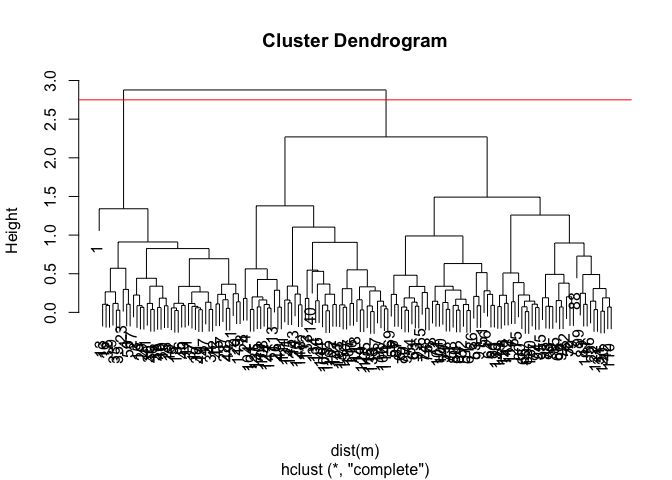<!-- -->

``` r
grps_m2<- cutree(hc_myturn, k=2) ## for two groups
plot(m, col=grps_m2)
```

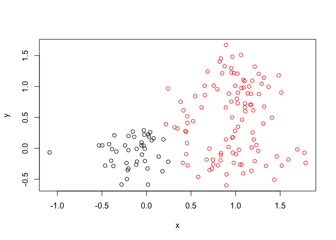<!-- -->

``` r
###now three groups
grps_m3<- cutree(hc_myturn, k=3)
plot(m, col=grps_m3)
```

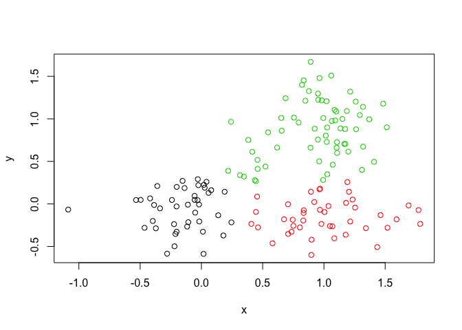<!-- --> \#\#\#
Principal Component Analysis (PCA) \#\# what is PCA??? \#\# prcomp()
\#we will draw and generate PCA plots, determine how much variation each
principal component accounts for \# examine loadings (or loading scores)
to determine what variables have the largest effect on the graph \#\# ok
lets’s go \#\# You can also download this file from the class
website\!

``` r
mydata <- read.csv("https://tinyurl.com/expression-CSV", row.names=1) #samples are columns, rows are genes
### using nrow(mydata) and ncol(mydata) you can see there are 10 cols and 100 rows
#time to implement PCA
#prcomp() expectssamples to be rows and genes to be columns (why????), so we gotta transpose the matrix with t()
mydata_t<-t(mydata)
#nice!
pca<-prcomp(mydata_t, scale = TRUE)
### check it out
attributes(pca)
```

    ## $names
    ## [1] "sdev"     "rotation" "center"   "scale"    "x"       
    ## 
    ## $class
    ## [1] "prcomp"

``` r
###
```

``` r
### let's look closer
pca$x[,1]
```

    ##       wt1       wt2       wt3       wt4       wt5       ko1       ko2 
    ## -9.697374 -9.138950 -9.054263 -8.731483 -9.006312  8.846999  9.213885 
    ##       ko3       ko4       ko5 
    ##  9.458412  8.883412  9.225673

``` r
pca$x[,2]
```

    ##        wt1        wt2        wt3        wt4        wt5        ko1 
    ##  1.5233313  0.3748504 -0.9855163 -0.7468371 -0.2945307  2.2345475 
    ##        ko2        ko3        ko4        ko5 
    ## -3.2607503 -0.2636283  0.6339701  0.7845635

``` r
#plot these??
plot(pca$x[,1], pca$x[,2]) ### see the larger variance with 1 compared to 2
```

<!-- --> \#

``` r
#ok we gotta look at out PCAs
summary(pca) #notice how PC1 has 92% of the proportion of variance
```

    ## Importance of components:
    ##                           PC1    PC2     PC3     PC4     PC5     PC6
    ## Standard deviation     9.6237 1.5198 1.05787 1.05203 0.88062 0.82545
    ## Proportion of Variance 0.9262 0.0231 0.01119 0.01107 0.00775 0.00681
    ## Cumulative Proportion  0.9262 0.9493 0.96045 0.97152 0.97928 0.98609
    ##                            PC7     PC8     PC9      PC10
    ## Standard deviation     0.80111 0.62065 0.60342 3.348e-15
    ## Proportion of Variance 0.00642 0.00385 0.00364 0.000e+00
    ## Cumulative Proportion  0.99251 0.99636 1.00000 1.000e+00

# 

``` r
## lets do PCA
pca <- prcomp(mydata_t, scale=TRUE)
## A basic PC1 vs PC2 2-D plot
plot(pca$x[,1], pca$x[,2])
```

<!-- -->

``` r
## Variance captured per PC
pca.var <- pca$sdev^2 
pca.var.per <- round(pca.var/sum(pca.var)*100, 1) 
pca.var.per
```

    ##  [1] 92.6  2.3  1.1  1.1  0.8  0.7  0.6  0.4  0.4  0.0

``` r
plot(pca)
```

<!-- -->

``` r
#let's colors the KO vs WT
plot(pca$x[,1:2], col=c("red","red","red","red","red", "blue","blue","blue","blue","blue")) #but this assumes i know that all the WT data comes before the KO so i can just list the color for each point
```

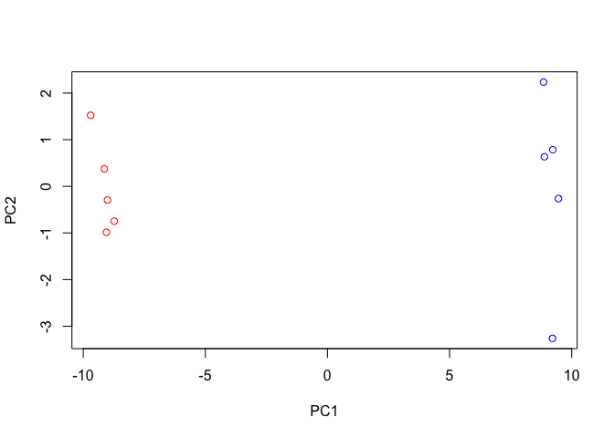<!-- -->

``` r
### that's really inefficient and ridiculous
```

``` r
wt_ko<- substr(colnames(mydata),1,2) #idk what this does???
wt_ko
```

    ##  [1] "wt" "wt" "wt" "wt" "wt" "ko" "ko" "ko" "ko" "ko"

``` r
###you can make the plot beter with this i guess?
colvec<- as.factor(wt_ko) ### idk how this specified color
plot(pca$x[,1], pca$x[,2], col=colvec, pch=16,
 xlab=paste0("PC1 (", pca.var.per[1], "%)"),
 ylab=paste0("PC2 (", pca.var.per[2], "%)")) 
```

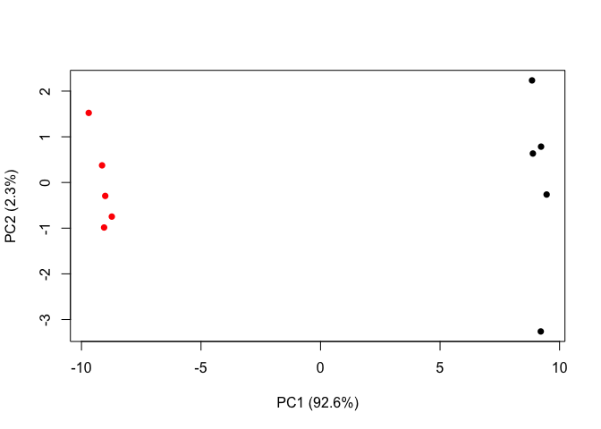<!-- --> \#MY TURN
AGAIN load the FILE

``` r
#x<-read.csv("UK_foods.csv")
#summary(x)
#dim(x)
```

\#preview the first six rows

``` r
#head(x)
```

\#let’s index it

``` r
#rownames(x) <- x[,1]
#x <- x[,-1]
#head(x)
#i dont know what we did this makes no sense
```

\#\#\#now let’s index it from the start bc using that -1 is ANNOYING AND
CAUSES PROBLEMS

``` r
#x <- read.csv("UK_foods.csv", row.names=1)
#head(x)
#i dont get this either
```

\#barblot
it

``` r
#barplot(as.matrix(x), beside=T, col=rainbow(nrow(x))) #idk how this happened
```

\#try a different plot

### and another way

``` r
#pairs(x, col=rainbow(10), pch=16)
```
