Untitled
================

``` r
# Generate some example data for clustering
tmp <- c(rnorm(30,-3), rnorm(30,3))
x <- cbind(x=tmp, y=rev(tmp))
plot(x)
```

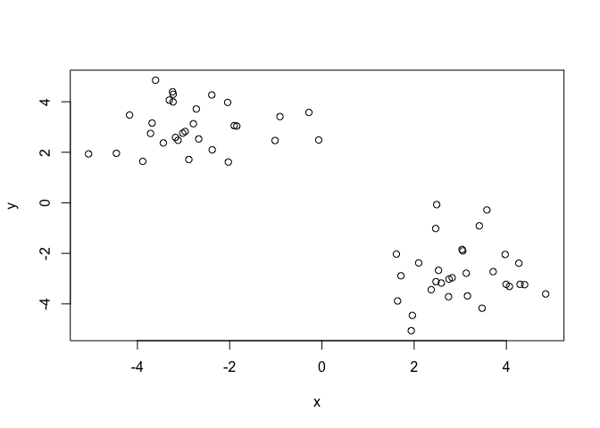<!-- -->

``` r
### use kmeans() setting k to 2 nstart to 20 to answer some questions about the above graph
#Use the kmeans() function setting k to 2 and nstart=20
#Inspect/print the results
#Q. How many points are in each cluster?
#Q. What ‘component’ of your result object details
 #- cluster size?
 #- cluster assignment/membership?
 #- cluster center?
#Plot x colored by the kmeans cluster assignment and
 #add cluster centers as blue points
k<-kmeans(x,centers=2,nstart=20)
```

``` r
k
```

    ## K-means clustering with 2 clusters of sizes 30, 30
    ## 
    ## Cluster means:
    ##           x         y
    ## 1  3.020447 -2.774139
    ## 2 -2.774139  3.020447
    ## 
    ## Clustering vector:
    ##  [1] 2 2 2 2 2 2 2 2 2 2 2 2 2 2 2 2 2 2 2 2 2 2 2 2 2 2 2 2 2 2 1 1 1 1 1
    ## [36] 1 1 1 1 1 1 1 1 1 1 1 1 1 1 1 1 1 1 1 1 1 1 1 1 1
    ## 
    ## Within cluster sum of squares by cluster:
    ## [1] 61.72217 61.72217
    ##  (between_SS / total_SS =  89.1 %)
    ## 
    ## Available components:
    ## 
    ## [1] "cluster"      "centers"      "totss"        "withinss"    
    ## [5] "tot.withinss" "betweenss"    "size"         "iter"        
    ## [9] "ifault"

# you can see the availble components of which there are 9

\#how to call up components is k$component

``` r
#Q. How many points are in each cluster?
k$size
```

    ## [1] 30 30

``` r
#this returns [1] 30 30. this means 30 points in each cluster 
#Q. What ‘component’ of your result object details
 #- cluster size?
 ###i think it's k$size? is this a trick? it's 30???
table(k$cluster) ## 30 1s and 30 2s
```

    ## 
    ##  1  2 
    ## 30 30

``` r
 #- cluster assignment/membership?

 #- cluster center?
```

# now let’s:

``` r
#Plot x colored by the kmeans cluster assignment and
 #add cluster centers as blue points
kmeans(x, centers=2, nstart=20)
```

    ## K-means clustering with 2 clusters of sizes 30, 30
    ## 
    ## Cluster means:
    ##           x         y
    ## 1 -2.774139  3.020447
    ## 2  3.020447 -2.774139
    ## 
    ## Clustering vector:
    ##  [1] 1 1 1 1 1 1 1 1 1 1 1 1 1 1 1 1 1 1 1 1 1 1 1 1 1 1 1 1 1 1 2 2 2 2 2
    ## [36] 2 2 2 2 2 2 2 2 2 2 2 2 2 2 2 2 2 2 2 2 2 2 2 2 2
    ## 
    ## Within cluster sum of squares by cluster:
    ## [1] 61.72217 61.72217
    ##  (between_SS / total_SS =  89.1 %)
    ## 
    ## Available components:
    ## 
    ## [1] "cluster"      "centers"      "totss"        "withinss"    
    ## [5] "tot.withinss" "betweenss"    "size"         "iter"        
    ## [9] "ifault"

``` r
plot(x, col=k$cluster) #col=k$cluster will color the clusters
points(k$centers, col="blue", pch=15) #we did pch=15 to really make the centers stand out
```

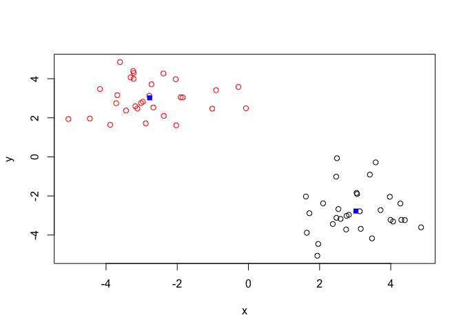<!-- -->

\#Hierarchical clustering \#we dont know the number of clusters ahead of
time \#can be bottom-up or top-down \#more flexible than k-means

``` r
#we need the x again
tmp <- c(rnorm(30,-3), rnorm(30,3))
x <- cbind(x=tmp, y=rev(tmp))
plot(x)
```

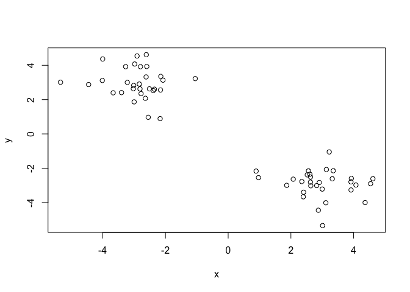<!-- -->

``` r
##so first let's try this
hc<-hclust(dist(x))
hc ###ehhh that's not helpful but lets plot is
```

    ## 
    ## Call:
    ## hclust(d = dist(x))
    ## 
    ## Cluster method   : complete 
    ## Distance         : euclidean 
    ## Number of objects: 60

``` r
plot(hc) ##look at the numbers and how they are organized
#they are 30 and below (left) and above 30 (right) 
## draw a line on the tree using abline
abline(h=6, col="red")
abline(h=4, col="blue")
```

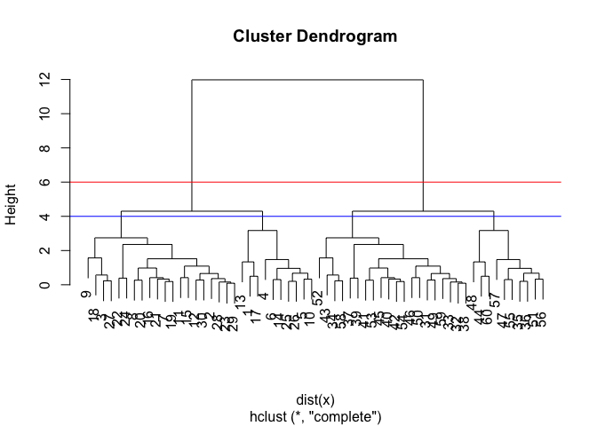<!-- -->

``` r
cutree(hc, k=6)
```

    ##  [1] 1 2 2 3 3 3 2 2 2 3 2 2 1 3 2 2 1 2 2 2 2 2 2 2 3 3 2 2 2 2 4 4 4 4 5
    ## [36] 5 4 4 4 4 4 4 4 6 4 4 5 6 4 4 5 4 4 4 5 5 5 4 4 6

``` r
cutree(hc, k=4)
```

    ##  [1] 1 2 2 1 1 1 2 2 2 1 2 2 1 1 2 2 1 2 2 2 2 2 2 2 1 1 2 2 2 2 3 3 3 3 4
    ## [36] 4 3 3 3 3 3 3 3 4 3 3 4 4 3 3 4 3 3 3 4 4 4 3 3 4

``` r
## you can also cut trees to yield a given k groups/clusters
grps<-cutree(hc, k=2)
table(grps)
```

    ## grps
    ##  1  2 
    ## 30 30

``` r
# First we need to calculate point (dis)similarity
# as the Euclidean distance between observations
dist_matrix <- dist(x)
##let's investigate this new thing
```

``` r
# First we need to calculate point (dis)similarity
# as the Euclidean distance between observations
dist_matrix <- dist(x)
```

``` r
# The hclust() function returns a hierarchical
# clustering model
hc_2 <- hclust(d = dist_matrix)
# the print method is not so useful here
hc_2
```

    ## 
    ## Call:
    ## hclust(d = dist_matrix)
    ## 
    ## Cluster method   : complete 
    ## Distance         : euclidean 
    ## Number of objects: 60

``` r
#Call:
#hclust(d = dist_matrix)
#Cluster method : complete
#Distance : euclidean
#Number of objects: 60 
```

## how to we link clusters in hierclusters?

\#\#aka: how is distance between clusters determined? FOUR MAIN METHODS
\#\#\# complete \#\#\#\# pairwise similarity between all observations in
clusters 1 and 2, uses largest of similarties \#\#\# single \#\#\#\#
uses smallest of similarities \#\#\# average \#\#\#\# uses average of
similarities \#\#\# centroid \#\#\#\# finds the centroid for each
cluster and uses similarity between those \#\#\# so how to do this in R

``` r
# Using different hierarchical clustering methods
#hc.complete <- hclust(d, method="complete")
#hc.average <- hclust(d, method="average")
#hc.single <- hclust(d, method="single")
### d doesn't exist so lol this does shit right now it's just a format
```

### MY TURN\!\!\!

``` r
# Step 1. Generate some example data for clustering
m <- rbind(
 matrix(rnorm(100, mean=0, sd = 0.3), ncol = 2), # c1
 matrix(rnorm(100, mean = 1, sd = 0.3), ncol = 2), # c2
 matrix(c(rnorm(50, mean = 1, sd = 0.3), # c3
 rnorm(50, mean = 0, sd = 0.3)), ncol = 2))
colnames(m) <- c("x", "y")
# Step 2. Plot the data without clustering
plot(m)
```

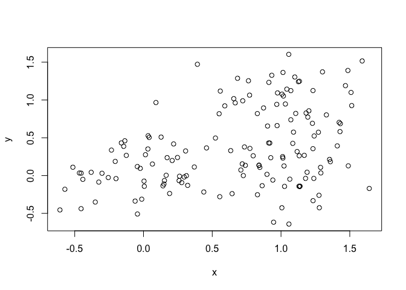<!-- -->

``` r
# Step 3. Generate colors for known clusters
# (just so we can compare to hclust results)
col <- as.factor( rep(c("c1","c2","c3"), each=50) )
plot(m, col=col)
```

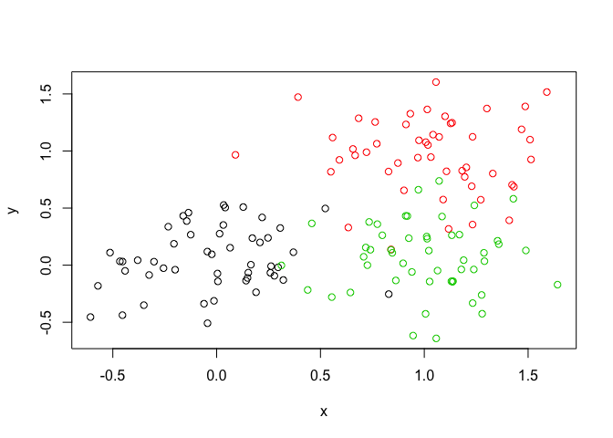<!-- -->

``` r
#Q. Use the dist(), hclust(), plot() and cutree() functions to return 2 and 3 clusters
#Q. How does this compare to your known 'col' groups?
dist(m)
```

    ##               1           2           3           4           5
    ## 2   0.315894894                                                
    ## 3   0.239268537 0.141806946                                    
    ## 4   0.398882867 0.559519879 0.417778467                        
    ## 5   0.114701264 0.298555577 0.179181036 0.307118131            
    ## 6   0.627758809 0.416419844 0.553577227 0.963496901 0.670179412
    ## 7   0.347495807 0.469408478 0.498315927 0.742061941 0.457358190
    ## 8   0.246719755 0.374079964 0.233076448 0.187309299 0.136283961
    ## 9   0.386193941 0.143006777 0.148875551 0.514489831 0.325095159
    ## 10  0.395204707 0.648513240 0.515859394 0.197696440 0.352973955
    ## 11  0.407125687 0.489761107 0.351078020 0.127322587 0.296774062
    ## 12  0.198334139 0.151338925 0.178540759 0.536420359 0.233858087
    ## 13  0.415324367 0.671526347 0.539123112 0.214759109 0.375580786
    ## 14  0.256435100 0.412354981 0.421969265 0.650665601 0.367410163
    ## 15  0.174609246 0.474372379 0.413371414 0.483272727 0.272624296
    ## 16  0.271661423 0.473462035 0.467313033 0.649183884 0.386311385
    ## 17  0.332490744 0.175105143 0.097988243 0.429207839 0.254852576
    ## 18  0.355879024 0.136125968 0.117411836 0.486439724 0.292654627
    ## 19  0.168194900 0.483086211 0.391383876 0.375698197 0.221570470
    ## 20  0.222134406 0.354718656 0.367440367 0.620840567 0.327383451
    ## 21  0.315673430 0.389475278 0.248998256 0.181441321 0.201749699
    ## 22  0.270074849 0.071255359 0.070565552 0.488270701 0.234969548
    ## 23  0.426679270 0.112243542 0.242541103 0.656174940 0.409427309
    ## 24  0.690904692 0.667493008 0.760180005 1.088772521 0.785835548
    ## 25  0.417560044 0.617918244 0.618681432 0.775395021 0.531931359
    ## 26  0.301292093 0.025060899 0.116963725 0.534737987 0.277426929
    ## 27  0.245184769 0.499941079 0.372407760 0.198344129 0.201953509
    ## 28  0.432606025 0.234511031 0.362851121 0.766488453 0.471398369
    ## 29  0.456918176 0.285768441 0.409413461 0.805944278 0.506027516
    ## 30  0.442504802 0.179479289 0.205600528 0.557499075 0.381310629
    ## 31  0.352705810 0.657160870 0.546077988 0.357072685 0.366909578
    ## 32  0.265927654 0.135774746 0.215758237 0.599314549 0.300375622
    ## 33  0.430791621 0.588958184 0.608364174 0.809293170 0.544975982
    ## 34  0.429672575 0.630815841 0.631572543 0.785497908 0.543951138
    ## 35  0.287823598 0.603220844 0.518826144 0.459317141 0.350265908
    ## 36  0.031977259 0.284112307 0.209306933 0.403707774 0.105156690
    ## 37  0.681941709 0.738547087 0.608996776 0.314062409 0.572961177
    ## 38  0.265801791 0.341722097 0.200041282 0.219296235 0.151109652
    ## 39  0.803611397 0.814177525 0.898362093 1.202119677 0.906019799
    ## 40  0.560289600 0.536971703 0.625608332 0.956710117 0.652418154
    ## 41  0.414446839 0.337732066 0.232020109 0.340076556 0.307238590
    ## 42  0.367744629 0.193691903 0.133086220 0.443913728 0.287868857
    ## 43  0.949787163 0.697204789 0.712079826 0.907203700 0.865188485
    ## 44  0.167377624 0.430803397 0.310631609 0.249449994 0.133020196
    ## 45  0.426433628 0.644961882 0.506284301 0.128456121 0.361858312
    ## 46  0.285254290 0.595455591 0.491774329 0.364533287 0.313658448
    ## 47  0.333813116 0.643550239 0.538044079 0.380351950 0.359320591
    ## 48  0.606480126 0.714793275 0.759579718 0.992300255 0.718821265
    ## 49  0.468719733 0.699812968 0.686665667 0.794608892 0.579879591
    ## 50  0.343941702 0.551848012 0.546657269 0.706960356 0.458405111
    ## 51  1.178773069 1.075714471 1.002484815 0.903735644 1.065102288
    ## 52  1.631676090 1.702365897 1.576365408 1.234671749 1.530128177
    ## 53  1.634584611 1.735388283 1.603554686 1.235785654 1.539213071
    ## 54  1.376276174 1.522358013 1.383639220 0.984971309 1.291951602
    ## 55  0.884923077 0.750037720 0.688129534 0.681211679 0.775168302
    ## 56  1.298999093 1.196472929 1.123964045 1.015338341 1.185105727
    ## 57  1.853679878 1.875513227 1.762101515 1.468386442 1.745140115
    ## 58  1.392864764 1.334338175 1.244789703 1.064232844 1.278242549
    ## 59  1.755127807 1.735029994 1.633859318 1.390826074 1.642428610
    ## 60  1.410140620 1.484997005 1.357404874 1.013263723 1.308707969
    ## 61  1.305668237 1.358699414 1.235360533 0.914673565 1.200142504
    ## 62  1.088300796 1.097527233 0.983798296 0.723119597 0.976649558
    ## 63  1.467853591 1.570182559 1.437666764 1.069017074 1.372315112
    ## 64  1.248300399 1.354760601 1.220887740 0.849447833 1.152834898
    ## 65  1.493463038 1.564361514 1.437882484 1.096894282 1.391568292
    ## 66  1.449103103 1.452808183 1.343003533 1.076799592 1.337890357
    ## 67  1.622466166 1.693450444 1.567360539 1.225445067 1.520948600
    ## 68  1.579510827 1.531505470 1.439124704 1.236897217 1.465229825
    ## 69  0.917729556 1.037585677 0.900455281 0.518955939 0.823423835
    ## 70  1.837545788 1.843056112 1.734243177 1.459092697 1.727149785
    ## 71  1.139878421 1.263328550 1.126657395 0.742109701 1.048047984
    ## 72  1.103067454 1.216927513 1.081409695 0.704328566 1.008597330
    ## 73  1.119352412 1.176751944 1.051403830 0.729488706 1.013729503
    ## 74  1.357890438 1.401504253 1.280623746 0.969400580 1.251139998
    ## 75  1.501514532 1.565286872 1.440364189 1.106243419 1.398379651
    ## 76  1.414142304 1.476315667 1.351415004 1.019727871 1.310466075
    ## 77  1.625479475 1.666814712 1.547575034 1.235227125 1.519113015
    ## 78  1.349248162 1.359855769 1.247546781 0.975342105 1.238479409
    ## 79  1.393273814 1.522657195 1.385917180 0.997410503 1.304219724
    ## 80  1.581734872 1.529966906 1.438952391 1.241838914 1.467342326
    ## 81  1.421644774 1.627265330 1.485467210 1.067849339 1.359309538
    ## 82  1.839096415 1.902349385 1.778527887 1.442683147 1.736682285
    ## 83  0.857717867 1.103152680 0.964961271 0.562698299 0.813854343
    ## 84  2.150714625 2.197323583 2.078126354 1.756674339 2.046057881
    ## 85  1.223548170 1.185612701 1.087562164 0.885655966 1.109302461
    ## 86  1.535251736 1.514154668 1.412398876 1.175478231 1.422228312
    ## 87  1.166775948 1.321185102 1.181303526 0.777561509 1.084074242
    ## 88  1.201593690 1.263667843 1.137800214 0.809076067 1.097101615
    ## 89  1.401755497 1.391483459 1.285623680 1.038418501 1.289281544
    ## 90  1.848254644 1.965260475 1.831151339 1.451188593 1.757300055
    ## 91  1.989932826 2.033934493 1.915048998 1.597029285 1.884640968
    ## 92  0.710913159 0.677843746 0.571258602 0.424409642 0.596213210
    ## 93  1.395829362 1.365719605 1.266190139 1.045578119 1.282115717
    ## 94  1.647587694 1.729607295 1.601316396 1.249250633 1.548249856
    ## 95  1.416948988 1.418185313 1.308940036 1.046619662 1.305446266
    ## 96  1.159619764 1.265916661 1.131735899 0.760737089 1.063669950
    ## 97  1.479521962 1.373344063 1.303551304 1.190427192 1.365580255
    ## 98  1.553477809 1.662621590 1.529197376 1.155073280 1.459811547
    ## 99  1.024368233 1.149565986 1.012259425 0.626401549 0.932268528
    ## 100 1.422969428 1.490275310 1.364300997 1.027389391 1.320208463
    ## 101 1.405034031 1.258383781 1.207259120 1.163538968 1.294224558
    ## 102 0.776662976 0.513146464 0.537482220 0.782933524 0.699425802
    ## 103 1.121087762 0.926366957 0.900340835 0.964724561 1.018803021
    ## 104 1.711236204 1.500461968 1.487057166 1.539752077 1.609632422
    ## 105 1.276212501 1.275814402 1.166230266 0.910308742 1.164261978
    ## 106 1.005045194 0.955570961 0.859427894 0.691472536 0.890369015
    ## 107 0.977330856 0.867669868 0.795196509 0.729511705 0.864645552
    ## 108 1.374630035 1.141457966 1.142435349 1.256573732 1.280010138
    ## 109 1.064546407 0.946347907 0.878793054 0.816403604 0.952176429
    ## 110 0.719798932 0.437129156 0.481826104 0.774274669 0.653085222
    ## 111 1.012276387 0.961297032 0.865773239 0.699452289 0.897591830
    ## 112 1.236637340 1.063232058 1.025382127 1.040149860 1.129893775
    ## 113 1.431103355 1.173297906 1.193622389 1.354431566 1.344380587
    ## 114 0.854553501 0.767160938 0.683268686 0.599538435 0.740952120
    ## 115 0.588699442 0.307751891 0.351672325 0.672080177 0.525565357
    ## 116 0.754126719 0.603702090 0.547394082 0.598296146 0.647912011
    ## 117 1.171167670 1.098356196 1.012596817 0.866449746 1.056529645
    ## 118 0.884962009 0.748688384 0.687472286 0.682978919 0.775370078
    ## 119 1.234262002 0.937218191 0.997764105 1.264857445 1.169830536
    ## 120 1.534055660 1.373295603 1.330127567 1.302757591 1.424533408
    ## 121 0.821139177 0.784721223 0.681459084 0.516783121 0.706478800
    ## 122 1.151722914 1.150424871 1.040210274 0.790652747 1.039385812
    ## 123 1.337103754 1.160651860 1.125128920 1.137124612 1.230397380
    ## 124 1.348156721 1.282243539 1.195184822 1.027559578 1.233459784
    ## 125 0.853243449 0.803110592 0.705054016 0.558006917 0.738550536
    ## 126 0.376650124 0.216607411 0.147036135 0.430309401 0.291353558
    ## 127 1.001247824 0.802433785 0.778048341 0.865112854 0.900815103
    ## 128 0.942280504 0.721240012 0.711418223 0.848135651 0.847862605
    ## 129 1.223001015 1.103854849 1.038206742 0.961993350 1.110230054
    ## 130 1.203805923 0.988882140 0.976424040 1.069466890 1.105398404
    ## 131 1.355128674 1.108840870 1.119680029 1.261403912 1.264693836
    ## 132 0.890721796 0.745247703 0.688801504 0.699359295 0.782231244
    ## 133 1.233168415 1.041438904 1.014297973 1.062005213 1.129595584
    ## 134 1.544528748 1.473635930 1.389618286 1.220800965 1.429830916
    ## 135 1.332182866 1.171432614 1.127227454 1.112317425 1.223246748
    ## 136 0.763859549 0.645653893 0.573429148 0.564484703 0.653340322
    ## 137 1.339141750 1.046042845 1.101386133 1.351187458 1.271069861
    ## 138 1.064578531 0.951962304 0.881857828 0.810100403 0.951788254
    ## 139 1.292836062 1.101194911 1.074334531 1.116789098 1.188935651
    ## 140 1.066675233 0.918683293 0.865709973 0.853897127 0.957286533
    ## 141 1.184019259 0.911990436 0.944833466 1.154330870 1.104994386
    ## 142 0.785563001 0.657368208 0.590372643 0.593482724 0.675937060
    ## 143 1.102242543 0.884133335 0.873308684 0.982889918 1.005394627
    ## 144 1.400908267 1.260650569 1.206301312 1.152206930 1.289468607
    ## 145 0.779950274 0.599901356 0.561046256 0.657261390 0.678505490
    ## 146 0.560318345 0.593217230 0.465751649 0.244957103 0.447437227
    ## 147 0.948333926 0.771461401 0.733097652 0.788939583 0.844130396
    ## 148 1.211150619 0.996636427 0.983938695 1.075524605 1.112595041
    ## 149 1.186100848 1.067953629 1.001540792 0.926809023 1.073351264
    ## 150 1.210119315 0.994296491 0.982477005 1.076611511 1.111887828
    ##               6           7           8           9          10
    ## 2                                                              
    ## 3                                                              
    ## 4                                                              
    ## 5                                                              
    ## 6                                                              
    ## 7   0.507412592                                                
    ## 8   0.776245280 0.592915807                                    
    ## 9   0.525902133 0.603188735 0.346449859                        
    ## 10  1.017047440 0.695443985 0.298009538 0.642832095            
    ## 11  0.904576840 0.753667570 0.160754084 0.419202840 0.319906944
    ## 12  0.438131824 0.329318697 0.352696643 0.274802282 0.579167670
    ## 13  1.038490200 0.710511447 0.321179990 0.666148045 0.023344256
    ## 14  0.526716558 0.091460306 0.502453331 0.538057001 0.608770362
    ## 15  0.714537486 0.298642464 0.380698671 0.558874229 0.402099353
    ## 16  0.597547723 0.119100126 0.516605693 0.592616219 0.585296231
    ## 17  0.586119947 0.592314016 0.261769399 0.085550495 0.559052052
    ## 18  0.535827700 0.584258402 0.315706403 0.032566562 0.611368710
    ## 19  0.779883467 0.406092403 0.298330862 0.540214699 0.290103306
    ## 20  0.493927891 0.133552763 0.463596913 0.480795342 0.595774607
    ## 21  0.802358301 0.658305018 0.075293190 0.333283349 0.336223958
    ## 22  0.484748942 0.477954842 0.303040166 0.128604252 0.580974863
    ## 23  0.358193261 0.536632051 0.474570955 0.169231333 0.756800495
    ## 24  0.415735731 0.374350175 0.920178524 0.808923213 1.064708114
    ## 25  0.677760416 0.174039727 0.657901892 0.741667608 0.684331649
    ## 26  0.441110247 0.474507576 0.349573938 0.130721996 0.625931579
    ## 27  0.863917244 0.565349846 0.180998601 0.508204747 0.153182006
    ## 28  0.198786025 0.385516522 0.579528983 0.364380086 0.818923928
    ## 29  0.171952037 0.364667404 0.619864141 0.417975859 0.848516264
    ## 30  0.526040488 0.647622797 0.395942988 0.056725081 0.693562768
    ## 31  0.972905700 0.578142245 0.379851990 0.690388226 0.182499345
    ## 32  0.370120849 0.335782283 0.413625068 0.276407385 0.647697455
    ## 33  0.606624497 0.121421794 0.676809836 0.720314086 0.735168300
    ## 34  0.687218849 0.185014575 0.669444803 0.754645560 0.692216728
    ## 35  0.866404422 0.433048766 0.417090917 0.667693937 0.321637077
    ## 36  0.604411121 0.352246981 0.241190344 0.355331686 0.414479944
    ## 37  1.154095201 1.029194971 0.436727078 0.638274454 0.481980795
    ## 38  0.751576429 0.605304492 0.052653712 0.300178709 0.348421558
    ## 39  0.566199141 0.464130996 1.042036310 0.956619137 1.158203623
    ## 40  0.345110306 0.265327564 0.786147527 0.679354573 0.940710544
    ## 41  0.746912494 0.722822654 0.233145059 0.225583715 0.510926088
    ## 42  0.596181449 0.624810242 0.284401352 0.076078054 0.582410536
    ## 43  0.909401934 1.166048938 0.819772726 0.573776438 1.093235585
    ## 44  0.786495671 0.496233258 0.162271504 0.453135569 0.230715635
    ## 45  1.032019829 0.748082638 0.275484532 0.620180366 0.086849148
    ## 46  0.900756305 0.506251258 0.349645578 0.638737482 0.219933520
    ## 47  0.947935640 0.543632911 0.385923026 0.684311203 0.215057496
    ## 48  0.621059419 0.264232531 0.853164645 0.854313215 0.920019170
    ## 49  0.776827168 0.272181164 0.696999436 0.817114987 0.680753441
    ## 50  0.646354126 0.140820248 0.585206289 0.672251096 0.625090513
    ## 51  1.425033076 1.497726010 0.948632429 0.934084550 1.092024799
    ## 52  2.114496614 1.976704340 1.395108244 1.590217527 1.321036822
    ## 53  2.151099491 1.974284650 1.407165262 1.632437561 1.298167741
    ## 54  1.937215236 1.703814336 1.167860435 1.437934794 1.012017656
    ## 55  1.095139056 1.186417946 0.675271796 0.607439235 0.878843117
    ## 56  1.541560447 1.619080671 1.067145639 1.054589308 1.200443288
    ## 57  2.274146633 2.201135415 1.608926787 1.749855533 1.582985157
    ## 58  1.703575811 1.727883947 1.150252896 1.196484618 1.232520947
    ## 59  2.117699305 2.099154023 1.508468404 1.601588075 1.531647896
    ## 60  1.898529094 1.755256137 1.173811429 1.375750971 1.103343249
    ## 61  1.769207588 1.652828772 1.064053733 1.244213642 1.025509425
    ## 62  1.500082458 1.433995774 0.841628720 0.974404958 0.873931445
    ## 63  1.986181011 1.808016642 1.240307147 1.469041095 1.134530478
    ## 64  1.771107375 1.588875689 1.021116818 1.257303218 0.919374805
    ## 65  1.977018116 1.838813259 1.256462753 1.453255599 1.187146452
    ## 66  1.848744369 1.795245000 1.202575384 1.325252264 1.213386193
    ## 67  2.105661579 1.967479770 1.385942821 1.581446408 1.311832104
    ## 68  1.902706033 1.917901460 1.334856384 1.394387904 1.395502769
    ## 69  1.453515115 1.258377272 0.693183313 0.950543157 0.597383100
    ## 70  2.235857554 2.184337119 1.591424232 1.714037585 1.583896303
    ## 71  1.679466815 1.477259930 0.918917106 1.173350808 0.800903691
    ## 72  1.633309156 1.443145964 0.877752771 1.124097582 0.774768190
    ## 73  1.589206387 1.466587236 0.877653546 1.065703366 0.847420690
    ## 74  1.809729929 1.705312674 1.114887579 1.284013315 1.084551175
    ## 75  1.976727311 1.847593227 1.262848904 1.452084341 1.201604588
    ## 76  1.887876378 1.760541961 1.174794378 1.363366687 1.119344138
    ## 77  2.072725335 1.972805426 1.382882895 1.546830571 1.342726514
    ## 78  1.759275282 1.695761166 1.102904192 1.234473251 1.111801353
    ## 79  1.938795976 1.726610941 1.176539191 1.431686826 1.040513801
    ## 80  1.899089052 1.919258337 1.337508346 1.392341051 1.402031255
    ## 81  2.028060205 1.715322339 1.254489640 1.569004874 1.028779824
    ## 82  2.312371894 2.184587536 1.601310172 1.786958433 1.529740858
    ## 83  1.480851350 1.131454328 0.733646784 1.075395074 0.463883653
    ## 84  2.602149513 2.497372144 1.910057199 2.076380035 1.849942915
    ## 85  1.568799012 1.562553035 0.978923102 1.051706020 1.051800999
    ## 86  1.899163044 1.878613646 1.288729635 1.381384938 1.322572656
    ## 87  1.734457714 1.493497020 0.961932290 1.242727415 0.802010601
    ## 88  1.676318797 1.548442697 0.961261347 1.152872615 0.918522467
    ## 89  1.782870271 1.746266072 1.155058171 1.261405165 1.184367980
    ## 90  2.381596342 2.182621964 1.627781875 1.866408315 1.495815352
    ## 91  2.438684956 2.336885654 1.748534347 1.912908948 1.694635967
    ## 92  1.078393837 1.045638680 0.471449052 0.552720380 0.618118057
    ## 93  1.748922789 1.737209736 1.149965568 1.232085613 1.201588370
    ## 94  2.143390811 1.990934306 1.414147014 1.620683134 1.326506474
    ## 95  1.813637401 1.762797990 1.170327014 1.290318204 1.185765909
    ## 96  1.682306430 1.500859961 0.931787893 1.169594907 0.835202323
    ## 97  1.710000763 1.799243616 1.247019187 1.230973965 1.372478598
    ## 98  2.078850679 1.891555223 1.328841862 1.563046063 1.212321853
    ## 99  1.565430852 1.362521013 0.803257664 1.062199305 0.690291241
    ## 100 1.902648907 1.768884923 1.184820117 1.378710218 1.122819802
    ## 101 1.564333180 1.705388010 1.187978287 1.115569162 1.355956055
    ## 102 0.739164829 0.981410643 0.670659011 0.394407730 0.957625136
    ## 103 1.199863382 1.389469498 0.936179891 0.787078622 1.162209256
    ## 104 1.719216737 1.968647404 1.525256265 1.365903466 1.737125716
    ## 105 1.672591716 1.621532864 1.029502531 1.148626209 1.056152435
    ## 106 1.339796400 1.339693919 0.763692593 0.821602989 0.872149895
    ## 107 1.222559716 1.291514168 0.753539654 0.726277312 0.924070944
    ## 108 1.343236091 1.610863961 1.211359515 1.012267333 1.453084788
    ## 109 1.290973296 1.376099078 0.841869300 0.804067538 1.010173908
    ## 110 0.640790672 0.900607255 0.642779066 0.333620407 0.937357473
    ## 111 1.344650721 1.346606807 0.771125187 0.827000815 0.880228721
    ## 112 1.351672912 1.520268837 1.035733582 0.921742662 1.237243747
    ## 113 1.325270009 1.639263939 1.289778031 1.054452691 1.547996066
    ## 114 1.141005418 1.175561755 0.626317374 0.629131395 0.794584454
    ## 115 0.563800541 0.774761146 0.526432981 0.202903518 0.823874999
    ## 116 0.950832230 1.045314774 0.560400993 0.460913129 0.794064274
    ## 117 1.465944192 1.500689051 0.932854331 0.959713398 1.047132081
    ## 118 1.092865940 1.185778886 0.675986358 0.606031694 0.880631797
    ## 119 0.995949451 1.377479747 1.152462149 0.849006393 1.441036045
    ## 120 1.660379660 1.827033097 1.321717486 1.231285913 1.495963347
    ## 121 1.180112435 1.156867996 0.579883400 0.655984233 0.704411683
    ## 122 1.548845440 1.496505697 0.905014159 1.024197938 0.943257776
    ## 123 1.440178402 1.619324444 1.135803023 1.019672922 1.333812588
    ## 124 1.648500987 1.680914014 1.107037240 1.143640550 1.200011651
    ## 125 1.192597369 1.185936932 0.614293067 0.671084361 0.746933891
    ## 126 0.619181121 0.642550266 0.276852049 0.097011767 0.574446151
    ## 127 1.082102025 1.265833755 0.823602154 0.663243230 1.061418145
    ## 128 0.981258760 1.188966863 0.784154871 0.586296474 1.040609672
    ## 129 1.440168962 1.535588120 0.997681662 0.961231975 1.152542374
    ## 130 1.230625514 1.456681528 1.030471139 0.853862391 1.266374204
    ## 131 1.289099835 1.577395140 1.204025958 0.984483765 1.456215803
    ## 132 1.082626257 1.186983246 0.686122943 0.602309012 0.897052626
    ## 133 1.310120877 1.504333022 1.043151829 0.902096565 1.259693438
    ## 134 1.832401358 1.876817469 1.303305207 1.333867876 1.389693297
    ## 135 1.467339840 1.624163728 1.122776178 1.029170284 1.307566241
    ## 136 1.010419731 1.070808926 0.552441508 0.505019883 0.762103410
    ## 137 1.109392347 1.489859820 1.247231951 0.953090872 1.531754604
    ## 138 1.300289970 1.378539133 0.839784285 0.810016166 1.003048268
    ## 139 1.366136377 1.564346472 1.101354891 0.962018769 1.314396610
    ## 140 1.241100400 1.363782598 0.856943388 0.775696089 1.050701032
    ## 141 1.053479640 1.374057604 1.065654572 0.800829217 1.340732217
    ## 142 1.014823827 1.088453395 0.577713871 0.515653919 0.791033890
    ## 143 1.130401981 1.352082131 0.934646473 0.749424932 1.178614996
    ## 144 1.572510262 1.704607198 1.181207080 1.117693776 1.343568031
    ## 145 0.922740296 1.054632633 0.602621568 0.457456106 0.850708362
    ## 146 1.008387376 0.904476216 0.313991493 0.492752722 0.439580339
    ## 147 1.078338836 1.227365188 0.758779940 0.629459415 0.986113694
    ## 148 1.238355448 1.464395351 1.037298699 0.861549484 1.272504635
    ## 149 1.406631963 1.498827379 0.961017158 0.925426799 1.117957045
    ## 150 1.234310179 1.462246155 1.037272651 0.859519525 1.273497349
    ##              11          12          13          14          15
    ## 2                                                              
    ## 3                                                              
    ## 4                                                              
    ## 5                                                              
    ## 6                                                              
    ## 7                                                              
    ## 8                                                              
    ## 9                                                              
    ## 10                                                             
    ## 11                                                             
    ## 12  0.500199402                                                
    ## 13  0.338806097 0.600811140                                    
    ## 14  0.663149860 0.264011060 0.624643499                        
    ## 15  0.529979945 0.334280054 0.415406650 0.219707677            
    ## 16  0.675559424 0.322642793 0.599121143 0.073022312 0.183978852
    ## 17  0.337095684 0.266068832 0.582326379 0.518321193 0.507097260
    ## 18  0.394823976 0.254953781 0.634697801 0.516279270 0.529221572
    ## 19  0.434982977 0.363737770 0.304510715 0.321416938 0.113340108
    ## 20  0.624153119 0.206466628 0.613158562 0.057671115 0.227422998
    ## 21  0.104606370 0.395757899 0.358373553 0.568870121 0.455655912
    ## 22  0.420027582 0.148643519 0.604116019 0.410151691 0.438186488
    ## 23  0.574587029 0.247975140 0.779955209 0.493075589 0.580190461
    ## 24  1.076982148 0.585132367 1.080928592 0.456440475 0.672676602
    ## 25  0.814124106 0.468910801 0.694521525 0.205585841 0.292487477
    ## 26  0.464744366 0.149841668 0.649007463 0.413520184 0.463675475
    ## 27  0.275326576 0.425987876 0.175022100 0.475538021 0.289036147
    ## 28  0.713071039 0.239758767 0.840534706 0.375231142 0.535558696
    ## 29  0.757756466 0.272203926 0.869618899 0.367174254 0.544485272
    ## 30  0.455492939 0.322125567 0.716819335 0.586136577 0.614718038
    ## 31  0.461788391 0.551030781 0.182161644 0.501058431 0.281374638
    ## 32  0.555425954 0.068806014 0.669419795 0.286247739 0.391387304
    ## 33  0.836204582 0.445545171 0.747205713 0.186585872 0.334393235
    ## 34  0.825341183 0.481863563 0.702089568 0.218469108 0.302338445
    ## 35  0.539302638 0.473558937 0.327577654 0.364063578 0.152000719
    ## 36  0.401848427 0.170744952 0.435282645 0.262576160 0.204076980
    ## 37  0.276338469 0.770780945 0.490353534 0.938348933 0.791564733
    ## 38  0.159505387 0.340703780 0.371435460 0.516468909 0.414321621
    ## 39  1.201367335 0.720701168 1.172462532 0.554004877 0.757453227
    ## 40  0.942368784 0.450067592 0.957817895 0.337457507 0.556978301
    ## 41  0.221374629 0.410463735 0.532750772 0.640945863 0.579862870
    ## 42  0.344492371 0.297102865 0.605577663 0.552017283 0.542336852
    ## 43  0.779901215 0.844413930 1.114021370 1.108284541 1.124396289
    ## 44  0.296026795 0.348980084 0.251995419 0.405387977 0.236937345
    ## 45  0.255742980 0.595163868 0.095951408 0.658852771 0.463318359
    ## 46  0.454406827 0.482915754 0.226639920 0.427854444 0.208391491
    ## 47  0.479241113 0.531429788 0.216745203 0.468199273 0.248647555
    ## 48  1.013584204 0.585692760 0.931730021 0.351667968 0.519583929
    ## 49  0.847388946 0.548921008 0.687820114 0.291567471 0.317441378
    ## 50  0.742174503 0.401483607 0.636683907 0.142605728 0.226508222
    ## 51  0.811011615 1.179771855 1.103393851 1.415497338 1.329048698
    ## 52  1.239022802 1.738003750 1.315002624 1.885281603 1.708102354
    ## 53  1.257139440 1.756885053 1.289335169 1.883430655 1.694932668
    ## 54  1.032765764 1.520310370 0.999897380 1.614775042 1.414011302
    ## 55  0.565703516 0.862222348 0.895045761 1.108099030 1.046597456
    ## 56  0.926778101 1.301234634 1.210810878 1.536665302 1.447793243
    ## 57  1.448405636 1.933799537 1.580350820 2.110098703 1.951108191
    ## 58  0.997054419 1.423268137 1.238983089 1.641346889 1.527008494
    ## 59  1.348770904 1.810527653 1.532959088 2.009784156 1.871318022
    ## 60  1.018184053 1.517629464 1.098120363 1.663825076 1.487780304
    ## 61  0.905189270 1.400579382 1.023134169 1.561450820 1.395984537
    ## 62  0.681259164 1.156566127 0.877810213 1.343926094 1.202505021
    ## 63  1.090635610 1.590214514 1.126314302 1.717085233 1.529868404
    ## 64  0.872560717 1.371570048 0.912159431 1.497867682 1.312284644
    ## 65  1.100269752 1.599259896 1.181794412 1.747371936 1.571754323
    ## 66  1.041979297 1.516979467 1.214376104 1.705009078 1.559037866
    ## 67  1.229895713 1.728913249 1.305813039 1.876057763 1.698863662
    ## 68  1.178720357 1.617370995 1.399963313 1.830395459 1.707971658
    ## 69  0.549601563 1.045123942 0.592617544 1.167308454 0.984114574
    ## 70  1.430678623 1.908251594 1.582715257 2.093793294 1.942338407
    ## 71  0.775934135 1.271174733 0.792799154 1.386642034 1.196844159
    ## 72  0.731557833 1.229125166 0.768104949 1.352176211 1.166588351
    ## 73  0.718933578 1.215204158 0.846478330 1.375232062 1.211706011
    ## 74  0.955215289 1.447912898 1.082641924 1.614037627 1.451681840
    ## 75  1.105591715 1.603482246 1.196872691 1.756132982 1.583265029
    ## 76  1.017205766 1.514764051 1.115300503 1.669085653 1.498080849
    ## 77  1.223310511 1.715668269 1.339377237 1.881474307 1.716382906
    ## 78  0.942202185 1.420488593 1.112926055 1.605348533 1.457793295
    ## 79  1.035086053 1.529112889 1.030005368 1.636645085 1.440986645
    ## 80  1.181953865 1.617311275 1.406778303 1.832022184 1.711521433
    ## 81  1.149810443 1.593124648 1.010655683 1.632512899 1.416746216
    ## 82  1.444299114 1.942189631 1.523551577 2.093143172 1.916875827
    ## 83  0.675985748 1.042826994 0.442805237 1.051271424 0.833073316
    ## 84  1.751308782 2.245614808 1.844270803 2.405923730 2.234003260
    ## 85  0.823238553 1.265248612 1.058055752 1.474761748 1.352905619
    ## 86  1.129483664 1.589059218 1.325105084 1.789463894 1.654092217
    ## 87  0.831606149 1.313739625 0.790200294 1.404493831 1.203897245
    ## 88  0.803312982 1.300726435 0.916223103 1.457016636 1.289733644
    ## 89  0.995226218 1.461189583 1.186880616 1.656685397 1.518042242
    ## 90  1.482006568 1.979600079 1.484806228 2.092584272 1.896772715
    ## 91  1.589452265 2.082943849 1.689632531 2.245464558 2.075779257
    ## 92  0.328002752 0.748053866 0.631854963 0.958741887 0.851664629
    ## 93  0.992107445 1.443468633 1.205782865 1.648711716 1.519831965
    ## 94  1.260050778 1.760056333 1.319361594 1.899648302 1.717925884
    ## 95  1.009840584 1.483200463 1.187191559 1.672688472 1.528362494
    ## 96  0.783206457 1.282175889 0.828784490 1.409763441 1.225842437
    ## 97  1.105073286 1.480466647 1.381923487 1.717064986 1.627713611
    ## 98  1.180970265 1.679758970 1.203040253 1.800915368 1.610307232
    ## 99  0.661295505 1.155615835 0.683256838 1.271773253 1.083774249
    ## 100 1.027980484 1.526440858 1.118233369 1.677425945 1.504209823
    ## 101 1.062031911 1.378963971 1.368615458 1.628294096 1.564251454
    ## 102 0.658048591 0.661534772 0.979554057 0.925003114 0.950842659
    ## 103 0.844503388 1.060182115 1.179421852 1.319897083 1.290899747
    ## 104 1.424702581 1.640680970 1.752717231 1.903103048 1.881611339
    ## 105 0.869279122 1.340556486 1.058845686 1.531630114 1.390511082
    ## 106 0.613490259 1.037562318 0.881734393 1.253072510 1.142335580
    ## 107 0.625695490 0.972089857 0.937862957 1.210251640 1.132049444
    ## 108 1.133510638 1.286092652 1.471182333 1.549997135 1.548094555
    ## 109 0.713827434 1.054800390 1.023555494 1.295644419 1.220104039
    ## 110 0.653974121 0.587987040 0.959980024 0.849016685 0.891999633
    ## 111 0.621165522 1.043968615 0.889824175 1.260079345 1.149895023
    ## 112 0.927102438 1.191394377 1.252560946 1.447186916 1.402408603
    ## 113 1.228577947 1.322512071 1.567328557 1.585596009 1.605702352
    ## 114 0.495713517 0.861553943 0.808705377 1.092373488 1.006032238
    ## 115 0.558305242 0.457779464 0.846868066 0.720106541 0.760460297
    ## 116 0.474274622 0.719081199 0.812499969 0.969005207 0.920533736
    ## 117 0.785738907 1.191115677 1.056493065 1.415605849 1.312825928
    ## 118 0.567155622 0.861359870 0.896902087 1.107624399 1.046910039
    ## 119 1.138944905 1.087750742 1.462972369 1.339143367 1.404588271
    ## 120 1.199284966 1.498938348 1.508904807 1.752021718 1.695748108
    ## 121 0.431394618 0.858711054 0.716044091 1.069810515 0.959038877
    ## 122 0.745145418 1.214497829 0.947277142 1.406795597 1.268726086
    ## 123 1.025447814 1.290260921 1.348737295 1.546792326 1.502906673
    ## 124 0.955812129 1.373724782 1.207363097 1.595018112 1.485287985
    ## 125 0.468980309 0.883122913 0.758864537 1.099728911 0.994417854
    ## 126 0.327387556 0.316063016 0.597491422 0.568315709 0.550927429
    ## 127 0.741792089 0.936591371 1.079619252 1.196790052 1.172182069
    ## 128 0.721690217 0.861098460 1.060175187 1.123948711 1.115646421
    ## 129 0.864920199 1.213999196 1.164604732 1.455081095 1.377003556
    ## 130 0.947237779 1.128640976 1.284190438 1.391177797 1.375844293
    ## 131 1.136367581 1.256047030 1.475121819 1.519960461 1.529437896
    ## 132 0.581798669 0.861191116 0.913704512 1.109945805 1.054348838
    ## 133 0.944621867 1.175025388 1.276084367 1.434368620 1.402034726
    ## 134 1.151543134 1.568132917 1.396141086 1.791137904 1.681243913
    ## 135 1.004871307 1.296175482 1.321547360 1.549132149 1.494935006
    ## 136 0.446014383 0.749746564 0.779088033 0.990842646 0.924315455
    ## 137 1.224363788 1.196991610 1.553297356 1.450194325 1.510601729
    ## 138 0.709391832 1.058421484 1.016090564 1.297468579 1.218771608
    ## 139 1.000551037 1.235044129 1.330461493 1.494432829 1.461438907
    ## 140 0.742582179 1.037447581 1.065792795 1.286971253 1.228821704
    ## 141 1.027009022 1.062631111 1.361518951 1.323913622 1.358181271
    ## 142 0.474300125 0.765513931 0.808155588 1.009515569 0.947555011
    ## 143 0.858746029 1.024225244 1.197119541 1.286984425 1.274890963
    ## 144 1.052704831 1.379104709 1.355827653 1.626634324 1.558649569
    ## 145 0.531212691 0.725735408 0.869966138 0.982254331 0.950173239
    ## 146 0.157388850 0.631729971 0.454068373 0.814831063 0.687367657
    ## 147 0.667612700 0.898479390 1.003697365 1.154656282 1.116633313
    ## 148 0.953468548 1.136322138 1.290262737 1.398822601 1.383123508
    ## 149 0.828863304 1.177465709 1.130249628 1.418239053 1.340232715
    ## 150 0.954330206 1.134311881 1.291330362 1.396946643 1.382238874
    ##              16          17          18          19          20
    ## 2                                                              
    ## 3                                                              
    ## 4                                                              
    ## 5                                                              
    ## 6                                                              
    ## 7                                                              
    ## 8                                                              
    ## 9                                                              
    ## 10                                                             
    ## 11                                                             
    ## 12                                                             
    ## 13                                                             
    ## 14                                                             
    ## 15                                                             
    ## 16                                                             
    ## 17  0.565079145                                                
    ## 18  0.568754319 0.057863720                                    
    ## 19  0.295266815 0.475204860 0.508410531                        
    ## 20  0.123775568 0.463003175 0.459422516 0.316016852            
    ## 21  0.587094675 0.248247531 0.305789788 0.373130938 0.526964286
    ## 22  0.464014055 0.123487773 0.106430647 0.432897920 0.353147640
    ## 23  0.559646880 0.239641062 0.184121059 0.594426886 0.436775138
    ## 24  0.492412152 0.834488340 0.803380807 0.777783324 0.471934478
    ## 25  0.151505449 0.716356625 0.718658837 0.403893815 0.263199854
    ## 26  0.472262615 0.153231982 0.119054122 0.467302498 0.355876125
    ## 27  0.463343316 0.427774266 0.475916001 0.178475988 0.455392083
    ## 28  0.448228388 0.409538643 0.366314577 0.590072717 0.330372555
    ## 29  0.439787466 0.460828031 0.419042998 0.607934896 0.328429795
    ## 30  0.642953210 0.134630767 0.088750676 0.596930890 0.528577019
    ## 31  0.460410583 0.614697364 0.657823676 0.193203886 0.504013160
    ## 32  0.352645979 0.288626556 0.263783366 0.429377557 0.229725139
    ## 33  0.160982094 0.704320699 0.700008673 0.447728864 0.241370111
    ## 34  0.164341946 0.729264135 0.731633165 0.413185709 0.276098115
    ## 35  0.313968696 0.603833856 0.636108605 0.128734665 0.378302122
    ## 36  0.285742739 0.303863194 0.325324665 0.199400942 0.222448844
    ## 37  0.947343627 0.568731852 0.622015411 0.687499911 0.900322230
    ## 38  0.537417250 0.214754781 0.270455957 0.340334912 0.473358247
    ## 39  0.573486451 0.977259726 0.949284984 0.868145407 0.581478607
    ## 40  0.383996296 0.701503460 0.672270046 0.657364269 0.345073289
    ## 41  0.676300444 0.162683660 0.211262276 0.517808468 0.589720622
    ## 42  0.599698372 0.035428673 0.060462226 0.508863002 0.496344321
    ## 43  1.165595701 0.617313540 0.599918868 1.086501627 1.050641062
    ## 44  0.399937751 0.377225997 0.420570937 0.139495910 0.381469165
    ## 45  0.643052231 0.534790866 0.590154051 0.349989225 0.639387406
    ## 46  0.389310000 0.566808635 0.606311233 0.121035039 0.430117982
    ## 47  0.425417896 0.611047219 0.651817092 0.168921873 0.473584922
    ## 48  0.343184953 0.851446444 0.838381292 0.632919785 0.397776988
    ## 49  0.226351013 0.784628037 0.792228299 0.419004701 0.347718160
    ## 50  0.079716778 0.644501712 0.648467525 0.339544342 0.198729459
    ## 51  1.447499948 0.915192718 0.940355768 1.243045052 1.364653785
    ## 52  1.881886746 1.529070637 1.578702605 1.595490775 1.853693170
    ## 53  1.873584855 1.565473165 1.617911687 1.581600983 1.856272230
    ## 54  1.596600409 1.362353040 1.418381853 1.301434102 1.594019595
    ## 55  1.146572164 0.596155293 0.616049118 0.973381560 1.054878442
    ## 56  1.568166596 1.036566193 1.061290791 1.360224071 1.485964244
    ## 57  2.115866460 1.700480283 1.743963917 1.841203859 2.072516089
    ## 58  1.664526186 1.165576622 1.198263383 1.429979024 1.594434002
    ## 59  2.024309978 1.562222953 1.600038841 1.766278333 1.967182839
    ## 60  1.660864873 1.312527957 1.363141124 1.375384299 1.632155974
    ## 61  1.563678992 1.184675748 1.233412120 1.285304710 1.526514932
    ## 62  1.356324985 0.922427201 0.967051238 1.098024852 1.303080762
    ## 63  1.707922844 1.400995098 1.453904342 1.416573244 1.689607856
    ## 64  1.489507393 1.187194131 1.240985696 1.199087329 1.470096119
    ## 65  1.744705543 1.391329376 1.441321563 1.459372193 1.715422597
    ## 66  1.716119795 1.278063062 1.320223775 1.452494282 1.664537890
    ## 67  1.872648908 1.520194345 1.569877133 1.586253383 1.844486383
    ## 68  1.850918467 1.361692151 1.395535968 1.607855505 1.784705359
    ## 69  1.159912973 0.875444711 0.931220780 0.871222513 1.139458176
    ## 70  2.102934066 1.668532786 1.709866502 1.834025643 2.054207779
    ## 71  1.375682803 1.099728173 1.154975850 1.083513476 1.360887445
    ## 72  1.343673271 1.051665194 1.106419886 1.053425603 1.324732777
    ## 73  1.378117568 1.003541514 1.053536444 1.101648254 1.340117906
    ## 74  1.617796945 1.226894317 1.274397132 1.341540107 1.578078140
    ## 75  1.754898663 1.391656623 1.440899888 1.471235985 1.723231317
    ## 76  1.668718241 1.302721825 1.352052992 1.386373601 1.635703615
    ## 77  1.884197927 1.491907888 1.538331099 1.605500749 1.845925854
    ## 78  1.615662257 1.184845411 1.228318508 1.351019214 1.565427644
    ## 79  1.622095860 1.358701074 1.413731756 1.327828050 1.613143759
    ## 80  1.853254233 1.360722033 1.393925036 1.611999586 1.785970393
    ## 81  1.599662152 1.486489692 1.544327760 1.311124417 1.623655820
    ## 82  2.090358046 1.728263043 1.776691337 1.804303469 2.060995015
    ## 83  1.014442029 0.989851288 1.046258588 0.731489908 1.047118154
    ## 84  2.405565465 2.022361253 2.068398888 2.121864662 2.372014442
    ## 85  1.494940450 1.013453236 1.050385979 1.253971047 1.429499767
    ## 86  1.804991425 1.341091750 1.379370532 1.550237279 1.746444450
    ## 87  1.386360723 1.164944702 1.221707392 1.091235623 1.384022033
    ## 88  1.458239864 1.090587774 1.140676280 1.178836517 1.422852609
    ## 89  1.670738064 1.217376928 1.257738493 1.413533518 1.614579828
    ## 90  2.078092276 1.797334417 1.850753452 1.783678022 2.068601515
    ## 91  2.246166971 1.858955345 1.904935240 1.963990677 2.210958971
    ## 92  0.982478405 0.503092448 0.545923662 0.761615393 0.912320223
    ## 93  1.666566918 1.193228216 1.230614499 1.418168535 1.604533501
    ## 94  1.893772424 1.557346294 1.608062465 1.604897645 1.869720357
    ## 95  1.684444364 1.243506310 1.285443533 1.422296487 1.631872073
    ## 96  1.402271521 1.098847521 1.152898422 1.112773797 1.381515855
    ## 97  1.748730689 1.215328758 1.238680590 1.539208370 1.666205589
    ## 98  1.789725720 1.494215601 1.547492109 1.496969828 1.774790157
    ## 99  1.261777078 0.987385241 1.043077009 0.970507880 1.245539319
    ## 100 1.675945267 1.317076438 1.366906347 1.392175677 1.644763306
    ## 101 1.667413093 1.113427086 1.128080148 1.485932325 1.574575887
    ## 102 0.983593048 0.446244064 0.422365259 0.920768857 0.867332593
    ## 103 1.367653803 0.802648740 0.805228872 1.229625713 1.263682719
    ## 104 1.953708781 1.389077881 1.386825029 1.820002218 1.846196189
    ## 105 1.544497044 1.101050801 1.143350730 1.285594034 1.490305334
    ## 106 1.276679298 0.783780301 0.820263661 1.048274695 1.206278393
    ## 107 1.244217675 0.707179449 0.732213747 1.050803488 1.158729198
    ## 108 1.604540947 1.045017538 1.035841592 1.497286184 1.492539713
    ## 109 1.330667302 0.789152497 0.811682749 1.139219117 1.243626700
    ## 110 0.910525040 0.398523408 0.364432547 0.871957404 0.791481805
    ## 111 1.283896683 0.789729058 0.825895713 1.055988946 1.213171917
    ## 112 1.491222076 0.928952156 0.937296624 1.333199610 1.391938325
    ## 113 1.644726663 1.098617137 1.081151734 1.565035966 1.527934513
    ## 114 1.123423256 0.600071491 0.631043882 0.922658552 1.042224508
    ## 115 0.780417054 0.272890790 0.234367238 0.742749353 0.662466303
    ## 116 1.010451268 0.453335399 0.470420138 0.855021959 0.914828846
    ## 117 1.442331162 0.931064962 0.962230728 1.220716162 1.367138644
    ## 118 1.146317641 0.595291479 0.614836621 0.974036519 1.054322278
    ## 119 1.405606648 0.915143067 0.880400296 1.388544990 1.282925677
    ## 120 1.793519950 1.234795890 1.245814194 1.620004742 1.697470371
    ## 121 1.092788469 0.610684801 0.651263170 0.866363666 1.023581760
    ## 122 1.420664453 0.975550662 1.018377265 1.165013589 1.365033489
    ## 123 1.591267982 1.028483623 1.035843193 1.433418894 1.491388834
    ## 124 1.619733513 1.114560583 1.146120354 1.389966540 1.547383393
    ## 125 1.124678310 0.630443918 0.668366916 0.903525141 1.052457418
    ## 126 0.614333966 0.050237053 0.083626765 0.512906589 0.513130292
    ## 127 1.245272563 0.680196855 0.681658907 1.114145611 1.140435954
    ## 128 1.176038268 0.613663704 0.607822997 1.066000125 1.066878066
    ## 129 1.489742438 0.948204636 0.969716489 1.294026503 1.403112989
    ## 130 1.442385525 0.878454284 0.874908060 1.320091932 1.334216731
    ## 131 1.576862418 1.023313303 1.009737083 1.484169467 1.462323772
    ## 132 1.150074710 0.595323252 0.612462247 0.983647489 1.056121302
    ## 133 1.481569645 0.916750057 0.920075237 1.338326019 1.378263192
    ## 134 1.816098147 1.307600285 1.337560399 1.585258596 1.743271619
    ## 135 1.590851572 1.031906452 1.043304387 1.421084488 1.494565461
    ## 136 1.027368179 0.484533692 0.509921132 0.850544062 0.938484095
    ## 137 1.516069535 1.016237370 0.983996966 1.490993590 1.393737794
    ## 138 1.331548968 0.793139950 0.816908110 1.136603835 1.245832930
    ## 139 1.541595804 0.976801138 0.980091590 1.397004429 1.438323790
    ## 140 1.326981462 0.771823878 0.787270618 1.155191066 1.233082324
    ## 141 1.385257664 0.853141112 0.829400589 1.326558008 1.266390998
    ## 142 1.047435342 0.499642577 0.522270702 0.875470324 0.956590619
    ## 143 1.338690048 0.775402677 0.770779514 1.221584639 1.229951029
    ## 144 1.664618717 1.113236795 1.129392590 1.478755363 1.573321236
    ## 145 1.028047283 0.463961982 0.471885235 0.891794320 0.926691073
    ## 146 0.830584360 0.422816170 0.476119661 0.591476459 0.773161617
    ## 147 1.199637660 0.636339274 0.644497456 1.053083070 1.099238347
    ## 148 1.449962280 0.885964667 0.882548603 1.327140398 1.341872740
    ## 149 1.452837830 0.911737462 0.933633354 1.257506807 1.366316369
    ## 150 1.448312625 0.884516410 0.880693550 1.326722427 1.339956494
    ##              21          22          23          24          25
    ## 2                                                              
    ## 3                                                              
    ## 4                                                              
    ## 5                                                              
    ## 6                                                              
    ## 7                                                              
    ## 8                                                              
    ## 9                                                              
    ## 10                                                             
    ## 11                                                             
    ## 12                                                             
    ## 13                                                             
    ## 14                                                             
    ## 15                                                             
    ## 16                                                             
    ## 17                                                             
    ## 18                                                             
    ## 19                                                             
    ## 20                                                             
    ## 21                                                             
    ## 22  0.318882173                                                
    ## 23  0.479725954 0.175858923                                    
    ## 24  0.974334607 0.711291849 0.673990503                        
    ## 25  0.730365872 0.613227985 0.696918963 0.469541516            
    ## 26  0.364415801 0.046538086 0.132004820 0.684896149 0.618680030
    ## 27  0.242910208 0.434330519 0.609917205 0.927198405 0.581381745
    ## 28  0.609579722 0.297057011 0.216111170 0.458316531 0.558722068
    ## 29  0.653677277 0.345677292 0.269970580 0.405397025 0.538692783
    ## 30  0.376164140 0.180528751 0.169579890 0.833650213 0.790811493
    ## 31  0.441968437 0.599116365 0.769401316 0.952461960 0.533125705
    ## 32  0.450869888 0.165139616 0.207069044 0.546672136 0.490846962
    ## 33  0.746447634 0.593588889 0.658038093 0.388050487 0.082587012
    ## 34  0.742074967 0.626206177 0.709549062 0.471793615 0.012978245
    ## 35  0.490083429 0.557118815 0.713041174 0.805542021 0.376289916
    ## 36  0.306295957 0.238220698 0.395109929 0.685219689 0.434472536
    ## 37  0.377438235 0.673242825 0.805921203 1.351731698 1.081312562
    ## 38  0.055426609 0.270562916 0.436880112 0.918940348 0.682626633
    ## 39  1.100763712 0.853772580 0.826466803 0.154846459 0.510176751
    ## 40  0.839502645 0.578092017 0.552155090 0.135150749 0.395543294
    ## 41  0.175438050 0.281320894 0.393994763 0.990707577 0.826751638
    ## 42  0.262524925 0.151012364 0.242808456 0.858787160 0.750866306
    ## 43  0.762111779 0.702131346 0.639265128 1.295707646 1.313308649
    ## 44  0.235720252 0.367986953 0.542129879 0.853318027 0.527317297
    ## 45  0.295047395 0.574889345 0.748752612 1.111205772 0.752017585
    ## 46  0.418190489 0.540529839 0.707545798 0.880576325 0.470531687
    ## 47  0.451589956 0.587975170 0.755691934 0.917770332 0.495554083
    ## 48  0.920441406 0.733276376 0.763581911 0.282494875 0.243705329
    ## 49  0.771471102 0.688612319 0.784446664 0.551374678 0.099068678
    ## 50  0.657310112 0.543656060 0.635414524 0.486724782 0.073742222
    ## 51  0.873475878 1.037997642 1.080609193 1.742964103 1.596063443
    ## 52  1.342781533 1.639192846 1.759418278 2.315238156 1.999130575
    ## 53  1.361745801 1.669313042 1.801174855 2.324238702 1.982139882
    ## 54  1.134987978 1.452793320 1.601986862 2.065881643 1.693441170
    ## 55  0.601262033 0.716992251 0.750606836 1.415913001 1.297386631
    ## 56  0.992140316 1.159295691 1.199476599 1.863512145 1.716437402
    ## 57  1.547657653 1.818630649 1.916011020 2.518597413 2.243534726
    ## 58  1.077864814 1.288944870 1.352023359 1.999993499 1.808066025
    ## 59  1.440939779 1.684162807 1.762379044 2.393926405 2.160740091
    ## 60  1.122141760 1.420987835 1.544959115 2.093983036 1.779197435
    ## 61  1.007475333 1.296748739 1.413322588 1.981805863 1.688460879
    ## 62  0.776127623 1.040117697 1.142082077 1.741684381 1.491924919
    ## 63  1.195236995 1.503744707 1.637479612 2.157380397 1.817900946
    ## 64  0.977104561 1.287614324 1.424966967 1.937802036 1.601329660
    ## 65  1.204021870 1.500921754 1.622484762 2.176559996 1.863189140
    ## 66  1.137619684 1.397547959 1.490735986 2.102074943 1.849821039
    ## 67  1.333669726 1.630231203 1.750652519 2.306078819 1.989895108
    ## 68  1.263859404 1.484870655 1.550781742 2.196151917 1.992409486
    ## 69  0.653358209 0.968771948 1.115007929 1.607612491 1.274576535
    ## 70  1.527565778 1.788444977 1.878354240 2.493356227 2.234158364
    ## 71  0.879753836 1.194776274 1.339012277 1.830598306 1.484378193
    ## 72  0.835847540 1.148942204 1.290537890 1.792986104 1.455911702
    ## 73  0.821469716 1.113744445 1.234931970 1.795734881 1.504176387
    ## 74  1.056553762 1.340777503 1.452776993 2.030593314 1.744154650
    ## 75  1.208887527 1.502617812 1.621248075 2.182480706 1.875129676
    ## 76  1.120354546 1.413633853 1.532551100 2.094167847 1.790207153
    ## 77  1.324667467 1.606985043 1.715022825 2.298637599 2.008838094
    ## 78  1.038715194 1.303316380 1.401082908 2.005605038 1.748780821
    ## 79  1.138742643 1.454096941 1.597823011 2.084130157 1.724505961
    ## 80  1.266159948 1.484004993 1.547903738 2.195207627 1.995262526
    ## 81  1.241471272 1.556010378 1.721195540 2.088668672 1.669907808
    ## 82  1.547636451 1.840297923 1.955896595 2.521121077 2.207970862
    ## 83  0.743758088 1.033376028 1.207439213 1.505711016 1.081043907
    ## 84  1.853445237 2.137628975 2.244170574 2.827761167 2.525748850
    ## 85  0.907888867 1.135912442 1.212808192 1.846710084 1.636586407
    ## 86  1.220599922 1.462888516 1.543070882 2.172486224 1.942545876
    ## 87  0.932306609 1.251013457 1.404345475 1.855930766 1.484243650
    ## 88  0.906348627 1.200441679 1.322101288 1.880295124 1.582177911
    ## 89  1.087963087 1.338126197 1.425405622 2.045693118 1.807199739
    ## 90  1.586386166 1.898063283 2.034557930 2.539152961 2.179256968
    ## 91  1.691293351 1.974366631 2.080717420 2.665512063 2.367855102
    ## 92  0.397462793 0.623192405 0.720459543 1.331410066 1.127407242
    ## 93  1.080375312 1.315451698 1.393138919 2.025858145 1.806214831
    ## 94  1.364325837 1.665299708 1.789894246 2.334048781 2.007750749
    ## 95  1.104910488 1.363181496 1.455664002 2.068246306 1.818804227
    ## 96  0.887739601 1.198602241 1.336952607 1.848817385 1.515611527
    ## 97  1.172110548 1.337720011 1.372493472 2.039595026 1.896980611
    ## 98  1.285500995 1.595741286 1.731248893 2.243845802 1.896577242
    ## 99  0.764841295 1.080682106 1.226918944 1.714996289 1.372384002
    ## 100 1.131497030 1.427067135 1.547935366 2.104682918 1.796069367
    ## 101 1.112892785 1.231849855 1.242462575 1.916037651 1.818225801
    ## 102 0.621527317 0.521689310 0.454490871 1.115778543 1.130336862
    ## 103 0.865455941 0.911605336 0.894319142 1.566802884 1.518993011
    ## 104 1.453444032 1.493048935 1.453414941 2.112301544 2.104575267
    ## 105 0.963373516 1.220557361 1.314479971 1.925577497 1.680118548
    ## 106 0.690607941 0.906498188 0.983231578 1.617617395 1.420969270
    ## 107 0.678279679 0.829874682 0.874864364 1.535033093 1.393684510
    ## 108 1.144058180 1.140740924 1.086675148 1.738887768 1.753934210
    ## 109 0.766623143 0.911148557 0.947965406 1.612859800 1.480447330
    ## 110 0.602796919 0.455576875 0.367113168 1.020463729 1.054581299
    ## 111 0.697959324 0.912533049 0.988281442 1.623714552 1.428307529
    ## 112 0.962300295 1.042935894 1.038553092 1.712384470 1.642707929
    ## 113 1.226910397 1.182412271 1.104987467 1.732358774 1.791086155
    ## 114 0.551030600 0.723555032 0.786469227 1.433642374 1.271850062
    ## 115 0.494499595 0.323799160 0.249534184 0.919093331 0.925663601
    ## 116 0.489597246 0.572632207 0.604093947 1.269081184 1.161790514
    ## 117 0.858836335 1.054548195 1.114438090 1.764904793 1.588277157
    ## 118 0.602063676 0.715974126 0.748707484 1.414390020 1.297178830
    ## 119 1.104897569 0.966411302 0.846152428 1.411115280 1.542164913
    ## 120 1.246899731 1.350865992 1.349951034 2.023769529 1.944751902
    ## 121 0.506658651 0.731906910 0.821940073 1.441373115 1.237012444
    ## 122 0.838220919 1.094766037 1.190655852 1.799515864 1.557411686
    ## 123 1.062212281 1.141703979 1.133036914 1.806279573 1.742765588
    ## 124 1.033960618 1.238022446 1.297916672 1.948631523 1.764310017
    ## 125 0.540283671 0.752819569 0.834913158 1.463682701 1.270027208
    ## 126 0.249461958 0.171673571 0.265107914 0.880921354 0.765716361
    ## 127 0.754667358 0.788068959 0.771414678 1.444539791 1.396498345
    ## 128 0.719775863 0.713797099 0.680970083 1.351166242 1.326368675
    ## 129 0.922388952 1.069907166 1.101772471 1.769457615 1.639320371
    ## 130 0.961661400 0.981072443 0.945593438 1.611688456 1.593039181
    ## 131 1.139279124 1.113034081 1.047474049 1.689931375 1.724903843
    ## 132 0.612795549 0.714842911 0.741360061 1.409486289 1.301200921
    ## 133 0.971315250 1.026420377 1.008621175 1.680487420 1.632976178
    ## 134 1.230306689 1.431084201 1.485144060 2.140779970 1.960665025
    ## 135 1.048294499 1.148191587 1.150657320 1.824646015 1.742134065
    ## 136 0.478503411 0.607158521 0.657906713 1.313145763 1.177776389
    ## 137 1.196475793 1.072778880 0.957124422 1.524731679 1.653726289
    ## 138 0.764496024 0.915530054 0.955716165 1.618937858 1.481001744
    ## 139 1.029189658 1.086446148 1.067450936 1.738746652 1.693009252
    ## 140 0.782646109 0.890562805 0.908373966 1.579992039 1.478043259
    ## 141 1.009163599 0.926894146 0.837977503 1.459945186 1.529464449
    ## 142 0.504222301 0.621445160 0.664805081 1.324531011 1.198172589
    ## 143 0.867331988 0.876838320 0.841203979 1.508431222 1.489177524
    ## 144 1.106002878 1.232522874 1.247394996 1.920387409 1.815158816
    ## 145 0.535156523 0.577316250 0.586278940 1.258222102 1.179520905
    ## 146 0.246222247 0.528695309 0.660085449 1.215489083 0.970715857
    ## 147 0.687774577 0.750040494 0.752170966 1.425851993 1.351142036
    ## 148 0.968368721 0.988726588 0.953423046 1.619515024 1.600636450
    ## 149 0.885724001 1.033566240 1.066948431 1.733876176 1.602410911
    ## 150 0.968538689 0.986820859 0.950459711 1.616081805 1.598920849
    ##              26          27          28          29          30
    ## 2                                                              
    ## 3                                                              
    ## 4                                                              
    ## 5                                                              
    ## 6                                                              
    ## 7                                                              
    ## 8                                                              
    ## 9                                                              
    ## 10                                                             
    ## 11                                                             
    ## 12                                                             
    ## 13                                                             
    ## 14                                                             
    ## 15                                                             
    ## 16                                                             
    ## 17                                                             
    ## 18                                                             
    ## 19                                                             
    ## 20                                                             
    ## 21                                                             
    ## 22                                                             
    ## 23                                                             
    ## 24                                                             
    ## 25                                                             
    ## 26                                                             
    ## 27  0.478170054                                                
    ## 28  0.257459933 0.665745546                                    
    ## 29  0.307965110 0.695678558 0.054219871                        
    ## 30  0.173274839 0.561733569 0.380484245 0.434697628            
    ## 31  0.638538298 0.199490328 0.781940852 0.800955343 0.745871828
    ## 32  0.145817869 0.494518425 0.171436521 0.206719007 0.315249586
    ## 33  0.592936126 0.620810637 0.502126300 0.476646967 0.766210956
    ## 34  0.631625170 0.590985252 0.570137350 0.549501618 0.803777507
    ## 35  0.589098528 0.265557786 0.685510893 0.696035649 0.724415709
    ## 36  0.269341544 0.262429287 0.407859435 0.434558992 0.411491817
    ## 37  0.714345383 0.511920687 0.970295575 1.018164788 0.658123069
    ## 38  0.316764528 0.233398502 0.557411103 0.600586135 0.347707921
    ## 39  0.830295958 1.029367745 0.611502634 0.559113189 0.983738250
    ## 40  0.553366875 0.799800712 0.339922996 0.290070555 0.706933222
    ## 41  0.315426389 0.413295073 0.572210622 0.623332198 0.247959077
    ## 42  0.174197173 0.455165378 0.426012965 0.478408926 0.113686244
    ## 43  0.694765340 1.000608500 0.843783554 0.893693691 0.522668249
    ## 44  0.410139241 0.078273350 0.588624349 0.617802678 0.508421742
    ## 45  0.621109722 0.184008052 0.833246775 0.867282810 0.667280598
    ## 46  0.578004564 0.179597327 0.711058130 0.728822446 0.694964448
    ## 47  0.625882308 0.209137341 0.758953966 0.776051980 0.740335443
    ## 48  0.723728346 0.805508145 0.574028572 0.534235388 0.894209037
    ## 49  0.698390846 0.596693374 0.655111514 0.636679830 0.868326880
    ## 50  0.551265473 0.515097919 0.511357765 0.497074917 0.722378687
    ## 51  1.059360411 1.085566967 1.293660544 1.347864376 0.913194830
    ## 52  1.678738954 1.419777356 1.935907793 1.984796307 1.599240436
    ## 53  1.711069489 1.410440680 1.966089839 2.012858961 1.646976750
    ## 54  1.497377513 1.139529178 1.744152667 1.786765015 1.462199242
    ## 55  0.734969695 0.835643679 0.964329519 1.018549272 0.583910326
    ## 56  1.180325383 1.200336764 1.413173835 1.467391717 1.032705457
    ## 57  1.853572916 1.662812212 2.109561065 2.161281341 1.748632917
    ## 58  1.315696633 1.259408882 1.560427821 1.614271682 1.182624271
    ## 59  1.714808084 1.589078926 1.965695337 2.018887424 1.592911448
    ## 60  1.461154990 1.199182086 1.717954771 1.766347181 1.387012964
    ## 61  1.335365052 1.107166337 1.592794873 1.642388546 1.252361821
    ## 62  1.075369960 0.921460036 1.331830874 1.383240990 0.976917665
    ## 63  1.545779748 1.244642749 1.800349072 1.846850720 1.484875321
    ## 64  1.330201827 1.026164080 1.583730534 1.629665993 1.275604058
    ## 65  1.540662706 1.283130066 1.797730570 1.846471254 1.463187034
    ## 66  1.431292326 1.274631380 1.686320631 1.738460530 1.322969046
    ## 67  1.669811612 1.410537745 1.926964230 1.975825540 1.590577013
    ## 68  1.512520802 1.434239908 1.758554307 1.812314837 1.381313087
    ## 69  1.012708804 0.696729259 1.262670008 1.307022951 0.975060278
    ## 70  1.821756248 1.655608736 2.076146642 2.128532302 1.709817545
    ## 71  1.238499713 0.912741701 1.489001689 1.533421803 1.195664358
    ## 72  1.192199756 0.880330160 1.444143749 1.489295472 1.145163777
    ## 73  1.153138051 0.923269585 1.410351756 1.459399550 1.076656802
    ## 74  1.378490178 1.163194427 1.635918483 1.686101992 1.289958195
    ## 75  1.541781191 1.294356420 1.799094028 1.848289238 1.460649231
    ## 76  1.452802405 1.209063162 1.710110802 1.759305892 1.372275250
    ## 77  1.644055256 1.427484020 1.901322404 1.951915477 1.550440145
    ## 78  1.337971883 1.173081451 1.593876280 1.645623849 1.234317020
    ## 79  1.497830806 1.161262760 1.748148312 1.792333758 1.452882953
    ## 80  1.511184883 1.438892715 1.756332954 1.810164121 1.378526634
    ## 81  1.602420437 1.176467190 1.829662674 1.865324783 1.603429028
    ## 82  1.879014892 1.628464490 2.136439352 2.185961453 1.793541385
    ## 83  1.079483789 0.616941996 1.282568980 1.312368971 1.119895196
    ## 84  2.174622654 1.945132586 2.431834578 2.482512398 2.078649273
    ## 85  1.165660214 1.081834389 1.415857014 1.469103955 1.043449183
    ## 86  1.493793601 1.373816896 1.745266790 1.798339043 1.373761802
    ## 87  1.296140936 0.929327555 1.540030427 1.581643342 1.270058046
    ## 88  1.240006095 1.000815226 1.497150267 1.546060884 1.163711160
    ## 89  1.370502352 1.236757053 1.624050903 1.676655373 1.256830434
    ## 90  1.940702263 1.617272776 2.194000424 2.239604841 1.882889589
    ## 91  2.011262208 1.786769310 2.268444539 2.319169902 1.915267773
    ## 92  0.656324386 0.602424971 0.911583700 0.963545293 0.556205481
    ## 93  1.345631570 1.243430582 1.596199374 1.649411509 1.223741688
    ## 94  1.705701619 1.430690062 1.962325713 2.010475133 1.631704597
    ## 95  1.396738291 1.244655899 1.651594774 1.703796487 1.287816014
    ## 96  1.241321104 0.938992302 1.494586406 1.540413386 1.188737022
    ## 97  1.357728948 1.377675704 1.587211332 1.641416854 1.207125963
    ## 98  1.638125401 1.326965335 1.892020157 1.938064160 1.579569871
    ## 99  1.124680178 0.798554893 1.374309061 1.418414612 1.086118017
    ## 100 1.466630748 1.215308381 1.723784887 1.772674809 1.388492937
    ## 101 1.245648249 1.337206476 1.458566552 1.512299785 1.084085046
    ## 102 0.511698656 0.850927607 0.661213785 0.711984631 0.341249216
    ## 103 0.917363222 1.106352789 1.108701608 1.161406562 0.747310825
    ## 104 1.494177813 1.692298767 1.660601783 1.710707249 1.321312728
    ## 105 1.254279060 1.108627983 1.509387082 1.561484273 1.147070587
    ## 106 0.935743943 0.881878331 1.185715125 1.238955317 0.814047799
    ## 107 0.851200863 0.900813997 1.086894825 1.141061587 0.706653632
    ## 108 1.137363240 1.386871471 1.290102378 1.339271376 0.964165160
    ## 109 0.930726443 0.989027991 1.161753835 1.215973399 0.781318083
    ## 110 0.439100787 0.819540049 0.568272026 0.618051684 0.277357075
    ## 111 0.941562143 0.889740236 1.191190967 1.244480713 0.819019785
    ## 112 1.052464050 1.197668096 1.254086972 1.307316108 0.885754109
    ## 113 1.172676348 1.469021054 1.296463653 1.342403569 1.002210931
    ## 114 0.748867337 0.770946119 0.993247781 1.047017132 0.616889475
    ## 115 0.308317826 0.699138192 0.461329079 0.513716099 0.146285298
    ## 116 0.589105493 0.730957258 0.817471575 0.871689952 0.437015321
    ## 117 1.080139423 1.055930830 1.323344057 1.377259703 0.945095644
    ## 118 0.733723198 0.836792347 0.962563067 1.016782873 0.582182269
    ## 119 0.943827692 1.331791999 1.006110797 1.044943470 0.792343915
    ## 120 1.361935056 1.474088084 1.565464645 1.618659534 1.196455964
    ## 121 0.763759514 0.702670488 1.017544266 1.069998365 0.655105665
    ## 122 1.128758971 0.988928880 1.384205282 1.436154865 1.023870387
    ## 123 1.150371605 1.296832928 1.348011671 1.400939791 0.982551779
    ## 124 1.263946559 1.221202216 1.507203711 1.561138510 1.128681858
    ## 125 0.782874038 0.741839870 1.034446179 1.087390235 0.666614918
    ## 126 0.196738684 0.451057421 0.449196898 0.501539790 0.128240364
    ## 127 0.793470886 0.997032607 0.986274055 1.039206859 0.623397133
    ## 128 0.714535612 0.962346707 0.893734219 0.945924216 0.541874510
    ## 129 1.088692366 1.140156569 1.316556003 1.370756043 0.936592695
    ## 130 0.982266417 1.203998052 1.156097405 1.207433289 0.809570192
    ## 131 1.106448793 1.382015012 1.245991101 1.293845978 0.934126247
    ## 132 0.731007976 0.849473068 0.956060695 1.010259864 0.576214281
    ## 133 1.032414688 1.210537840 1.222596662 1.275113902 0.862364805
    ## 134 1.455883833 1.415499668 1.696310895 1.750397234 1.316562048
    ## 135 1.159741466 1.278608916 1.366545345 1.420006949 0.995235482
    ## 136 0.628809130 0.713878384 0.867496428 0.921532882 0.488588475
    ## 137 1.051785752 1.427544010 1.119740808 1.158843565 0.896650525
    ## 138 0.935958356 0.984709963 1.168940340 1.223151047 0.788457553
    ## 139 1.092289679 1.267731543 1.281068835 1.333434602 0.922045398
    ## 140 0.905292616 1.014881472 1.124188406 1.178234859 0.746483515
    ## 141 0.913310336 1.246631748 1.025432082 1.070772920 0.746501160
    ## 142 0.641322979 0.740916289 0.876237913 0.930388343 0.496180133
    ## 143 0.877625107 1.110173268 1.052266064 1.103827809 0.704853057
    ## 144 1.247399560 1.328020239 1.463485166 1.517352774 1.087510322
    ## 145 0.588004864 0.778032614 0.802088150 0.856129703 0.425230249
    ## 146 0.569162425 0.426406609 0.825681462 0.874135753 0.514245091
    ## 147 0.760137272 0.928566251 0.968272493 1.022008786 0.595147659
    ## 148 0.989991006 1.210640213 1.163931967 1.215265880 0.817314675
    ## 149 1.052639150 1.104148228 1.281482125 1.335692854 0.901334643
    ## 150 0.987797961 1.210910513 1.160703246 1.211955091 0.815028842
    ##              31          32          33          34          35
    ## 2                                                              
    ## 3                                                              
    ## 4                                                              
    ## 5                                                              
    ## 6                                                              
    ## 7                                                              
    ## 8                                                              
    ## 9                                                              
    ## 10                                                             
    ## 11                                                             
    ## 12                                                             
    ## 13                                                             
    ## 14                                                             
    ## 15                                                             
    ## 16                                                             
    ## 17                                                             
    ## 18                                                             
    ## 19                                                             
    ## 20                                                             
    ## 21                                                             
    ## 22                                                             
    ## 23                                                             
    ## 24                                                             
    ## 25                                                             
    ## 26                                                             
    ## 27                                                             
    ## 28                                                             
    ## 29                                                             
    ## 30                                                             
    ## 31                                                             
    ## 32  0.618282733                                                
    ## 33  0.594417839 0.456373075                                    
    ## 34  0.539197128 0.503574168 0.087411985                        
    ## 35  0.156947145 0.535141153 0.439266847 0.382261617            
    ## 36  0.381413291 0.239135635 0.442266498 0.446853043 0.319792995
    ## 37  0.659813839 0.821599844 1.108319458 1.092003234 0.772875112
    ## 38  0.431820083 0.396766242 0.695814749 0.694549221 0.462604579
    ## 39  1.029103558 0.688639960 0.437484073 0.508455069 0.875594749
    ## 40  0.838338510 0.413085035 0.313645536 0.401057135 0.697229508
    ## 41  0.612659870 0.444231674 0.826903239 0.839297606 0.642736717
    ## 42  0.644682083 0.315034339 0.737714386 0.763787671 0.637570048
    ## 43  1.199599680 0.830388117 1.286078277 1.326266099 1.214920847
    ## 44  0.237552709 0.417682311 0.559856614 0.537760273 0.254819545
    ## 45  0.268160116 0.662194940 0.797662952 0.760650862 0.399962020
    ## 46  0.073901778 0.549348956 0.527940586 0.477493012 0.101823151
    ## 47  0.037782087 0.597765610 0.557440731 0.501546276 0.119287384
    ## 48  0.775422836 0.579048886 0.185190942 0.239611554 0.618990084
    ## 49  0.514828035 0.577431460 0.175881782 0.090048409 0.360559065
    ## 50  0.483174761 0.428414450 0.111337805 0.086157543 0.328448622
    ## 51  1.260804766 1.202372745 1.600919102 1.608296082 1.350292779
    ## 52  1.493866393 1.789507596 2.040486560 2.008048170 1.642380455
    ## 53  1.462856940 1.812419552 2.029257926 1.990242476 1.615907937
    ## 54  1.164054536 1.581228252 1.747023963 1.700525867 1.320144073
    ## 55  1.027265678 0.879613862 1.294645023 1.309984463 1.091205847
    ## 56  1.372006126 1.323566530 1.721957018 1.728626347 1.465584032
    ## 57  1.762255156 1.977857704 2.276613903 2.253441064 1.903233753
    ## 58  1.412068740 1.453984377 1.822820457 1.819668952 1.523386730
    ## 59  1.714074352 1.847663163 2.184970621 2.171546958 1.843561286
    ## 60  1.278140715 1.569837400 1.819707998 1.788249555 1.424957293
    ## 61  1.205166070 1.449811669 1.723954454 1.698143457 1.345689711
    ## 62  1.056003087 1.199524649 1.517161935 1.502703031 1.179017492
    ## 63  1.301436908 1.646003778 1.864069864 1.826162990 1.453464457
    ## 64  1.089496940 1.427973976 1.646225487 1.609805667 1.239724657
    ## 65  1.361622329 1.650870525 1.903613621 1.872243017 1.508740040
    ## 66  1.395720031 1.558482264 1.877067831 1.860367681 1.526768509
    ## 67  1.484703268 1.780463002 2.031247083 1.998814112 1.633183589
    ## 68  1.577103414 1.649716106 2.010201772 2.003771951 1.695713667
    ## 69  0.773477747 1.103320367 1.317406381 1.283402377 0.919019581
    ## 70  1.764873590 1.949668816 2.263909346 2.244422887 1.901925688
    ## 71  0.968705968 1.329651117 1.531170900 1.492595329 1.120100204
    ## 72  0.946537725 1.286501738 1.500458485 1.464461377 1.095649405
    ## 73  1.028600284 1.265260491 1.538563343 1.514012051 1.165762117
    ## 74  1.264767459 1.495721690 1.778331074 1.753982244 1.404101306
    ## 75  1.377375183 1.654089427 1.914259323 1.884348550 1.523232000
    ## 76  1.296442120 1.565206711 1.828355083 1.799558276 1.440800931
    ## 77  1.520949799 1.762910943 2.044502424 2.018466969 1.663731865
    ## 78  1.294170379 1.463234771 1.776634114 1.759278025 1.425024038
    ## 79  1.199442345 1.588182593 1.775116634 1.732089608 1.354206967
    ## 80  1.583404560 1.648956660 2.012304916 2.006682660 1.700886834
    ## 81  1.141290445 1.659428800 1.735023175 1.674628139 1.295772444
    ## 82  1.702089117 1.992539041 2.249107858 2.216899667 1.850999940
    ## 83  0.554361449 1.111218602 1.146731940 1.085744444 0.707510735
    ## 84  2.023456739 2.293373068 2.565027866 2.534897714 2.171463241
    ## 85  1.231726772 1.300064284 1.654262849 1.647987188 1.344973048
    ## 86  1.505035156 1.626277627 1.965479396 1.953484985 1.630834390
    ## 87  0.956302268 1.375557288 1.537136707 1.491481081 1.111882700
    ## 88  1.098284245 1.351342450 1.618337448 1.591796353 1.238691219
    ## 89  1.366837076 1.500441687 1.831430270 1.818034307 1.493075829
    ## 90  1.651817743 2.037106097 2.230758609 2.186645667 1.807432699
    ## 91  1.869701912 2.130376543 2.405949929 2.377162765 2.016273025
    ## 92  0.780646958 0.785576663 1.140296818 1.139219103 0.867181776
    ## 93  1.383408422 1.479324061 1.826561743 1.817386469 1.503711255
    ## 94  1.496417896 1.813111834 2.051378370 2.016357836 1.646924178
    ## 95  1.368206733 1.524340660 1.845356640 1.829420935 1.497959056
    ## 96  1.007489923 1.338609410 1.559472359 1.524247702 1.156276965
    ## 97  1.546247410 1.501581598 1.902439556 1.909162131 1.643152209
    ## 98  1.375555277 1.736370196 1.944698645 1.904535572 1.529114818
    ## 99  0.861278714 1.214348566 1.417915359 1.380808154 1.010834009
    ## 100 1.298906789 1.577597895 1.835259782 1.805289214 1.444430935
    ## 101 1.519605195 1.391399805 1.814879234 1.830816949 1.599075406
    ## 102 1.047331470 0.645654607 1.101671132 1.143274060 1.049499493
    ## 103 1.302378149 1.061988028 1.504822024 1.531893955 1.352623080
    ## 104 1.885861464 1.635951957 2.086216123 2.117525763 1.942212666
    ## 105 1.238598507 1.381635594 1.705310148 1.690877757 1.364660367
    ## 106 1.046354574 1.070953640 1.434691397 1.432681751 1.147318310
    ## 107 1.084394157 0.994189651 1.396150475 1.406052804 1.162851086
    ## 108 1.585219627 1.275791619 1.730156890 1.766912245 1.623335212
    ## 109 1.171866633 1.074726210 1.481785857 1.492861168 1.251246902
    ## 110 1.011477131 0.565488743 1.021626631 1.067438178 1.000085954
    ## 111 1.054389103 1.077067444 1.441823030 1.440033300 1.155194697
    ## 112 1.388865670 1.198057924 1.633272297 1.655501763 1.452382287
    ## 113 1.668492464 1.303850827 1.760178669 1.804004947 1.692980849
    ## 114 0.954185464 0.888684318 1.277391573 1.284076551 1.033518263
    ## 115 0.887588121 0.438981530 0.895247550 0.938564417 0.870467538
    ## 116 0.927876773 0.734190764 1.155548345 1.174518467 0.977138757
    ## 117 1.221522127 1.219687080 1.598945101 1.600173995 1.321469275
    ## 118 1.028640945 0.878453813 1.294182210 1.309786204 1.092058472
    ## 119 1.526208449 1.053206408 1.498427029 1.554669749 1.516482549
    ## 120 1.658222252 1.507692637 1.938486526 1.957441970 1.734759274
    ## 121 0.873687549 0.895097984 1.250978946 1.248733330 0.968194126
    ## 122 1.125238512 1.255654103 1.581349693 1.568299548 1.247375239
    ## 123 1.487224756 1.295777743 1.732751147 1.755571310 1.552285476
    ## 124 1.378236374 1.403146575 1.777363601 1.776035289 1.485979522
    ## 125 0.915066097 0.917017198 1.282040074 1.281873542 1.007184734
    ## 126 0.643058903 0.336371266 0.754413382 0.778605833 0.641617282
    ## 127 1.194726193 0.938056501 1.381464316 1.409416471 1.238494895
    ## 128 1.161683447 0.856915931 1.306592815 1.339338217 1.192708434
    ## 129 1.318853948 1.233101576 1.641178641 1.651699281 1.403875503
    ## 130 1.401559052 1.124508867 1.574174898 1.605999222 1.444903975
    ## 131 1.581247113 1.241634324 1.697607232 1.737865608 1.611427737
    ## 132 1.042606018 0.876245577 1.296529612 1.313867606 1.102851038
    ## 133 1.404907510 1.177060995 1.619471706 1.645862293 1.460156303
    ## 134 1.569185714 1.596212414 1.973656547 1.972380847 1.679795223
    ## 135 1.465699918 1.305541166 1.735588697 1.754840017 1.537410618
    ## 136 0.906730918 0.771506365 1.177170899 1.190301223 0.968517678
    ## 137 1.623635060 1.164038420 1.610934139 1.666280807 1.619334367
    ## 138 1.166137329 1.079506672 1.483413745 1.493365433 1.247604675
    ## 139 1.461428918 1.236848675 1.679527382 1.705893542 1.518429928
    ## 140 1.204278075 1.050888251 1.473553325 1.490692468 1.272226337
    ## 141 1.445234082 1.039815408 1.495321238 1.542313196 1.455259257
    ## 142 0.934475585 0.785059162 1.196009898 1.210757050 0.994300244
    ## 143 1.308643228 1.019744194 1.469727764 1.502143219 1.347221359
    ## 144 1.508761495 1.393012247 1.813181529 1.827696396 1.590712214
    ## 145 0.976685459 0.733806648 1.168060995 1.192382379 1.016464441
    ## 146 0.601317223 0.679923710 0.990776316 0.982042624 0.691916567
    ## 147 1.124697201 0.905865158 1.340599313 1.363974829 1.175491390
    ## 148 1.408110347 1.132269658 1.581859404 1.613595660 1.451872282
    ## 149 1.283530947 1.196910840 1.604318177 1.614789872 1.367670974
    ## 150 1.408517690 1.129892568 1.579832394 1.611882677 1.451600523
    ##              36          37          38          39          40
    ## 2                                                              
    ## 3                                                              
    ## 4                                                              
    ## 5                                                              
    ## 6                                                              
    ## 7                                                              
    ## 8                                                              
    ## 9                                                              
    ## 10                                                             
    ## 11                                                             
    ## 12                                                             
    ## 13                                                             
    ## 14                                                             
    ## 15                                                             
    ## 16                                                             
    ## 17                                                             
    ## 18                                                             
    ## 19                                                             
    ## 20                                                             
    ## 21                                                             
    ## 22                                                             
    ## 23                                                             
    ## 24                                                             
    ## 25                                                             
    ## 26                                                             
    ## 27                                                             
    ## 28                                                             
    ## 29                                                             
    ## 30                                                             
    ## 31                                                             
    ## 32                                                             
    ## 33                                                             
    ## 34                                                             
    ## 35                                                             
    ## 36                                                             
    ## 37  0.677911111                                                
    ## 38  0.254140442 0.432803046                                    
    ## 39  0.802363235 1.477533687 1.045753524                        
    ## 40  0.553015636 1.216841353 0.784091628 0.277265781            
    ## 41  0.393345788 0.412788854 0.182441066 1.130195168 0.856576716
    ## 42  0.339235342 0.563232988 0.234996237 1.003142173 0.726659344
    ## 43  0.920841106 0.809764291 0.767823601 1.450470144 1.183490124
    ## 44  0.184170332 0.554690130 0.208791505 0.959185363 0.724663727
    ## 45  0.440366565 0.395353558 0.320036637 1.212211914 0.983626179
    ## 46  0.315168157 0.676314432 0.399392560 0.960318660 0.765273963
    ## 47  0.363698837 0.687299365 0.436897662 0.992672690 0.805022167
    ## 48  0.614189460 1.287673144 0.868135600 0.275671060 0.278349048
    ## 49  0.490329643 1.106261460 0.727540086 0.572601928 0.488544021
    ## 50  0.360735804 1.010779204 0.609216058 0.547284775 0.394779440
    ## 51  1.161912773 0.620305697 0.916180505 1.889640727 1.612581205
    ## 52  1.632869300 0.967908444 1.398145846 2.435022059 2.180971027
    ## 53  1.639029815 0.997004813 1.416394350 2.436844002 2.191480279
    ## 54  1.385353979 0.806331816 1.186743835 2.167869481 1.936491187
    ## 55  0.864301444 0.478359288 0.634241389 1.564057647 1.286793662
    ## 56  1.282495508 0.723068026 1.035715610 2.010540741 1.733415392
    ## 57  1.850112747 1.172201653 1.602562429 2.648289850 2.383446859
    ## 58  1.380610686 0.752641268 1.127174471 2.142191646 1.867034962
    ## 59  1.747225992 1.079766923 1.493910113 2.531044735 2.259465950
    ## 60  1.411364401 0.748462856 1.177458149 2.213490251 1.959804779
    ## 61  1.304322354 0.630175916 1.062879661 2.106089394 1.846969175
    ## 62  1.081749494 0.410942353 0.830132825 1.873865512 1.606581725
    ## 63  1.472180950 0.832276032 1.249807013 2.270333196 2.024590712
    ## 64  1.252597821 0.619080457 1.031449335 2.050936032 1.805055010
    ## 65  1.494433369 0.829275547 1.259386158 2.296671326 2.042262855
    ## 66  1.443025036 0.768927731 1.191686216 2.235136491 1.967044518
    ## 67  1.623675680 0.958863166 1.389031075 2.425820251 2.171820291
    ## 68  1.568622089 0.922909730 1.314558867 2.337269626 2.062787124
    ## 69  0.922405747 0.322605170 0.706682482 1.720272854 1.475178485
    ## 70  1.832305271 1.155904406 1.581896701 2.626116247 2.358318636
    ## 71  1.145792242 0.538116172 0.933060977 1.940465016 1.698807354
    ## 72  1.107774591 0.487063492 0.889739071 1.905389345 1.660504141
    ## 73  1.117909826 0.444460009 0.876890064 1.919689633 1.660961009
    ## 74  1.355687097 0.679197682 1.111861136 2.156582034 1.895595775
    ## 75  1.501742155 0.832785276 1.264304321 2.304104898 2.047949657
    ## 76  1.414020885 0.744013450 1.175777634 2.216349517 1.959572057
    ## 77  1.623577925 0.947320947 1.379966682 2.424670040 2.163619556
    ## 78  1.343635153 0.668324611 1.093035930 2.137512502 1.870499839
    ## 79  1.400476410 0.794765173 1.191817813 2.190600592 1.953221970
    ## 80  1.570490824 0.928011985 1.316530420 2.336848207 2.062040927
    ## 81  1.437870867 0.984369952 1.285941639 2.170389752 1.967837480
    ## 82  1.839802549 1.171445134 1.603052207 2.642127961 2.386634414
    ## 83  0.878086743 0.638560968 0.775916805 1.582893656 1.388392132
    ## 84  2.150028295 1.476029501 1.908826993 2.952070142 2.692855257
    ## 85  1.212816410 0.572930128 0.958709891 1.985855981 1.712678001
    ## 86  1.526887882 0.862833284 1.273310469 2.309593213 2.038006873
    ## 87  1.176360678 0.622372240 0.982975844 1.957548648 1.726846714
    ## 88  1.200916389 0.529998768 0.961773776 2.003104168 1.745649876
    ## 89  1.394180240 0.726495484 1.141222439 2.181009929 1.910901431
    ## 90  1.854763589 1.228757492 1.640347865 2.646567833 2.407748489
    ## 91  1.988809165 1.313856060 1.746645887 2.790560958 2.530549872
    ## 92  0.698037887 0.200153121 0.445116944 1.468731787 1.196863359
    ## 93  1.386297468 0.731551351 1.132243945 2.164169747 1.891630694
    ## 94  1.650017846 0.992333163 1.419516157 2.451184043 2.200263423
    ## 95  1.410553163 0.737591064 1.158830941 2.201714590 1.933247483
    ## 96  1.163651275 0.531340339 0.942063905 1.962543956 1.715961225
    ## 97  1.463059972 0.892038407 1.216052452 2.187508833 1.910267674
    ## 98  1.558708740 0.925545432 1.339790839 2.354687555 2.111575957
    ## 99  1.030101613 0.431082178 0.817907426 1.825450139 1.583111083
    ## 100 1.423412924 0.756036084 1.186894755 2.225767031 1.970244316
    ## 101 1.384900266 0.892076841 1.150196790 2.067350493 1.790898499
    ## 102 0.746766426 0.745476196 0.618008362 1.270281676 1.001136614
    ## 103 1.096519648 0.767006311 0.890086611 1.720196459 1.446464958
    ## 104 1.686179558 1.302353740 1.480041204 2.267122468 2.000423736
    ## 105 1.269303512 0.598976921 1.017076076 2.059278717 1.790591102
    ## 106 0.992442248 0.392549302 0.739262107 1.757742089 1.483841898
    ## 107 0.959211976 0.479105196 0.717797636 1.681493036 1.404467940
    ## 108 1.347551189 1.068042458 1.162546462 1.893731588 1.629321881
    ## 109 1.046018000 0.557574986 0.805800529 1.760522750 1.483294028
    ## 110 0.688842317 0.776673921 0.590636834 1.175157092 0.907878930
    ## 111 0.999563579 0.400646196 0.746482355 1.764041783 1.490005372
    ## 112 1.213975586 0.805407565 0.993107063 1.865004198 1.589874264
    ## 113 1.402300482 1.191823716 1.238973754 1.886483924 1.631039741
    ## 114 0.837772592 0.361264877 0.592434795 1.577324273 1.301303009
    ## 115 0.557590091 0.718444527 0.475454834 1.072738723 0.800350176
    ## 116 0.731601675 0.461659789 0.514906513 1.417477032 1.140213523
    ## 117 1.157007916 0.566655645 0.905655503 1.908289757 1.632464504
    ## 118 0.864228316 0.481452434 0.634756598 1.562647518 1.285381861
    ## 119 1.202912999 1.190834754 1.099841391 1.562117738 1.323813375
    ## 120 1.512923468 1.033636757 1.282518808 2.176399318 1.901193219
    ## 121 0.808784809 0.241818585 0.555383122 1.579409263 1.306999856
    ## 122 1.144343603 0.477530926 0.891707305 1.933317536 1.664530078
    ## 123 1.314376734 0.894614846 1.093407058 1.959373660 1.684945630
    ## 124 1.335108807 0.718473994 1.082355170 2.091663149 1.816041081
    ## 125 0.839807963 0.285779148 0.587524661 1.603404937 1.329755268
    ## 126 0.349050978 0.541345153 0.226073689 1.024812036 0.748535852
    ## 127 0.976095103 0.694913555 0.776092622 1.597661515 1.323456281
    ## 128 0.915397347 0.715992239 0.734137763 1.505030702 1.232684158
    ## 129 1.204850240 0.685313123 0.962943076 1.917848211 1.640582522
    ## 130 1.177866113 0.880573689 0.982716888 1.766114885 1.495846187
    ## 131 1.327081060 1.091015704 1.153950110 1.844631732 1.583726467
    ## 132 0.869276558 0.504925710 0.643693843 1.558507686 1.281284707
    ## 133 1.209047041 0.845053492 0.998179559 1.834086825 1.560768418
    ## 134 1.531414986 0.909651347 1.278727642 2.284852188 2.008735099
    ## 135 1.310735505 0.857012010 1.082509569 1.976756842 1.700990267
    ## 136 0.743927557 0.393487975 0.511524684 1.459078411 1.182166723
    ## 137 1.308033058 1.256992562 1.194587503 1.675481600 1.437847504
    ## 138 1.046529630 0.546776232 0.804621576 1.766084018 1.488925039
    ## 139 1.268822254 0.892764494 1.056753814 1.892498326 1.619545037
    ## 140 1.045661113 0.620417373 0.816372683 1.730172466 1.453201891
    ## 141 1.154104420 1.041279705 1.013455515 1.614093790 1.359005389
    ## 142 0.764960203 0.421753150 0.535810959 1.471452422 1.194311229
    ## 143 1.075899049 0.813498417 0.885978875 1.662727209 1.391877948
    ## 144 1.381313457 0.876619221 1.144367041 2.071189081 1.794440147
    ## 145 0.755380648 0.536349929 0.554401109 1.408865673 1.132156667
    ## 146 0.552328689 0.145941161 0.300118346 1.344988168 1.080363207
    ## 147 0.924667727 0.609033388 0.713144810 1.577443333 1.301310512
    ## 148 1.185252677 0.885163124 0.989627541 1.773943711 1.503681111
    ## 149 1.167940776 0.652875756 0.926135141 1.882037407 1.604776470
    ## 150 1.184122323 0.887827858 0.989460386 1.770546331 1.500495286
    ##              41          42          43          44          45
    ## 2                                                              
    ## 3                                                              
    ## 4                                                              
    ## 5                                                              
    ## 6                                                              
    ## 7                                                              
    ## 8                                                              
    ## 9                                                              
    ## 10                                                             
    ## 11                                                             
    ## 12                                                             
    ## 13                                                             
    ## 14                                                             
    ## 15                                                             
    ## 16                                                             
    ## 17                                                             
    ## 18                                                             
    ## 19                                                             
    ## 20                                                             
    ## 21                                                             
    ## 22                                                             
    ## 23                                                             
    ## 24                                                             
    ## 25                                                             
    ## 26                                                             
    ## 27                                                             
    ## 28                                                             
    ## 29                                                             
    ## 30                                                             
    ## 31                                                             
    ## 32                                                             
    ## 33                                                             
    ## 34                                                             
    ## 35                                                             
    ## 36                                                             
    ## 37                                                             
    ## 38                                                             
    ## 39                                                             
    ## 40                                                             
    ## 41                                                             
    ## 42  0.151326079                                                
    ## 43  0.587727084 0.582142275                                    
    ## 44  0.390587169 0.407608220 0.971275985                        
    ## 45  0.463520420 0.553947492 1.035519718 0.259489196            
    ## 46  0.581833377 0.598434174 1.164560100 0.193379116 0.298423571
    ## 47  0.619006501 0.642109078 1.204070374 0.234975678 0.299169627
    ## 48  0.986307934 0.882795192 1.402442423 0.743120461 0.982844864
    ## 49  0.883047886 0.819734370 1.390714323 0.553116285 0.755292545
    ## 50  0.753152314 0.679196427 1.245045207 0.457979714 0.689368276
    ## 51  0.774935446 0.887355675 0.639557151 1.103585328 1.007442727
    ## 52  1.367593341 1.518422697 1.531510044 1.482424527 1.247801646
    ## 53  1.407180818 1.558438831 1.628074465 1.478070982 1.231614341
    ## 54  1.214669989 1.361945654 1.546813715 1.212568738 0.955922758
    ## 55  0.470960574 0.566041962 0.391502884 0.836968641 0.802724657
    ## 56  0.896264883 1.008582465 0.730695109 1.220728945 1.114973400
    ## 57  1.538198290 1.683832656 1.578448055 1.717510621 1.503372169
    ## 58  1.012804405 1.141521512 0.937930277 1.292305605 1.145674929
    ## 59  1.403436198 1.541349280 1.363713221 1.634457008 1.447242021
    ## 60  1.151878891 1.303068332 1.354887607 1.261244909 1.028673926
    ## 61  1.022632296 1.173029547 1.203431357 1.164123446 0.945860257
    ## 62  0.759943615 0.906721833 0.911783736 0.965615099 0.787844050
    ## 63  1.243562054 1.394673184 1.488187116 1.311783384 1.066624868
    ## 64  1.031749558 1.182312340 1.318286523 1.092666898 0.849427402
    ## 65  1.230121884 1.381109727 1.412909622 1.345029488 1.112636578
    ## 66  1.116406923 1.260318813 1.171249775 1.322634183 1.129367307
    ## 67  1.358753349 1.509605674 1.524375936 1.473189449 1.238573790
    ## 68  1.207144653 1.338328257 1.126195682 1.471803933 1.309075771
    ## 69  0.727366336 0.874573067 1.107036044 0.762244865 0.523033414
    ## 70  1.507196952 1.650171045 1.514451905 1.706944499 1.502223676
    ## 71  0.948889962 1.097595722 1.282910810 0.981293864 0.733525811
    ## 72  0.899104740 1.048550367 1.225982598 0.946920497 0.703917800
    ## 73  0.842319866 0.993351392 1.073430602 0.978880056 0.765891665
    ## 74  1.064389922 1.213939456 1.217081399 1.218749504 1.004145084
    ## 75  1.229913445 1.380568435 1.397868209 1.354999778 1.125857745
    ## 76  1.141029309 1.291736778 1.319526805 1.268780619 1.042400566
    ## 77  1.329241191 1.477883756 1.435662111 1.484677118 1.264385274
    ## 78  1.022649318 1.168164221 1.110721589 1.221519369 1.027690684
    ## 79  1.206800754 1.356065304 1.508926609 1.232148892 0.979173182
    ## 80  1.206934471 1.336990714 1.116931407 1.475590813 1.315500378
    ## 81  1.358890163 1.494032182 1.779908074 1.254495538 0.998572016
    ## 82  1.566105477 1.716270713 1.692690900 1.690755966 1.456660453
    ## 83  0.897263353 1.006221815 1.425584574 0.694590354 0.458686665
    ## 84  1.859680191 2.007976169 1.926573890 2.005635992 1.775603883
    ## 85  0.856103141 0.991924567 0.868449564 1.117171442 0.964968948
    ## 86  1.182063537 1.320507877 1.168788454 1.417154964 1.237218611
    ## 87  1.022111759 1.166654735 1.397645508 1.002623639 0.745649332
    ## 88  0.929449423 1.080502345 1.148881715 1.058483342 0.838877278
    ## 89  1.056826246 1.198252780 1.090227891 1.281134829 1.099057720
    ## 90  1.640843531 1.791772255 1.870821050 1.687874991 1.435219161
    ## 91  1.696272488 1.844514628 1.770176434 1.846252247 1.619055551
    ## 92  0.341872047 0.485764229 0.614907808 0.622155397 0.536836166
    ## 93  1.035152117 1.172028336 1.025724813 1.283164704 1.115289235
    ## 94  1.396800445 1.548001219 1.580679949 1.495355638 1.255734193
    ## 95  1.081978269 1.225583066 1.137306971 1.291780588 1.101345543
    ## 96  0.944129012 1.094428163 1.247411571 1.004751688 0.763603253
    ## 97  1.076485001 1.186820734 0.868449723 1.399742077 1.286401846
    ## 98  1.337488808 1.488452683 1.583303208 1.395548396 1.147103258
    ## 99  0.838630543 0.986269252 1.199349061 0.866385503 0.620652443
    ## 100 1.155737659 1.306668385 1.342524512 1.276063860 1.046880437
    ## 101 0.991647176 1.081864095 0.686982406 1.347507942 1.272880155
    ## 102 0.446851115 0.412029422 0.185126214 0.813544637 0.908894738
    ## 103 0.712627844 0.768298223 0.312282777 1.098131679 1.088767015
    ## 104 1.303430961 1.354194867 0.817024379 1.687463279 1.659226886
    ## 105 0.939396613 1.083401859 1.020352528 1.153663213 0.970746267
    ## 106 0.627553400 0.761897422 0.689935792 0.909514213 0.786130935
    ## 107 0.569306548 0.679182663 0.499056392 0.911978824 0.842765592
    ## 108 0.980853628 1.009628686 0.447419193 1.371247576 1.382402636
    ## 109 0.654938289 0.760168245 0.518922812 1.000414471 0.928178221
    ## 110 0.434231756 0.367059535 0.275642158 0.774635951 0.896437446
    ## 111 0.633847795 0.767645610 0.689708473 0.917192184 0.794216871
    ## 112 0.822871875 0.895718861 0.467494600 1.197804001 1.158828733
    ## 113 1.056688428 1.063366160 0.481545769 1.445667813 1.482161180
    ## 114 0.453141645 0.574855233 0.515995948 0.783541278 0.713904539
    ## 115 0.337411486 0.243974903 0.392049346 0.650102366 0.789515607
    ## 116 0.340682758 0.422097226 0.348428410 0.722479798 0.725238629
    ## 117 0.781133889 0.906120425 0.726144373 1.081588859 0.960996261
    ## 118 0.470882859 0.565053116 0.387491681 0.837752581 0.804690660
    ## 119 0.930252626 0.883160269 0.381800306 1.290193062 1.391536870
    ## 120 1.119724935 1.202269959 0.762918034 1.482167004 1.413268533
    ## 121 0.450897068 0.591597442 0.638907587 0.727239648 0.620115322
    ## 122 0.813700600 0.958314834 0.925260633 1.031788781 0.857081641
    ## 123 0.923376087 0.995067796 0.543598516 1.297800203 1.254541465
    ## 124 0.963402806 1.089877190 0.879799585 1.251655438 1.113209153
    ## 125 0.473277251 0.609451789 0.615159416 0.764162638 0.662976969
    ## 126 0.128895333 0.023226028 0.574930230 0.406911052 0.542917496
    ## 127 0.596345476 0.645636233 0.223881824 0.984780726 0.991360399
    ## 128 0.551741940 0.578371115 0.124308337 0.942182803 0.976279199
    ## 129 0.814289611 0.918895793 0.622202219 1.154828149 1.068721087
    ## 130 0.802355465 0.843381708 0.321833515 1.191469357 1.194814608
    ## 131 0.971523805 0.987902438 0.411704683 1.361795432 1.388609060
    ## 132 0.476275896 0.564272174 0.361848069 0.848217741 0.822144854
    ## 133 0.822704478 0.882552248 0.410964646 1.205379158 1.183867161
    ## 134 1.158134136 1.282119718 1.028129447 1.447207901 1.302846967
    ## 135 0.917746587 0.999428646 0.584010495 1.283920698 1.226517878
    ## 136 0.351070232 0.456483089 0.422827169 0.714189004 0.688316371
    ## 137 1.021119095 0.983445054 0.450284352 1.388891300 1.478831548
    ## 138 0.656536289 0.764657974 0.536132800 0.997572992 0.920537584
    ## 139 0.881916661 0.942612922 0.462863241 1.263617459 1.237714060
    ## 140 0.652386887 0.740369466 0.426784279 1.018351202 0.971852976
    ## 141 0.834391946 0.818608180 0.247499473 1.215006561 1.282709387
    ## 142 0.371630409 0.470456409 0.398347181 0.739729574 0.717629933
    ## 143 0.704536082 0.740223532 0.225588634 1.094729972 1.109597121
    ## 144 0.988408741 1.082128633 0.701866693 1.340002544 1.259979120
    ## 145 0.373990725 0.430346979 0.273414664 0.763188576 0.785245476
    ## 146 0.267561090 0.417497774 0.721570718 0.452996372 0.359954564
    ## 147 0.537168395 0.602929549 0.278451819 0.920855850 0.913977396
    ## 148 0.809377990 0.850905012 0.329488461 1.198365012 1.200746074
    ## 149 0.777422401 0.882561848 0.598439355 1.118351444 1.034417793
    ## 150 0.809012811 0.849420814 0.325229177 1.198222286 1.201990570
    ##              46          47          48          49          50
    ## 2                                                              
    ## 3                                                              
    ## 4                                                              
    ## 5                                                              
    ## 6                                                              
    ## 7                                                              
    ## 8                                                              
    ## 9                                                              
    ## 10                                                             
    ## 11                                                             
    ## 12                                                             
    ## 13                                                             
    ## 14                                                             
    ## 15                                                             
    ## 16                                                             
    ## 17                                                             
    ## 18                                                             
    ## 19                                                             
    ## 20                                                             
    ## 21                                                             
    ## 22                                                             
    ## 23                                                             
    ## 24                                                             
    ## 25                                                             
    ## 26                                                             
    ## 27                                                             
    ## 28                                                             
    ## 29                                                             
    ## 30                                                             
    ## 31                                                             
    ## 32                                                             
    ## 33                                                             
    ## 34                                                             
    ## 35                                                             
    ## 36                                                             
    ## 37                                                             
    ## 38                                                             
    ## 39                                                             
    ## 40                                                             
    ## 41                                                             
    ## 42                                                             
    ## 43                                                             
    ## 44                                                             
    ## 45                                                             
    ## 46                                                             
    ## 47  0.048558851                                                
    ## 48  0.710759427 0.738043142                                    
    ## 49  0.461231082 0.477190783 0.297249739                        
    ## 50  0.416632271 0.446281437 0.295046596 0.149036569            
    ## 51  1.263138933 1.283324876 1.760952422 1.643710869 1.522339461
    ## 52  1.540890591 1.530255813 2.224858256 2.001688933 1.934570972
    ## 53  1.515831868 1.500140428 2.214426073 1.976454457 1.920834139
    ## 54  1.223035829 1.201805488 1.931627358 1.678551603 1.636581273
    ## 55  1.014928879 1.043275940 1.447250500 1.353641919 1.223872049
    ## 56  1.376905389 1.395601023 1.882370198 1.763074164 1.642733651
    ## 57  1.801517925 1.797056172 2.457983430 2.256799340 2.175338437
    ## 58  1.428292864 1.439928006 1.992050412 1.844436531 1.735140343
    ## 59  1.743559767 1.746283534 2.361237355 2.185282748 2.089726776
    ## 60  1.323274523 1.314147415 2.003923466 1.783453603 1.714171969
    ## 61  1.243968405 1.239765921 1.906608007 1.699786929 1.621126764
    ## 62  1.080271006 1.086436966 1.694779441 1.516956774 1.421052877
    ## 63  1.352946802 1.338519709 2.049191701 1.813987607 1.755989862
    ## 64  1.138661132 1.126199516 1.831252332 1.599887465 1.538624642
    ## 65  1.407079972 1.397704464 2.087787255 1.867351812 1.798136944
    ## 66  1.426371334 1.428205070 2.055529203 1.871305136 1.779595250
    ## 67  1.531689256 1.521084887 2.215619505 1.992478571 1.925332000
    ## 68  1.598447441 1.606753397 2.181759081 2.024904940 1.919982648
    ## 69  0.817295628 0.809075761 1.502220845 1.277433374 1.210619429
    ## 70  1.800604406 1.798804832 2.443569082 2.251717988 2.164778296
    ## 71  1.019439065 1.005633040 1.716341755 1.480565875 1.422781282
    ## 72  0.994361657 0.982982279 1.685465186 1.455492461 1.392969834
    ## 73  1.064313180 1.062368034 1.720890037 1.517576606 1.436343524
    ## 74  1.302475933 1.299113389 1.960422972 1.757061840 1.676298721
    ## 75  1.421468943 1.413189047 2.098075924 1.881049689 1.809451415
    ## 76  1.338983893 1.331917459 2.011898680 1.797681108 1.724054785
    ## 77  1.561922999 1.556114632 2.227082903 2.019139499 1.941637789
    ## 78  1.324634654 1.326576129 1.955541817 1.769770489 1.678717644
    ## 79  1.255402028 1.237013537 1.960187856 1.714174781 1.665466179
    ## 80  1.603954985 1.612792512 2.183233595 2.028616779 1.922707475
    ## 81  1.210613392 1.177848590 1.913560067 1.635237639 1.624029916
    ## 82  1.749558026 1.738575613 2.433392846 2.210437441 2.143329294
    ## 83  0.625253639 0.590348988 1.324714347 1.047482392 1.035948291
    ## 84  2.069865302 2.059776537 2.748750284 2.530304572 2.460230437
    ## 85  1.249136204 1.259941198 1.826246807 1.670088281 1.564088884
    ## 86  1.531619715 1.536338193 2.141032606 1.969085945 1.871179947
    ## 87  1.014095847 0.993989356 1.721856084 1.471106197 1.426827451
    ## 88  1.136966822 1.132826592 1.801294952 1.592951570 1.515097978
    ## 89  1.393707076 1.398194226 2.008014995 1.832491815 1.736133218
    ## 90  1.709435899 1.689518742 2.415756244 2.166581876 2.120899006
    ## 91  1.914537337 1.905715276 2.589319941 2.374250176 2.301767563
    ## 92  0.780311752 0.801740960 1.309688273 1.168414560 1.054136055
    ## 93  1.405877374 1.413379436 2.000375715 1.836148604 1.734250646
    ## 94  1.545858457 1.533213690 2.236192594 2.007080971 1.944401656
    ## 95  1.397813354 1.400382682 2.023422594 1.841225277 1.748370160
    ## 96  1.054908969 1.043876226 1.744386198 1.515955664 1.452296644
    ## 97  1.553314559 1.570747821 2.062366039 1.943277106 1.823280530
    ## 98  1.429349407 1.412927283 2.129889509 1.889588249 1.835893595
    ## 99  0.909673127 0.897801107 1.603022901 1.370879838 1.309993072
    ## 100 1.342653454 1.334637187 2.019116770 1.802103777 1.730404806
    ## 101 1.516438504 1.539916180 1.964656007 1.873623494 1.744696949
    ## 102 1.006487306 1.048352987 1.217386850 1.209318923 1.062811663
    ## 103 1.283572614 1.315441065 1.640954733 1.585136877 1.446961947
    ## 104 1.870727912 1.900852838 2.213437047 2.173390183 2.033295818
    ## 105 1.265278987 1.269860113 1.882662797 1.704586937 1.609279175
    ## 106 1.055458793 1.071444312 1.603831488 1.459666102 1.347853711
    ## 107 1.080093574 1.104039904 1.554290131 1.444427753 1.319947032
    ## 108 1.560959186 1.595629783 1.849658593 1.827774210 1.684240532
    ## 109 1.168233103 1.191846442 1.638323874 1.532038896 1.406725586
    ## 110 0.965260515 1.009154388 1.130475759 1.136861656 0.988974963
    ## 111 1.063403809 1.079449179 1.610763550 1.467205768 1.355168353
    ## 112 1.376924954 1.405228565 1.775598624 1.704279928 1.569841769
    ## 113 1.638122829 1.675688020 1.866420416 1.870452566 1.723901579
    ## 114 0.950116190 0.973846763 1.439307561 1.319927973 1.198129435
    ## 115 0.838851176 0.883575989 1.010862640 1.006645144 0.859194446
    ## 116 0.907761195 0.940094216 1.304712107 1.221931315 1.088637679
    ## 117 1.230196020 1.246533581 1.764879504 1.629764586 1.514865487
    ## 118 1.016031679 1.044525651 1.446482668 1.353681047 1.223683061
    ## 119 1.481594323 1.525040888 1.579055603 1.630591500 1.481556097
    ## 120 1.653544689 1.677918641 2.084093471 2.002746769 1.871459707
    ## 121 0.878435753 0.896952266 1.420875466 1.276240595 1.163889930
    ## 122 1.148901033 1.155508394 1.758042640 1.583787699 1.486219322
    ## 123 1.476209483 1.504045664 1.873872635 1.804662576 1.669963044
    ## 124 1.392059471 1.405226606 1.945144906 1.802691903 1.691162012
    ## 125 0.918436971 0.937810570 1.450136310 1.311241441 1.196696467
    ## 126 0.598998675 0.641847965 0.901577441 0.832899824 0.693635122
    ## 127 1.172574884 1.206081579 1.517031798 1.463716319 1.324691319
    ## 128 1.133491563 1.169897458 1.435373605 1.397810110 1.255738293
    ## 129 1.318640470 1.340346504 1.797763186 1.689932170 1.565585685
    ## 130 1.379544040 1.413061326 1.702692642 1.663082106 1.522035477
    ## 131 1.553328779 1.589742419 1.810990556 1.801591519 1.656389844
    ## 132 1.028369939 1.057738493 1.446762544 1.359291146 1.227846103
    ## 133 1.388746096 1.419288706 1.756023391 1.698270374 1.560781127
    ## 134 1.585024784 1.596950698 2.141048259 1.998674949 1.887529200
    ## 135 1.458205823 1.484105241 1.881458277 1.800776912 1.668894085
    ## 136 0.892945629 0.921979491 1.332946136 1.232467695 1.104147553
    ## 137 1.581229595 1.623862302 1.692895944 1.741455903 1.592450777
    ## 138 1.163679958 1.186617811 1.641156210 1.531505561 1.407263362
    ## 139 1.446224571 1.476285187 1.815844913 1.758160168 1.620793817
    ## 140 1.194413521 1.221518402 1.623125823 1.535374456 1.404640807
    ## 141 1.408383347 1.448741146 1.596842284 1.611551255 1.463830075
    ## 142 0.919745448 0.949301193 1.349868357 1.254282445 1.124633706
    ## 143 1.284224543 1.318889429 1.597907700 1.559936462 1.418370173
    ## 144 1.506983763 1.529660500 1.964681217 1.869213993 1.741545797
    ## 145 0.952109918 0.986689652 1.310263954 1.244327031 1.107123976
    ## 146 0.602770699 0.622901883 1.166233626 1.004777403 0.898454040
    ## 147 1.105841605 1.137656906 1.482866491 1.414507267 1.278519435
    ## 148 1.386304467 1.419720067 1.710475800 1.670590085 1.529607759
    ## 149 1.282766569 1.304779211 1.761075398 1.653070928 1.528676217
    ## 150 1.386386905 1.419963791 1.707959642 1.669141843 1.527971506
    ##              51          52          53          54          55
    ## 2                                                              
    ## 3                                                              
    ## 4                                                              
    ## 5                                                              
    ## 6                                                              
    ## 7                                                              
    ## 8                                                              
    ## 9                                                              
    ## 10                                                             
    ## 11                                                             
    ## 12                                                             
    ## 13                                                             
    ## 14                                                             
    ## 15                                                             
    ## 16                                                             
    ## 17                                                             
    ## 18                                                             
    ## 19                                                             
    ## 20                                                             
    ## 21                                                             
    ## 22                                                             
    ## 23                                                             
    ## 24                                                             
    ## 25                                                             
    ## 26                                                             
    ## 27                                                             
    ## 28                                                             
    ## 29                                                             
    ## 30                                                             
    ## 31                                                             
    ## 32                                                             
    ## 33                                                             
    ## 34                                                             
    ## 35                                                             
    ## 36                                                             
    ## 37                                                             
    ## 38                                                             
    ## 39                                                             
    ## 40                                                             
    ## 41                                                             
    ## 42                                                             
    ## 43                                                             
    ## 44                                                             
    ## 45                                                             
    ## 46                                                             
    ## 47                                                             
    ## 48                                                             
    ## 49                                                             
    ## 50                                                             
    ## 51                                                             
    ## 52  0.930081173                                                
    ## 53  1.051592577 0.166940865                                    
    ## 54  1.061519253 0.451609034 0.339421346                        
    ## 55  0.330303906 1.147767176 1.238475880 1.159201822            
    ## 56  0.121479452 0.897142350 1.031644204 1.080462267 0.448910078
    ## 57  0.940253722 0.339588606 0.486424162 0.790511425 1.225230138
    ## 58  0.298970345 0.688137545 0.831647568 0.924411704 0.613319800
    ## 59  0.726232267 0.497994188 0.664618723 0.905097356 1.036808547
    ## 60  0.789164336 0.221537221 0.273362723 0.348698099 0.965118582
    ## 61  0.641663107 0.347208021 0.424657803 0.447370976 0.814198413
    ## 62  0.400516658 0.635727085 0.717469604 0.667832500 0.521217166
    ## 63  0.937742219 0.222605294 0.166898441 0.234147962 1.096885486
    ## 64  0.822356481 0.406429453 0.386439424 0.239500536 0.928218639
    ## 65  0.829220004 0.138759747 0.222475589 0.385770682 1.025510926
    ## 66  0.545855284 0.396796721 0.541194331 0.673681787 0.805005650
    ## 67  0.924144632 0.009239617 0.166146490 0.445025334 1.140304425
    ## 68  0.492292293 0.615736963 0.776422839 0.941005123 0.812069218
    ## 69  0.756333966 0.724768975 0.716855113 0.487414639 0.739202023
    ## 70  0.874896224 0.403492666 0.561111237 0.846262048 1.171681428
    ## 71  0.838358995 0.529853822 0.498089006 0.270171725 0.898854657
    ## 72  0.786042780 0.547345838 0.531539562 0.325215933 0.841855749
    ## 73  0.579811268 0.525614316 0.575113357 0.488287803 0.682188196
    ## 74  0.634907808 0.317635776 0.417780665 0.486376070 0.831150888
    ## 75  0.807025052 0.138945008 0.247512432 0.420627812 1.012157958
    ## 76  0.741801857 0.226968846 0.311502954 0.407438206 0.931707863
    ## 77  0.815044110 0.157796032 0.324139447 0.572122203 1.061670622
    ## 78  0.504556175 0.426330439 0.549945704 0.628334576 0.734277382
    ## 79  1.001213672 0.370631272 0.274151051 0.085737755 1.118780271
    ## 80  0.485125219 0.634502680 0.795153945 0.958240066 0.807109658
    ## 81  1.363430050 0.775225707 0.631829251 0.345957539 1.407305461
    ## 82  1.070454653 0.208861432 0.287232045 0.623458256 1.317529697
    ## 83  1.214325632 1.080589694 1.005952054 0.674443487 1.116860358
    ## 84  1.288815832 0.529691296 0.595587135 0.934921611 1.569385627
    ## 85  0.258454842 0.674200460 0.793140912 0.820036052 0.503604090
    ## 86  0.529656246 0.486191489 0.644104065 0.807232632 0.825714732
    ## 87  0.976047110 0.589820322 0.518202208 0.210320993 1.019508973
    ## 88  0.626641490 0.438759590 0.490268532 0.435188850 0.757409924
    ## 89  0.462646492 0.477744002 0.617407110 0.723968680 0.727992999
    ## 90  1.287473916 0.364446262 0.243115700 0.488995350 1.481488054
    ## 91  1.134408720 0.380230874 0.472584561 0.808984583 1.409208845
    ## 92  0.483158352 1.044823353 1.101902393 0.958044708 0.281370980
    ## 93  0.390024960 0.564057236 0.705912921 0.806652270 0.676106997
    ## 94  0.986462786 0.065675027 0.104813641 0.416590005 1.194573518
    ## 95  0.514238242 0.422621669 0.562122837 0.677524515 0.769966345
    ## 96  0.779683308 0.486382233 0.475543778 0.299593293 0.859625043
    ## 97  0.301572916 0.898001198 1.048537451 1.151120851 0.623682852
    ## 98  1.025710828 0.216136310 0.089939909 0.251926351 1.192164529
    ## 99  0.801414454 0.632715883 0.611909248 0.376081810 0.822714577
    ## 100 0.767618123 0.212126485 0.286937630 0.385203251 0.954065358
    ## 101 0.276084453 1.087086276 1.229404975 1.292818161 0.520846492
    ## 102 0.730349963 1.565088976 1.645352027 1.526240986 0.424782866
    ## 103 0.369039077 1.296987602 1.412589341 1.387284413 0.290820540
    ## 104 0.716595600 1.506331321 1.658016727 1.743863299 0.859149392
    ## 105 0.422665098 0.513545522 0.628965985 0.671920646 0.642895699
    ## 106 0.236201175 0.845788395 0.938149284 0.884385469 0.302092225
    ## 107 0.208193415 1.032465577 1.131351449 1.077803359 0.130302536
    ## 108 0.599939980 1.515099181 1.645982403 1.657034653 0.591185640
    ## 109 0.134486735 1.023048291 1.132609916 1.105504376 0.197429082
    ## 110 0.820432971 1.633238717 1.706789747 1.571535807 0.505770442
    ## 111 0.228617884 0.844897308 0.938518081 0.887653829 0.302871873
    ## 112 0.282889377 1.204687270 1.331597554 1.341496694 0.362025935
    ## 113 0.760207735 1.679036709 1.808818979 1.812314291 0.714011058
    ## 114 0.324223158 1.041495941 1.123495851 1.031252419 0.130690922
    ## 115 0.863829235 1.621107520 1.682660753 1.523482847 0.535801425
    ## 116 0.476515867 1.248945941 1.326595311 1.213483958 0.146939708
    ## 117 0.112931567 0.822959901 0.940853416 0.949753392 0.378433449
    ## 118 0.332408077 1.151620389 1.242435869 1.163197015 0.004017772
    ## 119 0.949797409 1.873630334 1.982007542 1.921338325 0.762141846
    ## 120 0.417233325 1.173823909 1.323473436 1.410396643 0.649369011
    ## 121 0.387676097 0.956428575 1.024633522 0.909535768 0.262688483
    ## 122 0.372871718 0.608677055 0.704581476 0.688754654 0.539166805
    ## 123 0.330983248 1.222377719 1.357240627 1.390441402 0.461360676
    ## 124 0.240716976 0.731536416 0.870312713 0.944643203 0.556687182
    ## 125 0.345753784 0.958296939 1.033145863 0.931664143 0.230978295
    ## 126 0.866324204 1.495516312 1.536068230 1.341178685 0.546259644
    ## 127 0.416176071 1.320958597 1.425271783 1.370108817 0.221360364
    ## 128 0.518032029 1.407598702 1.505546812 1.431669304 0.272750431
    ## 129 0.072140696 0.980562622 1.107422568 1.128710922 0.353817296
    ## 130 0.458890753 1.388631116 1.509729183 1.496005846 0.402949136
    ## 131 0.659871361 1.582662952 1.710211340 1.709304478 0.612755152
    ## 132 0.342750651 1.175224808 1.267279349 1.189626547 0.030479722
    ## 133 0.360002798 1.285456102 1.410878180 1.413181787 0.381143535
    ## 134 0.408494234 0.728373416 0.885559332 1.025730719 0.737304803
    ## 135 0.269615545 1.149342973 1.284997484 1.323735858 0.448392511
    ## 136 0.430873373 1.169122307 1.245120116 1.132437374 0.122838473
    ## 137 0.960714850 1.890334262 2.005882820 1.963809109 0.809094744
    ## 138 0.124939668 1.004274778 1.113441955 1.086562511 0.205374114
    ## 139 0.375457350 1.289498074 1.419670539 1.435820026 0.435587592
    ## 140 0.212774413 1.125750467 1.236816485 1.207569911 0.182234233
    ## 141 0.751727425 1.678292565 1.790085138 1.742673802 0.587968928
    ## 142 0.418435546 1.179865288 1.259161187 1.152960836 0.099363634
    ## 143 0.469741468 1.394890612 1.507368989 1.470152939 0.337064296
    ## 144 0.257685201 1.056881419 1.199322422 1.264541120 0.518536560
    ## 145 0.503864739 1.312509569 1.394315399 1.287382919 0.178982629
    ## 146 0.660603134 1.110738724 1.142758605 0.948103594 0.444425858
    ## 147 0.372486505 1.253486255 1.352740313 1.288156529 0.134732099
    ## 148 0.458099456 1.387550136 1.509265383 1.497307500 0.407840825
    ## 149 0.057409063 0.985215125 1.108168625 1.118337715 0.318002031
    ## 150 0.463972012 1.393525820 1.515033556 1.502289120 0.410218957
    ##              56          57          58          59          60
    ## 2                                                              
    ## 3                                                              
    ## 4                                                              
    ## 5                                                              
    ## 6                                                              
    ## 7                                                              
    ## 8                                                              
    ## 9                                                              
    ## 10                                                             
    ## 11                                                             
    ## 12                                                             
    ## 13                                                             
    ## 14                                                             
    ## 15                                                             
    ## 16                                                             
    ## 17                                                             
    ## 18                                                             
    ## 19                                                             
    ## 20                                                             
    ## 21                                                             
    ## 22                                                             
    ## 23                                                             
    ## 24                                                             
    ## 25                                                             
    ## 26                                                             
    ## 27                                                             
    ## 28                                                             
    ## 29                                                             
    ## 30                                                             
    ## 31                                                             
    ## 32                                                             
    ## 33                                                             
    ## 34                                                             
    ## 35                                                             
    ## 36                                                             
    ## 37                                                             
    ## 38                                                             
    ## 39                                                             
    ## 40                                                             
    ## 41                                                             
    ## 42                                                             
    ## 43                                                             
    ## 44                                                             
    ## 45                                                             
    ## 46                                                             
    ## 47                                                             
    ## 48                                                             
    ## 49                                                             
    ## 50                                                             
    ## 51                                                             
    ## 52                                                             
    ## 53                                                             
    ## 54                                                             
    ## 55                                                             
    ## 56                                                             
    ## 57  0.866680453                                                
    ## 58  0.221114625 0.646941658                                    
    ## 59  0.635732072 0.267816449 0.427554469                        
    ## 60  0.781745158 0.503338600 0.599415089 0.565121143            
    ## 61  0.642586078 0.557550429 0.477041777 0.545187683 0.151903789
    ## 62  0.446000571 0.778533082 0.378775846 0.668869470 0.444129700
    ## 63  0.933562151 0.558382682 0.751164712 0.675856812 0.152303965
    ## 64  0.844826811 0.708426152 0.700709691 0.755319876 0.205235844
    ## 65  0.810267625 0.428877890 0.614610159 0.519620747 0.083993563
    ## 66  0.501796739 0.426159320 0.291706917 0.318988040 0.329001713
    ## 67  0.892163018 0.345724744 0.683906784 0.499774768 0.212331323
    ## 68  0.396427793 0.488222329 0.199185612 0.240206113 0.594156172
    ## 69  0.824211162 0.990806016 0.762207014 0.969943814 0.506042019
    ## 70  0.793710817 0.098861818 0.577354870 0.173936026 0.534929764
    ## 71  0.877688919 0.830138458 0.759341594 0.862597464 0.326975024
    ## 72  0.828970400 0.833307456 0.719020247 0.847828883 0.334527310
    ## 73  0.615810028 0.739557022 0.507953206 0.694157214 0.310356358
    ## 74  0.624063862 0.499763942 0.443917883 0.482658580 0.157807856
    ## 75  0.784196923 0.402452727 0.585313678 0.484519192 0.101569216
    ## 76  0.729260188 0.471390063 0.542645336 0.512466525 0.059518713
    ## 77  0.768605618 0.244790674 0.552445286 0.344439488 0.259999868
    ## 78  0.482834496 0.515685530 0.298431974 0.420086372 0.302291562
    ## 79  1.013505496 0.708146105 0.849832147 0.819380940 0.265161435
    ## 80  0.386484238 0.503962954 0.195927308 0.252545403 0.611737480
    ## 81  1.397390281 1.113031010 1.257860243 1.248030568 0.694618219
    ## 82  1.018575809 0.247205997 0.799215774 0.494226783 0.429511147
    ## 83  1.294803982 1.395973225 1.244976570 1.424023275 0.893014151
    ## 84  1.214520264 0.348650536 0.995332601 0.595537982 0.746931917
    ## 85  0.260728515 0.721752918 0.181139410 0.549886623 0.531929298
    ## 86  0.457318933 0.411159864 0.236471489 0.221472158 0.459519355
    ## 87  1.017392829 0.912870116 0.897536441 0.974657113 0.416644108
    ## 88  0.647780358 0.664553402 0.512242937 0.641730182 0.223351619
    ## 89  0.419559071 0.498018981 0.214644125 0.353610060 0.388595200
    ## 90  1.260181498 0.584108047 1.052565672 0.817852982 0.516433724
    ## 91  1.065133632 0.201316333 0.844540446 0.465278924 0.591569184
    ## 92  0.598868585 1.198068475 0.682657082 1.062626315 0.836147794
    ## 93  0.335643745 0.553156247 0.125846987 0.369503582 0.475744115
    ## 94  0.957275945 0.385598974 0.750445971 0.560527805 0.244939823
    ## 95  0.474529671 0.461505232 0.269639967 0.345901073 0.337649143
    ## 96  0.813957590 0.773300867 0.689945361 0.794969237 0.273476049
    ## 97  0.180564708 0.799162342 0.226850907 0.543238503 0.824865353
    ## 98  1.015993620 0.552993592 0.826069074 0.706055645 0.236548508
    ## 99  0.855629327 0.917206292 0.764950139 0.922836320 0.419856443
    ## 100 0.755815040 0.474725851 0.569195708 0.528877803 0.036756238
    ## 101 0.213267241 1.011757031 0.398986544 0.757933874 0.987637993
    ## 102 0.836521004 1.649442296 1.026606060 1.453688275 1.373036162
    ## 103 0.437224130 1.301806773 0.654900184 1.072446006 1.144805375
    ## 104 0.666795429 1.371336584 0.830823809 1.103843035 1.429650111
    ## 105 0.414506341 0.601573815 0.259252090 0.480811583 0.368955353
    ## 106 0.330909043 0.941255091 0.388274538 0.779993733 0.665033966
    ## 107 0.329421075 1.097221244 0.483368120 0.906511566 0.858827318
    ## 108 0.618238934 1.463292568 0.834261880 1.210266651 1.387829974
    ## 109 0.251511210 1.060604717 0.428350486 0.855688781 0.863092275
    ## 110 0.929125756 1.730336048 1.114507143 1.540592336 1.436001503
    ## 111 0.322837525 0.937526451 0.381291702 0.774601780 0.665536061
    ## 112 0.314631829 1.179083288 0.535628358 0.939487317 1.071437986
    ## 113 0.782438268 1.626108089 0.998658194 1.371406244 1.549171094
    ## 114 0.444748866 1.145004405 0.567397001 0.976705085 0.850533887
    ## 115 0.978938755 1.743395281 1.148513383 1.569199935 1.415943481
    ## 116 0.595703353 1.350760805 0.753674111 1.173139525 1.054510407
    ## 117 0.162885292 0.854413999 0.237682739 0.658375950 0.676924101
    ## 118 0.450771722 1.228620194 0.616096164 1.039788567 0.969079686
    ## 119 1.013776515 1.880431002 1.233854317 1.643706437 1.710646567
    ## 120 0.342737907 1.061156308 0.494855239 0.797415022 1.093700889
    ## 121 0.498680796 1.094102321 0.571842244 0.952581524 0.754409140
    ## 122 0.401394650 0.725680334 0.312829213 0.603651499 0.432870301
    ## 123 0.325761235 1.168390897 0.538557080 0.918516202 1.104567282
    ## 124 0.168310756 0.703570567 0.058258572 0.485759561 0.629192758
    ## 125 0.458541508 1.082541349 0.542026742 0.931946081 0.761219866
    ## 126 0.987627331 1.660611781 1.119192703 1.518431210 1.280321978
    ## 127 0.507465816 1.355983627 0.714176875 1.139834515 1.153432905
    ## 128 0.613396991 1.455461355 0.816910539 1.243624316 1.232539115
    ## 129 0.108581419 0.969507276 0.322591516 0.743073454 0.848788164
    ## 130 0.507268370 1.373084915 0.728342692 1.133737409 1.244671446
    ## 131 0.687848130 1.539883361 0.906248454 1.288849896 1.449030389
    ## 132 0.459146474 1.248017751 0.630870318 1.055940616 0.993948475
    ## 133 0.396676322 1.260724112 0.617661080 1.019770658 1.149152431
    ## 134 0.299251791 0.609448145 0.157173159 0.354599651 0.684742752
    ## 135 0.253356192 1.096334249 0.465161311 0.848184463 1.033767382
    ## 136 0.552137572 1.278298270 0.694130683 1.108034501 0.973278088
    ## 137 1.012323261 1.876571284 1.233434920 1.632224344 1.736990974
    ## 138 0.244576864 1.044268092 0.414576975 0.841507273 0.843842524
    ## 139 0.393586195 1.248827634 0.612019154 1.002154976 1.161869640
    ## 140 0.310731535 1.152451795 0.511350172 0.937944967 0.967540822
    ## 141 0.813795054 1.680468370 1.034002055 1.443933155 1.519983535
    ## 142 0.539106091 1.281420436 0.688753381 1.106040032 0.986709826
    ## 143 0.540107796 1.404515235 0.757659596 1.175203210 1.237974913
    ## 144 0.186379385 0.982961325 0.368789046 0.730205877 0.958088086
    ## 145 0.618972658 1.402426783 0.791722463 1.215767182 1.121594034
    ## 146 0.774213335 1.303566029 0.839671397 1.195003790 0.892292546
    ## 147 0.476528421 1.304667719 0.670857264 1.098397360 1.080008833
    ## 148 0.504701117 1.370143498 0.725810510 1.130114003 1.244593974
    ## 149 0.136783980 0.986370494 0.340836243 0.765293084 0.846351518
    ## 150 0.511023511 1.376523108 0.732129388 1.136547407 1.250213267
    ##              61          62          63          64          65
    ## 2                                                              
    ## 3                                                              
    ## 4                                                              
    ## 5                                                              
    ## 6                                                              
    ## 7                                                              
    ## 8                                                              
    ## 9                                                              
    ## 10                                                             
    ## 11                                                             
    ## 12                                                             
    ## 13                                                             
    ## 14                                                             
    ## 15                                                             
    ## 16                                                             
    ## 17                                                             
    ## 18                                                             
    ## 19                                                             
    ## 20                                                             
    ## 21                                                             
    ## 22                                                             
    ## 23                                                             
    ## 24                                                             
    ## 25                                                             
    ## 26                                                             
    ## 27                                                             
    ## 28                                                             
    ## 29                                                             
    ## 30                                                             
    ## 31                                                             
    ## 32                                                             
    ## 33                                                             
    ## 34                                                             
    ## 35                                                             
    ## 36                                                             
    ## 37                                                             
    ## 38                                                             
    ## 39                                                             
    ## 40                                                             
    ## 41                                                             
    ## 42                                                             
    ## 43                                                             
    ## 44                                                             
    ## 45                                                             
    ## 46                                                             
    ## 47                                                             
    ## 48                                                             
    ## 49                                                             
    ## 50                                                             
    ## 51                                                             
    ## 52                                                             
    ## 53                                                             
    ## 54                                                             
    ## 55                                                             
    ## 56                                                             
    ## 57                                                             
    ## 58                                                             
    ## 59                                                             
    ## 60                                                             
    ## 61                                                             
    ## 62  0.294111479                                                
    ## 63  0.296227878 0.577123638                                    
    ## 64  0.232180882 0.428641953 0.219586889                        
    ## 65  0.214328951 0.507568925 0.157937800 0.282243651            
    ## 66  0.248591957 0.361562024 0.475218396 0.478317451 0.328534060
    ## 67  0.338689694 0.627698430 0.215132219 0.397406118 0.129654350
    ## 68  0.512314371 0.522642249 0.735301166 0.744120517 0.581477308
    ## 69  0.436921587 0.387806966 0.550149823 0.330666520 0.589920145
    ## 70  0.562812772 0.752252225 0.612131835 0.738801239 0.469208135
    ## 71  0.321819815 0.437932938 0.333628286 0.123813394 0.405689192
    ## 72  0.302771099 0.386289949 0.364944919 0.145837133 0.416782971
    ## 73  0.186416345 0.180564288 0.420880337 0.250081257 0.387814768
    ## 74  0.062928449 0.318758835 0.310008474 0.285487324 0.196947801
    ## 75  0.208364891 0.497531973 0.193569253 0.306053013 0.035631468
    ## 76  0.120866343 0.413546517 0.208660135 0.246354034 0.094033868
    ## 77  0.320555276 0.573620269 0.338557663 0.465189123 0.191396801
    ## 78  0.182710437 0.263922650 0.454550031 0.413525363 0.327833795
    ## 79  0.373952177 0.614564169 0.150035539 0.190640216 0.300036774
    ## 80  0.527958437 0.530226275 0.753373727 0.759949153 0.599799631
    ## 81  0.783718079 0.962922617 0.572413330 0.557493356 0.728605901
    ## 82  0.543652136 0.820310416 0.413988596 0.613311070 0.345788872
    ## 83  0.878836248 0.869047271 0.863343960 0.687779898 0.967951723
    ## 84  0.846121105 1.102088648 0.735446526 0.935660835 0.662984489
    ## 85  0.386885489 0.205212845 0.681791869 0.584099889 0.570790230
    ## 86  0.386849970 0.452359851 0.599770416 0.616581679 0.446062763
    ## 87  0.446716358 0.576153269 0.371438078 0.219704186 0.484343423
    ## 88  0.107003574 0.240969954 0.340058107 0.197211498 0.300742393
    ## 89  0.281541038 0.315569231 0.539144798 0.513225739 0.400005938
    ## 90  0.667434419 0.960561499 0.398236386 0.610500908 0.460437093
    ## 91  0.684501072 0.938636201 0.595773385 0.785960042 0.508142980
    ## 92  0.697619635 0.421700089 0.944343232 0.746491107 0.910037882
    ## 93  0.360526978 0.328138385 0.626931108 0.589418266 0.488831864
    ## 94  0.385005713 0.677952711 0.201483848 0.407202628 0.170676798
    ## 95  0.241929985 0.328809707 0.486948643 0.473894832 0.345442461
    ## 96  0.251992829 0.379656090 0.308645438 0.089394607 0.355597718
    ## 97  0.703781715 0.571068162 0.976061029 0.925740718 0.835582118
    ## 98  0.386367146 0.671756294 0.096322584 0.308425482 0.213366977
    ## 99  0.378392456 0.409712391 0.446186133 0.229106551 0.502280229
    ## 100 0.140673182 0.434684580 0.182287617 0.236298500 0.074729904
    ## 101 0.852285592 0.656378055 1.139903502 1.057823947 1.010349552
    ## 102 1.224791858 0.930974042 1.495700503 1.308929733 1.438542695
    ## 103 0.994026590 0.721432632 1.289133684 1.149123365 1.191179683
    ## 104 1.300091608 1.108794616 1.581691462 1.510323844 1.444358120
    ## 105 0.228401972 0.188230329 0.519921423 0.443053734 0.406689746
    ## 106 0.513497864 0.223880855 0.800774866 0.647039352 0.723711418
    ## 107 0.706967094 0.419864154 0.996354758 0.841644518 0.914575973
    ## 108 1.241408211 0.989798472 1.537268489 1.417543299 1.423663190
    ## 109 0.711791454 0.438424467 1.006206544 0.866766045 0.912306480
    ## 110 1.289859871 0.997568020 1.553697362 1.360612679 1.504149184
    ## 111 0.513868358 0.225543308 0.802030166 0.650003235 0.723508249
    ## 112 0.924486727 0.675569500 1.220474835 1.102020103 1.109128564
    ## 113 1.401809309 1.144482968 1.697940517 1.573026443 1.586403389
    ## 114 0.701414671 0.407378830 0.977488524 0.802408497 0.914901563
    ## 115 1.274480974 0.987957238 1.524749333 1.323153782 1.488202968
    ## 116 0.906881905 0.613624358 1.176900027 0.992298899 1.120939871
    ## 117 0.528913021 0.293740654 0.825069981 0.710885166 0.718731566
    ## 118 0.818145759 0.525191100 1.100885492 0.932232322 1.029425856
    ## 119 1.558771959 1.272953659 1.849558179 1.689452996 1.762704112
    ## 120 0.965293081 0.788722484 1.245711528 1.178735020 1.108767033
    ## 121 0.610322811 0.323867069 0.872252323 0.686165398 0.824477879
    ## 122 0.281063288 0.069624558 0.574810091 0.449854158 0.487663983
    ## 123 0.961821993 0.731469303 1.255663314 1.151800136 1.135601626
    ## 124 0.498800559 0.363660074 0.781484696 0.715625425 0.650701598
    ## 125 0.614346217 0.322705538 0.883987487 0.704335550 0.828626350
    ## 126 1.150029615 0.883499310 1.372447049 1.160407059 1.358259529
    ## 127 1.001532053 0.715738312 1.292077258 1.135567072 1.206899374
    ## 128 1.080900520 0.790244424 1.367185272 1.200957652 1.289674568
    ## 129 0.703398696 0.470923714 0.998708304 0.889970287 0.884979632
    ## 130 1.095003477 0.828706507 1.390978242 1.257213319 1.287552772
    ## 131 1.301015968 1.041490808 1.597232515 1.470106514 1.487737128
    ## 132 0.842843342 0.550273378 1.126357620 0.958479340 1.053716866
    ## 133 1.001223672 0.745731950 1.297422069 1.173718940 1.188411857
    ## 134 0.584219562 0.531886420 0.831390509 0.815349499 0.682087714
    ## 135 0.892163716 0.669039033 1.185174112 1.085685514 1.063589686
    ## 136 0.826145184 0.533459216 1.095025141 0.910493015 1.040341356
    ## 137 1.585661415 1.306051884 1.879486761 1.728820567 1.784743553
    ## 138 0.692521804 0.419339590 0.986913211 0.847756980 0.893216357
    ## 139 1.016026847 0.770511560 1.311630546 1.196394798 1.197343935
    ## 140 0.816276787 0.541547695 1.110672454 0.969278517 1.016253500
    ## 141 1.368346399 1.086431072 1.661166897 1.508036803 1.569732963
    ## 142 0.838519747 0.544898639 1.110704534 0.929100474 1.052405803
    ## 143 1.086580752 0.808197195 1.380450956 1.233408019 1.286687253
    ## 144 0.823305867 0.631249460 1.110371477 1.030006451 0.980384197
    ## 145 0.972783816 0.678785307 1.246486856 1.064686613 1.186313267
    ## 146 0.769889058 0.530024079 0.978178975 0.764882878 0.972350645
    ## 147 0.928217000 0.639096320 1.216204769 1.054901371 1.136159210
    ## 148 1.095103640 0.829838908 1.391150152 1.258415034 1.287027769
    ## 149 0.699029890 0.455771733 0.995077700 0.879071349 0.885738111
    ## 150 1.100649580 0.834904314 1.396667437 1.263447888 1.292817313
    ##              66          67          68          69          70
    ## 2                                                              
    ## 3                                                              
    ## 4                                                              
    ## 5                                                              
    ## 6                                                              
    ## 7                                                              
    ## 8                                                              
    ## 9                                                              
    ## 10                                                             
    ## 11                                                             
    ## 12                                                             
    ## 13                                                             
    ## 14                                                             
    ## 15                                                             
    ## 16                                                             
    ## 17                                                             
    ## 18                                                             
    ## 19                                                             
    ## 20                                                             
    ## 21                                                             
    ## 22                                                             
    ## 23                                                             
    ## 24                                                             
    ## 25                                                             
    ## 26                                                             
    ## 27                                                             
    ## 28                                                             
    ## 29                                                             
    ## 30                                                             
    ## 31                                                             
    ## 32                                                             
    ## 33                                                             
    ## 34                                                             
    ## 35                                                             
    ## 36                                                             
    ## 37                                                             
    ## 38                                                             
    ## 39                                                             
    ## 40                                                             
    ## 41                                                             
    ## 42                                                             
    ## 43                                                             
    ## 44                                                             
    ## 45                                                             
    ## 46                                                             
    ## 47                                                             
    ## 48                                                             
    ## 49                                                             
    ## 50                                                             
    ## 51                                                             
    ## 52                                                             
    ## 53                                                             
    ## 54                                                             
    ## 55                                                             
    ## 56                                                             
    ## 57                                                             
    ## 58                                                             
    ## 59                                                             
    ## 60                                                             
    ## 61                                                             
    ## 62                                                             
    ## 63                                                             
    ## 64                                                             
    ## 65                                                             
    ## 66                                                             
    ## 67  0.392372592                                                
    ## 68  0.268006596 0.614008483                                    
    ## 69  0.653667088 0.715540751 0.879994095                        
    ## 70  0.391288274 0.408099222 0.405388984 0.999732938            
    ## 71  0.569541750 0.520873635 0.828198915 0.226399351 0.856873094
    ## 72  0.545877032 0.538191312 0.798564850 0.185378793 0.853551026
    ## 73  0.376431257 0.516705212 0.605950898 0.277881739 0.736488979
    ## 74  0.193057586 0.309846451 0.460219222 0.498628141 0.501403898
    ## 75  0.297059389 0.130571735 0.547108171 0.604294905 0.438371645
    ## 76  0.269549646 0.218308302 0.534705588 0.523004254 0.494061580
    ## 77  0.269375743 0.157995292 0.461658686 0.748140060 0.277817256
    ## 78  0.101744482 0.420108464 0.337126681 0.556882946 0.488861590
    ## 79  0.592411726 0.363622838 0.858915079 0.485487754 0.761835754
    ## 80  0.284855909 0.632773261 0.018765855 0.891062790 0.419828070
    ## 81  1.017809158 0.770098286 1.285632979 0.672934939 1.177843486
    ## 82  0.524741482 0.218092149 0.679242046 0.933628773 0.342551681
    ## 83  1.117408497 1.072160528 1.357663617 0.482802387 1.425020968
    ## 84  0.765180474 0.538827446 0.829880312 1.252876700 0.424550051
    ## 85  0.303366811 0.667953434 0.355978467 0.592968685 0.671379080
    ## 86  0.138377279 0.483822406 0.135550748 0.780038194 0.347004122
    ## 87  0.695065900 0.581564259 0.958290999 0.300004497 0.951013238
    ## 88  0.331743961 0.429814528 0.581830156 0.331940330 0.668475939
    ## 89  0.083407462 0.472934495 0.238318941 0.646249940 0.452987369
    ## 90  0.761088740 0.368716796 0.971623687 0.934602556 0.677590667
    ## 91  0.604282105 0.389070651 0.689536335 1.097254737 0.291490245
    ## 92  0.774982857 1.036278184 0.872527523 0.495279190 1.165491251
    ## 93  0.167282781 0.559561498 0.194637225 0.689993816 0.495586588
    ## 94  0.458759034 0.067633301 0.681336966 0.733976112 0.457247442
    ## 95  0.035413390 0.417718001 0.270399434 0.632319715 0.425331539
    ## 96  0.498983271 0.477215358 0.757031369 0.242510504 0.795389980
    ## 97  0.507878137 0.894684377 0.311188612 0.958634042 0.713959197
    ## 98  0.541849346 0.211757057 0.792463352 0.636427975 0.619628945
    ## 99  0.614913941 0.623572839 0.859672376 0.112022280 0.935120613
    ## 100 0.294617552 0.203181611 0.558642956 0.525616714 0.502516291
    ## 101 0.690657246 1.082889748 0.523634245 1.027631294 0.928028769
    ## 102 1.229771013 1.557313334 1.222463141 1.061257422 1.593850371
    ## 103 0.914878283 1.290791578 0.832523684 1.006585390 1.230712401
    ## 104 1.117257477 1.503277578 0.901335242 1.472800528 1.277184932
    ## 105 0.177017400 0.506923164 0.352767688 0.527556502 0.568033298
    ## 106 0.515691864 0.838284538 0.579884206 0.528229792 0.897087216
    ## 107 0.679483875 1.025320791 0.682311317 0.692355706 1.042237865
    ## 108 1.120018072 1.509981947 0.975587870 1.300529171 1.380372514
    ## 109 0.653057652 1.016432510 0.624514817 0.747679755 0.999592272
    ## 110 1.308058284 1.625247936 1.311576295 1.097540542 1.677439290
    ## 111 0.512221620 0.837445367 0.573411332 0.534611820 0.892684579
    ## 112 0.812702295 1.199211902 0.699511294 1.003937689 1.102925248
    ## 113 1.284234972 1.673858019 1.138067441 1.441065221 1.542279135
    ## 114 0.719626442 1.033672392 0.765306581 0.608952797 1.099273675
    ## 115 1.317728822 1.612768170 1.347521146 1.040914247 1.697028142
    ## 116 0.926385228 1.241026156 0.952848012 0.761138443 1.302052464
    ## 117 0.446370625 0.816741384 0.436762672 0.663600510 0.795925432
    ## 118 0.808541446 1.144163008 0.814789270 0.742943161 1.174914184
    ## 119 1.495553342 1.867117558 1.403699141 1.488368073 1.806399856
    ## 120 0.782343347 1.170462190 0.578743528 1.164945842 0.971110192
    ## 121 0.669273524 0.948142595 0.761212391 0.476537417 1.058605019
    ## 122 0.302839633 0.601166537 0.453027056 0.449874611 0.694033157
    ## 123 0.826209195 1.217527832 0.681651112 1.077017282 1.086992888
    ## 124 0.335051555 0.726858039 0.255401777 0.751105546 0.635149622
    ## 125 0.656563818 0.950208350 0.734361136 0.510370950 1.043453103
    ## 126 1.237126598 1.486706417 1.315843921 0.853767113 1.627014259
    ## 127 0.952695644 1.314151536 0.902472922 0.960164664 1.290975598
    ## 128 1.047099110 1.400505560 1.007244278 1.001874468 1.392549222
    ## 129 0.590072630 0.975016374 0.504373016 0.828414771 0.898923148
    ## 130 1.000423963 1.382796636 0.893844237 1.121108522 1.297314734
    ## 131 1.189142949 1.577305246 1.052919702 1.337554550 1.458134551
    ## 132 0.829237708 1.167824498 0.829033614 0.769055824 1.193033247
    ## 133 0.894209078 1.279893288 0.780040258 1.061219463 1.184019211
    ## 134 0.356262390 0.725994104 0.122263312 0.910089137 0.524310340
    ## 135 0.753033809 1.144543147 0.610377588 1.023257711 1.015758983
    ## 136 0.852832045 1.161130318 0.892982027 0.684244324 1.232331090
    ## 137 1.505000808 1.884226480 1.393624693 1.544997524 1.798628334
    ## 138 0.635380212 0.997631006 0.611611828 0.731361491 0.984087757
    ## 139 0.895166286 1.284285262 0.763920534 1.098289096 1.169206731
    ## 140 0.751421622 1.119250010 0.701954651 0.836426455 1.087670630
    ## 141 1.297569633 1.671942524 1.203866003 1.324964365 1.606387569
    ## 142 0.856810761 1.171985455 0.887896802 0.708990163 1.233396699
    ## 143 1.015407910 1.388533358 0.935215830 1.072476681 1.333604983
    ## 144 0.660467669 1.052689227 0.495010897 1.004957118 0.899784106
    ## 145 0.980365177 1.304746205 0.990162123 0.836738169 1.350142769
    ## 146 0.891570888 1.101751693 1.021744697 0.461412258 1.281833519
    ## 147 0.893799666 1.246420724 0.864608375 0.873832138 1.243853638
    ## 148 0.998813273 1.381755899 0.890311624 1.124221787 1.294031927
    ## 149 0.598514119 0.979396581 0.528091529 0.805123425 0.918190358
    ## 150 1.004937502 1.387719077 0.896740849 1.128083714 1.300445511
    ##              71          72          73          74          75
    ## 2                                                              
    ## 3                                                              
    ## 4                                                              
    ## 5                                                              
    ## 6                                                              
    ## 7                                                              
    ## 8                                                              
    ## 9                                                              
    ## 10                                                             
    ## 11                                                             
    ## 12                                                             
    ## 13                                                             
    ## 14                                                             
    ## 15                                                             
    ## 16                                                             
    ## 17                                                             
    ## 18                                                             
    ## 19                                                             
    ## 20                                                             
    ## 21                                                             
    ## 22                                                             
    ## 23                                                             
    ## 24                                                             
    ## 25                                                             
    ## 26                                                             
    ## 27                                                             
    ## 28                                                             
    ## 29                                                             
    ## 30                                                             
    ## 31                                                             
    ## 32                                                             
    ## 33                                                             
    ## 34                                                             
    ## 35                                                             
    ## 36                                                             
    ## 37                                                             
    ## 38                                                             
    ## 39                                                             
    ## 40                                                             
    ## 41                                                             
    ## 42                                                             
    ## 43                                                             
    ## 44                                                             
    ## 45                                                             
    ## 46                                                             
    ## 47                                                             
    ## 48                                                             
    ## 49                                                             
    ## 50                                                             
    ## 51                                                             
    ## 52                                                             
    ## 53                                                             
    ## 54                                                             
    ## 55                                                             
    ## 56                                                             
    ## 57                                                             
    ## 58                                                             
    ## 59                                                             
    ## 60                                                             
    ## 61                                                             
    ## 62                                                             
    ## 63                                                             
    ## 64                                                             
    ## 65                                                             
    ## 66                                                             
    ## 67                                                             
    ## 68                                                             
    ## 69                                                             
    ## 70                                                             
    ## 71                                                             
    ## 72  0.057009434                                                
    ## 73  0.261879329 0.214544938                                    
    ## 74  0.382151027 0.365170622 0.239980033                        
    ## 75  0.428396825 0.435630672 0.388964511 0.181016770            
    ## 76  0.362811545 0.362095776 0.300011467 0.106894063 0.088985114
    ## 77  0.586006611 0.588524835 0.506303918 0.268123267 0.161023487
    ## 78  0.491335765 0.461690968 0.279001231 0.145578647 0.303352003
    ## 79  0.259331942 0.307735556 0.438856678 0.408188588 0.334895428
    ## 80  0.842760845 0.812402125 0.617998860 0.476573740 0.565495314
    ## 81  0.525554320 0.579609089 0.784372083 0.827951793 0.763947459
    ## 82  0.735996954 0.755597688 0.727279586 0.503644031 0.338751137
    ## 83  0.568151033 0.576407458 0.751713514 0.941447015 0.993527351
    ## 84  1.058602260 1.077000856 1.032447594 0.797752013 0.650798640
    ## 85  0.620663977 0.574111228 0.359622654 0.376686001 0.548965853
    ## 86  0.707187636 0.681877303 0.502316702 0.331154605 0.411839087
    ## 87  0.139911670 0.190004718 0.401625688 0.503336589 0.513133315
    ## 88  0.249271762 0.216764172 0.087169333 0.167074775 0.302789611
    ## 89  0.591265074 0.560410989 0.369779537 0.237729307 0.370726053
    ## 90  0.709252106 0.750612591 0.816126150 0.657352540 0.480541794
    ## 91  0.909641110 0.924557360 0.870917110 0.635046040 0.493202521
    ## 92  0.688351057 0.632828806 0.527082985 0.733854251 0.905969499
    ## 93  0.658633233 0.623167989 0.420576253 0.322194999 0.459468208
    ## 94  0.528004917 0.551962478 0.555139517 0.363664573 0.182835844
    ## 95  0.559323990 0.532564084 0.354452943 0.191903230 0.315701505
    ## 96  0.071186695 0.061194938 0.199982223 0.313141542 0.374707473
    ## 97  0.978595883 0.935358876 0.721456516 0.670308181 0.804803871
    ## 98  0.414297436 0.451229309 0.517189262 0.392557909 0.246157678
    ## 99  0.115779665 0.085533450 0.257851851 0.441304826 0.520785679
    ## 100 0.355932966 0.359368912 0.313546675 0.132851523 0.079060309
    ## 101 1.090373701 1.041074870 0.828530957 0.829901150 0.982293820
    ## 102 1.257027749 1.201168851 1.074946084 1.247469420 1.427783505
    ## 103 1.140769050 1.084709137 0.899178146 0.994821655 1.170925155
    ## 104 1.543905896 1.494270460 1.282105150 1.272981569 1.413989561
    ## 105 0.500832050 0.462485038 0.257084046 0.212688589 0.385546852
    ## 106 0.638842516 0.583365902 0.396985485 0.529060158 0.710070197
    ## 107 0.826679973 0.770308738 0.591907383 0.718340218 0.898971877
    ## 108 1.421142198 1.366193232 1.170262914 1.232099377 1.399250349
    ## 109 0.863829098 0.808560673 0.617222467 0.715416544 0.893652433
    ## 110 1.301429018 1.246505807 1.133103516 1.315851058 1.495087741
    ## 111 0.643189731 0.587861901 0.399921979 0.528481515 0.709496402
    ## 112 1.110244901 1.056167292 0.856116273 0.916294768 1.085635297
    ## 113 1.571668220 1.516084447 1.324436903 1.394029141 1.562374382
    ## 114 0.769311187 0.712301899 0.559186268 0.723860624 0.904038452
    ## 115 1.253889643 1.200738028 1.107706344 1.306130465 1.482198133
    ## 116 0.945899984 0.889422265 0.756248833 0.931402791 1.111068177
    ## 117 0.731141070 0.680000104 0.470811469 0.523506881 0.697479502
    ## 118 0.902809941 0.845810162 0.686205721 0.835032555 1.016041616
    ## 119 1.660100465 1.603095037 1.441643144 1.565756745 1.744520864
    ## 120 1.218322785 1.170591596 0.956686811 0.937172310 1.078685491
    ## 121 0.644122186 0.587247880 0.451379723 0.641348647 0.817577355
    ## 122 0.476321509 0.428304348 0.214464511 0.292129210 0.473135085
    ## 123 1.169207098 1.116583401 0.910723394 0.947389567 1.109853378
    ## 124 0.765584047 0.722231719 0.508443996 0.471838423 0.622962405
    ## 125 0.668971751 0.611965673 0.463882866 0.641456164 0.819870486
    ## 126 1.076380608 1.027086305 0.970527930 1.190827474 1.357617713
    ## 127 1.113969940 1.057110933 0.886478348 1.010070889 1.189772711
    ## 128 1.170064741 1.113058086 0.954504604 1.093603625 1.274277443
    ## 129 0.908851456 0.856927324 0.649397283 0.692892867 0.861279898
    ## 130 1.252294055 1.196489475 1.007723332 1.092310185 1.265806072
    ## 131 1.467979581 1.412355468 1.221278775 1.294499200 1.464286143
    ## 132 0.929332942 0.872333648 0.712205510 0.858965003 1.039980944
    ## 133 1.177202706 1.122400049 0.926153968 0.994760676 1.165397586
    ## 134 0.887278968 0.851612499 0.646571907 0.539473109 0.648983727
    ## 135 1.106931776 1.055120243 0.847047541 0.876348712 1.037540088
    ## 136 0.865379381 0.808776546 0.674323170 0.851773834 1.030988433
    ## 137 1.707007172 1.650071777 1.479299050 1.588209026 1.764651152
    ## 138 0.845495911 0.790333426 0.598296574 0.696311149 0.874668659
    ## 139 1.205536357 1.151501884 0.951018702 1.005921891 1.172988958
    ## 140 0.962668094 0.906894294 0.719383324 0.819435170 0.997208444
    ## 141 1.485653478 1.428720168 1.258726480 1.372884336 1.550615715
    ## 142 0.886825611 0.830073415 0.690534401 0.862264331 1.042151074
    ## 143 1.218464899 1.161892247 0.983392062 1.089923598 1.267328267
    ## 144 1.064054633 1.015174154 0.802175417 0.800389078 0.952250562
    ## 145 1.020321257 0.963737177 0.826429723 0.994899900 1.175284132
    ## 146 0.681507720 0.631543809 0.585652517 0.816283598 0.974612649
    ## 147 1.030235325 0.973300204 0.806722899 0.939875963 1.120423601
    ## 148 1.254251983 1.198520576 1.009048926 1.091960046 1.265108739
    ## 149 0.893219839 0.840438896 0.635603934 0.691815286 0.863182499
    ## 150 1.258866246 1.203091117 1.014015502 1.097684312 1.270958813
    ##              76          77          78          79          80
    ## 2                                                              
    ## 3                                                              
    ## 4                                                              
    ## 5                                                              
    ## 6                                                              
    ## 7                                                              
    ## 8                                                              
    ## 9                                                              
    ## 10                                                             
    ## 11                                                             
    ## 12                                                             
    ## 13                                                             
    ## 14                                                             
    ## 15                                                             
    ## 16                                                             
    ## 17                                                             
    ## 18                                                             
    ## 19                                                             
    ## 20                                                             
    ## 21                                                             
    ## 22                                                             
    ## 23                                                             
    ## 24                                                             
    ## 25                                                             
    ## 26                                                             
    ## 27                                                             
    ## 28                                                             
    ## 29                                                             
    ## 30                                                             
    ## 31                                                             
    ## 32                                                             
    ## 33                                                             
    ## 34                                                             
    ## 35                                                             
    ## 36                                                             
    ## 37                                                             
    ## 38                                                             
    ## 39                                                             
    ## 40                                                             
    ## 41                                                             
    ## 42                                                             
    ## 43                                                             
    ## 44                                                             
    ## 45                                                             
    ## 46                                                             
    ## 47                                                             
    ## 48                                                             
    ## 49                                                             
    ## 50                                                             
    ## 51                                                             
    ## 52                                                             
    ## 53                                                             
    ## 54                                                             
    ## 55                                                             
    ## 56                                                             
    ## 57                                                             
    ## 58                                                             
    ## 59                                                             
    ## 60                                                             
    ## 61                                                             
    ## 62                                                             
    ## 63                                                             
    ## 64                                                             
    ## 65                                                             
    ## 66                                                             
    ## 67                                                             
    ## 68                                                             
    ## 69                                                             
    ## 70                                                             
    ## 71                                                             
    ## 72                                                             
    ## 73                                                             
    ## 74                                                             
    ## 75                                                             
    ## 76                                                             
    ## 77  0.226757816                                                
    ## 78  0.247361260 0.327446488                                    
    ## 79  0.324377289 0.486901314 0.552115496                        
    ## 80  0.552258021 0.480383151 0.351451719 0.876348457            
    ## 81  0.753195930 0.909761138 0.966373249 0.430623524 1.302650069
    ## 82  0.427431704 0.257048436 0.583419417 0.551005483 0.697121312
    ## 83  0.930960217 1.152950856 1.026550645 0.731807760 1.369635184
    ## 84  0.736965047 0.530645048 0.846028126 0.867509082 0.844375204
    ## 85  0.483558045 0.567711915 0.247870300 0.754296673 0.358731191
    ## 86  0.400195212 0.336202617 0.223861401 0.724570660 0.153759153
    ## 87  0.463634212 0.674155940 0.623185371 0.246019125 0.973497085
    ## 88  0.214045234 0.426672043 0.244938047 0.375840600 0.595769336
    ## 89  0.330562360 0.352772867 0.100290316 0.645811712 0.251996696
    ## 90  0.552331384 0.510589119 0.783219629 0.456056119 0.990287273
    ## 91  0.577713128 0.367474040 0.683217811 0.735686544 0.705263352
    ## 92  0.818083405 0.994638838 0.682402836 0.933218518 0.873653415
    ## 93  0.418271565 0.433008033 0.178325264 0.730040076 0.203161189
    ## 94  0.264507691 0.223032480 0.481911497 0.340548123 0.700102812
    ## 95  0.278897224 0.300963994 0.075588399 0.597890677 0.286059675
    ## 96  0.302570768 0.528522042 0.420149138 0.267979006 0.771576643
    ## 97  0.767402506 0.752662281 0.525018413 1.076676933 0.295199711
    ## 98  0.286733512 0.361656624 0.533770711 0.184233373 0.810950833
    ## 99  0.445816624 0.672527187 0.525403137 0.373919228 0.872558544
    ## 100 0.026666498 0.230177654 0.274021695 0.301357731 0.576330371
    ## 101 0.933342005 0.948894846 0.685983879 1.224729804 0.508413062
    ## 102 1.344520032 1.484946104 1.157537774 1.497949826 1.215475131
    ## 103 1.101212865 1.184082075 0.870683967 1.335996153 0.821557156
    ## 104 1.373351216 1.358128465 1.127552420 1.673825076 0.883147928
    ## 105 0.319481292 0.418862993 0.091417195 0.601374328 0.363524311
    ## 106 0.630042582 0.763899492 0.436947214 0.835449068 0.580261727
    ## 107 0.821529089 0.939712920 0.613198520 1.030724403 0.677681543
    ## 108 1.338782988 1.385980559 1.096072165 1.599536469 0.960630046
    ## 109 0.821130021 0.919290519 0.597798352 1.052877318 0.618060902
    ## 110 1.410326414 1.559102632 1.232308210 1.547833269 1.305162695
    ## 111 0.629945401 0.761677781 0.434513164 0.838103173 0.573634019
    ## 112 1.023117020 1.081154108 0.782296574 1.282946306 0.687008556
    ## 113 1.500828210 1.550363066 1.259071286 1.756746982 1.122833250
    ## 114 0.820869053 0.966057500 0.639929158 0.993041796 0.763219028
    ## 115 1.395331285 1.558727410 1.235368426 1.506496905 1.342816957
    ## 116 1.026978049 1.174648398 0.848286552 1.182035011 0.948731884
    ## 117 0.630356673 0.713759246 0.396637973 0.888657681 0.433478900
    ## 118 0.935628814 1.065360497 0.737978301 1.122794866 0.809763076
    ## 119 1.670866950 1.764508204 1.447680787 1.879772297 1.391219595
    ## 120 1.037355601 1.028183889 0.791684148 1.339220650 0.561334895
    ## 121 0.731173727 0.896995377 0.579251399 0.876112062 0.762392894
    ## 122 0.394468556 0.531969760 0.210455335 0.628812692 0.460613763
    ## 123 1.053325058 1.090801533 0.807867251 1.327853986 0.667263302
    ## 124 0.574138139 0.600581993 0.326975369 0.872749445 0.250701242
    ## 125 0.734811809 0.891982966 0.570029933 0.894863132 0.734675565
    ## 126 1.268800638 1.454704512 1.144942000 1.334680817 1.314590798
    ## 127 1.114528370 1.219140949 0.896831378 1.325272815 0.893376014
    ## 128 1.196442489 1.311358052 0.986453872 1.391503405 0.998555242
    ## 129 0.799589660 0.859169168 0.557930413 1.066813698 0.494783826
    ## 130 1.199110911 1.269633936 0.963437495 1.442807906 0.881215744
    ## 131 1.401369885 1.456453593 1.160941907 1.654300483 1.038311555
    ## 132 0.959996092 1.087380643 0.760148262 1.149019977 0.823512085
    ## 133 1.101645771 1.162844480 0.862174005 1.356430392 0.767226198
    ## 134 0.625450729 0.577250859 0.401854745 0.946271219 0.105591328
    ## 135 0.982000662 1.017422651 0.736024598 1.259874170 0.596339465
    ## 136 0.946443656 1.097620597 0.772225714 1.100332887 0.889998711
    ## 137 1.694404887 1.774350705 1.464146869 1.918144999 1.380044473
    ## 138 0.801971854 0.901213167 0.579223202 1.033741211 0.605576064
    ## 139 1.112561112 1.162160853 0.869774587 1.376529360 0.750109593
    ## 140 0.925316556 1.019089255 0.699875636 1.156108074 0.693636616
    ## 141 1.478621091 1.566764616 1.252009484 1.697577929 1.191494023
    ## 142 0.958405026 1.104876156 0.778493164 1.119289741 0.884304759
    ## 143 1.195867065 1.284355619 0.968623420 1.421794499 0.924121834
    ## 144 0.903641147 0.918743608 0.656298018 1.196034615 0.480010980
    ## 145 1.092280425 1.233274873 0.906021730 1.254742472 0.984806634
    ## 146 0.885663908 1.083948403 0.792984153 0.939245148 1.024808602
    ## 147 1.043099869 1.157414624 0.832270820 1.245052016 0.857009927
    ## 148 1.198788824 1.267952751 0.962575341 1.443755578 0.877574358
    ## 149 0.798702699 0.867887032 0.560325742 1.058411386 0.519396020
    ## 150 1.204503104 1.274096140 0.968479190 1.448917631 0.884008203
    ##              81          82          83          84          85
    ## 2                                                              
    ## 3                                                              
    ## 4                                                              
    ## 5                                                              
    ## 6                                                              
    ## 7                                                              
    ## 8                                                              
    ## 9                                                              
    ## 10                                                             
    ## 11                                                             
    ## 12                                                             
    ## 13                                                             
    ## 14                                                             
    ## 15                                                             
    ## 16                                                             
    ## 17                                                             
    ## 18                                                             
    ## 19                                                             
    ## 20                                                             
    ## 21                                                             
    ## 22                                                             
    ## 23                                                             
    ## 24                                                             
    ## 25                                                             
    ## 26                                                             
    ## 27                                                             
    ## 28                                                             
    ## 29                                                             
    ## 30                                                             
    ## 31                                                             
    ## 32                                                             
    ## 33                                                             
    ## 34                                                             
    ## 35                                                             
    ## 36                                                             
    ## 37                                                             
    ## 38                                                             
    ## 39                                                             
    ## 40                                                             
    ## 41                                                             
    ## 42                                                             
    ## 43                                                             
    ## 44                                                             
    ## 45                                                             
    ## 46                                                             
    ## 47                                                             
    ## 48                                                             
    ## 49                                                             
    ## 50                                                             
    ## 51                                                             
    ## 52                                                             
    ## 53                                                             
    ## 54                                                             
    ## 55                                                             
    ## 56                                                             
    ## 57                                                             
    ## 58                                                             
    ## 59                                                             
    ## 60                                                             
    ## 61                                                             
    ## 62                                                             
    ## 63                                                             
    ## 64                                                             
    ## 65                                                             
    ## 66                                                             
    ## 67                                                             
    ## 68                                                             
    ## 69                                                             
    ## 70                                                             
    ## 71                                                             
    ## 72                                                             
    ## 73                                                             
    ## 74                                                             
    ## 75                                                             
    ## 76                                                             
    ## 77                                                             
    ## 78                                                             
    ## 79                                                             
    ## 80                                                             
    ## 81                                                             
    ## 82  0.915148488                                                
    ## 83  0.588883861 1.277206901                                    
    ## 84  1.199142914 0.322767965 1.597435084                        
    ## 85  1.137469143 0.824727762 1.074132224 1.065977981            
    ## 86  1.152464136 0.570129223 1.250144059 0.759794755 0.330364120
    ## 87  0.391408609 0.785339306 0.491905885 1.106044270 0.760575622
    ## 88  0.751581816 0.641463201 0.785730215 0.949163475 0.387093455
    ## 89  1.064171419 0.607816509 1.120892348 0.841470490 0.224512664
    ## 90  0.677346544 0.337276927 1.157201112 0.540937093 1.029506197
    ## 91  1.097456527 0.185635268 1.458747882 0.163473188 0.906397136
    ## 92  1.167580562 1.237490092 0.836836863 1.523756685 0.518099941
    ## 93  1.144167042 0.684537933 1.170494205 0.900891690 0.180399843
    ## 94  0.728005261 0.212570476 1.064637504 0.534126387 0.729269959
    ## 95  1.019829119 0.557266214 1.100508173 0.800489973 0.269027530
    ## 96  0.584500625 0.694781866 0.631465246 1.015983011 0.555302660
    ## 97  1.483211522 0.985170561 1.437933387 1.138161703 0.366714343
    ## 98  0.560060235 0.371631100 0.916041101 0.684367957 0.768323466
    ## 99  0.584871581 0.840811262 0.502545654 1.162399204 0.608619709
    ## 100 0.731153315 0.416490753 0.923446613 0.729832757 0.509498289
    ## 101 1.610644708 1.189472030 1.490029699 1.352458040 0.473789963
    ## 102 1.729663733 1.739978504 1.326336695 1.994102218 0.928174614
    ## 103 1.661605352 1.439385692 1.405320073 1.650231928 0.622855683
    ## 104 2.064132293 1.579723305 1.923126452 1.687856926 0.926824695
    ## 105 1.000544519 0.674703041 1.007168081 0.935635130 0.164222767
    ## 106 1.162380764 1.018370872 0.978631564 1.280092884 0.230148639
    ## 107 1.346091077 1.196382180 1.108980323 1.442440739 0.376615864
    ## 108 1.945591709 1.633113841 1.706314776 1.804843253 0.855901481
    ## 109 1.387729419 1.176240471 1.179863211 1.408274304 0.351687627
    ## 110 1.759144179 1.812647645 1.329262330 2.073198880 1.008603817
    ## 111 1.167069766 1.016461797 0.986013518 1.276905366 0.224716297
    ## 112 1.635675808 1.332636538 1.434571300 1.525869435 0.539687978
    ## 113 2.094381965 1.797447723 1.829687148 1.966540265 1.017454250
    ## 114 1.276615879 1.219242374 0.998198003 1.483994192 0.428721385
    ## 115 1.689647672 1.808178025 1.233177720 2.081065284 1.025702282
    ## 116 1.433930036 1.427840517 1.085415246 1.691350494 0.630743210
    ## 117 1.255166762 0.970420529 1.132111349 1.201613910 0.148807564
    ## 118 1.411149808 1.321251701 1.119918669 1.572859225 0.507033296
    ## 119 2.161064777 2.020236091 1.799272903 2.228252784 1.200129705
    ## 120 1.734559486 1.257350176 1.630191768 1.391341099 0.597983739
    ## 121 1.145916620 1.144023631 0.871618759 1.423863236 0.406893604
    ## 122 0.997079158 0.783985860 0.932441198 1.055793713 0.147096018
    ## 123 1.694391908 1.336985331 1.518135413 1.511521995 0.575062049
    ## 124 1.272952708 0.850291136 1.232704408 1.052132371 0.158726710
    ## 125 1.176489697 1.141862128 0.913900416 1.416015347 0.383093741
    ## 126 1.476120399 1.693223611 0.992987072 1.984778260 0.969082801
    ## 127 1.626593739 1.476096303 1.331793650 1.704372606 0.651486717
    ## 128 1.673512135 1.568384891 1.344003159 1.803371778 0.744203277
    ## 129 1.433536369 1.112355818 1.285077753 1.317923927 0.316943702
    ## 130 1.774278048 1.522784305 1.519083977 1.720117906 0.716904863
    ## 131 1.990580835 1.705456782 1.729313401 1.882684400 0.917813605
    ## 132 1.437540397 1.343549513 1.143115209 1.592929060 0.526954098
    ## 133 1.701922501 1.414576263 1.479910298 1.607262115 0.618101264
    ## 134 1.366911198 0.800662664 1.392512431 0.948692866 0.338163802
    ## 135 1.631366019 1.263653085 1.472399666 1.440187084 0.505958906
    ## 136 1.357158559 1.349815967 1.025840469 1.616944626 0.561376718
    ## 137 2.215711524 2.028054316 1.875844355 2.222514544 1.216422923
    ## 138 1.369631090 1.158204464 1.166301878 1.391708651 0.333518272
    ## 139 1.730991162 1.411181017 1.524976098 1.593482092 0.629977291
    ## 140 1.484995467 1.275726318 1.253363418 1.500872912 0.452623020
    ## 141 1.994988033 1.822043309 1.666269055 2.028242146 1.004175692
    ## 142 1.381715770 1.358171433 1.055086142 1.621695513 0.562017631
    ## 143 1.735208210 1.540111990 1.450954330 1.752985832 0.720811888
    ## 144 1.583499705 1.159592054 1.469684675 1.324292115 0.446213566
    ## 145 1.509552444 1.487878694 1.156406141 1.745426474 0.680712634
    ## 146 1.108273999 1.312820876 0.704032804 1.614033020 0.666077414
    ## 147 1.541134572 1.414413543 1.246553113 1.652050427 0.590633465
    ## 148 1.776538652 1.520854629 1.523619555 1.717014708 0.716295049
    ## 149 1.418569712 1.122518793 1.257526552 1.335010280 0.315179424
    ## 150 1.780971161 1.527058128 1.526334339 1.723412505 0.722110461
    ##              86          87          88          89          90
    ## 2                                                              
    ## 3                                                              
    ## 4                                                              
    ## 5                                                              
    ## 6                                                              
    ## 7                                                              
    ## 8                                                              
    ## 9                                                              
    ## 10                                                             
    ## 11                                                             
    ## 12                                                             
    ## 13                                                             
    ## 14                                                             
    ## 15                                                             
    ## 16                                                             
    ## 17                                                             
    ## 18                                                             
    ## 19                                                             
    ## 20                                                             
    ## 21                                                             
    ## 22                                                             
    ## 23                                                             
    ## 24                                                             
    ## 25                                                             
    ## 26                                                             
    ## 27                                                             
    ## 28                                                             
    ## 29                                                             
    ## 30                                                             
    ## 31                                                             
    ## 32                                                             
    ## 33                                                             
    ## 34                                                             
    ## 35                                                             
    ## 36                                                             
    ## 37                                                             
    ## 38                                                             
    ## 39                                                             
    ## 40                                                             
    ## 41                                                             
    ## 42                                                             
    ## 43                                                             
    ## 44                                                             
    ## 45                                                             
    ## 46                                                             
    ## 47                                                             
    ## 48                                                             
    ## 49                                                             
    ## 50                                                             
    ## 51                                                             
    ## 52                                                             
    ## 53                                                             
    ## 54                                                             
    ## 55                                                             
    ## 56                                                             
    ## 57                                                             
    ## 58                                                             
    ## 59                                                             
    ## 60                                                             
    ## 61                                                             
    ## 62                                                             
    ## 63                                                             
    ## 64                                                             
    ## 65                                                             
    ## 66                                                             
    ## 67                                                             
    ## 68                                                             
    ## 69                                                             
    ## 70                                                             
    ## 71                                                             
    ## 72                                                             
    ## 73                                                             
    ## 74                                                             
    ## 75                                                             
    ## 76                                                             
    ## 77                                                             
    ## 78                                                             
    ## 79                                                             
    ## 80                                                             
    ## 81                                                             
    ## 82                                                             
    ## 83                                                             
    ## 84                                                             
    ## 85                                                             
    ## 86                                                             
    ## 87  0.833427657                                                
    ## 88  0.466114111 0.385702748                                    
    ## 89  0.138224631 0.723472558 0.343778843                        
    ## 90  0.846443398 0.695556934 0.732228438 0.841417203            
    ## 91  0.608081577 0.966970682 0.788453647 0.682019155 0.479974581
    ## 92  0.841158326 0.791601689 0.613209055 0.714985291 1.341830062
    ## 93  0.150622407 0.794122049 0.409362002 0.088826565 0.928268585
    ## 94  0.551427605 0.572770340 0.468019946 0.538601342 0.302910644
    ## 95  0.149752003 0.688054632 0.316466340 0.055430676 0.786099820
    ## 96  0.636412242 0.207621947 0.178639989 0.520086874 0.699464977
    ## 97  0.417442739 1.117857847 0.734469054 0.437108737 1.261221073
    ## 98  0.657517955 0.428486374 0.435967029 0.611871548 0.303381889
    ## 99  0.748399159 0.198394318 0.283193267 0.621631398 0.825031676
    ## 100 0.423748012 0.450654559 0.226634696 0.356857353 0.528604917
    ## 101 0.619344446 1.229938716 0.860882084 0.612096112 1.451527646
    ## 102 1.247052159 1.359663800 1.156588750 1.152650097 1.888163568
    ## 103 0.890875919 1.270335631 0.961412989 0.831628722 1.651217021
    ## 104 1.021959095 1.683380759 1.313710491 1.044720943 1.868317704
    ## 105 0.266478888 0.638507387 0.253011112 0.128428335 0.865979724
    ## 106 0.559945822 0.771125229 0.464436203 0.444707820 1.180891813
    ## 107 0.695920099 0.954964898 0.660503552 0.601076724 1.373572090
    ## 108 1.064851404 1.554438035 1.223919686 1.037752581 1.877423067
    ## 109 0.652748151 0.996492513 0.677953456 0.571546639 1.372743568
    ## 110 1.331285314 1.397424105 1.216655086 1.232542313 1.948851477
    ## 111 0.554797657 0.775899386 0.466371897 0.440588922 1.181149943
    ## 112 0.771383960 1.245520191 0.907583894 0.729574251 1.565184265
    ## 113 1.228950280 1.702974722 1.380906917 1.201867616 2.041032113
    ## 114 0.758783442 0.888995107 0.637432312 0.647835867 1.366568508
    ## 115 1.354261874 1.340185840 1.193504893 1.246251968 1.922491380
    ## 116 0.958432626 1.055113491 0.837698892 0.852845250 1.569343119
    ## 117 0.449025075 0.869777099 0.514631681 0.364471322 1.178001677
    ## 118 0.828882440 1.023401328 0.761417221 0.731446349 1.485444407
    ## 119 1.470288470 1.777382691 1.513161331 1.412419621 2.223039211
    ## 120 0.692411802 1.358204047 0.983040861 0.708933717 1.537062461
    ## 121 0.731180227 0.759988989 0.534480325 0.606767653 1.266694861
    ## 122 0.385370951 0.616090041 0.253770117 0.250080915 0.946554655
    ## 123 0.768567722 1.306567300 0.955253095 0.744633719 1.585772649
    ## 124 0.292517756 0.904966443 0.522539556 0.254050396 1.095434725
    ## 125 0.711058107 0.788545592 0.544425226 0.590550982 1.275887830
    ## 126 1.297547612 1.146585561 1.057685661 1.175142279 1.769675361
    ## 127 0.945758585 1.237537617 0.956293917 0.870849499 1.666859475
    ## 128 1.046389261 1.288158649 1.028517521 0.966217188 1.748112973
    ## 129 0.558665007 1.046905189 0.693531132 0.506731403 1.340787926
    ## 130 0.964568627 1.382895676 1.067351878 0.917037544 1.746309137
    ## 131 1.138791443 1.599174956 1.278476947 1.106371528 1.943705271
    ## 132 0.846558057 1.049884615 0.787052636 0.751466480 1.510232875
    ## 133 0.853347247 1.310937041 0.980646457 0.811005314 1.645324337
    ## 134 0.242184612 1.022409516 0.638008659 0.302837330 1.087835990
    ## 135 0.695458108 1.245089640 0.888731778 0.671614014 1.512894665
    ## 136 0.891012517 0.976305028 0.755960289 0.781118302 1.487780807
    ## 137 1.469376680 1.828591078 1.547021392 1.421593737 2.244895730
    ## 138 0.637128644 0.978468235 0.658750344 0.554111347 1.353651800
    ## 139 0.845312864 1.340871824 1.001504390 0.812579320 1.651427858
    ## 140 0.742232842 1.093587459 0.781658202 0.669057275 1.476671765
    ## 141 1.270459703 1.607468417 1.327337846 1.214313488 2.030158606
    ## 142 0.890438625 0.999528868 0.771049047 0.783602701 1.502062021
    ## 143 0.993509355 1.344887660 1.049070670 0.932301554 1.747068544
    ## 144 0.589479867 1.203736138 0.833211499 0.581983081 1.421323478
    ## 145 1.004477336 1.130404109 0.906722010 0.904629118 1.637303729
    ## 146 0.974947041 0.758724490 0.672085611 0.841856978 1.374689072
    ## 147 0.897057074 1.152613003 0.878636087 0.813343077 1.595074947
    ## 148 0.961932000 1.385139069 1.068200358 0.915444546 1.745573161
    ## 149 0.575215567 1.030411589 0.683625471 0.515133504 1.343488025
    ## 150 0.968268857 1.389581199 1.073409086 0.921563669 1.751437941
    ##              91          92          93          94          95
    ## 2                                                              
    ## 3                                                              
    ## 4                                                              
    ## 5                                                              
    ## 6                                                              
    ## 7                                                              
    ## 8                                                              
    ## 9                                                              
    ## 10                                                             
    ## 11                                                             
    ## 12                                                             
    ## 13                                                             
    ## 14                                                             
    ## 15                                                             
    ## 16                                                             
    ## 17                                                             
    ## 18                                                             
    ## 19                                                             
    ## 20                                                             
    ## 21                                                             
    ## 22                                                             
    ## 23                                                             
    ## 24                                                             
    ## 25                                                             
    ## 26                                                             
    ## 27                                                             
    ## 28                                                             
    ## 29                                                             
    ## 30                                                             
    ## 31                                                             
    ## 32                                                             
    ## 33                                                             
    ## 34                                                             
    ## 35                                                             
    ## 36                                                             
    ## 37                                                             
    ## 38                                                             
    ## 39                                                             
    ## 40                                                             
    ## 41                                                             
    ## 42                                                             
    ## 43                                                             
    ## 44                                                             
    ## 45                                                             
    ## 46                                                             
    ## 47                                                             
    ## 48                                                             
    ## 49                                                             
    ## 50                                                             
    ## 51                                                             
    ## 52                                                             
    ## 53                                                             
    ## 54                                                             
    ## 55                                                             
    ## 56                                                             
    ## 57                                                             
    ## 58                                                             
    ## 59                                                             
    ## 60                                                             
    ## 61                                                             
    ## 62                                                             
    ## 63                                                             
    ## 64                                                             
    ## 65                                                             
    ## 66                                                             
    ## 67                                                             
    ## 68                                                             
    ## 69                                                             
    ## 70                                                             
    ## 71                                                             
    ## 72                                                             
    ## 73                                                             
    ## 74                                                             
    ## 75                                                             
    ## 76                                                             
    ## 77                                                             
    ## 78                                                             
    ## 79                                                             
    ## 80                                                             
    ## 81                                                             
    ## 82                                                             
    ## 83                                                             
    ## 84                                                             
    ## 85                                                             
    ## 86                                                             
    ## 87                                                             
    ## 88                                                             
    ## 89                                                             
    ## 90                                                             
    ## 91                                                             
    ## 92  1.360293958                                                
    ## 93  0.744916559 0.695504957                                    
    ## 94  0.395632902 1.079718778 0.625737392                        
    ## 95  0.639451371 0.740414074 0.143819152 0.483249589            
    ## 96  0.863369542 0.665296872 0.587905338 0.492154508 0.488305868
    ## 97  1.000462471 0.777593533 0.349155791 0.962108947 0.490542400
    ## 98  0.557229687 1.040391866 0.700579650 0.169013144 0.557849502
    ## 99  1.010090787 0.593852537 0.677687613 0.636220914 0.598652606
    ## 100 0.572179591 0.835324768 0.444706785 0.244911569 0.304866193
    ## 101 1.213038971 0.739145619 0.523969722 1.149415045 0.667477425
    ## 102 1.833991024 0.569067148 1.098568488 1.608878059 1.194706130
    ## 103 1.498618103 0.571947617 0.757098388 1.351969773 0.883242414
    ## 104 1.568601993 1.125049860 0.956039517 1.570819720 1.098939476
    ## 105 0.773176258 0.597978343 0.163567143 0.566855392 0.142709850
    ## 106 1.118177746 0.294416206 0.410490668 0.892531896 0.480279468
    ## 107 1.283011877 0.306011934 0.546683014 1.081804993 0.644739261
    ## 108 1.664442938 0.872547189 0.953509563 1.574652737 1.092603816
    ## 109 1.251349218 0.392189400 0.507469543 1.075838644 0.619499303
    ## 110 1.912158704 0.614629234 1.181855412 1.674803985 1.272796225
    ## 111 1.115134242 0.301526254 0.405113394 0.892067403 0.476816994
    ## 112 1.378457485 0.624629574 0.648471154 1.262950674 0.783596524
    ## 113 1.827351488 0.992850357 1.117824640 1.738353443 1.256644548
    ## 114 1.321968126 0.177268672 0.608288883 1.085154902 0.684215806
    ## 115 1.918522817 0.580773061 1.203680192 1.658499168 1.282316882
    ## 116 1.529651107 0.266897913 0.807914319 1.291470924 0.891011329
    ## 117 1.044262215 0.461420285 0.301452181 0.878045002 0.413206170
    ## 118 1.412726037 0.284208922 0.679332227 1.198468435 0.773514581
    ## 119 2.078366427 0.996695913 1.338210739 1.926755718 1.463548332
    ## 120 1.261486553 0.878412484 0.620192228 1.237848890 0.763326516
    ## 121 1.260569130 0.111320564 0.584777747 0.995065458 0.634370002
    ## 122 0.892703135 0.472627165 0.258560970 0.655766509 0.268749914
    ## 123 1.369342135 0.718752923 0.659178252 1.282863076 0.799810002
    ## 124 0.900369003 0.637255132 0.168024496 0.792647387 0.309438123
    ## 125 1.253055430 0.142848708 0.562792870 0.999281453 0.621344055
    ## 126 1.821315593 0.462543347 1.149145601 1.525259658 1.202398251
    ## 127 1.548837530 0.495209079 0.803951956 1.372435191 0.919274440
    ## 128 1.646581758 0.517042235 0.902482941 1.457109056 1.013104072
    ## 129 1.166598426 0.538627852 0.427949149 1.038605519 0.560244866
    ## 130 1.572150334 0.684302219 0.838264489 1.445331228 0.970173564
    ## 131 1.740822735 0.892649499 1.023476893 1.641322700 1.160826270
    ## 132 1.433181275 0.306617835 0.697519138 1.222522267 0.794325883
    ## 133 1.460249658 0.656493648 0.730303355 1.343349050 0.864856297
    ## 134 0.810722960 0.833621748 0.228671865 0.793605588 0.348391167
    ## 135 1.297139341 0.689707981 0.585938901 1.209996174 0.726842697
    ## 136 1.454764821 0.194300068 0.740414291 1.210949961 0.817419233
    ## 137 2.076296564 1.059454890 1.343610493 1.945644765 1.474248667
    ## 138 1.234454133 0.385691625 0.491119972 1.056910662 0.601687673
    ## 139 1.449332258 0.707378019 0.729229138 1.348741274 0.867232377
    ## 140 1.345598619 0.437426372 0.600683244 1.179154679 0.718474552
    ## 141 1.878540081 0.842491410 1.139200114 1.732369001 1.265898233
    ## 142 1.459937534 0.222001837 0.739842690 1.222848100 0.821427090
    ## 143 1.601097570 0.614160861 0.858839994 1.448993982 0.983398956
    ## 144 1.184205472 0.728123564 0.493814989 1.119223886 0.637355247
    ## 145 1.584580138 0.342487860 0.854658583 1.356543835 0.945142424
    ## 146 1.451267577 0.179463756 0.836032143 1.136656628 0.858758916
    ## 147 1.494503804 0.409724130 0.751517358 1.303259234 0.859641715
    ## 148 1.569355581 0.689211792 0.836316799 1.444431269 0.968707487
    ## 149 1.182097336 0.503045995 0.439668016 1.042105283 0.567555695
    ## 150 1.575716727 0.691573042 0.842521664 1.450349794 0.974793131
    ##              96          97          98          99         100
    ## 2                                                              
    ## 3                                                              
    ## 4                                                              
    ## 5                                                              
    ## 6                                                              
    ## 7                                                              
    ## 8                                                              
    ## 9                                                              
    ## 10                                                             
    ## 11                                                             
    ## 12                                                             
    ## 13                                                             
    ## 14                                                             
    ## 15                                                             
    ## 16                                                             
    ## 17                                                             
    ## 18                                                             
    ## 19                                                             
    ## 20                                                             
    ## 21                                                             
    ## 22                                                             
    ## 23                                                             
    ## 24                                                             
    ## 25                                                             
    ## 26                                                             
    ## 27                                                             
    ## 28                                                             
    ## 29                                                             
    ## 30                                                             
    ## 31                                                             
    ## 32                                                             
    ## 33                                                             
    ## 34                                                             
    ## 35                                                             
    ## 36                                                             
    ## 37                                                             
    ## 38                                                             
    ## 39                                                             
    ## 40                                                             
    ## 41                                                             
    ## 42                                                             
    ## 43                                                             
    ## 44                                                             
    ## 45                                                             
    ## 46                                                             
    ## 47                                                             
    ## 48                                                             
    ## 49                                                             
    ## 50                                                             
    ## 51                                                             
    ## 52                                                             
    ## 53                                                             
    ## 54                                                             
    ## 55                                                             
    ## 56                                                             
    ## 57                                                             
    ## 58                                                             
    ## 59                                                             
    ## 60                                                             
    ## 61                                                             
    ## 62                                                             
    ## 63                                                             
    ## 64                                                             
    ## 65                                                             
    ## 66                                                             
    ## 67                                                             
    ## 68                                                             
    ## 69                                                             
    ## 70                                                             
    ## 71                                                             
    ## 72                                                             
    ## 73                                                             
    ## 74                                                             
    ## 75                                                             
    ## 76                                                             
    ## 77                                                             
    ## 78                                                             
    ## 79                                                             
    ## 80                                                             
    ## 81                                                             
    ## 82                                                             
    ## 83                                                             
    ## 84                                                             
    ## 85                                                             
    ## 86                                                             
    ## 87                                                             
    ## 88                                                             
    ## 89                                                             
    ## 90                                                             
    ## 91                                                             
    ## 92                                                             
    ## 93                                                             
    ## 94                                                             
    ## 95                                                             
    ## 96                                                             
    ## 97  0.910428120                                                
    ## 98  0.397763837 1.048354260                                    
    ## 99  0.146724100 0.974434593 0.529283638                        
    ## 100 0.298895872 0.793804895 0.260192159 0.444066713            
    ## 101 1.027054613 0.214837771 1.219472147 1.065007601 0.960004242
    ## 102 1.230931946 0.992091240 1.591952831 1.162486431 1.365462032
    ## 103 1.092055860 0.559645650 1.380393507 1.078855516 1.126296585
    ## 104 1.480695398 0.609484837 1.656592425 1.515911817 1.399935285
    ## 105 0.431017663 0.482795054 0.604932425 0.514511460 0.345539929
    ## 106 0.588780688 0.500334196 0.895069818 0.585191486 0.652745301
    ## 107 0.780284502 0.508397046 1.090302135 0.763072877 0.844969778
    ## 108 1.367849660 0.667034609 1.624199782 1.367143429 1.364938877
    ## 109 0.812311277 0.427015487 1.098036086 0.809740754 0.845786157
    ## 110 1.279925586 1.087425401 1.650012470 1.202298382 1.430361892
    ## 111 0.592555098 0.492259306 0.896134930 0.590618545 0.652822946
    ## 112 1.054839961 0.412074746 1.307925968 1.062618196 1.049137186
    ## 113 1.520470492 0.828379092 1.785676414 1.512756739 1.526877237
    ## 114 0.731708635 0.625310449 1.073352485 0.692058414 0.842039996
    ## 115 1.239123742 1.146255401 1.620651296 1.149310001 1.413652522
    ## 116 0.916127034 0.770552500 1.273131995 0.856786464 1.047537889
    ## 117 0.670770834 0.325435610 0.913459213 0.700431021 0.655994869
    ## 118 0.863618908 0.625228999 1.196159565 0.826578320 0.957999323
    ## 119 1.621766327 1.110611690 1.943303570 1.579316851 1.695085316
    ## 120 1.153285905 0.275854427 1.320771523 1.198367197 1.063939656
    ## 121 0.611052161 0.675053394 0.968566029 0.562212558 0.750179582
    ## 122 0.412894480 0.513211383 0.666840744 0.461555705 0.417956220
    ## 123 1.110636403 0.377113861 1.339889195 1.129106170 1.079768418
    ## 124 0.697667909 0.213137150 0.859913989 0.762357779 0.600803865
    ## 125 0.632258815 0.636145909 0.980139729 0.591785242 0.754887909
    ## 126 1.072639529 1.166131847 1.466331731 0.965361329 1.283798315
    ## 127 1.071261227 0.651179176 1.385798822 1.041728459 1.138465542
    ## 128 1.132076079 0.758739664 1.461997430 1.090388264 1.219629998
    ## 129 0.849375221 0.270723482 1.085063642 0.873292182 0.825733442
    ## 130 1.202265299 0.602239224 1.480957173 1.192312136 1.224626910
    ## 131 1.417012250 0.745920858 1.685578391 1.408951256 1.427298287
    ## 132 0.890055752 0.631180829 1.221537278 0.853012275 0.982521203
    ## 133 1.123688562 0.487966479 1.385700776 1.124860051 1.127529219
    ## 134 0.816500558 0.189823493 0.895117806 0.904344309 0.650773381
    ## 135 1.047017113 0.309322271 1.268681702 1.070921224 1.008498467
    ## 136 0.834703794 0.730817572 1.191271441 0.777910898 0.966752046
    ## 137 1.664972567 1.092230241 1.971799454 1.631560294 1.719304823
    ## 138 0.793654789 0.422202490 1.078756534 0.792293001 0.826601118
    ## 139 1.149920793 0.463120052 1.398151448 1.157817708 1.138746605
    ## 140 0.912906281 0.469571111 1.202530043 0.904055664 0.950057120
    ## 141 1.443733850 0.912473431 1.754037644 1.410612682 1.503218198
    ## 142 0.854558723 0.716532345 1.206842980 0.801173029 0.979192902
    ## 143 1.172779509 0.658993885 1.472696776 1.150640900 1.220617522
    ## 144 1.000292609 0.187815084 1.189675107 1.040410565 0.930305740
    ## 145 0.989484903 0.788076717 1.342593011 0.932044025 1.113425299
    ## 146 0.676930399 0.951271594 1.071486166 0.572047070 0.898639247
    ## 147 0.988891000 0.634835602 1.310605330 0.956344021 1.066486826
    ## 148 1.203909719 0.597721584 1.480940093 1.194878512 1.224354357
    ## 149 0.835305209 0.305801053 1.082889089 0.853637576 0.824580842
    ## 150 1.208703974 0.604133691 1.486535995 1.199114433 1.230049920
    ##             101         102         103         104         105
    ## 2                                                              
    ## 3                                                              
    ## 4                                                              
    ## 5                                                              
    ## 6                                                              
    ## 7                                                              
    ## 8                                                              
    ## 9                                                              
    ## 10                                                             
    ## 11                                                             
    ## 12                                                             
    ## 13                                                             
    ## 14                                                             
    ## 15                                                             
    ## 16                                                             
    ## 17                                                             
    ## 18                                                             
    ## 19                                                             
    ## 20                                                             
    ## 21                                                             
    ## 22                                                             
    ## 23                                                             
    ## 24                                                             
    ## 25                                                             
    ## 26                                                             
    ## 27                                                             
    ## 28                                                             
    ## 29                                                             
    ## 30                                                             
    ## 31                                                             
    ## 32                                                             
    ## 33                                                             
    ## 34                                                             
    ## 35                                                             
    ## 36                                                             
    ## 37                                                             
    ## 38                                                             
    ## 39                                                             
    ## 40                                                             
    ## 41                                                             
    ## 42                                                             
    ## 43                                                             
    ## 44                                                             
    ## 45                                                             
    ## 46                                                             
    ## 47                                                             
    ## 48                                                             
    ## 49                                                             
    ## 50                                                             
    ## 51                                                             
    ## 52                                                             
    ## 53                                                             
    ## 54                                                             
    ## 55                                                             
    ## 56                                                             
    ## 57                                                             
    ## 58                                                             
    ## 59                                                             
    ## 60                                                             
    ## 61                                                             
    ## 62                                                             
    ## 63                                                             
    ## 64                                                             
    ## 65                                                             
    ## 66                                                             
    ## 67                                                             
    ## 68                                                             
    ## 69                                                             
    ## 70                                                             
    ## 71                                                             
    ## 72                                                             
    ## 73                                                             
    ## 74                                                             
    ## 75                                                             
    ## 76                                                             
    ## 77                                                             
    ## 78                                                             
    ## 79                                                             
    ## 80                                                             
    ## 81                                                             
    ## 82                                                             
    ## 83                                                             
    ## 84                                                             
    ## 85                                                             
    ## 86                                                             
    ## 87                                                             
    ## 88                                                             
    ## 89                                                             
    ## 90                                                             
    ## 91                                                             
    ## 92                                                             
    ## 93                                                             
    ## 94                                                             
    ## 95                                                             
    ## 96                                                             
    ## 97                                                             
    ## 98                                                             
    ## 99                                                             
    ## 100                                                            
    ## 101                                                            
    ## 102 0.830253202                                                
    ## 103 0.374945569 0.461126720                                    
    ## 104 0.453643761 0.999746390 0.590855884                        
    ## 105 0.623898725 1.066128832 0.785390043 1.072548414            
    ## 106 0.512285600 0.721665862 0.503313085 0.947481308 0.345799264
    ## 107 0.436403190 0.552270790 0.315782640 0.823750256 0.522295063
    ## 108 0.452407196 0.632307069 0.301036305 0.376452417 1.019429423
    ## 109 0.348207527 0.598299961 0.283561116 0.745660931 0.509511676
    ## 110 0.928225075 0.098516511 0.559642272 1.092662508 1.141109979
    ## 111 0.504693988 0.723517585 0.499755484 0.940531260 0.343243837
    ## 112 0.219487890 0.614383186 0.155624859 0.500561611 0.703635891
    ## 113 0.614443198 0.661145834 0.434531108 0.443428553 1.181352203
    ## 114 0.566328684 0.523762655 0.407982128 0.948241512 0.549109618
    ## 115 1.003720041 0.206966972 0.647799409 1.204071510 1.145431405
    ## 116 0.660118120 0.318890581 0.375890753 0.965147536 0.757297301
    ## 117 0.365045268 0.798041403 0.474053650 0.815686324 0.312107926
    ## 118 0.521101111 0.421275530 0.288184439 0.857606989 0.646602608
    ## 119 0.900705675 0.483418604 0.581149842 0.826343513 1.360246867
    ## 120 0.141667674 0.921500751 0.460516585 0.335995749 0.738507978
    ## 121 0.654057564 0.624106928 0.538664274 1.060652455 0.492675556
    ## 122 0.614282388 0.957571399 0.714424530 1.067917163 0.126061653
    ## 123 0.164087901 0.701159286 0.240503513 0.407762866 0.735760906
    ## 124 0.359704354 0.968666054 0.598363514 0.801738545 0.273027020
    ## 125 0.610549745 0.612295876 0.499641984 1.016828340 0.481363833
    ## 126 1.063225750 0.408384041 0.753330504 1.340510541 1.060203584
    ## 127 0.483845439 0.346445219 0.123933322 0.710084974 0.807679368
    ## 128 0.588893323 0.242616159 0.218620320 0.779692998 0.896141375
    ## 129 0.207209941 0.729479053 0.332308887 0.644465386 0.480225990
    ## 130 0.397168018 0.495976384 0.114886072 0.512041241 0.880866690
    ## 131 0.531083368 0.595984513 0.330969262 0.439438656 1.081937845
    ## 132 0.518461152 0.401426556 0.267865455 0.843268098 0.668849018
    ## 133 0.285319903 0.570978785 0.115073121 0.482138936 0.782285773
    ## 134 0.403767182 1.135325561 0.727399806 0.781720875 0.390060963
    ## 135 0.103898813 0.730918689 0.272605091 0.451080790 0.665301035
    ## 136 0.641174684 0.400684445 0.400465672 0.979135487 0.681672544
    ## 137 0.878492499 0.576619411 0.593729262 0.750238531 1.379119158
    ## 138 0.353480252 0.612183500 0.302818573 0.757982699 0.490729286
    ## 139 0.252196682 0.627339628 0.174940237 0.424572711 0.793283304
    ## 140 0.341616988 0.526091017 0.179895749 0.687772889 0.612435776
    ## 141 0.704390457 0.407357322 0.382691590 0.684808677 1.165518953
    ## 142 0.620064845 0.386348575 0.371274845 0.951570518 0.687510835
    ## 143 0.466781627 0.393307869 0.102895963 0.616566445 0.882138826
    ## 144 0.030208169 0.840831961 0.389604442 0.480643260 0.594967230
    ## 145 0.658950045 0.252598033 0.341159243 0.931486922 0.814669324
    ## 146 0.918608923 0.632814507 0.733163162 1.299310656 0.717153210
    ## 147 0.490294971 0.359993924 0.177786693 0.766927232 0.741922180
    ## 148 0.391863994 0.503797461 0.118712789 0.504359359 0.880339974
    ## 149 0.239298481 0.699857291 0.317430445 0.668272005 0.479389746
    ## 150 0.398152203 0.500314205 0.122004561 0.506412387 0.886127610
    ##             106         107         108         109         110
    ## 2                                                              
    ## 3                                                              
    ## 4                                                              
    ## 5                                                              
    ## 6                                                              
    ## 7                                                              
    ## 8                                                              
    ## 9                                                              
    ## 10                                                             
    ## 11                                                             
    ## 12                                                             
    ## 13                                                             
    ## 14                                                             
    ## 15                                                             
    ## 16                                                             
    ## 17                                                             
    ## 18                                                             
    ## 19                                                             
    ## 20                                                             
    ## 21                                                             
    ## 22                                                             
    ## 23                                                             
    ## 24                                                             
    ## 25                                                             
    ## 26                                                             
    ## 27                                                             
    ## 28                                                             
    ## 29                                                             
    ## 30                                                             
    ## 31                                                             
    ## 32                                                             
    ## 33                                                             
    ## 34                                                             
    ## 35                                                             
    ## 36                                                             
    ## 37                                                             
    ## 38                                                             
    ## 39                                                             
    ## 40                                                             
    ## 41                                                             
    ## 42                                                             
    ## 43                                                             
    ## 44                                                             
    ## 45                                                             
    ## 46                                                             
    ## 47                                                             
    ## 48                                                             
    ## 49                                                             
    ## 50                                                             
    ## 51                                                             
    ## 52                                                             
    ## 53                                                             
    ## 54                                                             
    ## 55                                                             
    ## 56                                                             
    ## 57                                                             
    ## 58                                                             
    ## 59                                                             
    ## 60                                                             
    ## 61                                                             
    ## 62                                                             
    ## 63                                                             
    ## 64                                                             
    ## 65                                                             
    ## 66                                                             
    ## 67                                                             
    ## 68                                                             
    ## 69                                                             
    ## 70                                                             
    ## 71                                                             
    ## 72                                                             
    ## 73                                                             
    ## 74                                                             
    ## 75                                                             
    ## 76                                                             
    ## 77                                                             
    ## 78                                                             
    ## 79                                                             
    ## 80                                                             
    ## 81                                                             
    ## 82                                                             
    ## 83                                                             
    ## 84                                                             
    ## 85                                                             
    ## 86                                                             
    ## 87                                                             
    ## 88                                                             
    ## 89                                                             
    ## 90                                                             
    ## 91                                                             
    ## 92                                                             
    ## 93                                                             
    ## 94                                                             
    ## 95                                                             
    ## 96                                                             
    ## 97                                                             
    ## 98                                                             
    ## 99                                                             
    ## 100                                                            
    ## 101                                                            
    ## 102                                                            
    ## 103                                                            
    ## 104                                                            
    ## 105                                                            
    ## 106                                                            
    ## 107 0.196068201                                                
    ## 108 0.783340746 0.608449519                                    
    ## 109 0.225367934 0.088440132 0.557986380                        
    ## 110 0.795361934 0.635367086 0.721991312 0.687117566            
    ## 111 0.008097602 0.194386784 0.778543157 0.220700765 0.797881594
    ## 112 0.477718272 0.326594991 0.317075135 0.256936213 0.712768105
    ## 113 0.932827572 0.749941046 0.164402805 0.708203845 0.738720544
    ## 114 0.203956711 0.130217927 0.708556448 0.218121371 0.593407721
    ## 115 0.802147486 0.665214179 0.838862773 0.729401134 0.131780758
    ## 116 0.411581037 0.271754964 0.659348510 0.344306870 0.384859849
    ## 117 0.175170388 0.248141508 0.712859357 0.207230864 0.882978020
    ## 118 0.305972422 0.133283487 0.588397720 0.199262102 0.502525618
    ## 119 1.049073477 0.853228210 0.485374054 0.850917206 0.516767455
    ## 120 0.653341992 0.573898235 0.444062602 0.486403248 1.020010065
    ## 121 0.183963956 0.238299792 0.838189495 0.315800953 0.682177403
    ## 122 0.237118002 0.427067822 0.970788534 0.431401301 1.028725534
    ## 123 0.548807660 0.416047246 0.296289155 0.338646223 0.799655653
    ## 124 0.343367018 0.427050498 0.785555207 0.370368536 1.056877667
    ## 125 0.154476932 0.195235457 0.798140765 0.271804132 0.675523132
    ## 126 0.739096178 0.658206380 0.998552943 0.739709394 0.368727880
    ## 127 0.491903038 0.295876375 0.391721021 0.299855832 0.444386729
    ## 128 0.567529427 0.375308070 0.432454327 0.395235687 0.341109766
    ## 129 0.306463618 0.245675844 0.539206526 0.159490804 0.822882139
    ## 130 0.613729676 0.429507124 0.188620411 0.390501517 0.592425796
    ## 131 0.829152941 0.646193549 0.083271196 0.604702474 0.680535415
    ## 132 0.330027017 0.150893554 0.566923292 0.208413824 0.484924889
    ## 133 0.540137432 0.372497241 0.244165252 0.315119328 0.669334171
    ## 134 0.539699106 0.610434132 0.856166217 0.542977419 1.227204248
    ## 135 0.496607637 0.383765613 0.369511241 0.299949313 0.829209263
    ## 136 0.337141924 0.222717311 0.695802436 0.305377789 0.464117810
    ## 137 1.083088333 0.887438838 0.438820487 0.873902753 0.619564492
    ## 138 0.207447813 0.087331296 0.575972962 0.019294644 0.700069073
    ## 139 0.572782812 0.415995866 0.226320069 0.350691974 0.725458793
    ## 140 0.324188187 0.145440249 0.464157756 0.104494421 0.619638570
    ## 141 0.863044436 0.667125187 0.316420645 0.657499943 0.474914221
    ## 142 0.341818576 0.210761516 0.666127730 0.289714911 0.454478742
    ## 143 0.586421513 0.392499809 0.276757076 0.374907388 0.490590606
    ## 144 0.493396314 0.428037687 0.480621095 0.339597587 0.938421033
    ## 145 0.469522040 0.309258956 0.608961325 0.369391897 0.327916941
    ## 146 0.456865281 0.484795601 1.030416778 0.571484873 0.652458655
    ## 147 0.415539106 0.221584195 0.469047789 0.244320809 0.453366935
    ## 148 0.615548265 0.432321086 0.183404740 0.391862702 0.600224388
    ## 149 0.279488225 0.208771954 0.542531591 0.122751622 0.792341780
    ## 150 0.620237946 0.436383321 0.181357861 0.396798795 0.596539597
    ##             111         112         113         114         115
    ## 2                                                              
    ## 3                                                              
    ## 4                                                              
    ## 5                                                              
    ## 6                                                              
    ## 7                                                              
    ## 8                                                              
    ## 9                                                              
    ## 10                                                             
    ## 11                                                             
    ## 12                                                             
    ## 13                                                             
    ## 14                                                             
    ## 15                                                             
    ## 16                                                             
    ## 17                                                             
    ## 18                                                             
    ## 19                                                             
    ## 20                                                             
    ## 21                                                             
    ## 22                                                             
    ## 23                                                             
    ## 24                                                             
    ## 25                                                             
    ## 26                                                             
    ## 27                                                             
    ## 28                                                             
    ## 29                                                             
    ## 30                                                             
    ## 31                                                             
    ## 32                                                             
    ## 33                                                             
    ## 34                                                             
    ## 35                                                             
    ## 36                                                             
    ## 37                                                             
    ## 38                                                             
    ## 39                                                             
    ## 40                                                             
    ## 41                                                             
    ## 42                                                             
    ## 43                                                             
    ## 44                                                             
    ## 45                                                             
    ## 46                                                             
    ## 47                                                             
    ## 48                                                             
    ## 49                                                             
    ## 50                                                             
    ## 51                                                             
    ## 52                                                             
    ## 53                                                             
    ## 54                                                             
    ## 55                                                             
    ## 56                                                             
    ## 57                                                             
    ## 58                                                             
    ## 59                                                             
    ## 60                                                             
    ## 61                                                             
    ## 62                                                             
    ## 63                                                             
    ## 64                                                             
    ## 65                                                             
    ## 66                                                             
    ## 67                                                             
    ## 68                                                             
    ## 69                                                             
    ## 70                                                             
    ## 71                                                             
    ## 72                                                             
    ## 73                                                             
    ## 74                                                             
    ## 75                                                             
    ## 76                                                             
    ## 77                                                             
    ## 78                                                             
    ## 79                                                             
    ## 80                                                             
    ## 81                                                             
    ## 82                                                             
    ## 83                                                             
    ## 84                                                             
    ## 85                                                             
    ## 86                                                             
    ## 87                                                             
    ## 88                                                             
    ## 89                                                             
    ## 90                                                             
    ## 91                                                             
    ## 92                                                             
    ## 93                                                             
    ## 94                                                             
    ## 95                                                             
    ## 96                                                             
    ## 97                                                             
    ## 98                                                             
    ## 99                                                             
    ## 100                                                            
    ## 101                                                            
    ## 102                                                            
    ## 103                                                            
    ## 104                                                            
    ## 105                                                            
    ## 106                                                            
    ## 107                                                            
    ## 108                                                            
    ## 109                                                            
    ## 110                                                            
    ## 111                                                            
    ## 112 0.472079214                                                
    ## 113 0.928563824 0.477767949                                    
    ## 114 0.207481715 0.448158818 0.838595193                        
    ## 115 0.805893989 0.795086581 0.865608935 0.598454715            
    ## 116 0.414517335 0.482510623 0.757934111 0.208631153 0.396073683
    ## 117 0.167133048 0.395794516 0.872896551 0.331273408 0.912041285
    ## 118 0.306723107 0.360893307 0.710775820 0.134534931 0.533236402
    ## 119 1.047603000 0.704219151 0.383737644 0.890853504 0.646108906
    ## 120 0.645686378 0.311398072 0.592691818 0.704112626 1.106093202
    ## 121 0.191301531 0.564887103 0.970806684 0.132943161 0.664855930
    ## 122 0.236376900 0.654134302 1.128712433 0.435335098 1.026948057
    ## 123 0.542410697 0.100505552 0.460500544 0.541574819 0.887646701
    ## 124 0.336002781 0.482546319 0.949897792 0.515100522 1.092249968
    ## 125 0.161043766 0.521658909 0.932972142 0.100511518 0.666776499
    ## 126 0.744878393 0.878885604 1.055470916 0.552793411 0.249581316
    ## 127 0.490251606 0.269703920 0.498419521 0.351211923 0.526083927
    ## 128 0.567032223 0.371948737 0.507801473 0.400815812 0.432429197
    ## 129 0.299064711 0.224400721 0.701455520 0.371429617 0.876668281
    ## 130 0.609752246 0.194406595 0.320460521 0.522499177 0.696129623
    ## 131 0.824935560 0.378656027 0.103819855 0.736194495 0.802763282
    ## 132 0.330486114 0.349613401 0.686917057 0.160953862 0.521105198
    ## 133 0.535136455 0.082044505 0.400840253 0.483969418 0.761398117
    ## 134 0.532361698 0.588334891 1.017974748 0.707529170 1.272148598
    ## 135 0.489751034 0.117057322 0.533799257 0.512990797 0.909028106
    ## 136 0.340771899 0.484140535 0.806568395 0.133304923 0.465151462
    ## 137 1.080811792 0.698002671 0.309192787 0.939608667 0.750449418
    ## 138 0.202570251 0.272654227 0.726816575 0.214126755 0.739652913
    ## 139 0.567221211 0.095354046 0.389612240 0.532817273 0.819761661
    ## 140 0.320361173 0.187231670 0.609388466 0.261272257 0.677317044
    ## 141 0.860969404 0.504506336 0.272417334 0.718567882 0.604994823
    ## 142 0.344810592 0.458085124 0.776896333 0.138929253 0.463853624
    ## 143 0.583691556 0.248814807 0.378872753 0.464684256 0.591835691
    ## 144 0.485680329 0.235391112 0.643147679 0.557227760 1.010655898
    ## 145 0.471600617 0.465663957 0.697367359 0.271412443 0.360097382
    ## 146 0.464613854 0.798877724 1.139662750 0.355062490 0.583058259
    ## 147 0.414628329 0.292917869 0.583143345 0.264969600 0.515271291
    ## 148 0.611483282 0.191148193 0.317919795 0.526647245 0.703961134
    ## 149 0.272406245 0.225487554 0.702906229 0.334855186 0.843450184
    ## 150 0.616222928 0.197550740 0.313642456 0.529699704 0.700961964
    ##             116         117         118         119         120
    ## 2                                                              
    ## 3                                                              
    ## 4                                                              
    ## 5                                                              
    ## 6                                                              
    ## 7                                                              
    ## 8                                                              
    ## 9                                                              
    ## 10                                                             
    ## 11                                                             
    ## 12                                                             
    ## 13                                                             
    ## 14                                                             
    ## 15                                                             
    ## 16                                                             
    ## 17                                                             
    ## 18                                                             
    ## 19                                                             
    ## 20                                                             
    ## 21                                                             
    ## 22                                                             
    ## 23                                                             
    ## 24                                                             
    ## 25                                                             
    ## 26                                                             
    ## 27                                                             
    ## 28                                                             
    ## 29                                                             
    ## 30                                                             
    ## 31                                                             
    ## 32                                                             
    ## 33                                                             
    ## 34                                                             
    ## 35                                                             
    ## 36                                                             
    ## 37                                                             
    ## 38                                                             
    ## 39                                                             
    ## 40                                                             
    ## 41                                                             
    ## 42                                                             
    ## 43                                                             
    ## 44                                                             
    ## 45                                                             
    ## 46                                                             
    ## 47                                                             
    ## 48                                                             
    ## 49                                                             
    ## 50                                                             
    ## 51                                                             
    ## 52                                                             
    ## 53                                                             
    ## 54                                                             
    ## 55                                                             
    ## 56                                                             
    ## 57                                                             
    ## 58                                                             
    ## 59                                                             
    ## 60                                                             
    ## 61                                                             
    ## 62                                                             
    ## 63                                                             
    ## 64                                                             
    ## 65                                                             
    ## 66                                                             
    ## 67                                                             
    ## 68                                                             
    ## 69                                                             
    ## 70                                                             
    ## 71                                                             
    ## 72                                                             
    ## 73                                                             
    ## 74                                                             
    ## 75                                                             
    ## 76                                                             
    ## 77                                                             
    ## 78                                                             
    ## 79                                                             
    ## 80                                                             
    ## 81                                                             
    ## 82                                                             
    ## 83                                                             
    ## 84                                                             
    ## 85                                                             
    ## 86                                                             
    ## 87                                                             
    ## 88                                                             
    ## 89                                                             
    ## 90                                                             
    ## 91                                                             
    ## 92                                                             
    ## 93                                                             
    ## 94                                                             
    ## 95                                                             
    ## 96                                                             
    ## 97                                                             
    ## 98                                                             
    ## 99                                                             
    ## 100                                                            
    ## 101                                                            
    ## 102                                                            
    ## 103                                                            
    ## 104                                                            
    ## 105                                                            
    ## 106                                                            
    ## 107                                                            
    ## 108                                                            
    ## 109                                                            
    ## 110                                                            
    ## 111                                                            
    ## 112                                                            
    ## 113                                                            
    ## 114                                                            
    ## 115                                                            
    ## 116                                                            
    ## 117 0.516542250                                                
    ## 118 0.145324110 0.381424041                                    
    ## 119 0.730064520 1.051935861 0.758148962                        
    ## 120 0.783245098 0.501346236 0.649208900 0.922327440            
    ## 121 0.306242977 0.354355996 0.266416324 1.017516994 0.795167535
    ## 122 0.643882381 0.261038974 0.543034263 1.277805536 0.742340083
    ## 123 0.582981310 0.440991676 0.460368785 0.736789000 0.220457054
    ## 124 0.698035996 0.183934417 0.559395741 1.178127200 0.466525249
    ## 125 0.293456892 0.318572029 0.234862285 0.991129619 0.751540321
    ## 126 0.403155957 0.884017945 0.545356820 0.883332644 1.184575833
    ## 127 0.267667221 0.506399312 0.217736504 0.557508977 0.580099461
    ## 128 0.258731593 0.602365188 0.268738965 0.490043810 0.679125883
    ## 129 0.500423382 0.179143032 0.355200739 0.911971521 0.348867466
    ## 130 0.473934097 0.568878185 0.400093775 0.510078031 0.448892020
    ## 131 0.663401311 0.772241594 0.609605352 0.404139805 0.527260082
    ## 132 0.142210845 0.398053353 0.026526343 0.731711973 0.643703811
    ## 133 0.483304962 0.472381857 0.379211377 0.624344279 0.352335187
    ## 134 0.882027879 0.377024096 0.739635935 1.291856697 0.456795664
    ## 135 0.580459692 0.376252347 0.448030537 0.801425061 0.202904972
    ## 136 0.081977113 0.456531977 0.123563684 0.804403427 0.771433249
    ## 137 0.795605592 1.067621359 0.805196097 0.114045479 0.882831102
    ## 138 0.351637476 0.190193794 0.207509422 0.869862315 0.492921531
    ## 139 0.542062254 0.488302446 0.433876761 0.648587700 0.300997274
    ## 140 0.318502239 0.305330591 0.181927924 0.747880573 0.467383878
    ## 141 0.581691700 0.855573161 0.584085176 0.200027230 0.735478710
    ## 142 0.069793655 0.451149092 0.099442611 0.779383060 0.748651099
    ## 143 0.384624265 0.572283045 0.333656880 0.480156831 0.537363021
    ## 144 0.660036794 0.341529172 0.519023029 0.924580194 0.160533259
    ## 145 0.075635020 0.557400448 0.175978615 0.654781115 0.774026777
    ## 146 0.384445817 0.630031671 0.446596278 1.096931237 1.057810377
    ## 147 0.198380613 0.450439294 0.131067963 0.634941686 0.601854179
    ## 148 0.480383158 0.568465932 0.405028492 0.513939780 0.442056100
    ## 149 0.464797489 0.170338151 0.319487298 0.898558448 0.380770030
    ## 150 0.480948750 0.574207341 0.407364751 0.507501235 0.447597382
    ##             121         122         123         124         125
    ## 2                                                              
    ## 3                                                              
    ## 4                                                              
    ## 5                                                              
    ## 6                                                              
    ## 7                                                              
    ## 8                                                              
    ## 9                                                              
    ## 10                                                             
    ## 11                                                             
    ## 12                                                             
    ## 13                                                             
    ## 14                                                             
    ## 15                                                             
    ## 16                                                             
    ## 17                                                             
    ## 18                                                             
    ## 19                                                             
    ## 20                                                             
    ## 21                                                             
    ## 22                                                             
    ## 23                                                             
    ## 24                                                             
    ## 25                                                             
    ## 26                                                             
    ## 27                                                             
    ## 28                                                             
    ## 29                                                             
    ## 30                                                             
    ## 31                                                             
    ## 32                                                             
    ## 33                                                             
    ## 34                                                             
    ## 35                                                             
    ## 36                                                             
    ## 37                                                             
    ## 38                                                             
    ## 39                                                             
    ## 40                                                             
    ## 41                                                             
    ## 42                                                             
    ## 43                                                             
    ## 44                                                             
    ## 45                                                             
    ## 46                                                             
    ## 47                                                             
    ## 48                                                             
    ## 49                                                             
    ## 50                                                             
    ## 51                                                             
    ## 52                                                             
    ## 53                                                             
    ## 54                                                             
    ## 55                                                             
    ## 56                                                             
    ## 57                                                             
    ## 58                                                             
    ## 59                                                             
    ## 60                                                             
    ## 61                                                             
    ## 62                                                             
    ## 63                                                             
    ## 64                                                             
    ## 65                                                             
    ## 66                                                             
    ## 67                                                             
    ## 68                                                             
    ## 69                                                             
    ## 70                                                             
    ## 71                                                             
    ## 72                                                             
    ## 73                                                             
    ## 74                                                             
    ## 75                                                             
    ## 76                                                             
    ## 77                                                             
    ## 78                                                             
    ## 79                                                             
    ## 80                                                             
    ## 81                                                             
    ## 82                                                             
    ## 83                                                             
    ## 84                                                             
    ## 85                                                             
    ## 86                                                             
    ## 87                                                             
    ## 88                                                             
    ## 89                                                             
    ## 90                                                             
    ## 91                                                             
    ## 92                                                             
    ## 93                                                             
    ## 94                                                             
    ## 95                                                             
    ## 96                                                             
    ## 97                                                             
    ## 98                                                             
    ## 99                                                             
    ## 100                                                            
    ## 101                                                            
    ## 102                                                            
    ## 103                                                            
    ## 104                                                            
    ## 105                                                            
    ## 106                                                            
    ## 107                                                            
    ## 108                                                            
    ## 109                                                            
    ## 110                                                            
    ## 111                                                            
    ## 112                                                            
    ## 113                                                            
    ## 114                                                            
    ## 115                                                            
    ## 116                                                            
    ## 117                                                            
    ## 118                                                            
    ## 119                                                            
    ## 120                                                            
    ## 121                                                            
    ## 122 0.368796077                                                
    ## 123 0.652968081 0.701957075                                    
    ## 124 0.527301989 0.302389996 0.491185084                        
    ## 125 0.044025985 0.360502613 0.609194220 0.495356520            
    ## 126 0.568458575 0.935101773 0.978481882 1.067712106 0.586504018
    ## 127 0.483850171 0.720745330 0.361740070 0.656089284 0.450476483
    ## 128 0.528193733 0.802023456 0.458955524 0.758683542 0.501093429
    ## 129 0.448792270 0.440118173 0.261851990 0.266229754 0.405744155
    ## 130 0.653479564 0.817576741 0.237435289 0.674148064 0.614528038
    ## 131 0.868116444 1.026741881 0.371492507 0.855972155 0.829935754
    ## 132 0.292521392 0.566860820 0.449771489 0.573709909 0.261339411
    ## 133 0.608319747 0.728032388 0.132658850 0.564561284 0.566436745
    ## 134 0.723652593 0.464127848 0.563922082 0.196375986 0.691617471
    ## 135 0.615460088 0.636274758 0.073395845 0.417984392 0.571434455
    ## 136 0.224353982 0.565975434 0.583821571 0.640100101 0.212058258
    ## 137 1.069798136 1.304971152 0.715124474 1.179561629 1.040045588
    ## 138 0.305365753 0.412108967 0.351833625 0.356827599 0.261348571
    ## 139 0.653817586 0.747843814 0.089021640 0.561631924 0.611140297
    ## 140 0.381807749 0.535877243 0.283254787 0.453158511 0.339548213
    ## 141 0.849195503 1.087341416 0.541157675 0.978430351 0.818946544
    ## 142 0.243508770 0.574254793 0.558090278 0.633816648 0.226724311
    ## 143 0.597615754 0.805870561 0.318476588 0.700993284 0.562120204
    ## 144 0.640236097 0.587772596 0.189360917 0.329814930 0.597058956
    ## 145 0.378646776 0.705038962 0.564762273 0.734776150 0.362572845
    ## 146 0.276279414 0.592029933 0.894706227 0.798659188 0.315686751
    ## 147 0.397376450 0.648632283 0.392152368 0.612638177 0.364681558
    ## 148 0.657357833 0.818059252 0.231484936 0.671846718 0.618186824
    ## 149 0.414946208 0.429873123 0.276176161 0.283217500 0.371600710
    ## 150 0.660634957 0.823437009 0.237578008 0.678123931 0.621638006
    ##             126         127         128         129         130
    ## 2                                                              
    ## 3                                                              
    ## 4                                                              
    ## 5                                                              
    ## 6                                                              
    ## 7                                                              
    ## 8                                                              
    ## 9                                                              
    ## 10                                                             
    ## 11                                                             
    ## 12                                                             
    ## 13                                                             
    ## 14                                                             
    ## 15                                                             
    ## 16                                                             
    ## 17                                                             
    ## 18                                                             
    ## 19                                                             
    ## 20                                                             
    ## 21                                                             
    ## 22                                                             
    ## 23                                                             
    ## 24                                                             
    ## 25                                                             
    ## 26                                                             
    ## 27                                                             
    ## 28                                                             
    ## 29                                                             
    ## 30                                                             
    ## 31                                                             
    ## 32                                                             
    ## 33                                                             
    ## 34                                                             
    ## 35                                                             
    ## 36                                                             
    ## 37                                                             
    ## 38                                                             
    ## 39                                                             
    ## 40                                                             
    ## 41                                                             
    ## 42                                                             
    ## 43                                                             
    ## 44                                                             
    ## 45                                                             
    ## 46                                                             
    ## 47                                                             
    ## 48                                                             
    ## 49                                                             
    ## 50                                                             
    ## 51                                                             
    ## 52                                                             
    ## 53                                                             
    ## 54                                                             
    ## 55                                                             
    ## 56                                                             
    ## 57                                                             
    ## 58                                                             
    ## 59                                                             
    ## 60                                                             
    ## 61                                                             
    ## 62                                                             
    ## 63                                                             
    ## 64                                                             
    ## 65                                                             
    ## 66                                                             
    ## 67                                                             
    ## 68                                                             
    ## 69                                                             
    ## 70                                                             
    ## 71                                                             
    ## 72                                                             
    ## 73                                                             
    ## 74                                                             
    ## 75                                                             
    ## 76                                                             
    ## 77                                                             
    ## 78                                                             
    ## 79                                                             
    ## 80                                                             
    ## 81                                                             
    ## 82                                                             
    ## 83                                                             
    ## 84                                                             
    ## 85                                                             
    ## 86                                                             
    ## 87                                                             
    ## 88                                                             
    ## 89                                                             
    ## 90                                                             
    ## 91                                                             
    ## 92                                                             
    ## 93                                                             
    ## 94                                                             
    ## 95                                                             
    ## 96                                                             
    ## 97                                                             
    ## 98                                                             
    ## 99                                                             
    ## 100                                                            
    ## 101                                                            
    ## 102                                                            
    ## 103                                                            
    ## 104                                                            
    ## 105                                                            
    ## 106                                                            
    ## 107                                                            
    ## 108                                                            
    ## 109                                                            
    ## 110                                                            
    ## 111                                                            
    ## 112                                                            
    ## 113                                                            
    ## 114                                                            
    ## 115                                                            
    ## 116                                                            
    ## 117                                                            
    ## 118                                                            
    ## 119                                                            
    ## 120                                                            
    ## 121                                                            
    ## 122                                                            
    ## 123                                                            
    ## 124                                                            
    ## 125                                                            
    ## 126                                                            
    ## 127 0.631165689                                                
    ## 128 0.566591382 0.107560570                                    
    ## 129 0.898633358 0.398890259 0.504854261                        
    ## 130 0.830414190 0.206994061 0.267731877 0.410522441            
    ## 131 0.978518083 0.400045932 0.419871154 0.603016246 0.216688293
    ## 132 0.545186537 0.192208632 0.242483677 0.360496452 0.378364016
    ## 133 0.867261852 0.239006111 0.329972887 0.304897206 0.114444731
    ## 134 1.260201159 0.805722571 0.912164471 0.407484161 0.781850749
    ## 135 0.981683676 0.385306407 0.488696392 0.198205656 0.294752940
    ## 136 0.435492581 0.308472680 0.322760276 0.464832908 0.507476916
    ## 137 0.982232929 0.593721541 0.543538072 0.915700745 0.505470417
    ## 138 0.743930733 0.317984115 0.412228592 0.158442681 0.409463690
    ## 139 0.927298549 0.298822242 0.387662558 0.313089336 0.149468233
    ## 140 0.721630151 0.203547618 0.305682904 0.203394877 0.289628519
    ## 141 0.813653594 0.372581556 0.325449596 0.712381537 0.310732212
    ## 142 0.450074105 0.278731758 0.295379798 0.448569242 0.477853998
    ## 143 0.727743775 0.119724159 0.163137918 0.435080655 0.104785737
    ## 144 1.063107393 0.494537741 0.600645021 0.191530828 0.418653929
    ## 145 0.414118501 0.222459498 0.191394225 0.517700736 0.428440334
    ## 146 0.395761087 0.642711452 0.642855583 0.717601895 0.841931107
    ## 147 0.586361401 0.086744833 0.154222122 0.369645772 0.280910931
    ## 148 0.837885423 0.213730021 0.275461797 0.408783997 0.007834932
    ## 149 0.862220065 0.374578500 0.479187614 0.036909467 0.403418260
    ## 150 0.836544796 0.213882459 0.273281875 0.414932642 0.007272323
    ##             131         132         133         134         135
    ## 2                                                              
    ## 3                                                              
    ## 4                                                              
    ## 5                                                              
    ## 6                                                              
    ## 7                                                              
    ## 8                                                              
    ## 9                                                              
    ## 10                                                             
    ## 11                                                             
    ## 12                                                             
    ## 13                                                             
    ## 14                                                             
    ## 15                                                             
    ## 16                                                             
    ## 17                                                             
    ## 18                                                             
    ## 19                                                             
    ## 20                                                             
    ## 21                                                             
    ## 22                                                             
    ## 23                                                             
    ## 24                                                             
    ## 25                                                             
    ## 26                                                             
    ## 27                                                             
    ## 28                                                             
    ## 29                                                             
    ## 30                                                             
    ## 31                                                             
    ## 32                                                             
    ## 33                                                             
    ## 34                                                             
    ## 35                                                             
    ## 36                                                             
    ## 37                                                             
    ## 38                                                             
    ## 39                                                             
    ## 40                                                             
    ## 41                                                             
    ## 42                                                             
    ## 43                                                             
    ## 44                                                             
    ## 45                                                             
    ## 46                                                             
    ## 47                                                             
    ## 48                                                             
    ## 49                                                             
    ## 50                                                             
    ## 51                                                             
    ## 52                                                             
    ## 53                                                             
    ## 54                                                             
    ## 55                                                             
    ## 56                                                             
    ## 57                                                             
    ## 58                                                             
    ## 59                                                             
    ## 60                                                             
    ## 61                                                             
    ## 62                                                             
    ## 63                                                             
    ## 64                                                             
    ## 65                                                             
    ## 66                                                             
    ## 67                                                             
    ## 68                                                             
    ## 69                                                             
    ## 70                                                             
    ## 71                                                             
    ## 72                                                             
    ## 73                                                             
    ## 74                                                             
    ## 75                                                             
    ## 76                                                             
    ## 77                                                             
    ## 78                                                             
    ## 79                                                             
    ## 80                                                             
    ## 81                                                             
    ## 82                                                             
    ## 83                                                             
    ## 84                                                             
    ## 85                                                             
    ## 86                                                             
    ## 87                                                             
    ## 88                                                             
    ## 89                                                             
    ## 90                                                             
    ## 91                                                             
    ## 92                                                             
    ## 93                                                             
    ## 94                                                             
    ## 95                                                             
    ## 96                                                             
    ## 97                                                             
    ## 98                                                             
    ## 99                                                             
    ## 100                                                            
    ## 101                                                            
    ## 102                                                            
    ## 103                                                            
    ## 104                                                            
    ## 105                                                            
    ## 106                                                            
    ## 107                                                            
    ## 108                                                            
    ## 109                                                            
    ## 110                                                            
    ## 111                                                            
    ## 112                                                            
    ## 113                                                            
    ## 114                                                            
    ## 115                                                            
    ## 116                                                            
    ## 117                                                            
    ## 118                                                            
    ## 119                                                            
    ## 120                                                            
    ## 121                                                            
    ## 122                                                            
    ## 123                                                            
    ## 124                                                            
    ## 125                                                            
    ## 126                                                            
    ## 127                                                            
    ## 128                                                            
    ## 129                                                            
    ## 130                                                            
    ## 131                                                            
    ## 132 0.586198225                                                
    ## 133 0.299880420 0.362917244                                    
    ## 134 0.934374848 0.751054587 0.667514282                        
    ## 135 0.443844708 0.441486721 0.181861843 0.493826212            
    ## 136 0.708496230 0.135878016 0.498608132 0.828976183 0.570989674
    ## 137 0.355579261 0.778707417 0.616094552 1.278007545 0.784188289
    ## 138 0.623378885 0.218652185 0.332704722 0.532525932 0.310245620
    ## 139 0.294358643 0.418842430 0.060064310 0.647913825 0.154147095
    ## 140 0.505595304 0.177037725 0.227116029 0.609920218 0.266166614
    ## 141 0.245391332 0.557622262 0.425159602 1.092539250 0.603793123
    ## 142 0.678741732 0.108657161 0.470493341 0.820405269 0.547387470
    ## 143 0.280383454 0.309067332 0.185854508 0.829323377 0.362972381
    ## 144 0.558649823 0.517921356 0.305501056 0.375743337 0.123901428
    ## 145 0.606054838 0.161435617 0.453951153 0.912310711 0.571736616
    ## 146 1.042661042 0.465393047 0.825193047 0.994265241 0.868049655
    ## 147 0.483412292 0.105464378 0.285541068 0.775425201 0.400118720
    ## 148 0.214100160 0.383533888 0.110410271 0.777916941 0.289768835
    ## 149 0.602754906 0.325597019 0.302948471 0.435546950 0.218171311
    ## 150 0.209844831 0.385634959 0.116848711 0.784355496 0.296125855
    ##             136         137         138         139         140
    ## 2                                                              
    ## 3                                                              
    ## 4                                                              
    ## 5                                                              
    ## 6                                                              
    ## 7                                                              
    ## 8                                                              
    ## 9                                                              
    ## 10                                                             
    ## 11                                                             
    ## 12                                                             
    ## 13                                                             
    ## 14                                                             
    ## 15                                                             
    ## 16                                                             
    ## 17                                                             
    ## 18                                                             
    ## 19                                                             
    ## 20                                                             
    ## 21                                                             
    ## 22                                                             
    ## 23                                                             
    ## 24                                                             
    ## 25                                                             
    ## 26                                                             
    ## 27                                                             
    ## 28                                                             
    ## 29                                                             
    ## 30                                                             
    ## 31                                                             
    ## 32                                                             
    ## 33                                                             
    ## 34                                                             
    ## 35                                                             
    ## 36                                                             
    ## 37                                                             
    ## 38                                                             
    ## 39                                                             
    ## 40                                                             
    ## 41                                                             
    ## 42                                                             
    ## 43                                                             
    ## 44                                                             
    ## 45                                                             
    ## 46                                                             
    ## 47                                                             
    ## 48                                                             
    ## 49                                                             
    ## 50                                                             
    ## 51                                                             
    ## 52                                                             
    ## 53                                                             
    ## 54                                                             
    ## 55                                                             
    ## 56                                                             
    ## 57                                                             
    ## 58                                                             
    ## 59                                                             
    ## 60                                                             
    ## 61                                                             
    ## 62                                                             
    ## 63                                                             
    ## 64                                                             
    ## 65                                                             
    ## 66                                                             
    ## 67                                                             
    ## 68                                                             
    ## 69                                                             
    ## 70                                                             
    ## 71                                                             
    ## 72                                                             
    ## 73                                                             
    ## 74                                                             
    ## 75                                                             
    ## 76                                                             
    ## 77                                                             
    ## 78                                                             
    ## 79                                                             
    ## 80                                                             
    ## 81                                                             
    ## 82                                                             
    ## 83                                                             
    ## 84                                                             
    ## 85                                                             
    ## 86                                                             
    ## 87                                                             
    ## 88                                                             
    ## 89                                                             
    ## 90                                                             
    ## 91                                                             
    ## 92                                                             
    ## 93                                                             
    ## 94                                                             
    ## 95                                                             
    ## 96                                                             
    ## 97                                                             
    ## 98                                                             
    ## 99                                                             
    ## 100                                                            
    ## 101                                                            
    ## 102                                                            
    ## 103                                                            
    ## 104                                                            
    ## 105                                                            
    ## 106                                                            
    ## 107                                                            
    ## 108                                                            
    ## 109                                                            
    ## 110                                                            
    ## 111                                                            
    ## 112                                                            
    ## 113                                                            
    ## 114                                                            
    ## 115                                                            
    ## 116                                                            
    ## 117                                                            
    ## 118                                                            
    ## 119                                                            
    ## 120                                                            
    ## 121                                                            
    ## 122                                                            
    ## 123                                                            
    ## 124                                                            
    ## 125                                                            
    ## 126                                                            
    ## 127                                                            
    ## 128                                                            
    ## 129                                                            
    ## 130                                                            
    ## 131                                                            
    ## 132                                                            
    ## 133                                                            
    ## 134                                                            
    ## 135                                                            
    ## 136                                                            
    ## 137 0.865312868                                                
    ## 138 0.308680714 0.893159777                                    
    ## 139 0.554718992 0.630101370 0.366960981                        
    ## 140 0.304848812 0.769451761 0.123778460 0.272365212            
    ## 141 0.648203953 0.221355554 0.676649304 0.452336509 0.553491423
    ## 142 0.029775492 0.838564506 0.294641821 0.527027176 0.281349720
    ## 143 0.428191771 0.499102699 0.394141529 0.237418368 0.270560478
    ## 144 0.637413322 0.904477932 0.343313856 0.276149895 0.342126318
    ## 145 0.154972284 0.721872377 0.380061771 0.513875854 0.322105376
    ## 146 0.334812017 1.171848487 0.565153481 0.878354226 0.611907157
    ## 147 0.226796700 0.676772147 0.260399749 0.344807652 0.166293599
    ## 148 0.513177564 0.507720297 0.410752596 0.143187638 0.291634505
    ## 149 0.428129383 0.906696712 0.121566150 0.318154680 0.174602293
    ## 150 0.514700773 0.501437901 0.415727742 0.149149069 0.296201997
    ##             141         142         143         144         145
    ## 2                                                              
    ## 3                                                              
    ## 4                                                              
    ## 5                                                              
    ## 6                                                              
    ## 7                                                              
    ## 8                                                              
    ## 9                                                              
    ## 10                                                             
    ## 11                                                             
    ## 12                                                             
    ## 13                                                             
    ## 14                                                             
    ## 15                                                             
    ## 16                                                             
    ## 17                                                             
    ## 18                                                             
    ## 19                                                             
    ## 20                                                             
    ## 21                                                             
    ## 22                                                             
    ## 23                                                             
    ## 24                                                             
    ## 25                                                             
    ## 26                                                             
    ## 27                                                             
    ## 28                                                             
    ## 29                                                             
    ## 30                                                             
    ## 31                                                             
    ## 32                                                             
    ## 33                                                             
    ## 34                                                             
    ## 35                                                             
    ## 36                                                             
    ## 37                                                             
    ## 38                                                             
    ## 39                                                             
    ## 40                                                             
    ## 41                                                             
    ## 42                                                             
    ## 43                                                             
    ## 44                                                             
    ## 45                                                             
    ## 46                                                             
    ## 47                                                             
    ## 48                                                             
    ## 49                                                             
    ## 50                                                             
    ## 51                                                             
    ## 52                                                             
    ## 53                                                             
    ## 54                                                             
    ## 55                                                             
    ## 56                                                             
    ## 57                                                             
    ## 58                                                             
    ## 59                                                             
    ## 60                                                             
    ## 61                                                             
    ## 62                                                             
    ## 63                                                             
    ## 64                                                             
    ## 65                                                             
    ## 66                                                             
    ## 67                                                             
    ## 68                                                             
    ## 69                                                             
    ## 70                                                             
    ## 71                                                             
    ## 72                                                             
    ## 73                                                             
    ## 74                                                             
    ## 75                                                             
    ## 76                                                             
    ## 77                                                             
    ## 78                                                             
    ## 79                                                             
    ## 80                                                             
    ## 81                                                             
    ## 82                                                             
    ## 83                                                             
    ## 84                                                             
    ## 85                                                             
    ## 86                                                             
    ## 87                                                             
    ## 88                                                             
    ## 89                                                             
    ## 90                                                             
    ## 91                                                             
    ## 92                                                             
    ## 93                                                             
    ## 94                                                             
    ## 95                                                             
    ## 96                                                             
    ## 97                                                             
    ## 98                                                             
    ## 99                                                             
    ## 100                                                            
    ## 101                                                            
    ## 102                                                            
    ## 103                                                            
    ## 104                                                            
    ## 105                                                            
    ## 106                                                            
    ## 107                                                            
    ## 108                                                            
    ## 109                                                            
    ## 110                                                            
    ## 111                                                            
    ## 112                                                            
    ## 113                                                            
    ## 114                                                            
    ## 115                                                            
    ## 116                                                            
    ## 117                                                            
    ## 118                                                            
    ## 119                                                            
    ## 120                                                            
    ## 121                                                            
    ## 122                                                            
    ## 123                                                            
    ## 124                                                            
    ## 125                                                            
    ## 126                                                            
    ## 127                                                            
    ## 128                                                            
    ## 129                                                            
    ## 130                                                            
    ## 131                                                            
    ## 132                                                            
    ## 133                                                            
    ## 134                                                            
    ## 135                                                            
    ## 136                                                            
    ## 137                                                            
    ## 138                                                            
    ## 139                                                            
    ## 140                                                            
    ## 141                                                            
    ## 142 0.620762710                                                
    ## 143 0.283410999 0.398454436                                    
    ## 144 0.727416098 0.617330051 0.484063627                        
    ## 145 0.509862928 0.135915996 0.332207240 0.662323409            
    ## 146 0.962868292 0.364567033 0.762283943 0.907467253 0.453300838
    ## 147 0.455420006 0.197092938 0.204476940 0.495855034 0.172746111
    ## 148 0.314899440 0.483588935 0.112569048 0.413656950 0.435424721
    ## 149 0.699725471 0.412148127 0.419329253 0.225611100 0.483910309
    ## 150 0.308470210 0.485072680 0.110177882 0.420008017 0.435138839
    ##             146         147         148         149
    ## 2                                                  
    ## 3                                                  
    ## 4                                                  
    ## 5                                                  
    ## 6                                                  
    ## 7                                                  
    ## 8                                                  
    ## 9                                                  
    ## 10                                                 
    ## 11                                                 
    ## 12                                                 
    ## 13                                                 
    ## 14                                                 
    ## 15                                                 
    ## 16                                                 
    ## 17                                                 
    ## 18                                                 
    ## 19                                                 
    ## 20                                                 
    ## 21                                                 
    ## 22                                                 
    ## 23                                                 
    ## 24                                                 
    ## 25                                                 
    ## 26                                                 
    ## 27                                                 
    ## 28                                                 
    ## 29                                                 
    ## 30                                                 
    ## 31                                                 
    ## 32                                                 
    ## 33                                                 
    ## 34                                                 
    ## 35                                                 
    ## 36                                                 
    ## 37                                                 
    ## 38                                                 
    ## 39                                                 
    ## 40                                                 
    ## 41                                                 
    ## 42                                                 
    ## 43                                                 
    ## 44                                                 
    ## 45                                                 
    ## 46                                                 
    ## 47                                                 
    ## 48                                                 
    ## 49                                                 
    ## 50                                                 
    ## 51                                                 
    ## 52                                                 
    ## 53                                                 
    ## 54                                                 
    ## 55                                                 
    ## 56                                                 
    ## 57                                                 
    ## 58                                                 
    ## 59                                                 
    ## 60                                                 
    ## 61                                                 
    ## 62                                                 
    ## 63                                                 
    ## 64                                                 
    ## 65                                                 
    ## 66                                                 
    ## 67                                                 
    ## 68                                                 
    ## 69                                                 
    ## 70                                                 
    ## 71                                                 
    ## 72                                                 
    ## 73                                                 
    ## 74                                                 
    ## 75                                                 
    ## 76                                                 
    ## 77                                                 
    ## 78                                                 
    ## 79                                                 
    ## 80                                                 
    ## 81                                                 
    ## 82                                                 
    ## 83                                                 
    ## 84                                                 
    ## 85                                                 
    ## 86                                                 
    ## 87                                                 
    ## 88                                                 
    ## 89                                                 
    ## 90                                                 
    ## 91                                                 
    ## 92                                                 
    ## 93                                                 
    ## 94                                                 
    ## 95                                                 
    ## 96                                                 
    ## 97                                                 
    ## 98                                                 
    ## 99                                                 
    ## 100                                                
    ## 101                                                
    ## 102                                                
    ## 103                                                
    ## 104                                                
    ## 105                                                
    ## 106                                                
    ## 107                                                
    ## 108                                                
    ## 109                                                
    ## 110                                                
    ## 111                                                
    ## 112                                                
    ## 113                                                
    ## 114                                                
    ## 115                                                
    ## 116                                                
    ## 117                                                
    ## 118                                                
    ## 119                                                
    ## 120                                                
    ## 121                                                
    ## 122                                                
    ## 123                                                
    ## 124                                                
    ## 125                                                
    ## 126                                                
    ## 127                                                
    ## 128                                                
    ## 129                                                
    ## 130                                                
    ## 131                                                
    ## 132                                                
    ## 133                                                
    ## 134                                                
    ## 135                                                
    ## 136                                                
    ## 137                                                
    ## 138                                                
    ## 139                                                
    ## 140                                                
    ## 141                                                
    ## 142                                                
    ## 143                                                
    ## 144                                                
    ## 145                                                
    ## 146                                                
    ## 147 0.561562978                                    
    ## 148 0.847491843 0.286775472                        
    ## 149 0.682217643 0.339897203 0.402368405            
    ## 150 0.849172497 0.288110458 0.006438598 0.408323038

``` r
hc_myturn<-hclust(dist(m))
plot(hc_myturn)
abline(h=2.75, col="red")
```

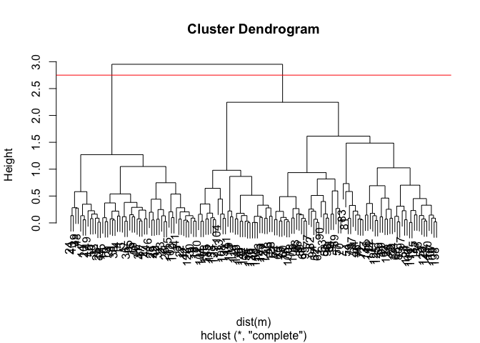<!-- -->

``` r
grps_m2<- cutree(hc_myturn, k=2) ## for two groups
plot(m, col=grps_m2)
```

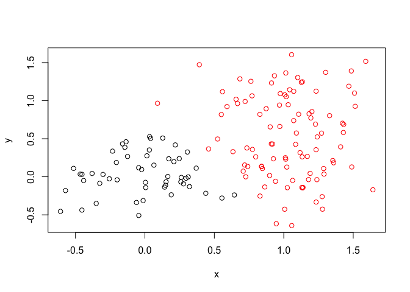<!-- -->

``` r
###now three groups
grps_m3<- cutree(hc_myturn, k=3)
plot(m, col=grps_m3)
```

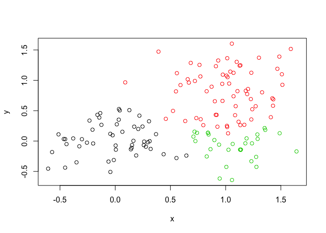<!-- --> \#\#\#
Principal Component Analysis (PCA) \#\# what is PCA??? \#\# prcomp()
\#we will draw and generate PCA plots, determine how much variation each
principal component accounts for \# examine loadings (or loading scores)
to determine what variables have the largest effect on the graph \#\# ok
lets’s go \#\# You can also download this file from the class
website\!

``` r
mydata <- read.csv("https://tinyurl.com/expression-CSV", row.names=1) #samples are columns, rows are genes
### using nrow(mydata) and ncol(mydata) you can see there are 10 cols and 100 rows
#time to implement PCA
#prcomp() expectssamples to be rows and genes to be columns (why????), so we gotta transpose the matrix with t()
mydata_t<-t(mydata)
#nice!
pca<-prcomp(mydata_t, scale = TRUE)
### check it out
attributes(pca)
```

    ## $names
    ## [1] "sdev"     "rotation" "center"   "scale"    "x"       
    ## 
    ## $class
    ## [1] "prcomp"

``` r
###
```

``` r
### let's look closer
pca$x[,1]
```

    ##       wt1       wt2       wt3       wt4       wt5       ko1       ko2 
    ## -9.697374 -9.138950 -9.054263 -8.731483 -9.006312  8.846999  9.213885 
    ##       ko3       ko4       ko5 
    ##  9.458412  8.883412  9.225673

``` r
pca$x[,2]
```

    ##        wt1        wt2        wt3        wt4        wt5        ko1 
    ##  1.5233313  0.3748504 -0.9855163 -0.7468371 -0.2945307  2.2345475 
    ##        ko2        ko3        ko4        ko5 
    ## -3.2607503 -0.2636283  0.6339701  0.7845635

``` r
#plot these??
plot(pca$x[,1], pca$x[,2]) ### see the larger variance with 1 compared to 2
```

<!-- --> \#

``` r
#ok we gotta look at out PCAs
summary(pca) #notice how PC1 has 92% of the proportion of variance
```

    ## Importance of components:
    ##                           PC1    PC2     PC3     PC4     PC5     PC6
    ## Standard deviation     9.6237 1.5198 1.05787 1.05203 0.88062 0.82545
    ## Proportion of Variance 0.9262 0.0231 0.01119 0.01107 0.00775 0.00681
    ## Cumulative Proportion  0.9262 0.9493 0.96045 0.97152 0.97928 0.98609
    ##                            PC7     PC8     PC9      PC10
    ## Standard deviation     0.80111 0.62065 0.60342 3.348e-15
    ## Proportion of Variance 0.00642 0.00385 0.00364 0.000e+00
    ## Cumulative Proportion  0.99251 0.99636 1.00000 1.000e+00

# 

``` r
## lets do PCA
pca <- prcomp(mydata_t, scale=TRUE)
## A basic PC1 vs PC2 2-D plot
plot(pca$x[,1], pca$x[,2])
```

<!-- -->

``` r
## Variance captured per PC
pca.var <- pca$sdev^2 
pca.var.per <- round(pca.var/sum(pca.var)*100, 1) 
pca.var.per
```

    ##  [1] 92.6  2.3  1.1  1.1  0.8  0.7  0.6  0.4  0.4  0.0

``` r
plot(pca)
```

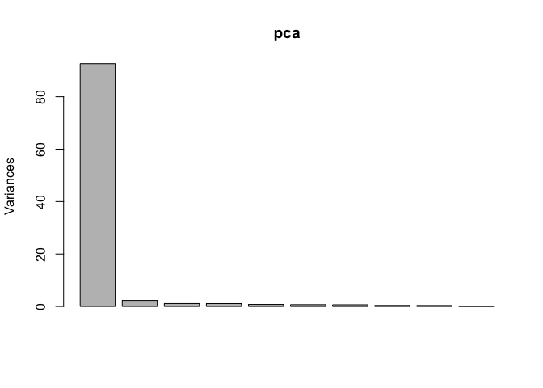<!-- -->

``` r
#let's colors the KO vs WT
plot(pca$x[,1:2], col=c("red","red","red","red","red", "blue","blue","blue","blue","blue")) #but this assumes i know that all the WT data comes before the KO so i can just list the color for each point
```

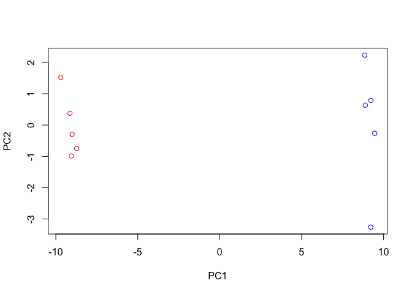<!-- -->

``` r
### that's really inefficient and ridiculous
```

``` r
wt_ko<- substr(colnames(mydata),1,2) #idk what this does???
wt_ko
```

    ##  [1] "wt" "wt" "wt" "wt" "wt" "ko" "ko" "ko" "ko" "ko"

``` r
###you can make the plot beter with this i guess?
colvec<- as.factor(wt_ko) ### idk how this specified color
plot(pca$x[,1], pca$x[,2], col=colvec, pch=16,
 xlab=paste0("PC1 (", pca.var.per[1], "%)"),
 ylab=paste0("PC2 (", pca.var.per[2], "%)")) 
```

<!-- --> \#MY TURN
AGAIN load the FILE

``` r
#x<-read.csv("UK_foods.csv")
#summary(x)
#dim(x)
```

\#preview the first six rows

``` r
#head(x)
```

\#let’s index it

``` r
#rownames(x) <- x[,1]
#x <- x[,-1]
#head(x)
#i dont know what we did this makes no sense
```

\#\#\#now let’s index it from the start bc using that -1 is ANNOYING AND
CAUSES PROBLEMS

``` r
#x <- read.csv("UK_foods.csv", row.names=1)
#head(x)
#i dont get this either
```

\#barblot
it

``` r
#barplot(as.matrix(x), beside=T, col=rainbow(nrow(x))) #idk how this happened
```

\#try a different plot

### and another way

``` r
#pairs(x, col=rainbow(10), pch=16)
```
