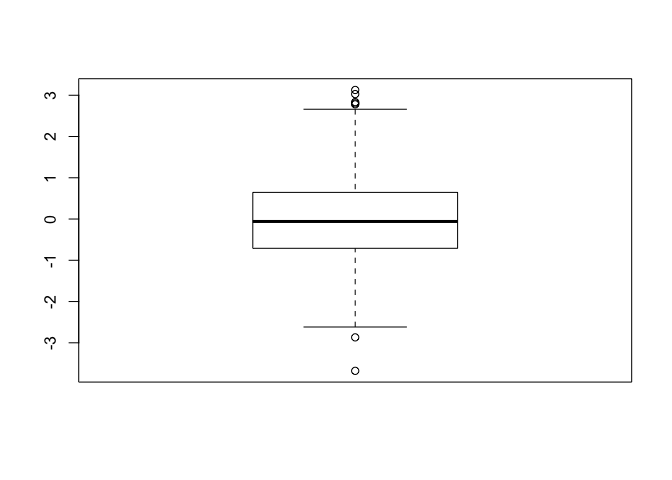
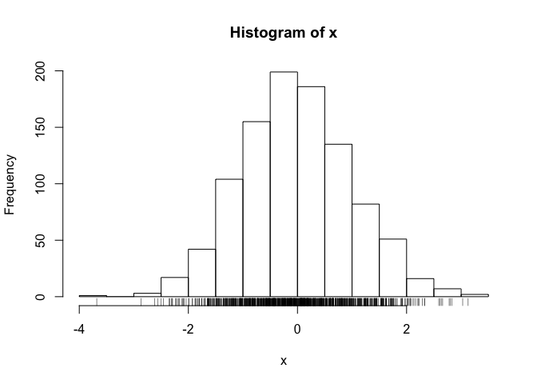
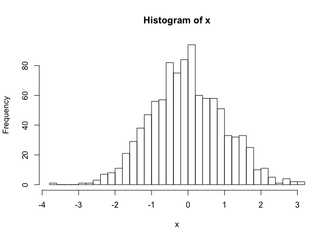

Class05
================

``` r
#Class 05 data visualization
x<-rnorm(1000)
#what is rnorm? what does it mean? ?rnorm to get explanation (doesn't make sense tbh)
#also what is x??? is it a vector? use the following:
is.vector(x)
```

    ## [1] TRUE

``` r
#this turns out to be true! it is a vector. Now lets find out how many things are in x
length(x)
```

    ## [1] 1000

``` r
#cool! 1000 things! but i want to know more
mean(x)
```

    ## [1] -0.02107981

``` r
#the mean is 0.007050588
sd(x)
```

    ## [1] 1.005793

``` r
#the sd is 0.9664718
#summary!
summary(x)
```

    ##     Min.  1st Qu.   Median     Mean  3rd Qu.     Max. 
    ## -3.67975 -0.70829 -0.05921 -0.02108  0.64546  3.12854

``` r
#cool! this gives us nice bit of information!! \
#time to make some graphs of this
boxplot(x)
```

<!-- -->

``` r
hist(x)
rug(x)
```

<!-- -->

``` r
#the fuck is a rug??? it added something to the histogram but i dont really know what it means :P 
#according to Barry it shows us where the data is
#let's play with the histograms
hist(x, breaks=3)
```

<!-- -->

``` r
hist(x, breaks=30)
```

<!-- -->

``` r
#### time for the in class handout!!!!
###we have imported a bunch of data! find it in the files area! 
###let's put weight_chart.txt into a table
#read.table(weight_chart.txt)
##well that doesn't work! how do i find the file???
read.table(file="bimm143_05_rstats/weight_chart.txt")
###to make that go faster, instead of typing in the path you can type in the start and hit "tab" and R will give suggestions! 
## what are V1 and V2??? what the fuck???
#i guess they are variable 1 and variable 2
## it does not know that the headers are Age and Weight! it thinks those are pieces of data! 
## so tell it that header are true! (TRUE)
read.table(file="bimm143_05_rstats/weight_chart.txt", header=TRUE)
###ahhhh perfect!
#now let's name the data because hoo boy typing in read.table(blahlblah) while manipulating the data is gonna get OLD
##this is weight and age so! 
weight_v_age <- read.table("bimm143_05_rstats/weight_chart.txt", header=TRUE)
weight_v_age
#woo that worked!
#now to make the plots! ok first a scatterplot 
plot(weight_v_age)
#let's make it better
plot(weight_v_age$Age, weight_v_age$Weight, type="o")
###we can do BETTER change the circles to squares with pch=15
plot(weight_v_age$Age, weight_v_age$Weight, type="o", pch=15)
###cool ow make the squares BIGGER
###pch = # the number corresponds to a shape 
plot(weight_v_age$Age, weight_v_age$Weight, type="o", pch=15, cex=1.5)
#make the lines thicker!!
plot(weight_v_age$Age, weight_v_age$Weight, type="o", pch=15, cex=1.5, lwd=2)
###give the Y axis a scale between 2 and 10 kilograms
plot(weight_v_age$Age, weight_v_age$Weight, type="o", pch=15, cex=1.5,lwd=2, ylim=c(2,10))
#change the x and y labels
plot(weight_v_age$Age, weight_v_age$Weight, type="o", pch=15, cex=1.5, lwd=2, ylim=c(2,10), xlab="age(months)",ylab="weight(kg)")
#title!!!
plot(weight_v_age$Age, weight_v_age$Weight, type="o", pch=15, cex=1.5, lwd=2, ylim=c(2,10), xlab="age(months)",ylab="weight(kg)", main="Baby weight vs Age")
### add some color!
plot(weight_v_age$Age, weight_v_age$Weight, type="o", pch=15, cex=1.5, lwd=2, ylim=c(2,10), xlab="age(months)",ylab="weight(kg)", main="Baby weight vs Age", col="pink" )
```

``` r
##### NOW WE MAKE BAR PLOT
#read.table("bimm143_05_rstats/feature_counts.txt", header=TRUE)
### well THAT DOESN'T WORK. the data under Feature isn't numerical
###go back and edit the file to make sure the features are not seperated improperly
#let R know it's seperated by tab
read.table("bimm143_05_rstats/feature_counts.txt", header=TRUE, sep="\t")
###the "\t" is the tab
mouse <- read.table("bimm143_05_rstats/feature_counts.txt", header=TRUE, sep="\t")
mouse
##plot time
barplot(mouse$Count)
###ok so instead of building the plot from scratch choose the numeric variable with the $ sign
#now to edit the bar plot
#i want it horizontal
barplot(mouse$Count, horiz = TRUE)
#i want the count axis labeled!
barplot(mouse$Count, horiz = TRUE, ylab="features")
#i want the names of the features next to each bar!, we want a title, we want the labels to be horizontal
#barplot(mouse$Count, horiz = TRUE, names.arg = mouse$Feature, las=1, main="Gene Counts")
###shit! the features are all cut off!change parameteres
par(mar=c(4.1,12.1,5.1,3))
#### idk how this tells the barplot the parameters but i guess it does 
#it's a parameter of four things, the margins for the top, bottom, left, and right)
#also its the las=# that flips labels, and you can use it more than once to flip both
barplot(mouse$Count, horiz = TRUE, names.arg = mouse$Feature, las=1, las=2, main="Gene Counts")
###ugh the grey is boring!!! add some fucking color
#barplot(mouse$Count, horiz = TRUE, names.arg = mouse$Feature, las=1, las=2, main="Gene Counts", col=1:12)

### ok onto the next thing?? color i guess?
read.table("bimm143_05_rstats/male_female_counts.txt", header=TRUE, sep="\t")
male_female<-read.table("bimm143_05_rstats/male_female_counts.txt", header=TRUE, sep="\t")
par(mar=c(6,3,3,3))
barplot(male_female$Count, col=rainbow(10), names.arg = male_female$Sample, las=1,las=2)
##maybe we should color the male and female different?
###idk why adding 2 next to the color does what it does but whatever
#ohhhh it will repeat the pattern! let's fuck with this! ive now done 3 colors, it loops the colors! fun!!!
barplot(male_female$Count, col=c("royalblue1",'peachpuff2',"mediumorchid"), names.arg = male_female$Sample, las=1,las=2)
### coloring by value
```
